# 🤖 Embodied-AI Learning Lab

**From GIS & remote sensing to robotics — every concept becomes a runnable, testable experiment.**

A learner's lab covering control, robot perception, mapping, navigation, learning and SO-101 manipulation. Experiments are checked with paired comparisons, physical replay and tiered tests; reports keep both improvements and failures. Lesson demos use RGB replay views; a separate S288 MicroDinosaur experiment uses RGB checkpoints, ToF ranging and ToF-scaled monocular depth for closed-loop simulated campus patrol. See the [new experiment review](docs/microdinosaur-patrol-review-20261009.md) and [3-minute narrated film](https://www.bilibili.com/video/BV1Mtp46EEw9/).

> **Why this exists:** I come from remote-sensing deep learning (land-cover classification, MSSACT-Net) and spatial analytics. This repo is my bridge to embodied intelligence — control → robot perception → mapping → robot learning — with every step kept small and verifiable.

| | |
|---|---|
| **MicroDinosaur · 2026-10-09** | S288 simulated campus patrol: **8/8 checkpoints, 99.60 m**. Added depth stops **80 ms earlier** in one paired obstacle case; normal route trace is unchanged. [Review and video](#microdinosaur-patrol) |
| **Navigation · lesson 69** | Rounds 12–14: 60/60 fresh validation episodes reached and stopped, with zero contact; 3 impossible entrances correctly rejected. Exact pose, static layouts and low speed; computation still exceeds the 100 ms control interval. [Report](docs/69-physical-height-navigation.md) |
| **Manipulation · lesson 73** | Round 3: surface alignment improved 21/27 → 24/27 on matched fresh conditions, with 3 rescues and no regressions. Pre-lift contact gating alone: 11/27; combined: 23/27. Three drop failures remain; known initial position, no visual feedback. [Report](docs/73-so101-contact-feedback.md) |
| **Verified · 2026-10-05** | Full run: 1134 passed, one old RGB equality assertion failed. After its correction: all 12 replay tests, 936 quick tests and 20 grasping tests passed in separate runs. Grasping records independently replayed; figures and actual windows inspected. [Delivery evidence](docs/benchmarks/so101-contact-v4-delivery.json) |
| **Stack** | MuJoCo + Gymnasium (Windows) · ROS 2 Jazzy + Gazebo Harmonic 8.15 (WSL2 / Ubuntu 24.04) · uv + Python 3.12 |
| **Start here** | [Quick start](#quick-start) · [MicroDinosaur patrol & film](#microdinosaur-patrol) · [Navigation & grasping windows](#latest-demos) · [课程索引](#课程索引) |

<p align="center">

[](https://github.com/eugenewang5425/embodied-ai-lab)
[](https://github.com/eugenewang5425/embodied-ai-lab)
[](https://github.com/eugenewang5425/embodied-ai-lab)
[](https://github.com/eugenewang5425/embodied-ai-lab)
[](https://github.com/eugenewang5425/embodied-ai-lab)
[](https://github.com/eugenewang5425/embodied-ai-lab)

</p>

## Quick start

Install `uv`, then run these commands from the repository directory in PowerShell. The project uses Python 3.12.

```powershell
uv sync --locked
uv run python -m embodied_learning.env_check --steps 300 --seed 7
uv run python -m embodied_learning.viewer --policy pd --seconds 10 --seed 7
```

`results/` contains local experiment archives and is excluded from Git. A fresh clone has the code, figures and compact benchmark summaries; generate an experiment before opening its replay window. Below, paired generation/replay commands use the same directory. Use a new output directory for another run.

<a id="microdinosaur-patrol"></a>

### S288 小恐龙园区巡检：相机、ToF 与单目深度

[观看 3 分钟技术讲解（B 站）](https://www.bilibili.com/video/BV1Mtp46EEw9/) · [实验小结与下一步](docs/microdinosaur-patrol-review-20261009.md) · [RGB＋ToF 基准](docs/microdinosaur-campus-patrol.md) · [深度实验详情](docs/microdinosaur-patrol-depth.md)

[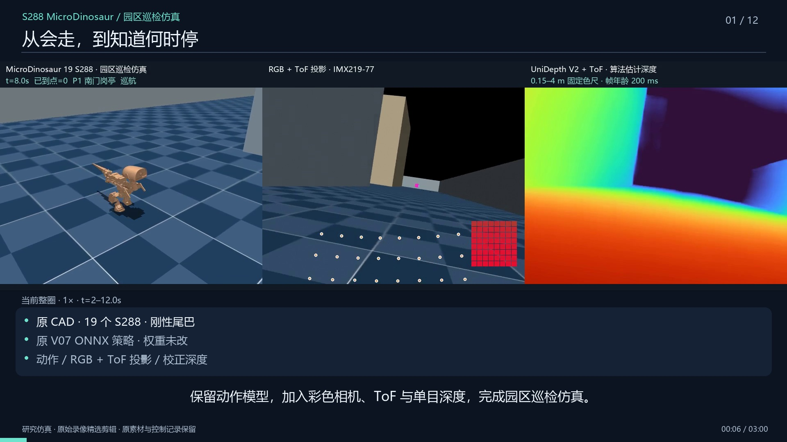](https://www.bilibili.com/video/BV1Mtp46EEw9/)

保留原 19 个 S288、刚性尾巴与 V07 ONNX 动作策略（50 Hz），用 IMX219-77 彩色相机候选配置（640×480）和规定的 VL53L5CX ToF（8×8、15 Hz、4 m）模拟感知。编码器/IMU估计运动，RGB 标记校正漂移并确认巡检点；UniDepth V2 Small 估计密集深度，ToF 校准尺度并检查质量。深度候选还需物理地平线、同角域双 ToF 分区和连续帧确认，原传感器失效停车保持优先。

| 同条件对照 | 已验证结果 | 结论边界 |
| --- | --- | --- |
| 最终压力配置整圈：RGB＋ToF / 加深度 | 两组均 **8/8 点、99.60 m、430.18 s**，动作 trace 相同 | 新增深度没有改善本轮整圈到点率、效率或定位误差 |
| 固定障碍：RGB＋ToF / 加深度 | 停车指令 **1.98 s → 1.90 s**；深度组停后净位移 **4.84 cm** | 单个匹配案例提前 **80 ms**；不等于最坏停车距离或动态绕障能力 |
| UniDepth 同帧近场深度 | 17 个有效留出帧 AbsRel **82.2% → 14.5%**；校正接受 **17/19** | 39 帧同一世界/轨迹的冻结数据，近场 0.15–4 m；不是巡检成功率 |

深度五案例 **381,504 个物理步**独立重放状态误差为 0，所有步园区接触与关节越限为 0；**23 项专项契约检查**通过，未重跑全仓 full。天空误判 **1/8** 和侧墙误判 **2/8** 两个整圈失败保留。历史盲走没有环境测距/巡检点确认，其航向实验与新园区场景不同；新增感知能力与新增深度的配对收益分别报告。

当前是**已知初始位姿、平整道路、预布彩色标记的仿真研究**。相机模式、安装外参和部分时延仍是假设，实机室外、板端实时性、电机温升、无标记定位及设备缺陷识别待验证，`hardware_released: false`。成片含本地星瞳 AI 配音与模型署名，按非商用研究范围发布。[紧凑证据](docs/benchmarks/microdinosaur-patrol-review-20261009.json)；大型原始数据及机器人源资产保存在本机。

<a id="latest-demos"></a>

### 最新导航与抓取窗口

**导航：第 69 课第十四轮。** 先生成 75 回合正式记录，再打开指定的街区箱体回合。窗口一键同步相机、三维场景、雷达点、当前地图、目标和统计；可切换参照与改进算法、查看失败、暂停和拖动时间。[讲义](docs/69-physical-height-navigation.md)

```powershell
uv run python -m embodied_learning.experiments.navigation_height_study --workers 3 --output results/navigation_reinforcement_v14
uv run python -m embodied_learning.navigation_study_demo --lesson 69 --footprint results/navigation_reinforcement_v14 --case 69_street_crate_37__delay_2__bypass_crate --play
```

**机械臂：第 73 课第三轮。** 先生成 126 回合正式记录，再打开实际指面校准组。外部相机、腕部相机、三维场景、目标、接触力和统计一键共同切换；可以查看完成、掉落和接触拒绝。[讲义](docs/73-so101-contact-feedback.md)

```powershell
uv run python -m embodied_learning.experiments.so101_contact_study --workers 3 --output results/so101_contact_v4
uv run python -m embodied_learning.manipulation_demo --results results/so101_contact_v4 --position p04a1 --method surface --play
```

已有上述完整记录时，直接运行对应第二条命令即可。导航 60/60 是限定仿真范围的验证；机械臂 24/27 仍未达到稳定抓取。两者 RGB 均为存档位姿重渲染，尚未参与控制，下一步见[导航阶段复盘](docs/navigation-stage-review-69-71.md)和[机械臂路线](docs/manipulation-roadmap.md)。逐课原理、变量、数据、思考题和复现步骤见下方课程索引。

### 测试流程

改动某课后，先运行该课的快速测试，再运行全仓快速测试；按改动范围选该课的慢层。`quick` 排除真实窗口、完整记录重放和训练重放，并在首个失败处停下。`record` 包含实验记录、CLI 和其他非训练慢测；`gui` 测隔离窗口；`training` 测第 28–42 课训练回放。三类互不重叠，`slow` 是合集。需要一次运行某课所有测试时用带文件参数的 `full`；改动共用基础模块或做阶段验收时，再跑全仓 `full`。统一入口给 Windows 子进程设置 UTF-8，并报告总耗时及最慢的 10 项。

```powershell
uv run python scripts/test.py quick tests/test_session55_rgbd_loops.py tests/test_session56_map_localization.py tests/test_navigation_benchmark.py
uv run python scripts/test.py quick
uv run python scripts/test.py record tests/test_session55_rgbd_loops.py tests/test_session56_map_localization.py
uv run python scripts/test.py gui tests/test_session47_pose_graph.py
uv run python scripts/test.py training tests/test_session40_rl_arm_reaching.py
uv run python scripts/test.py full tests/test_session55_rgbd_loops.py  # 单课所有测试
uv run python scripts/test.py full          # 共用基础模块变更或阶段验收
uv run python scripts/test.py slow          # 三类慢测合集
uv run ruff check src tests scripts docs/img/make_readme_figures.py
```

`quick` 通过只说明快测层通过；实验数值、图表和本机窗口仍按各课记录核对。慢速标记及自动分层规则见 [tests/conftest.py](tests/conftest.py)。

2026-09-24 全仓 `slow` 实测 176 项通过、耗时 3657 秒。其中第 53 课 SciPy 生产求解器的记录准备阶段为 1785 秒，约占总耗时一半；该次运行另有 11 条警告，未造成失败。

### 交互实验回放窗口

**第 66 课：街区式园区巡检**：24×24 m 场景含建筑、道路、车辆、树木和 8 个巡检点。支持真实存档雷达点、一键汇总/单独跟随、各方法分图；相机和 3D 同时标出当前巡检目标，窗口内提供通俗的方法说明和任务结果。先看“完成多少巡检点”，再看定位误差。[第六十六课讲义](docs/66-campus-patrol.md)。

```powershell
uv run python -m embodied_learning.campus_patrol_demo --play
```

也可双击 `scripts/open_campus_patrol_demo.cmd`。首轮 4 组 × 3 轮：仿真真值参考 **3/3** 完成，雷达＋参考地图 **2/3** 完成，纯里程计和雷达＋自建地图均 **0/3** 完成；全部零接触。说明准确地图下的雷达纠偏已有部分有效证据，自建图导航与失败恢复仍未通过。相机为按实际位姿重渲染；这轮没有 RGB 定位。复跑、来源哈希和边界见上述说明。

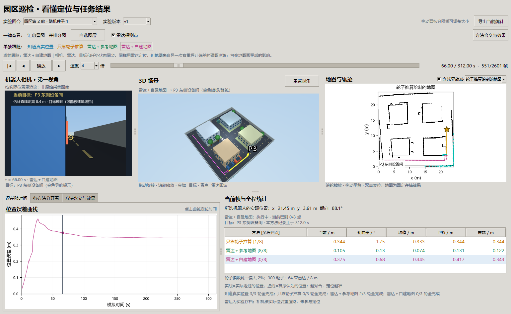

图示选用种子 1、66 s，一键单独跟随自建地图方法。左上金色提示是当前目标；青点是存档雷达回波投到估计位置；下方显示该方法误差曲线，右下突出对应统计行。点击其他方法会同步切换全部视图、底图和目标，保留时间与播放状态；“汇总叠图/并排分图”一键恢复比较。

第66课首轮中，雷达参与定位与近障停车，该轮未实现扫描驱动绕行或在线修图；自建图组仍用共享先验避障图。后续67/69课已独立研究观测重规划和地图更新，不能把后续机制回填为66课首轮能力。相关研究、地图修复实验顺序与综合项目/课程安排见[后续规划](docs/campus-map-repair-plan.md)。

第 65 课的 24 份配对记录可在同一个窗口切换：机器人相机第一视角、3D 全景、占据地图、轨迹、误差曲线和偏差统计共用时间轴，支持暂停、单步、拖动进度、100/400 粒子对照、视角旋转/缩放和统计导出。窗口按数据适配器与独立面板组织，后续实验可复用。[操作与模块接口](docs/replay-window.md)。

```powershell
uv run python -m embodied_learning.map_separation_demo --play
```

也可双击 `scripts/open_map_separation_demo.cmd`。本窗口回放正式记录；相机按存档真值位姿重渲染，3D 高度与机位仅为展示，当前批次没有存档 RGB-D 图像。

### 照片房间三维验证

新增本地照片参考房间：同一份几何生成 Blender 可编辑模型和 MuJoCo 碰撞/射线场景，复用 A*、编码器里程计和 PF 定位。首轮发现低位激光切片可能漏掉床架与椅脚；匹配激光高度的地图在三组噪声种子下将平均定位误差从约 18.7 cm 降至约 5.1 cm。桌高 69 cm、桌面短边暂按 65 cm；房间尺寸及床底净空尚未校准，结果仅针对模型内的单房间运动学回放。[模型、变量、对照结果与复现说明](docs/63-photo-room-3d-validation.md)。

```powershell
uv run python -m embodied_learning.photo_room
uv run python -m embodied_learning.experiments.photo_room_validation --layout results/photo_room_v1/layout.json
uv run python scripts/render_photo_room_replay.py
```

<a id="cn"></a>

---
# 具身智能学习与本地仿真

本项目采用“学习一个概念，完成一个可运行实验，留下可复现实验记录”的方式学习具身智能。

## 项目目标

- 建立机器人学、控制、感知和学习之间的完整知识框架。
- 在本地仿真环境中验证每个核心概念，而不只停留在阅读材料。
- 利用 GIS、遥感和空间智能基础，逐步进入三维感知、建图、导航、机器人学习与具身智能。
- 保持项目小步迭代、Git 可追踪、结果可复现。

## 当前状态（2026-10-09 · 基准 62 + 第 63–73 课与 S288 巡检专项）

- **S288 小恐龙专项（2026-10-09）**：原动作策略＋RGB/ToF/单目深度完成 8/8 标记巡检；固定障碍新增深度提前 80 ms 发停车指令，正常整圈轨迹不变。两次误停失败、传感器降级、专项验证和实机边界见[新实验小结](docs/microdinosaur-patrol-review-20261009.md)。

- **三维操作主线（72—73课）**：[第七十三课第三轮讲义](docs/73-so101-contact-feedback.md)新增126物理回合，同27新条件指面校准21/27→24/27、救回3例无退步；单独门控11/27、组合23/27，两负对照各0/9。仍有3例掉落，力与压入代价保留，先补动态接触再进入视觉。首两轮原批次保留；已知初始位置，RGB尚未参与控制。见[操作路线](docs/manipulation-roadmap.md)。

**基础课程 1–56 均已形成实验、讲义与演示记录。** “完成一课”表示做完对照并记录结论；目标能力是否通过，仍看每课的结果和失败边界。完整数字保留在课程索引与逐课结果中。

| 课程范围 | 学什么 | 实验告诉我们什么 |
| --- | --- | --- |
| 1–7 | 倒立摆控制、扰动、读数噪声与摆起 | 分开观察真实状态、传感读数和控制动作，比较 PD、LQR 与能量摆起的适用范围 |
| 8–13 | 平面 2R 臂的坐标、逆解、路径与电机限制 | “几何上到得了”还要经过轨迹、时间、力矩和停稳检验 |
| 14–21 | 小车坐标、里程计、标定、地标融合、ROS 2 与目标反馈 | 系统偏差和随机噪声要分别处理；估计到点不等于身体实际到点 |
| 22–27 | 相机、单目深度定尺、内参、ICP 与视觉接地 | 投影、尺度、观测误差和匹配身份一起决定三维测量是否可信 |
| 28–42 | BC、PPO、残差学习、示教、SAC、DAgger 与块策略 | 拟合、探索、首次到达和稳定控制是不同指标；学习策略的负结果全部保留 |
| 43–56 | 建图、规划、定位、回环、位姿图与图定位 | 融合可修漂移；回环末端变准不保证全程形状正确；理想图有效，自建图仍未过门 |

- **最近一次代码验收（2026-10-05）**：全仓 1134 项通过、1 项旧相机像素断言失败，入口总耗时 5385.4 s（约 89 分 45 秒）。不变场景重复渲染也会出现少量像素的 1 级亮度差，现按“每通道差≤1、变化像素≤0.1%”比较，并保留相机几何及标记透明度检查；修正后回放模块 12 项、全仓快速层 936 项和抓取完整选择集 20 项分别通过。没有再次运行全仓慢层，不能合并成一次全量全绿成绩。Ruff 通过，三张科学图和四张实际窗口图已检查。[验收记录](docs/benchmarks/so101-contact-v4-delivery.json)包含各次日志、数据与图片哈希；原始数组保存在本地 `results/`。
- **记录体系**：审查报告与 issue/PR 文稿见[实验审查报告](docs/26-experiment-review-2026-09-05.md)、[问题与 PR 草稿](docs/27-issues-pr-drafts-2026-09-05.md)（含演示验收轮缺陷登记 F1–F12 与开放 Issue 9）；设计变更与规划调整见[实验决策日志](docs/34-experiment-decision-log.md)（只追加）；演示真机验收标准见实验审查报告第六节。
- **闭环导航与官方 AMCL 对照已过参数门禁（第 64 课 v4）**：照片房间四组定位来源对照（真值/里程计/参考图 PF/自建图 PF）60 回合——全组零接触、不可达 12/12 安全拒绝、C/D 误差 0.006/0.012 m 低于 B 0.023 m；官方 nav2 AMCL 批量执行器修复后（launch 参数化 + `ros2 param get` 硬门禁）27/27 有效：A-budget 0.078 m 最好，更新频率 4.6× 只换来 0.104→0.089 m——粒子数/波束数才是主变量。此前"AMCL 参数不敏感"结论已撤回（三组配置当时从未真正生效）。
- **ROS 2 本机环境记录**：WSL2 / Ubuntu 24.04.4 + ROS 2 Jazzy + Gazebo Harmonic 8.15.0 + colcon，安装与核验见[环境审计](docs/00-environment-audit.md)。这些是作者电脑的环境记录；克隆代码不会自动安装 WSL 或 ROS 2。
- **多传感器长期路线图已启动**：目标是在三维房间完成 LiDAR＋RGB-D 定位、建图、巡检与失效恢复，并用对照实验解释每个模块的贡献（[路线图](docs/multisensor-navigation-roadmap.md)，约 10–14 周 8 阶段，第一轮 RGB-D）。阶段 0 已完成：统一评分器修复三个因果边界（首个修正前不再借用未来结果、无输出不再伪有效、时间匹配加容差）且 9 项已知答案测试通过，已有 AMCL 结论复核不受影响。
- **地图分离试跑（第 65 课）**：固定同一批扫描做理想图/真值投影图/里程计投影图三方对照 + 100/400 粒子单变量扫描——表示间隙 −0.03 m（端点图≈理想图）、落点间隙 +1.34 m（自建图失败主因是落点误差）；粒子数不是杠杆（400 粒子自建图基本不变、理想图发散反而 1/12→6/12）。P5 巡检路线生成器 [patrol_routes.py](src/embodied_learning/experiments/patrol_routes.py) 就绪并通过第 64 课可达性交叉验证。
- **园区巡检基线（第 66 课）**：24×24 m 园区四种定位来源各 3 轮共 12 回合——真值 3/3 完成、雷达＋参考图 2/3、纯里程计与雷达＋自建图均 0/3，全组零接触；自建图组失败于雷达近障停车后超时，在线绕行与修图分别由第 67/68 课以受控实验补上。
- **新进展（67–68课）**：完成车身/相机/雷达标定、81回合避障与冻结修图后的12回合独立导航；统一窗口可一键同步查看。连续原始 RGB 采集、视觉定位及两套控制器的完整融合仍待做。[阶段小结与下一步](docs/navigation-stage-review-66-68.md)。第65课似然场扫描尚未执行，保留为独立诊断。
- **分离实验与最新进展（69—71课）**：69物理停车／择路余量／三维部件检查三轮完成，最终三个布局×四高度×五新种子60/60到达停稳、零接触；同12对10/12→12/12。到点规则48/48、恢复准确图24/24仍是分离平台。控制P95超过周期、遮挡、位姿误差、真实异步与组合尚未验证，见[阶段复盘](docs/navigation-stage-review-69-71.md)。

## 课程索引

| 课号 | 主题 | 核心概念 | 对应 Embodied-AI-Guide 章节 | 讲义链接 |
| --- | --- | --- | --- | --- |
| 第 1 课 | 环境与实验规范 | 环境自检、随机动作基线、依赖锁定与可复现实验记录 | Infrastructure 篇（Simulators/Benchmarks） | [讲义](docs/03-session-01.md) |
| 第 2 课 | PD 控制与随机基线对照 | 比例-微分反馈、配对对照与稳定指标 | Control 篇（6.2.1 经典控制） | [讲义](docs/04-session-02-pd-control.md) |
| 第 3 课 | 离散 LQR 全状态对比 | 基于真实平衡点的离散 LQR、输入代价 R | Control 篇（6.2.2 现代控制·最优控制） | [讲义](docs/05-session-03-lqr.md) |
| 第 4 课 | LQR 权重与慢放对照 | R 权重扫描、教学回放与多 R 曲线叠加 | Control 篇（6.2.2 现代控制·最优控制） | [讲义](docs/06-session-04-lqr-weights-and-demo.md) |
| 第 5 课 | 随机外部扰动 | 配对随机推力、恢复时间与失败率 | Control 篇（6.2.2 现代控制·最优控制） | [讲义](docs/07-session-05-disturbance.md) |
| 第 6 课 | 真实状态与传感读数 | 测量噪声 0×/1×/3× 对照、真实状态与读数辨别 | Control 篇（6.2.2 现代控制·最优控制） | [讲义](docs/08-session-06-measurement-noise.md) |
| 第 7 课 | 下垂摆起与强扰动恢复 | 能量摆起与 LQR 切换、失败边界 | Control 篇（6.2.3 先进控制入口） | [讲义](docs/09-session-07-swingup.md) |
| 第 8 课 | 两个关节与末端坐标 | 平面 2R FK、解析双分支 IK、关节 PD 到达 | Control 篇·机器人学导论（6.3.2 运动学与动力学） | [讲义](docs/10-session-08-planar-arm.md) |
| 第 9 课 | 沿直线运动与 Jacobian | Jacobian 直线路径、奇异位形的瞬时方向限制 | Control 篇·机器人学导论（6.3.2 运动学与动力学） | [讲义](docs/11-session-09-jacobian-path.md) |
| 第 10 课 | 换一批路径后还可靠吗 | 有种子多路径配对评估、参考/执行/验收分层 | Control 篇·机器人学导论（6.3.2 运动学与动力学） | [讲义](docs/12-session-10-path-coverage.md) |
| 第 11 课 | 逐点解析 IK 起步 | 逐点解析 IK 参考、连续分支与速度规划边界 | Control 篇·机器人学导论（6.3.2 运动学与动力学） | [讲义](docs/13-session-11-waypoint-ik.md) |
| 第 12 课 | 动作时间与电机限制 | 8/4/2 秒对照、规划拒绝与力矩截断分层 | Control 篇·机器人学导论（6.3.2 运动学与动力学） | [讲义](docs/14-session-12-timing-and-torque.md) |
| 第 13 课 | 模型前馈＋原 PD | 逆动力学前馈、前馈/反馈/限幅职责区分 | Control 篇·机器人学导论（6.3.2 运动学与动力学） | [讲义](docs/15-session-13-model-feedforward.md) |
| 第 14 课 | 差速小车与世界/车体/传感器坐标 | 差速运动学、坐标变换链、错误映射反例 | Control 篇·里程计与 SLAM 前置/状态估计动机 | [讲义](docs/16-session-14-mobile-frames.md) |
| 第 15 课 | 编码器里程计与累积误差 | 位姿递推、比例偏差的累积误差 | Control 篇·里程计与 SLAM 前置/状态估计动机 | [讲义](docs/17-session-15-encoder-odometry.md) |
| 第 16 课 | 固定比例标定与独立验证 | 对照测量→求系数→换路线验证、错误基准反例 | Control 篇·里程计与 SLAM 前置/状态估计动机 | [讲义](docs/18-session-16-encoder-calibration.md) |
| 第 17 课 | 标定之后的随机测量噪声 | 种子化逐区间噪声、系统偏差与随机分散分离 | Control 篇·里程计与 SLAM 前置/状态估计动机 | [讲义](docs/19-session-17-random-noise.md) |
| 第 18 课 | 已知地标（控制点）观测与里程计对照 | 测距测角、2D Procrustes 位姿解算、累积 vs 不累积 | Control 篇·里程计与 SLAM 前置/状态估计动机 | [讲义](docs/20-session-18-landmark-observations.md) |
| 第 19 课 | 看观测 → 解位置 → 最简融合 | 观测重置＋里程计填充、三组配对与坏观测反例 | Control 篇·里程计与 SLAM 前置/状态估计动机 | [讲义](docs/21-session-19-landmark-fusion.md) |
| 第 20 课 | ROS 2 节点、消息与坐标链 | 三进程消息交接、时间戳配对、TF 坐标链 | Infrastructure 篇（ROS 2 工程生态） | [讲义](docs/22-session-20-ros2-messages-and-tf.md) |
| 第 21 课（含 23a 停车门限补充） | 根据估计位置驶向目标 | 估计驱动轮速、估计到达与实际通过区分、停车门限单变量对照 | Algorithm 篇·Robot Navigation 前置 | [讲义](docs/23-session-21-goal-feedback.md) · [补充](docs/23a-session-21-stopping-tolerance.md) |
| 第 22 课 | 针孔相机与投影-反投影 | 针孔投影/反投影、无深度只剩一条射线、深度噪声误差传播 ∝ 射线长度 | Algorithm 篇·Computer Vision 3D + Hardware 篇·Sensors | [讲义](docs/24-session-22-pinhole-projection.md) |
| 第 23 课 | 单目相对深度 ↔ 米制尺度标定 | 逆深度仿射歧义、控制点最小二乘标定 (a,b)、N/σ 扫描与 Z² 误差分层 | Algorithm 篇·Vision Foundation Models（相对深度）+ 标定 | [讲义](docs/25-session-23-monocular-metric.md) |
| 第 24 课 | 真实 DA V2 仿射检验 | R²=0.9974 但残差为结构场（U 形+水平相关 −0.85）、全局仿射 3.2 cm 下限 | Vision Foundation Models（域差距与近似阶） | [讲义](docs/28-session-24-real-depth-affine.md) |
| 第 25 课 | 张氏内参标定 | 单应 DLT、v 向量闭式解、M/σ 传播、退化姿态与自洽性陷阱 | Computer Vision 3D（相机标定）+ GIS 摄影测量内方位元素 | [讲义](docs/29-session-25-camera-intrinsics.md) |
| 第 26 课 | 点云 ICP 配准 | 两帧带噪点云、点到点/点到面、收敛半径与几何退化滑动 | Computer Vision 3D（配准）+ GIS 多测站拼合 | [讲义](docs/30-session-26-icp-registration.md) |
| 第 27 课 | MobileSAM 视觉接地标身份 | 掩码质心+深度反投影、最近邻身份分配、错配爆炸与 δφ=δpx/f 传播 | Vision Foundation Models（替代 assumed identity） | [讲义](docs/31-session-27-visual-grounding.md) |
| 第 28 课 | 行为克隆（阶段 5 入口） | 手写 MLP+反向传播、开环 MSE 33× vs 闭环 0/75、复合误差与分布移 | Robot Learning（IL 入口；BC 与专家的口径差） | [讲义](docs/32-session-28-bc-imitation.md) |
| 第 29 课 | PPO 摆起（RL 对照） | 手写 numpy PPO（GAE/clip）、扶稳子技能学到但完整摆起 0/60、基线 20/20 的诚实对照 | Robot Learning（RL 入口；奖励在环 vs 监督分布） | [讲义](docs/33-session-29-ppo-swingup.md) |
| 第 30 课 | 残差 RL 摆起 | 能量整形底座 + 限幅残差、a=0 守卫逐位一致、朴素残差触限 95.8–99.6% 毁掉底座 | Robot Learning（Residual RL；探索噪声非无害） | [讲义](docs/35-session-30-residual-swingup.md) |
| 第 31 课 | PBRS 势函数塑形 | 能量梯子不改最优策略、cE=2 种子 1 于 150k 步首次触达直立区、"对的能量≠对的姿态" | Robot Learning（reward shaping；Ng 1999 定理） | [讲义](docs/36-session-31-pbrs-shaping.md) |
| 第 32 课 | DAPG 示教空投 | 8 条基线示教 + BC 正则、直立首达 33/60 成为常态、BC 记忆分化（0.218 vs 1.24） | Robot Learning（RL from demonstrations；DAPG RSS 2018） | [讲义](docs/37-session-32-dapg-swingup.md) |
| 第 33 课 | Go-Explore 画地图 | 72 格档案全覆盖、稳定带捕获 417 次、BC 鲁棒化 0/20（找到但学不会走） | Robot Learning（hard exploration；Go-Explore Nature 2021） | [讲义](docs/38-session-33-goexplore-swingup.md) |
| 第 34 课 | 两阶段奖励（分阶段目标） | 荡起=能量误差、上方切角度奖励；首达 2/3 种子（100k+200k）但首成仍 0/60 | Robot Learning（stage-switching；MDPI 2024 两阶段协议） | [讲义](docs/39-session-34-twophase-swingup.md) |
| 第 35 课 | 手写 numpy SAC | 回放池+孪生 Q+最大熵、α 坍缩 0.0000–0.0009、回放熵归零；首达成 0/60 首达 0/60 | Robot Learning（off-policy SAC 原论文 benchmark） | [讲义](docs/40-session-35-sac-swingup.md) |
| 第 36 课 | DAgger 在线纠错 | 教师逐帧标注、w=0 对照证明数据有效只修到达、首达 0→5/60 但 0/60 | Robot Learning（DAgger；Ross 2010 在线聚合） | [讲义](docs/41-session-36-dagger-swingup.md) |
| 第 37 课 | 多峰块策略（ACT 最小版） | 门控混合专家、确定性均值路径到达 0/3→3/3（历史首次）、成功仍 0/60 | Robot Learning（多峰表示；ACT/扩散基础思想） | [讲义](docs/42-session-37-act-swingup.md) |
| 第 38 课 | 倒立摆组合学习 | 能量底座+多峰块残差、保护性✓（120/120 到达零出界）增值性✗（0/60 劣化基线） | Robot Learning（Residual RL；Johannink 2019 框架的边界实证） | [讲义](docs/43-session-38-combo-swingup.md) |
| 第 39 课 | 差速小车纯学习 | 手写 SAC、接近学到但到达输给目标熵、悬停画像 | Robot Learning（全驱动 RL；最大熵探索边界） | [讲义](docs/44-session-39-rl-goal-reaching.md) |
| 第 40 课 | 2R 臂纯学习 | 全驱动红利再证、跨任务目标熵均衡收敛、戳进球但停不住 | Robot Learning（全驱动第二系统对照） | [讲义](docs/45-session-40-rl-arm-reaching.md) |
| 第 41 课 | 分阶段最小验证 | 底座已最优、线性修正无改善信号（10 次探索全等 4.76s）、裁决=base_optimal_no_headroom | 方法论（最小验证+过门协议） | [讲义](docs/46-session-41-staged-verification.md) |
| 第 42 课 | ACT/torch 到达 | Transformer 块策略 683k 参数、0/60 但归因清晰化：信息-精度硬墙 | Robot Learning（Transformer 策略表示） | [讲义](docs/47-session-42-act-torch-reaching.md) |
| 第 43 课 | 占据栅格建图 + A* 规划 + 纯追踪（回主线） | Bresenham log-odds 建图、8 邻域 A*（膨胀=刹车门限一致）、差速适配纯追踪；有障碍 15/15 无碰撞到达 vs 盲飞 3/15 | Algorithm 篇·Robot Navigation（costmap/planner/controller 最小版） | [讲义](docs/48-session-43-grid-nav.md) |
| 第 44 课 | 定位误差穿栈（位姿不确定下） | 第 43 课栈三组位姿对照：真值 15/15、里程计 1% 0/15（误差 1.22 m）、2% 0/15（2.25 m）、2%+地标融合 15/15（2.5 cm 与真值几乎等价） | Algorithm 篇·Robot Navigation（定位误差传播；SLAM 前置） | [讲义](docs/49-session-44-nav-pose-error.md) |
| 第 45 课 | 最小栅格 SLAM（帧间扫描匹配） | 无信标扫描匹配闭环：S 与 E 同 0/15（2.47 vs 2.25 m）、匹配器接受率 4.6%：本场景的帧间匹配尚不能约束长期漂移 | Algorithm 篇·Robot Navigation（scan-to-submap；回环前置） | [讲义](docs/50-session-45-scan-slam.md) |
| 第 46 课 | 回环闭合（绝对锚第二形态） | 采集-重放四链巡逻对照：N/S 4.8–5.0 m，回环（L/LT）闭合末端 9.2 m→0.14/0.16 m；黄金边分离结构与匹配；形状未修（真因子图下一步） | Algorithm 篇·Robot Navigation（loop closure；pose-graph 后端） | [讲义](docs/51-session-46-loop-closure.md) |
| 第 47 课 | 加权位姿图优化（后端） | 世界帧因子+unary 回环锚+G-N：FG 均值 5.03 < 弧长 5.33（形状✓）末端 1.21 m；黄金锚末端 0.016 m、均值反升（σ 权衡） | Algorithm 篇·Robot Navigation（pose-graph 后端） | [讲义](docs/52-session-47-pose-graph.md) |
| 第 48 课 | 鲁棒位姿图（毒化回环注入） | 受控注入错峰回环：LS 均值 4.82→7.63（脆弱性✓）、Huber-IRLS 压回 5.22（抵抗✓）；单核两难（好回环同核不闭合 8.79 m）；δ 退火阴性 | Algorithm 篇·Robot Navigation（robust back-end） | [讲义](docs/53-session-48-robust-graph.md) |
| 第 49 课 | 回环匹配器工程化（量化方向退化） | 锚定-抛光 + 弧长重采样 + top-k 三件套：接受率阶梯 0.32→0.43→0.52→0.76（K）；旧判据方向正确率 ≤5.4% 后经第 54 课勘误；相似结构的伪影峰仍需甄别；协议重建修复第 46 课四处设计条件 | Algorithm 篇·Robot Navigation（scan matching；回环候选判别） | [讲义](docs/54-session-49-matcher-engineering.md) |
| 第 50 课 | 特征化回环检测（阴性记录） | 三项特征评分分布重叠；2.6% vs oracle 4.9% 属后来勘误的旧判据，不能据此判断实际方向正确率；自建地图一致性存在自证问题 | Algorithm 篇·Robot Navigation（place recognition 的判别力边界） | [讲义](docs/55-session-50-feature-loops.md) |
| 第 51 课 | 可切换约束 SC/MM（阴性记录） | 第 48 课同款绝对锚注入：SC λ 扫描 17 组可行域为空（λ≤20 杀好边、λ≥50 留毒化，两切换带反相重叠）、MM 硬组件选择死锁；下一课检验相对回环边，仍未解决毒化问题 | Algorithm 篇·Robot Navigation（switchable constraints / max-mixtures） | [讲义](docs/56-session-51-switchable-graph.md) |
| 第 52 课 | 相对回环边（SC/MM 真实工作域） | 毒化相对边同样毒（5.42 > N 4.84）；90°+1 m 注入与真值仅差 ~2 m，开关折中 s=0.61 半闭合而非拒绝；MM 退火后 valid 仍 0——连续开关≠分类器 | Algorithm 篇·Robot Navigation（相对边下的鲁棒核语义） | [讲义](docs/57-session-52-relative-loops.md) |
| 第 53 课 | 生产求解器对照（问题属性判定） | 同题交 scipy least_squares（huber/soft_l1 × 尺度扫描）：生产核同样不拒绝毒化边（6.32 > N 4.86）、网格无解——失败是问题属性，不是实现产物 | Algorithm 篇·Robot Navigation（与生产实现的对照方法论） | [讲义](docs/58-session-53-production-solver.md) |
| 第 54 课 | 度量勘误 + 各向异性对照 | 49/50 课方向正确率是评估目标伪影（est 位姿差值烤入漂移）；修正判据（隐含位姿 vs 真值）后 ISO 0.722/ANISO 0.583；环境假设证伪 | Algorithm 篇·Robot Navigation（评估目标与信息载体一致性） | [讲义](docs/59-session-54-aniso-env.md) |
| 第 55 课 | 模拟标记外观检索 | 里程计弧长筛选 292 个探帧；top-12 检索精确率 12/12，几何方向正确 11/12、审查量 4.1%；不是真实 RGB-D 图像 | Algorithm 篇·Robot Navigation（场所识别） | [讲义](docs/60-session-55-rgbd-loops.md) |
| 第 56 课 | 建图与定位分离 | 修正 16 m 内圈巡游后：EST / 理想图 PF / 自建图 PF 平均误差 1.984 / 0.322 / 3.443 m；自建图未过门，理想图绑架恢复 4/5 | Algorithm 篇·Robot Navigation（地图质量与定位） | [讲义](docs/61-session-56-map-localization.md) |

### 第 56 课之后：跨场景基准与第 63–73 课

文档号历史上一直领先于课号（审查报告、基准等非课文档穿插编号）：文档号 57–61 就是第 52–56 课的讲义，62 号留给跨场景集成基准。照片房间与园区属于新场景，闭环、避障、修图属于新课题，已构成真正的课程内容，因此自**第 63 课**起课号与文档号对齐，后续新课顺延编号。

| 编号 | 主题 | 状态 | 讲义 |
| --- | --- | --- | --- |
| 62（基准） | 跨场景导航集成基准 | 自建图未过原门槛（试跑） | [报告](docs/62-navigation-benchmark.md) |
| 第 63 课 | 照片房间三维验证 | 模型内验证；尺寸仍有假设 | [讲义](docs/63-photo-room-3d-validation.md) |
| 第 64 课 | 照片房间闭环与 AMCL | v4 记录与参数审计 | [讲义](docs/64-closed-loop-navigation.md) |
| 第 65 课 | 地图分离 | 固定扫描归因与粒子数对照 | [讲义](docs/65-map-separation.md) |
| 第 66 课 | 街区式园区巡检 | 已完成基线；雷达停车，尚无在线绕行/修图 | [讲义](docs/66-campus-patrol.md) |
| 第 67 课 | 车身标定与观测驱动避障 | 已完成：81回合；融合组18/27到达、零碰撞、9次窄路拒绝 | [讲义](docs/67-body-aware-obstacle-avoidance.md) |
| 第 68 课 | 扫描校准与错误地图修复 | 已完成受控离线实验：5/24→23/24真实到点，仍1轮误报完成 | [讲义](docs/68-scan-based-map-repair.md) |
| 第 69 课 | 足印、跟踪、制动、接触与在线地图 | 最新第十四轮：60/60 新验证通过、零接触；3 个无路入口正确拒绝，旧失败保留 | [讲义](docs/69-footprint-planning.md) / [最新补充](docs/69-physical-height-navigation.md) / [全部轮次](#lesson69-rounds) |
| 第 70 课 | 位置预算与停稳到点 | 18回合；两种新判据各48/48，真实45cm线不变 | [讲义](docs/70-arrival-decisions.md) |
| 第 71 课 | 观测约束有限恢复 | 12回合；准确图18/24→24/24，旧到点误报仍保留 | [讲义](docs/71-bounded-recovery.md) |
| 第 72 课 | SO-101三维机械臂、工具与相机坐标 | 固定开源模型；32姿态雅可比与64相机往返审计；姿态限制负例保留 | [讲义](docs/72-so101-geometry.md) |
| 第 73 课 | 真实接触抓取、指面校准与反馈 | 第三轮同新条件21/27→24/27、无退步；门控11/27、组合23/27，仍有掉落，尚无视觉抓取 | [首轮讲义](docs/73-so101-physical-grasping.md) / [第二轮](docs/73-so101-approach-geometry.md) / [第三轮](docs/73-so101-contact-feedback.md) |

<a id="lesson69-rounds"></a>

#### 第 69 课轮次索引

| 轮次 | 这次改变什么 | 讲义 |
| --- | --- | --- |
| 1–3 | 车身足印 → 跟踪与路线保留 → 制动形状 | [第一轮](docs/69-footprint-planning.md) · [第二轮](docs/69-footprint-tracking-round2.md) · [第三轮](docs/69-braking-round3.md) |
| 4–6 | 位姿与延迟边界 → 队列预测 → 允许轻微擦碰的接触物理 | [第四轮](docs/69-robustness-round4.md) · [第五轮](docs/69-execution-round5.md) · [第六轮](docs/69-contact-round6.md) |
| 7–9 | 降低速度 → 观测更新地图 → 进度与执行门控 | [第七轮](docs/69-speed-round7.md) · [第八轮](docs/69-online-map-round8.md) · [第九轮](docs/69-progress-round9.md) |
| 10–11 | 深度采样 → 确实能绕开的新障碍 | [第十轮](docs/69-depth-sampling-round10.md) · [第十一轮](docs/69-reachable-obstacles-round11.md) |
| 12–14 | 真实物理停车 → 择路余量 → 按部件高度判断通行 | [合并讲义](docs/69-physical-height-navigation.md) |

### SO-101机械臂：相机、三维场景与接触统计

从此前 2R 平面臂进入三维桌面抓取。使用固定版本的 SO-101 开源模型，以实际接触夹起 4 cm、50 g 方块并放到目标区域；物体没有焊接到手臂。首轮正常组 6/9、两种负对照各 0/9；第二轮在新的 27 对相同位置与朝向条件上由 17/27 提升到 21/27，仍有 6 次失败、2 次退步。[机械臂推进路线](docs/manipulation-roadmap.md)说明标定、抓取、视觉、恢复与学习的顺序。


窗口包括外部俯视相机、腕部相机、可旋转三维视图和诊断图。一次选择方法或物体位置，所有面板共同切换并保留时间；青线是夹爪实际运动，橙线是物体实际运动，金点/金圈是目标提示，粉点是受力接触。当前控制使用已知物体位置，相机只作模型投影检查与存档渲染，视觉抓取安排在后续阶段。

```powershell
uv run python -m embodied_learning.experiments.so101_grasping --output results/so101_my_run
uv run python -m embodied_learning.manipulation_demo --results results/so101_my_run --play
uv run python scripts/validate_so101_grasping.py results/so101_my_run
uv run python scripts/test.py full tests/test_so101_manipulation.py
```

已有本机正式记录时可直接运行`uv run python -m embodied_learning.manipulation_demo`。新实验必须使用新目录；上游Apache-2.0许可、固定提交与模型哈希保留在`src/embodied_learning/assets/so101`。

## 当前技术路线

1. **Windows 原生：MuJoCo + Gymnasium**
   - 用于动力学、控制、机械臂运动学和强化学习入门。
   - 第一批实验：环境自检、倒立摆、二维机械臂到达。
2. **WSL2 / Ubuntu 24.04：ROS 2 Jazzy + Gazebo Harmonic（2026-09-03 已安装）**
   - 用于机器人系统、传感器、LiDAR、SLAM、导航与多节点通信。
   - 已安装：Ubuntu 24.04.4（WSL 发行版 `Ubuntu-24.04`，vhd 约 8 GB，位于本机自定义路径）、ROS 2 Jazzy（ros-jazzy-desktop，287 个包）、Gazebo Harmonic（gz sim 8.15.0）、colcon；Linux 侧 Python 3.12.3。
   - 使用：任意终端输入 `wsl` 进入；`~/.bashrc` 已自动加载 ROS 2；`gz sim` 打开 Gazebo 窗口。环境核验见[环境审计](docs/00-environment-audit.md)。
   - 第二十课运行真实 ROS 消息与 TF；第六十四课进一步完成官方 Nav2/AMCL 参数门禁对照。最新街区导航与抓取实验运行于 Windows 原生 MuJoCo，Gazebo 综合世界仍待接入。
3. **Isaac Lab：暂不进入主线**
   - 当前电脑的 RTX 5070 Laptop GPU 具有 8GB 显存，低于完整 Isaac Lab 工作流建议的 16GB。
   - 后续可按具体任务评估轻量/headless 运行、远程 GPU 或云环境。

## 学习闭环

每个主题都按以下顺序推进：

每份逐课讲义先把**本课新出现的量是什么、它怎样影响下一步动作、实验固定与改变了什么、结果数字究竟支持什么**连成一条推理链，再给出原理、实验表格、失败条件和复现命令。第 1–56 课与第 63–73 课均包含理论对应和思考题：先用图表回答每课的问题，再尝试用思考题解释数字、设计下一次单变量对照。

1. 物理直觉与任务定义；
2. 坐标系、状态、动作与数学模型；
3. 在仿真中实现；
4. 记录指标、失败现象与原因；
5. 修改方法并复现实验；
6. 形成简短结论和下一步。

## 项目结构

```text
.
├── README.md
├── docs/
│   ├── 00-environment-audit.md
│   ├── 01-learning-roadmap.md
│   ├── 02-phase-1.md
│   ├── 03-session-01.md
│   ├── 04-session-02-pd-control.md
│   ├── 05-session-03-lqr.md
│   ├── 06-session-04-lqr-weights-and-demo.md
│   ├── 07-session-05-disturbance.md
│   ├── 08-session-06-measurement-noise.md
│   ├── 09-session-07-swingup.md
│   ├── 10-session-08-planar-arm.md
│   ├── 11-session-09-jacobian-path.md
│   ├── 12-session-10-path-coverage.md
│   ├── 13-session-11-waypoint-ik.md
│   ├── 14-session-12-timing-and-torque.md
│   ├── 15-session-13-model-feedforward.md
│   ├── 16-session-14-mobile-frames.md
│   ├── 17-session-15-encoder-odometry.md
│   ├── 18-session-16-encoder-calibration.md
│   ├── 19-session-17-random-noise.md
│   ├── 20-session-18-landmark-observations.md
│   ├── 21-session-19-landmark-fusion.md
│   ├── 22-session-20-ros2-messages-and-tf.md
│   ├── 23-session-21-goal-feedback.md
│   ├── 23a-session-21-stopping-tolerance.md
│   ├── 24-session-22-pinhole-projection.md
│   ├── 25-session-23-monocular-metric.md
│   ├── 26-experiment-review-2026-09-05.md
│   ├── 27-issues-pr-drafts-2026-09-05.md
│   ├── 28-session-24-real-depth-affine.md
│   ├── 29-session-25-camera-intrinsics.md
│   ├── 30-session-26-icp-registration.md
│   ├── 31-session-27-visual-grounding.md
│   ├── 32-session-28-bc-imitation.md
│   ├── 33-session-29-ppo-swingup.md
│   ├── 34-experiment-decision-log.md
│   ├── 35-session-30-residual-swingup.md
│   ├── 36-session-31-pbrs-shaping.md
│   ├── 37-session-32-dapg-swingup.md
│   ├── 38-session-33-goexplore-swingup.md
│   ├── 39-session-34-twophase-swingup.md
│   ├── 40-session-35-sac-swingup.md
│   ├── 41-session-36-dagger-swingup.md
│   ├── 42-session-37-act-swingup.md
│   ├── 43-session-38-combo-swingup.md
│   ├── 44-session-39-rl-goal-reaching.md
│   ├── 45-session-40-rl-arm-reaching.md
│   ├── 46-session-41-staged-verification.md
│   ├── 47-session-42-act-torch-reaching.md
│   ├── 48-session-43-grid-nav.md
│   ├── 49-session-44-nav-pose-error.md
│   ├── 50-session-45-scan-slam.md
│   ├── 51-session-46-loop-closure.md
│   ├── 52-session-47-pose-graph.md
│   ├── 53-session-48-robust-graph.md
│   ├── 54-session-49-matcher-engineering.md
│   ├── 55-session-50-feature-loops.md
│   ├── 56-session-51-switchable-graph.md
│   ├── 57-session-52-relative-loops.md
│   ├── 58-session-53-production-solver.md
│   ├── 59-session-54-aniso-env.md
│   ├── 60-session-55-rgbd-loops.md
│   ├── 61-session-56-map-localization.md
│   ├── 62-navigation-benchmark.md          # 62=跨场景基准；63–73 课号与文档号对齐
│   ├── 63-photo-room-3d-validation.md
│   ├── 64-closed-loop-navigation.md
│   ├── 65-map-separation.md
│   ├── 66-campus-patrol.md
│   ├── 67-body-aware-obstacle-avoidance.md
│   ├── 68-scan-based-map-repair.md
│   ├── 69-footprint-planning.md
│   ├── 69-footprint-tracking-round2.md
│   ├── 69-tracking-round2-plan.md
│   ├── 69-braking-round3.md
│   ├── 69-braking-round3-plan.md
│   ├── 69-robustness-round4.md
│   ├── 69-robustness-round4-plan.md
│   ├── 69-execution-round5.md
│   ├── 69-execution-round5-plan.md
│   ├── 69-physical-height-navigation.md    # 第十二至十四轮；其余轮次见课程索引
│   ├── 70-arrival-decisions.md
│   ├── 71-bounded-recovery.md
│   ├── 72-so101-geometry.md
│   ├── 73-so101-physical-grasping.md
│   ├── 73-so101-approach-geometry.md
│   ├── manipulation-roadmap.md
│   ├── navigation-stage-review-69-71.md
│   ├── campus-map-repair-plan.md、campus-patrol-window.md、replay-window.md
│   ├── multisensor-navigation-roadmap.md、navigation-stage-review-66-68.md
│   ├── benchmarks/                         # 精简 JSON 摘要与 SHA-256
│   ├── img/                                # 讲义与 README 图表及生成脚本
│   ├── reviews/                            # 审查报告
│   └── video/                              # 讲解视频说明与剧本
├── scripts/                                # 分层测试入口、launch 与演示启动器
├── src/embodied_learning/
├── tests/
├── results/
├── monocular-depth/   # 单目深度独立子项目
├── pyproject.toml
├── uv.lock
└── .gitignore
```

## 快速运行

以下各课展示对应轮次的历史结果；“下一步”和测试数量按当时记录理解，最新状态以首页的 2026-10-05 汇总为准。`results/…日期…` 是作者本地归档目录，不随 Git 克隆。复跑请使用各课生成命令的新目录，再将演示命令的 `--results` 指向该目录；完整参数与数据说明见相应讲义。

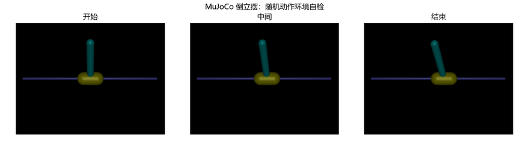

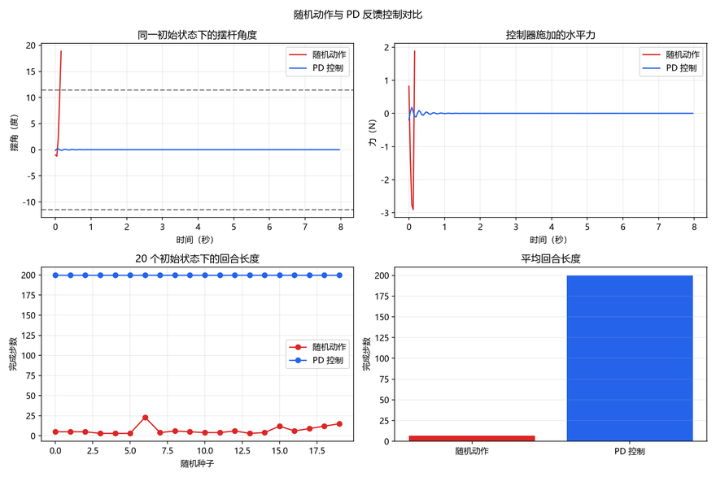

<details><summary>原始演示窗口（展开查看）</summary>

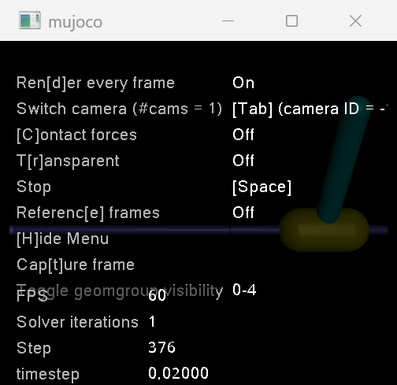

</details>

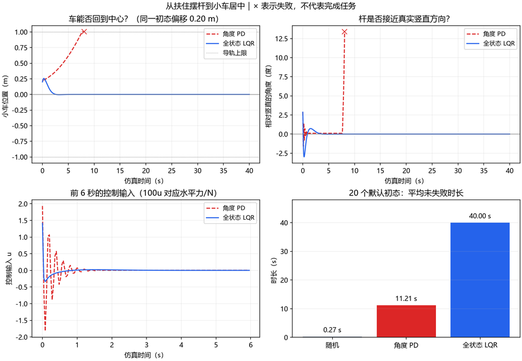

<details><summary>原始演示窗口（展开查看）</summary>

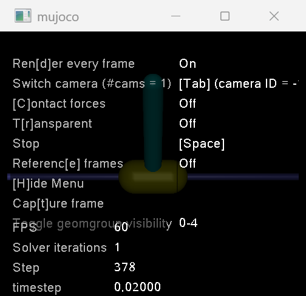

</details>


在项目目录打开一个新的 PowerShell：

```powershell
uv sync
uv run python scripts/test.py quick
uv run python -m embodied_learning.env_check --steps 300 --seed 7
uv run python -m embodied_learning.experiments.pd_comparison
uv run python -m embodied_learning.viewer --policy pd --seconds 10 --seed 7
uv run python -m embodied_learning.experiments.lqr_comparison --output results/lqr_my_run
uv run python -m embodied_learning.viewer --policy lqr --seconds 15 --seed 7
```

这些命令分别同步依赖、运行自动测试、生成随机基线、比较 PD 控制，并打开 10 秒的 PD 控制图形窗口。

最后两条是第三课：40 秒全状态控制对比，以及 LQR 图形窗口。LQR 对比必须使用新的 `--output` 目录，不会覆盖已有结果。当前已验证报告在 `results/lqr_2026-09-02/`；该目录受 Git 忽略规则保护，保留结果需另行归档。运行 `uv sync --locked` 可严格使用锁定依赖。

模型单位校正：控制输入 `u ∈ [-3, 3]`，实际小车执行器水平力为 `100u N`；物理竖直对应关节角约 `-0.001667 rad`。旧结果文件仍保留，新报告已区分这些概念。

## 慢速教学演示

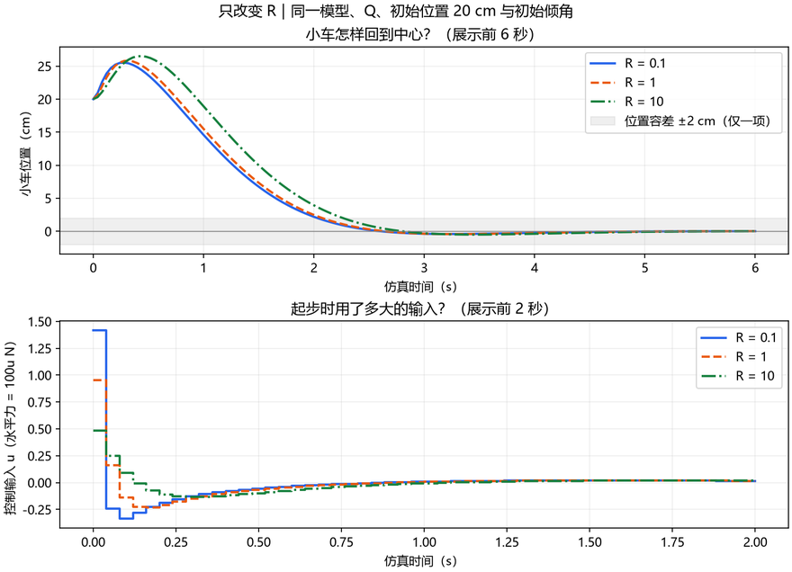

<details><summary>原始演示窗口（展开查看）</summary>

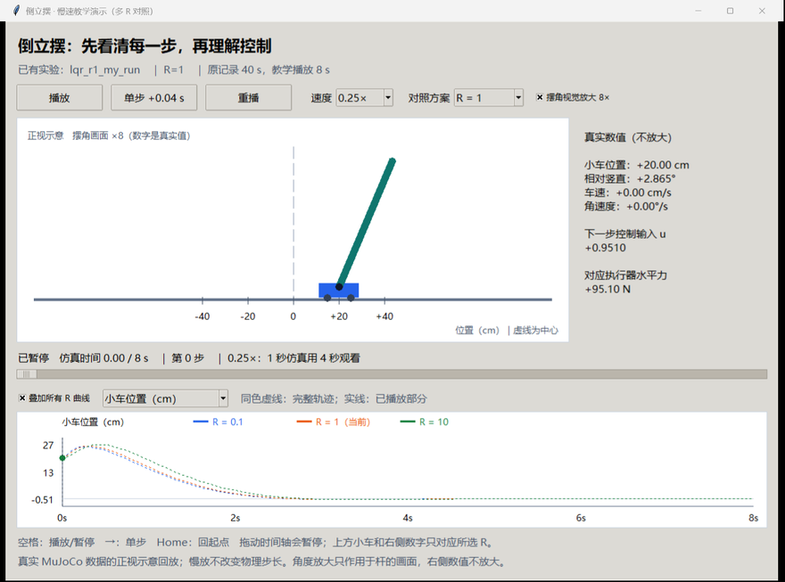

</details>

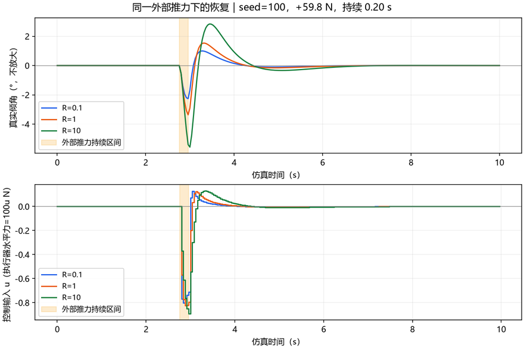

<details><summary>原始演示窗口（展开查看）</summary>

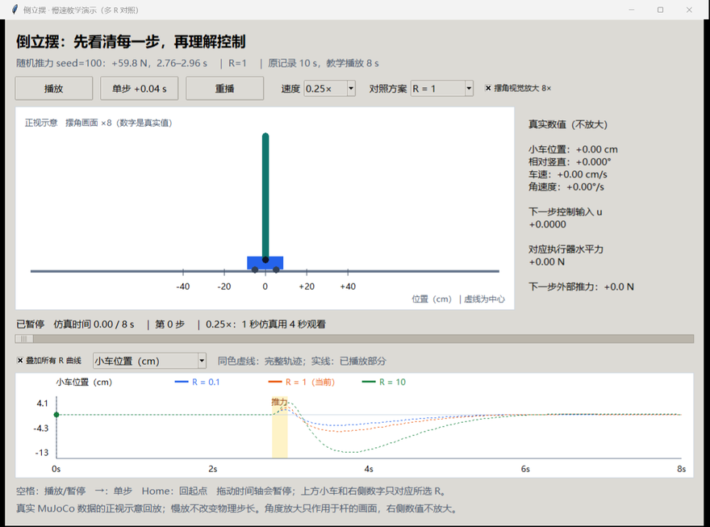

</details>


如果原来的仿真窗口太快，在项目目录运行：

```powershell
uv run python -m embodied_learning.teaching_demo
```

默认暂停、0.25 倍速，播放最有变化的前 8 秒。支持播放/暂停、单步、重播、时间轴、R 对照和真实状态数值；退出可关闭窗口或按 Esc。
如果存在 `results/lqr_r1_my_run`，自动读取其中的 R=1 实验，不会覆盖文件；其他 R 使用同一初态计算。没有该目录时，三个方案均由当前 MuJoCo 生成。

也可明确指定已有的 `lqr_comparison` 结果：

```powershell
uv run python -m embodied_learning.teaching_demo --results results/lqr_r1_my_run
```

这是实际仿真轨迹的二维正视示意回放，不是额外训练。默认摆角画面放大 8 倍，开关可以关闭；右侧数字始终是真实值，播放速度不改变物理步长。
详细操作和 R 对照结果见[第四课：慢放与输入代价](docs/06-session-04-lqr-weights-and-demo.md)。

图表区新增“叠加所有 R 曲线”（默认开启）：蓝色 R=0.1、橙色 R=1、绿色 R=10，共用时间与纵轴尺度。可切换位置、真实倾角、控制输入；关闭叠加只显示当前 R，颜色不变，也不会重置播放位置。

第五课已加入同条件随机外部推力，使用原来的 LQR、不新增学习算法或依赖：

```powershell
uv run python -m embodied_learning.teaching_demo --push-results results/lqr_push_2026-09-02 --seed 100
```

该命令只读取已有实验；完整复现使用新目录：

```powershell
uv run python -m embodied_learning.experiments.lqr_disturbance --output results/lqr_push_my_run
```

见[第五课：被推一下之后](docs/07-session-05-disturbance.md)。

## 第六课：真实状态与传感读数

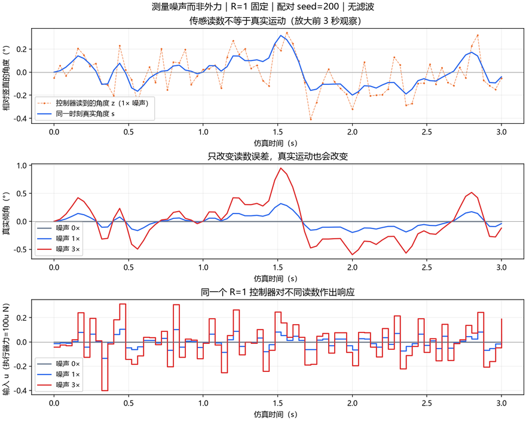

<details><summary>原始演示窗口（展开查看）</summary>

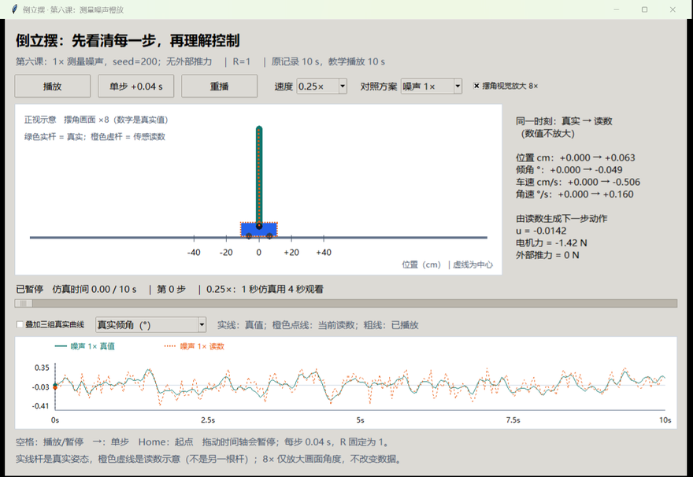

</details>


固定 R=1，只增加测量噪声，比较 0×、1×、3× 三组；不与上一课推力混合。
已有结果在 `results/lqr_noise_2026-09-02/`，其中 `comparison.png` 对照真实倾角、传感读数和控制动作，`trajectories.npz` 保留逐步原始数据。

```powershell
uv run python -m embodied_learning.experiments.lqr_measurement_noise --output results/lqr_noise_my_run
```

复现命令须使用新目录。第六课现已补充慢放入口，直接读取已有数据：

```powershell
uv run python -m embodied_learning.teaching_demo --noise-results results/lqr_noise_2026-09-02 --seed 200 --seconds 10
```

默认暂停、0.25×、1× 噪声。实线杆是真实姿态，橙色虚线杆是同一时刻的传感读数（不是另一根杆）；右侧显示真实值→读数以及由读数产生的下一步动作。切换 0×/1×/3× 噪声，或勾选“三组真实曲线”比较实际运动；三组均固定 R=1，没有外力。角度 8× 仅为画面放大，数字和曲线不放大；单步仍是 0.04 s。不新增 GUI 框架或滤波器，不覆盖实验。
阅读[第六课：看错了，也可能真的动起来](docs/08-session-06-measurement-noise.md)，完成状态、读数、动作三者的辨别。按最新学习问题，先增加下面的摆起专题，再进入双关节机械臂运动学。

## 第七课：下垂摆起与强扰动恢复

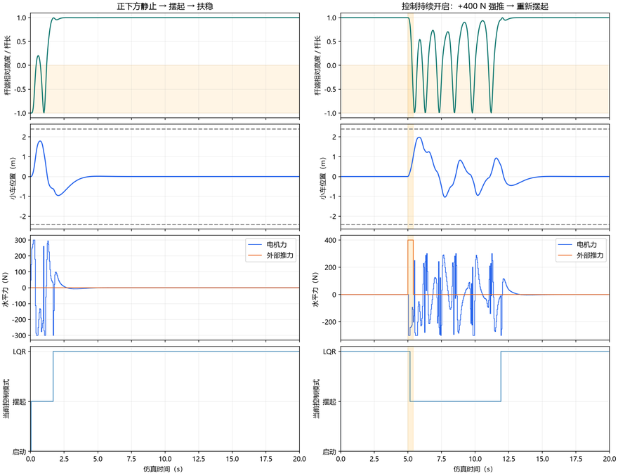

<details><summary>原始演示窗口（展开查看）</summary>

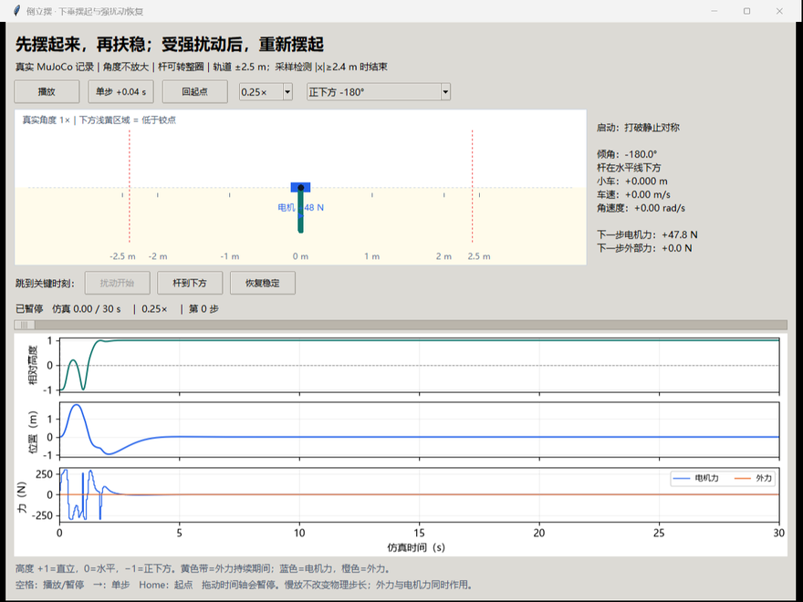

</details>


新增独立的全转动环境：正下方 -180°、左右下方 ±120° 初态，以及在控制持续开启时仍能推倒杆的 ±400 N 扰动。远离直立时用能量摆起，接近直立时切入 LQR；过强的 +600 N 案例保留真实失败。

```powershell
uv run python -m embodied_learning.swingup_demo --results results/swingup_2026-09-02
```

默认暂停、0.25×，可单步或跳到“扰动开始 / 杆到下方 / 恢复稳定”。画面角度不放大，显示控制模式、真实状态、电机力和外力。

新任务取消角度结束条件并允许杆转整圈；轨道扩为 ±2.5 m，每步检查到 |x|≥2.4 m 会失败，另保留速度与数值边界。电机仍最大 ±300 N，原实验和学员已有结果不变。

已保存的正下方启动在 4.76 s 稳定；+400 N 于 5.00–5.40 s 施加，5.32 s 将杆推到下方，15.24 s 重新稳定。只是确定性教学案例，不代表任意扰动均可恢复。

详细原理、场景结果和新目录复现命令见[第七课：倒下以后，先摆起来](docs/09-session-07-swingup.md)。

## 第八课：两个关节与末端坐标

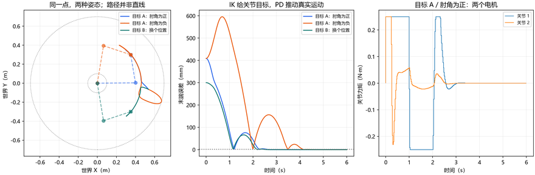

<details><summary>原始演示窗口（展开查看）</summary>

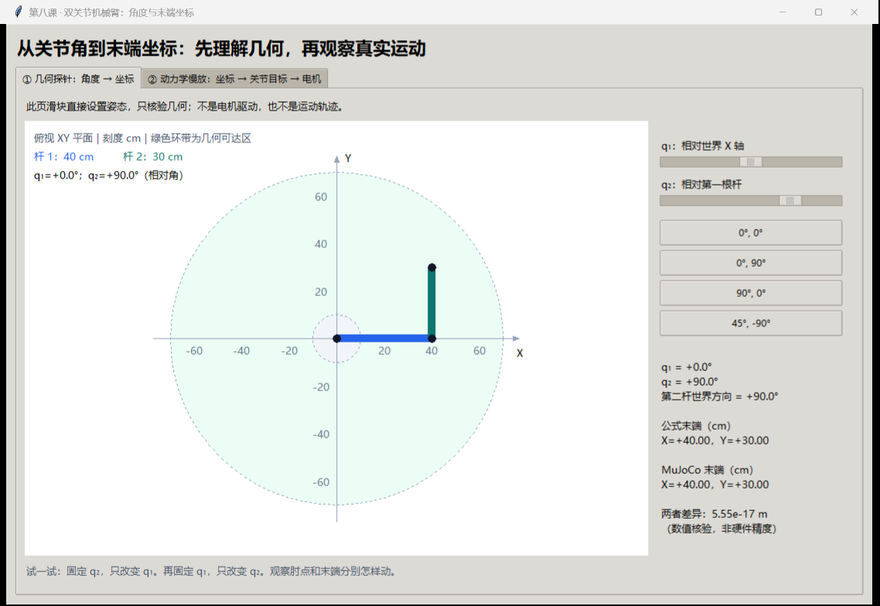

</details>


第八课已进入平面双关节机械臂：两个相对关节角决定末端世界坐标，解析 IK 给目标角，两个电机通过 PD 驱动真实 MuJoCo 运动。

```powershell
uv run python -m embodied_learning.arm_demo --results results/arm_reaching_2026-09-02_v2
```

第一页为几何滑块（直接设置姿态，不是动力学）；第二页为真实力矩驱动轨迹的 0.25× 慢放。三个固定案例均达到末端误差 ≤2 mm、关节误差和速度同时满足门限并持续至少 0.5 s；49 个姿态核验了公式和 MuJoCo 坐标一致。未加入随机目标、碰撞、噪声或 Jacobian 控制。

复现：`uv run python -m embodied_learning.experiments.arm_reaching --output results/arm_reaching_my_run`。输出目录须为新目录。学习顺序和验收记录见[第八课：两个关节角与末端坐标](docs/10-session-08-planar-arm.md)。早期未通过的 `results/arm_reaching_2026-09-02/` 保留作调试证据，当前使用 `_v2`。

## 第九课：沿直线运动与 Jacobian

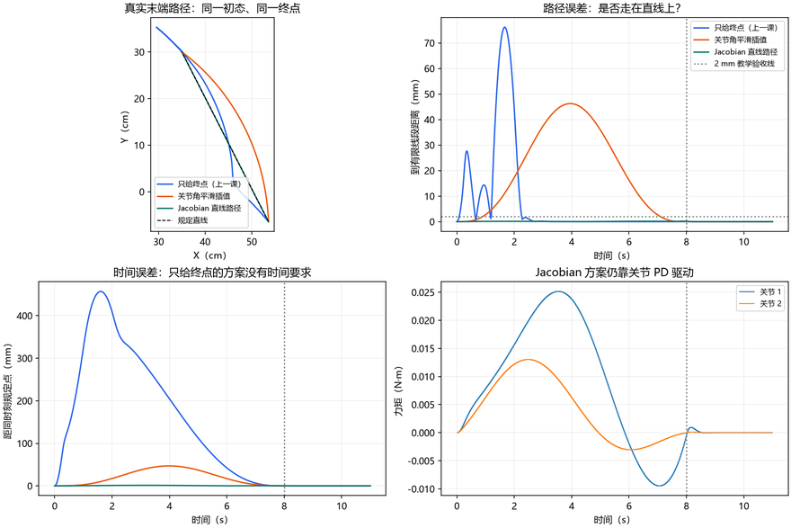

<details><summary>原始演示窗口（展开查看）</summary>

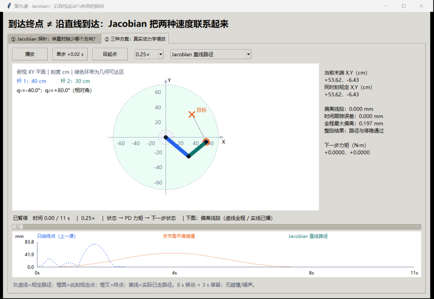

</details>


沿用同一 2R 模型和电机限制，对比只给终点、关节角插值、Jacobian 直线路径。后两者使用相同 8 秒移动 + 3 秒停留与内层关节 PD。0–8 秒最大偏离线段分别为 76.154、46.241、0.197 mm；三组均停稳，只有 Jacobian 组满足本次 2 mm 路径门限。这是单条固定路径的理想仿真结果，不代表硬件精度。

```powershell
uv run python -m embodied_learning.arm_path_demo --results results/arm_path_2026-09-02
```

默认暂停、0.25×，三组曲线不同颜色、同一尺度。第一页是奇异位形的静态速度预测，第二页是真实力矩驱动的轨迹回放；数值阻尼不能恢复伸直位形缺失的瞬时运动方向。

复现：`uv run python -m embodied_learning.experiments.arm_path --output results/arm_path_my_run`。新目录输出包含三组实际状态、力矩、几何参考、对照图与奇异性探针；完整实验和讲解见[第九课：到达终点，不等于沿直线到达](docs/11-session-09-jacobian-path.md)。未增加噪声、碰撞、自由度或依赖；下一步才是有种子的多路径评估。

## 第十课：换一批路径后还可靠吗？

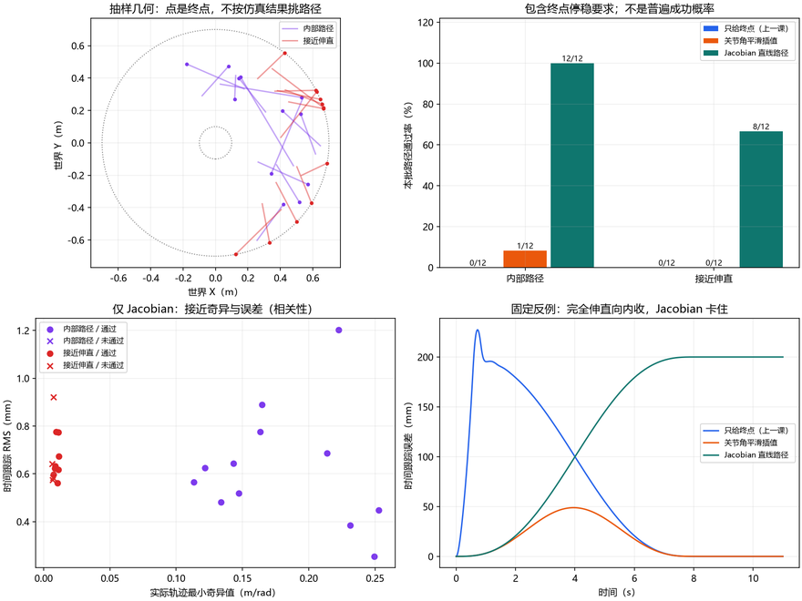

<details><summary>原始演示窗口（展开查看）</summary>

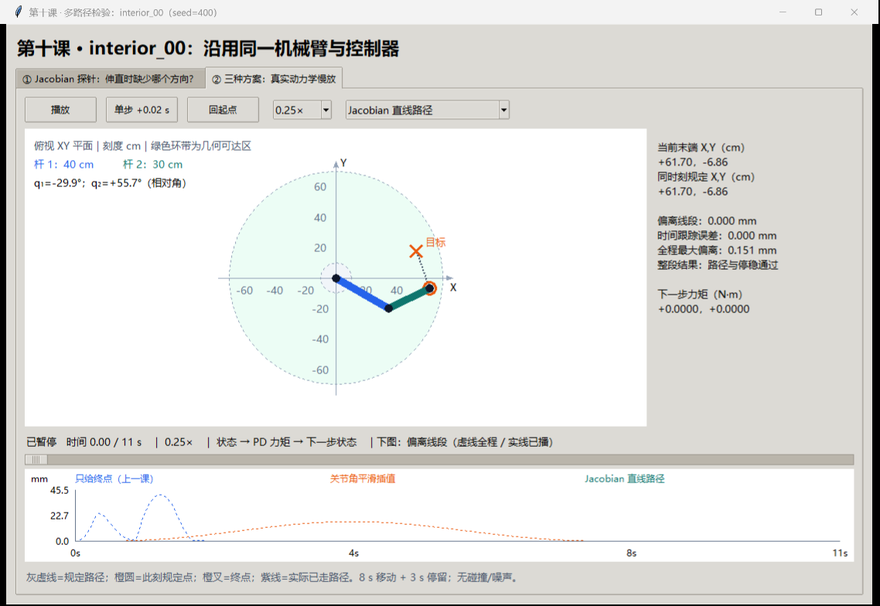

</details>


已完成 seed=400 的 24 条随机路径与 1 条固定奇异初态反例，三方法配对共 75 回合；控制器、2R 模型、电机限幅和时间安排不变。Jacobian 内部组路径通过 12/12，近伸直组 8/12；后者四个未通过案例均因关节角误差未连续满足末尾 0.5 s 要求，而非超过路径偏离门限。

完全伸直向内收的反例中，参考角和两电机力矩均为零，机械臂原地不动：虽偏离线段为零，仍距终点 200 mm，因此不误报成功。慢放入口：

```powershell
uv run python -m embodied_learning.arm_path_demo --results results/arm_path_batch_2026-09-02_v2/trials/singular_inward
```

同一窗口也可读取 `trials/interior_00` 或 `trials/near_extension_01`，新增整段结果与停稳未过条件。批量复现：

```powershell
uv run python -m embodied_learning.experiments.arm_path_batch --seed 400 --per-group 12 --output results/arm_path_batch_my_run
```

正式结果使用 `_v2`；早期目录存在 Windows 换行导致的清单哈希记录问题，保留但不作为正式报告。详见[第十课：多路径检验与失败分层](docs/12-session-10-path-coverage.md)。小样本分组计数不代表普遍成功率；未增加噪声、接触或依赖。

## 第十一课：逐点解析 IK 起步

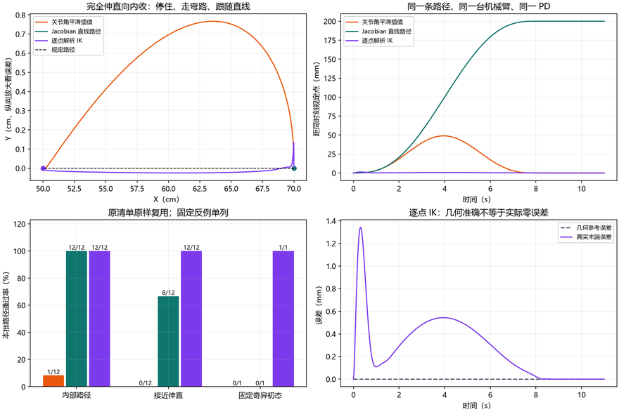

<details><summary>原始演示窗口（展开查看）</summary>

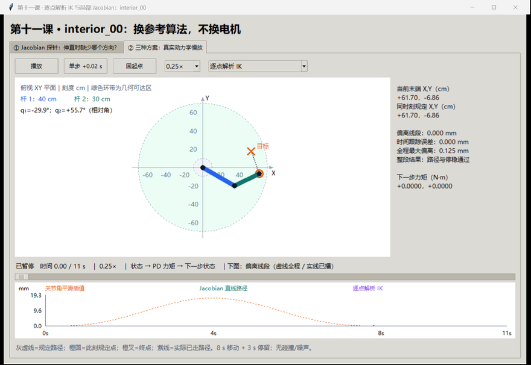

</details>


只改变参考生成方式，不改变机械臂、电机、PD、时间表或验收。对原第十课清单重新比较关节插值、Jacobian 和逐点解析 IK；原有两种方法的轨迹逐数组完全一致。

逐点 IK 在原清单上通过内部组 12/12、近伸直组 12/12 和固定反例 1/1；完全伸直向内收时，实际最大偏离 1.342 mm，没有力矩饱和。不是任意任务上的成功保证：近伸直组中途偏离通常比 Jacobian 更大，最接近门限的案例约 1.891 mm。

```powershell
uv run python -m embodied_learning.arm_path_demo --results results/arm_ik_comparison_2026-09-02/trials/singular_inward
```

默认暂停、0.25×、逐点解析 IK。三种方案为橙/绿/紫色，复用现有窗口；旧结果仍可读取。复现与原理见[第十一课：换参考算法，不换电机](docs/13-session-11-waypoint-ik.md)。未增加依赖或自由度。

## 第十二课：动作时间与电机限制

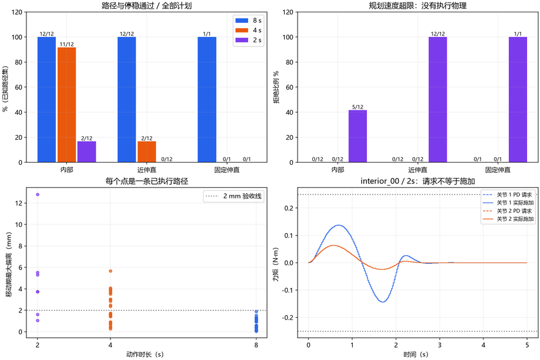

<details><summary>原始演示窗口（展开查看）</summary>

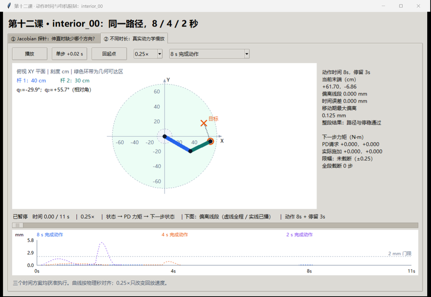

</details>


同一批 25 条路径、同一逐点 IK/PD/电机，只把动作时间设为 8、4、2 秒，随后均停留 3 秒。8 秒通过 25/25；4 秒通过 13/25，却没有力矩截断；2 秒中 18 条规划速度超限而未执行，其余 7 条有 2 条通过、1 条发生力矩截断。不能把未执行、跟踪偏差和电机饱和混为一谈。

```powershell
uv run python -m embodied_learning.arm_path_demo --results results/arm_timing_2026-09-02/trials/interior_00
```

默认暂停、0.25×，三种动作时间不同颜色，右侧同时显示 PD 请求和实际施加力矩。将末尾换成 `interior_08` 可看实际截断，换成 `singular_inward` 可看 2 秒规划拒绝。旧回放入口保留；完整指标、复现命令和边界见[第十二课讲义](docs/14-session-12-timing-and-torque.md)。8 秒组所有原始数组与第十一课完全一致，没有改模型、增益、限幅或验收门限。

## 第十三课：模型前馈＋原 PD

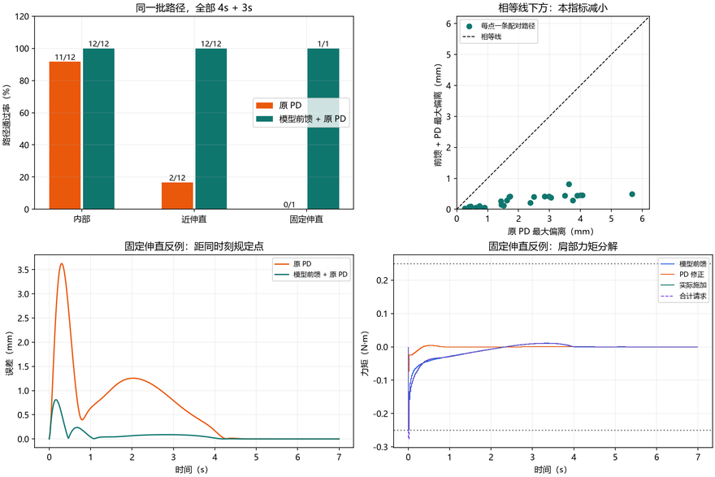

<details><summary>原始演示窗口（展开查看）</summary>

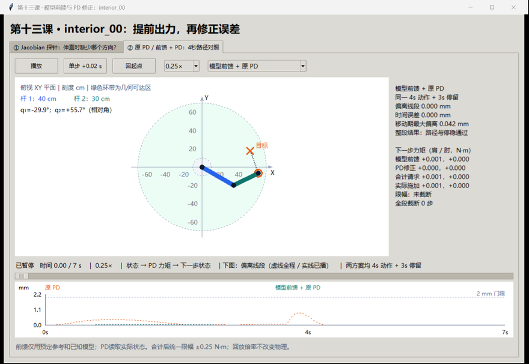

</details>


这是机械臂基础阶段的收尾实验：沿用第十二课的 25 条路径，统一 4 秒动作＋3 秒停留；只加入参考轨迹逆动力学前馈，不改变 PD 增益、电机上限或参考。原 PD 全部数组与第十二课完全一致，路径通过数从 13/25 提高到 25/25。固定伸直案例仍有一次起步力矩截断，不代表模型失配或真实硬件同样可靠。

```powershell
uv run python -m embodied_learning.arm_path_demo --results results/arm_feedforward_2026-09-03_v2/trials/singular_inward
```

默认暂停、0.25×；橙色原 PD、绿色前馈＋PD。右侧拆分模型前馈、PD 修正、合计请求、实际施加。详见[第十三课讲义](docs/15-session-13-model-feedforward.md)与[学习路线回顾](docs/01-learning-roadmap.md)。全量 215 项测试通过。下一主线为差速移动机器人和坐标系，不继续无限扩展 2R 调参。

## 第十四课：差速小车与世界/车体/传感器坐标

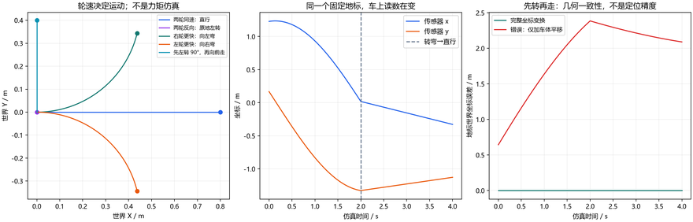

<details><summary>原始演示窗口（展开查看）</summary>

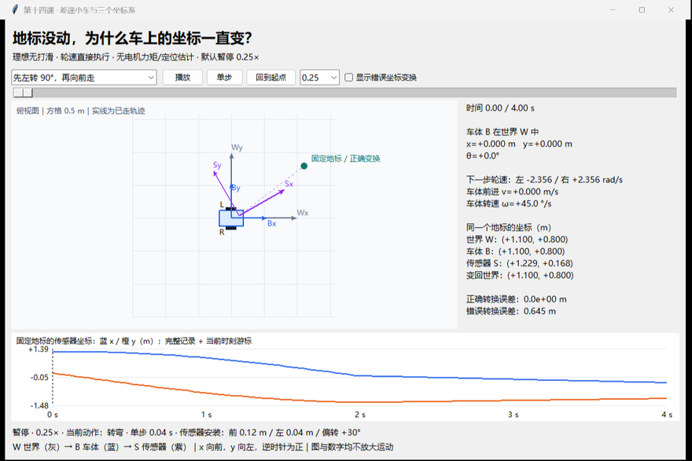

</details>


进入移动机器人阶段：两个轮速输入决定直行、原地转向、左右圆弧，以及先左转 90° 再前进。新增独立的轻量二维运动学实验，不改变机械臂/倒立摆，也不安装 ROS 2。

```powershell
uv run python -m embodied_learning.mobile_demo --results results/mobile_frames_2026-09-03
```

默认暂停、0.25×，同时显示世界轴、车体轴、偏置安装的传感器轴和地标坐标。勾选“显示错误坐标变换”可看遗漏旋转和安装偏移后，固定地标为什么在地图里乱跑；蓝/橙曲线为同一地标的传感器 x/y，支持单步和时间轴。

先转再走例在世界 `[0, 0.400] m`、90° 结束，五例均与解析运动结果一致。地标完整转换最大往返误差约 `6.28e-16 m`，是已知位姿下的浮点数一致性，**不是定位精度**。轮速直接执行，无力矩、打滑、噪声或反馈控制。复现需新目录：

```powershell
uv run python -m embodied_learning.experiments.mobile_frames --output results/mobile_frames_my_run
```

见[第十四课讲义与观察练习](docs/16-session-14-mobile-frames.md)。新增 36 项测试，全量 251 项通过；已用真实桌面核验播放、单步、案例切换和错误变换叠加。下一步将真实位姿与编码器里程计分开，只加入单一可控偏差，暂不进入 SLAM。

## 第十五课：编码器里程计与累积误差

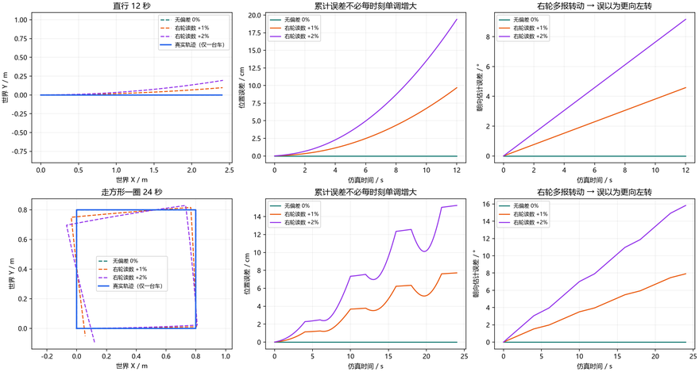

<details><summary>原始演示窗口（展开查看）</summary>

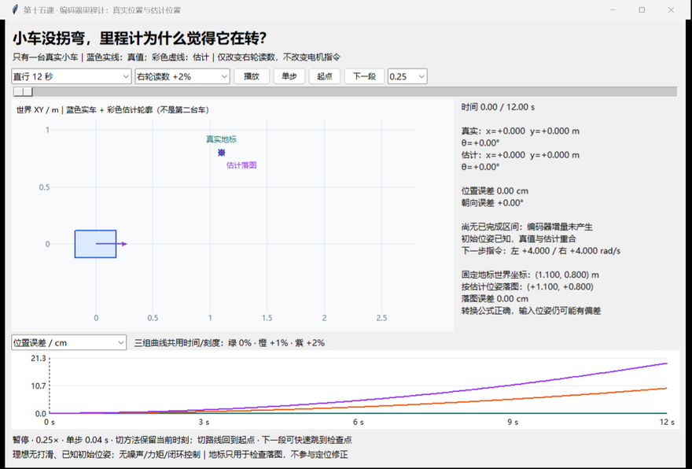

</details>


同一台理想差速车、同一轮速指令，只改变右轮编码器读数比例：0%、+1%、+2%。估计器从编码器增量独立累计位姿，不读取真实位置，不利用地标纠偏。直行 2.4 m 时，+2% 组位置误差 19.40 cm、朝向误差 9.17°；方形一圈后分别为 15.24 cm、15.82°。

```powershell
uv run python -m embodied_learning.odometry_demo --results results/mobile_odometry_2026-09-03
```

默认暂停、0.25×；蓝色为真值，彩色虚线是同一台车的估计轮廓，不是第二台真实车。三组误差曲线同轴叠加，支持位置/朝向/地标落图指标；切偏差保留当前时刻，切路线回起点，“下一段”可快速跳过等待。

复现需新目录：`uv run python -m embodied_learning.experiments.mobile_odometry --output results/mobile_odometry_my_run`。新增 31 项测试；第十四课直行前 4 s 真值与旧记录完全一致。上轮组合回归曾为 281 通过、1 项 Tk 初始化失败；本轮采用窗口测试进程隔离后重复通过，不宣称已确定或修复 Tcl 底层根因。历史证据保留于[第十五课讲义](docs/17-session-15-encoder-odometry.md)，当前验收见第十六课。

## 第十六课：固定比例标定与独立验证

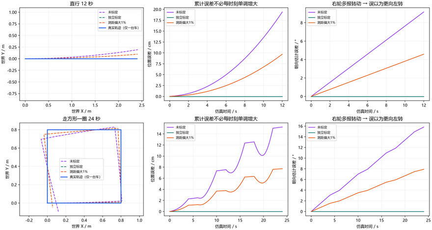

<details><summary>原始演示窗口（展开查看）</summary>

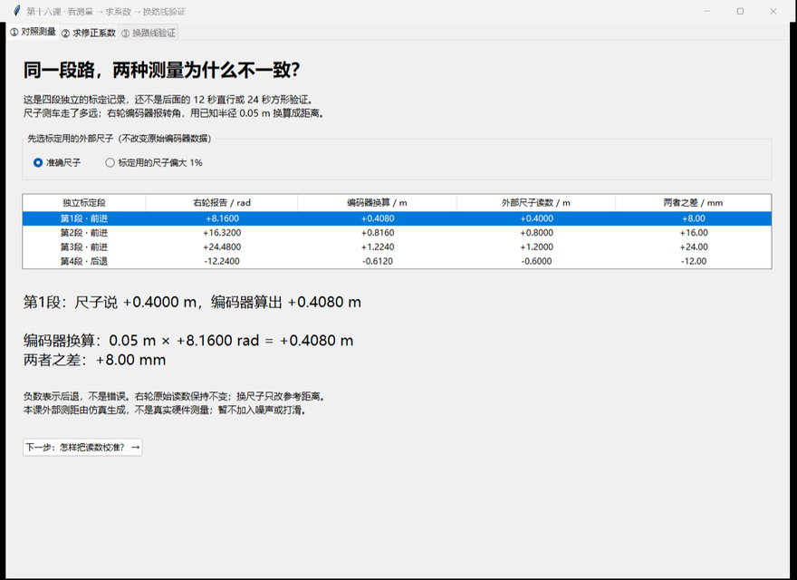

</details>


用新生成的 0.4/0.8/1.2/-0.6 m 独立直行测距数据拟合一个右轮修正系数，再验证冻结的第十五课路线。c≈0.980392 由数据求出，不是直接填入真实偏差。另保留“标定测距偏大 1%”反例，说明测量基准的重要性。

```powershell
uv run python -m embodied_learning.calibration_demo
```

新版默认从“① 对照测量”开始：先看 0.4000 m 与 0.4080 m 的差异，再到“② 求修正系数”点击计算，最后进入“③ 换路线验证”的暂停、0.25× 回放。换成“标定用的尺子偏大 1%”只改变参考距离，必须重新计算系数。灯杆落图默认隐藏，可勾选辅助显示；它不参与定位或控制。

验证页明确标出与旧实验的对应：紫色不修正 = 旧 +2%、绿色准确尺子标定 ≈ 旧 0%、橙色尺子偏大1%标定 ≈ 旧 +1%。切方法保留当前时刻；直行终点误差仍为 19.40 cm、数值舍入量级、9.69 cm。新增的是可见的标定过程，不是新运动能力；近零不代表实车精度。

正式结果仍在 `results/encoder_calibration_2026-09-03_v2/`，本次只改教学 UI、测试及文档，不重跑或覆盖旧实验。315 项全量测试连续两次通过，Ruff 静态及格式检查通过；computer-use 实际核验了测量表、两种尺子的计算步骤、验证页和可选灯杆显示。完整原理、假设、复现命令与 Tk 隔离边界见[第十六课讲义](docs/18-session-16-encoder-calibration.md)。

## 第十七课：标定之后的随机测量噪声

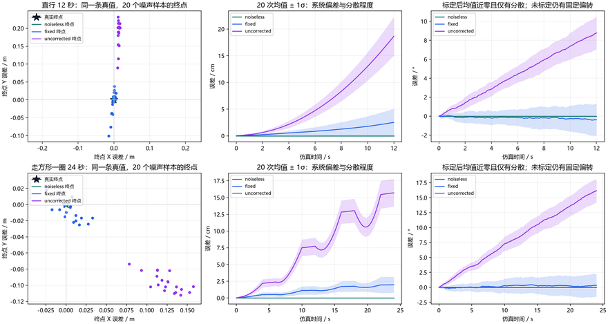

<details><summary>原始演示窗口（展开查看）</summary>

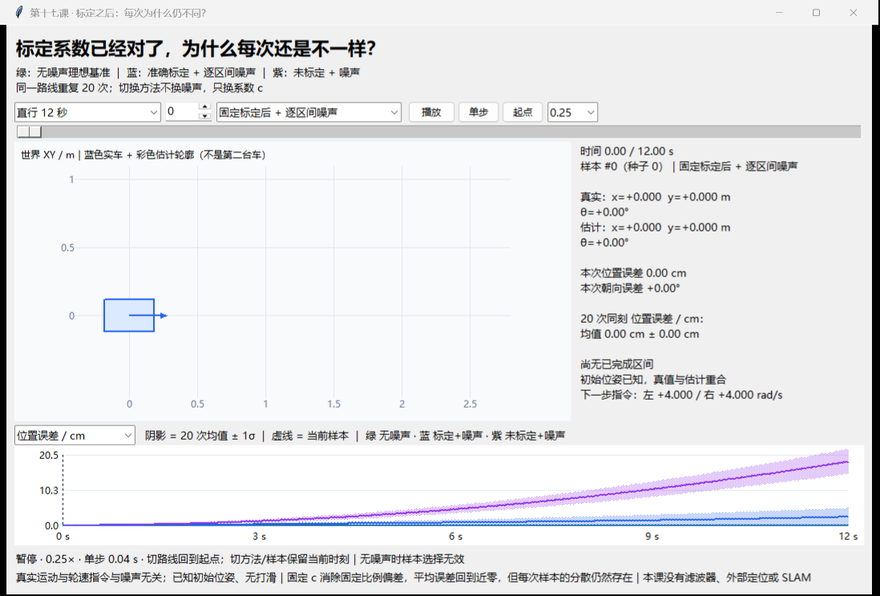

</details>


固定系数 c≈0.980392 已经完全抵消右轮多报的 2%：无噪声理想基准下终点误差小于 `1e-10 m`。本课只加一种变化——每个 0.04 s 区间右轮读数再叠加种子化零均值噪声 σ=0.008 rad（约为单步增量 0.16 rad 的 5%），同一条路线重复 20 次，把**系统偏差**（20 次平均）和**随机分散**（标准差/分位）分开统计。

```powershell
uv run python -m embodied_learning.mobile_noise_demo --results results/mobile_noise_2026-09-03
```

默认暂停、0.25×、样本 #0、固定标定组。样本 #0–19 选择不同的噪声实现；固定标定与未标定共用 ε，仅改变 c；无噪声组另设 ε=0。图表同时画 20 次均值 ±1σ 阴影带与当前样本曲线，可对比统计规律和这一次结果。

直行 2.4 m / 12 s 终点（N=20）：固定标定组平均误差距离 2.52 cm、标准差 2.55 cm、单次 0.32–10.16 cm；未标定组平均 18.65 cm（有符号平均 Y 偏移 +18.61 cm）。方形 24 s：固定标定 1.96 ± 1.19 cm；未标定 15.70 ± 2.08 cm。c 修正固定编码器比例，但逐区间噪声仍进入位姿递推；有符号均值较小不等于平均误差距离为零。位置误差也不能直接套用独立增量求和的 √N 规律。

复现需新目录：`uv run python -m embodied_learning.experiments.mobile_noise --output results/mobile_noise_my_run --runs 20 --seed 0`。新增 16 项测试；全量 331 项连续两次通过，Ruff 静态及格式检查通过（62 个 Python 文件）。完整原理、假设、统计口径与停止点见[第十七课讲义](docs/19-session-17-random-noise.md)。是否引入外部观测/滤波由任务精度要求决定，不自动加卡尔曼或 SLAM。

## 第十八课：已知地标（控制点）观测与里程计对照

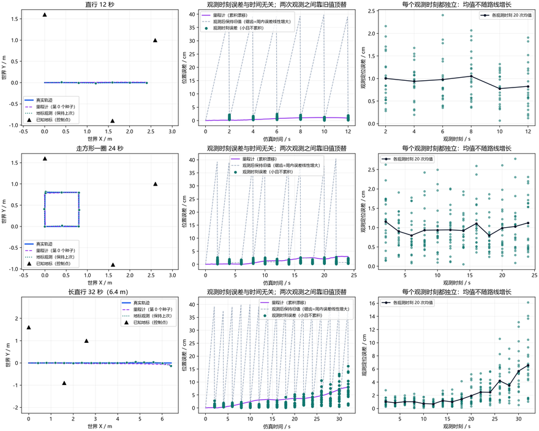

<details><summary>原始演示窗口（展开查看）</summary>

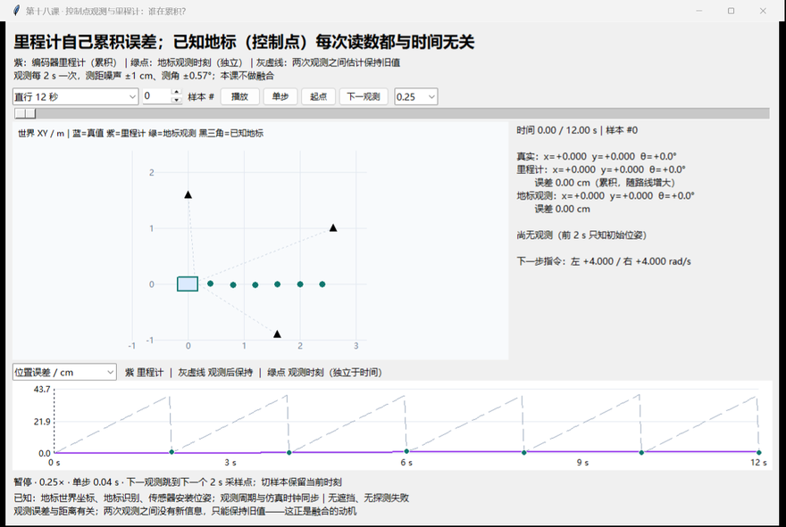

</details>


本课增加第二种信息来源：装在车上的传感器每 2 s 对三个**已知世界坐标的地标**测一次距离和方位角（测距标准差 1 cm、测角标准差 0.57°，不是误差上限），
用 2D Procrustes 闭式解（旋转+平移刚体配准，无缩放）从观测反算车体位姿——就是 GIS 控制点配准的机器人版。里程计与地标观测各自独立估计，**不做融合**。

```powershell
uv run python -m embodied_learning.landmark_demo --results results/mobile_landmarks_2026-09-03
```

默认暂停、0.25×、直行、样本 #0。地图上蓝=真值、紫=里程计、绿点=观测时刻、黑三角=已知地标；"下一观测"按钮跳到取样点。
右侧面板区分两种估计的误差属性；图表可切位置/朝向误差。

三条路线 × 20 种子（直行 12 s / 方形 24 s / 长直行 32 s）：里程计终点误差 2.52 / 1.96 / 9.56 cm（累积，σ 同步增大）；
地标观测全采样均值 0.93 / 0.97 / 2.24 cm（不递推累积历史误差，但随几何位置变化；长直行末端误差升至 6.57 cm）。同终点比较应使用观测终点 0.83 / 1.12 / 6.57 cm，而不是全采样均值。
关键现象：两次观测之间估计"保持旧值"，误差按车行驶距离线性增大（锯齿峰 ≈ 每周期车速×2 s≈40 cm），观测时刻误差跳回小值——
**观测给绝对基准、里程计填观测间隙**，这是最简融合的动机；本课不实现融合。

复现需新目录：`uv run python -m embodied_learning.experiments.landmark_observations --output results/mobile_landmarks_my_run --runs 20 --seed 0`。
新增 15 项测试；全量 346 项连续两次通过，Ruff 静态及格式检查通过（63 个 Python 文件）。
完整原理、假设与停止点见[第十八课讲义](docs/20-session-18-landmark-observations.md)。最简融合现已在第十九课实现。

## 第十九课：看观测 → 解位置 → 最简融合

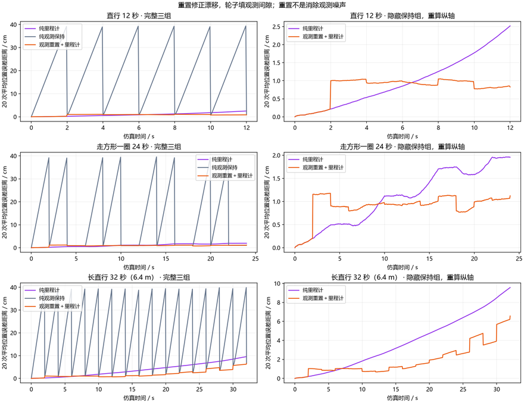

<details><summary>原始演示窗口（展开查看）</summary>

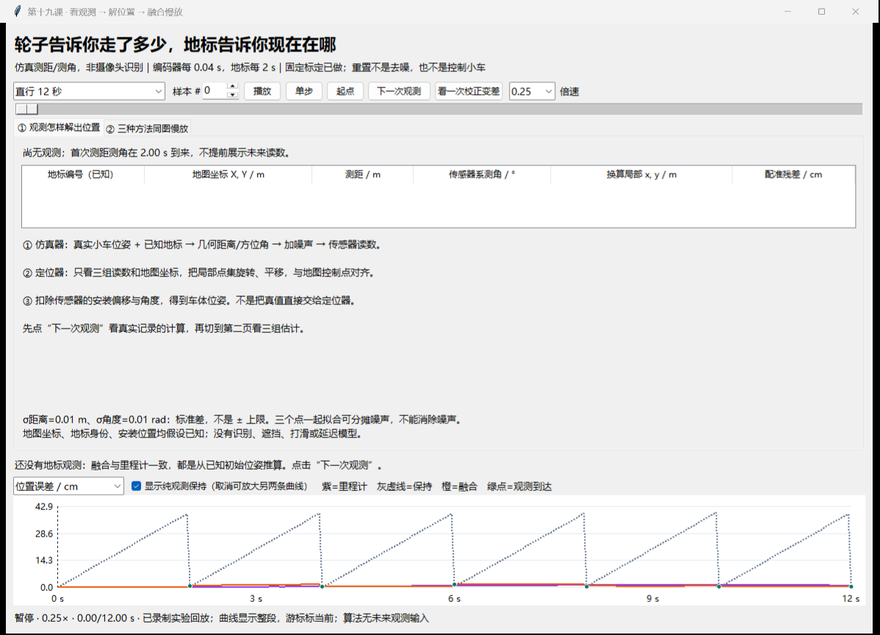

</details>


同一批测量比较纯里程计、纯观测保持、观测重置＋里程计三组。新演示先显示三组原始测距/测角、局部坐标与配准残差，再解释传感器位姿如何扣除安装偏移得到车体位姿；第二页提供三色慢放、校正前后和“看一次校正变差”。默认暂停、0.25×。

```powershell
uv run python -m embodied_learning.fusion_demo --results results/mobile_fusion_2026-09-03
```

三条路线各 20 次的**全程平均位置误差距离**（纯里程计 / 纯观测保持 / 融合）：直行 0.978 / 19.642 / 0.803 cm；方形 1.089 / 13.478 / 0.901 cm；长直行 3.822 / 19.933 / 1.938 cm。长直行 320 次重置中 168 次使瞬时位置误差增大：整体收益不等于每次校正必然改善。观测时刻融合位置等于观测解，不宣称去除了观测噪声。

固定标定修正编码器比例；位姿重置修正累计漂移；两者都不能自动校正错误地图、错误安装参数或消除随机噪声。新增 30 项测试，全量 376 项通过；真值与旧两种估计和第十八课逐数组一致，旧产物不覆盖。详见[第十九课讲义与复现](docs/21-session-19-landmark-fusion.md)。本课不实现卡尔曼、SLAM、ROS 节点或运动控制，学完后回到移动机器人系统主线。

## 第二十课：ROS 2 节点、消息与坐标链

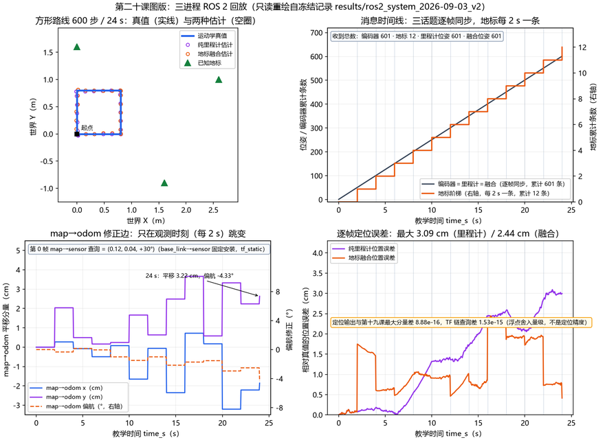

<details><summary>原始演示窗口（展开查看）</summary>

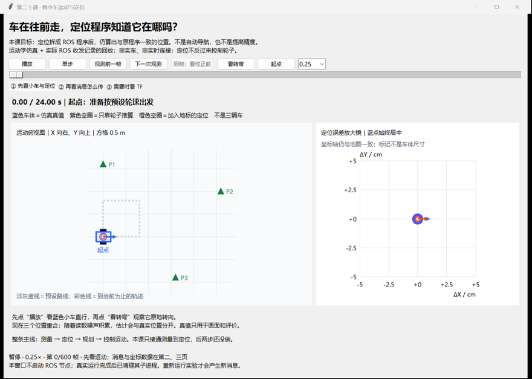

</details>

预览图由冻结记录只读重绘生成：`uv run python -m embodied_learning.experiments.record_figures --kind ros2 --record results/ros2_system_2026-09-03_v2 --output docs/img/lesson-20-ros2-timeline.png`

沿用第十九课读数和算法，在已有 WSL2 / ROS 2 Jazzy 中真实运行传感器回放、定位、核验三个独立进程。新增的是程序间的数据交接与坐标组织，不是提高定位精度；没有安装新仿真器或启动导航。

```powershell
uv run python -m embodied_learning.ros2_system_demo
```

默认暂停、0.25×，现在先打开运动页：左侧蓝色小车按预设轮速直行、原地转弯；右侧用厘米尺度显示定位偏差。紫／橙空圈是同一辆车的两种估计，不是另外两辆车。点“下一次观测”，再切换“同帧：看校正前／后”，时间和真车位置保持不变，只看估计修正；可直接跳到转弯。消息和 TF 放在辅助页，不再先展示表格。

这是运动学真值与实际 ROS 收发记录的只读回放，非实车、非实时连接；目标是验证独立程序仍能协作定位，不是自动导航。定位还不反馈控制轮子。整条主线是测量→定位→规划→控制，本课只接通前两项。

方形路线两种发布顺序都收到 601 条编码器、12 条地标，以及各 601 条里程计和融合位姿；相对旧算法最大差异约 `8.88e-16`，属数值舍入范围。逐帧 TF 查询和迟到订阅者接收静态变换均通过，运行结束清理本次子进程。正式记录在 `results/ros2_system_2026-09-03_v2/`，反序记录在 `results/ros2_system_reversed_2026-09-03_v2/`。

重新实际运行：`uv run python -m embodied_learning.experiments.ros2_system --route square --output results/ros2_system_my_run`，须使用新目录。原实验保留；定位节点只订阅测量、不读取答案。初版新增 25 项测试，运动改版再加 5 项，全量 406 项重复通过；八个既有实验文件哈希不变。详细原理、操作与边界见[第二十课讲义](docs/22-session-20-ros2-messages-and-tf.md)。

## 第二十一课：根据估计位置驶向目标

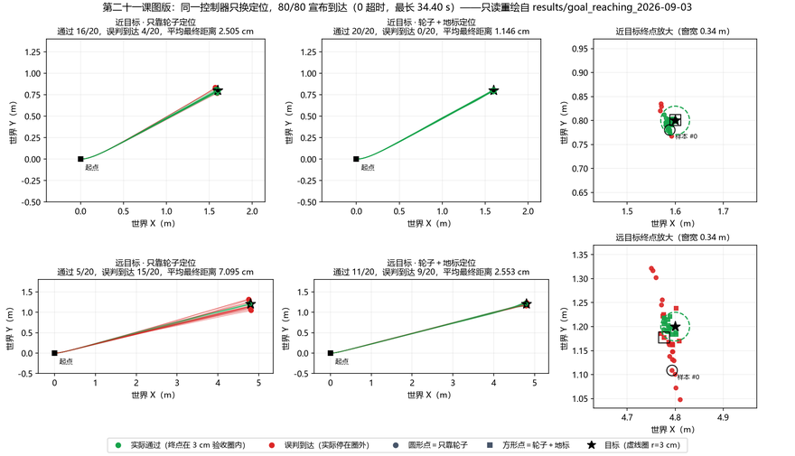

<details><summary>原始演示窗口（展开查看）</summary>

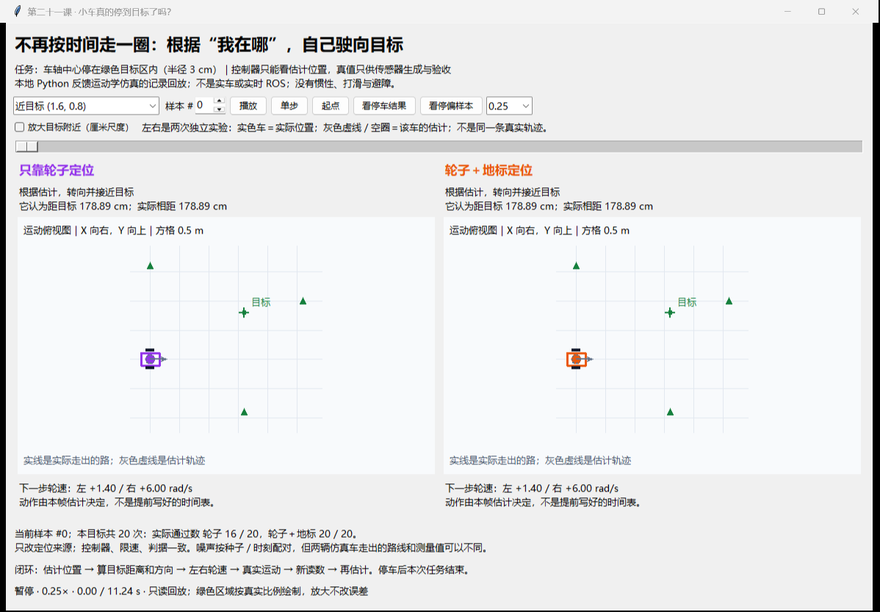

</details>

预览图由冻结记录只读重绘生成：`uv run python -m embodied_learning.experiments.record_figures --kind goal --record results/goal_reaching_2026-09-03 --output docs/img/lesson-21-goal-outcomes.png`

小车不再按预设时间表运动：每 0.04 s 根据估计位置和目标计算左右轮速。左右两次独立实验比较纯里程计与地标融合，控制器和限速不变；估计进入 2 cm 并停稳 0.4 s 后宣布到达，独立验收检查真实车轴中心是否在半径 3 cm 的目标区。

```powershell
uv run python -m embodied_learning.goal_demo
```

默认暂停、0.25×，先看实际行驶；“看停车结果”会放大目标附近，“看停偏样本”可看到估计已进圈但真车停偏。近目标实际通过数 16/20→20/20，远目标 5/20→11/20；远目标仍有 9 次融合误判，不宣称完全解决噪声。

正式结果在 `results/goal_reaching_2026-09-03/`。这是新运行的 Python 反馈运动学实验，不是新 ROS 联调或实车，不增加惯性、打滑、避障或滤波。80 回合逐数组复现一致，全量 429 项测试通过。原理和新目录复现见[第二十一课讲义](docs/23-session-21-goal-feedback.md)。

### 第二十一课补充：缩小停车门限

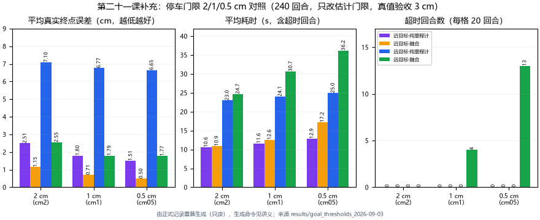

<details><summary>原始演示窗口（展开查看）</summary>

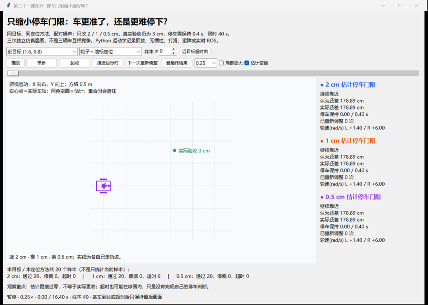

</details>

预览图由冻结记录只读重绘生成：`uv run python -m embodied_learning.experiments.record_figures --kind threshold --record results/goal_thresholds_2026-09-03 --output docs/img/lesson-21a-thresholds.png`

```powershell
uv run python -m embodied_learning.threshold_demo
```

同一张运动图同步慢放蓝色 2 cm、橙色 1 cm、紫色 0.5 cm；只改估计停车门限，真实验收仍为 3 cm。点“接近目标时 → 播放”看停车差异，“远目标超时例”可查看更严格却迟迟不能完成的回合。默认暂停、0.25×，不是第二十二课或新阶段。

近／远目标、两种定位、20 种子共 240 回合，逐数组复现；2 cm 的 80 回合与上一课完全一致。远目标融合通过／超时数为 11/0、13/4、7/13（各 20 次）；门限更小不保证任务更好。全量 443 项测试通过，慢放及超时对照已实际检查。正式结果 `results/goal_thresholds_2026-09-03/`，见[补充实验讲义](docs/23a-session-21-stopping-tolerance.md)。原默认门限不变，旧结果保留。

## 第二十二课：针孔相机与投影-反投影（阶段 4：三维感知）

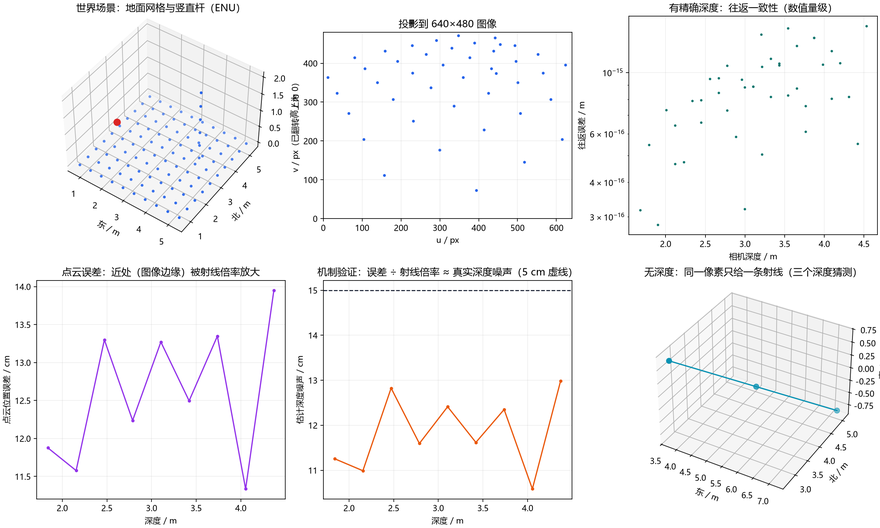

<details><summary>原始演示窗口（展开查看）</summary>

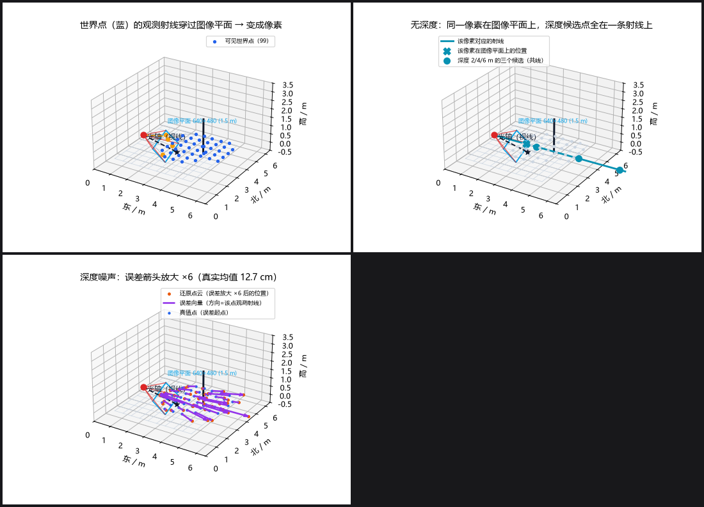

</details>


进入三维感知阶段的第一课。已知坐标的 3D 场景（地面网格 + 竖直杆）经针孔相机投影到 640×480 图像（fx=600、主点 (320,240)）。**可见性 = 深度大于近裁剪 0.5 m 且像素落在图像内**（43 点；杆顶超出图像上边界被视场切掉——见②③演示中的橙色杆点）。有精确深度时**往返一致**（最大 1.47e-15 m）；无深度时同一像素只给一条射线（三个深度猜测共线且重投影相同——单目本质无尺度）；深度噪声上调到 σ=15 cm（贴近廉价深度传感器的粗糙测距量级）：点云误差均值 12.67 cm、最大 60.32 cm，且**误差 ∝ 射线长度 |K⁻¹[u,v,1]|**（误差÷倍率近/远段 11.10/11.61 cm ≈ σ·√(2/π) 机制验证）；相机平移 0.5 m 后反投影回同一世界系仍一致（1.37e-15 m）。

```powershell
uv run python -m embodied_learning.pinhole_demo --results results/mobile_pinhole_2026-09-03
```

窗口左侧是**可旋转 3D 场景视图**（地面+杆+光心/光轴/图像平面/视锥+射线与点云差异，可拖拽旋转缩放），右侧像素平面（杆点橙色高亮）与数字面板；三种模式：① 精确深度（往返误差与近裁剪面）、② 无深度（射线上三个深度候选与共线证明）、③ 深度噪声（真值 vs 噪声点云与误差连线 + 20 种子统计）。按 Esc 退出。

复现需新目录：`uv run python -m embodied_learning.experiments.pinhole_projection --output results/mobile_pinhole_my_run --runs 20 --seed 0`。新增 11 项测试；全量 454 项通过。完整原理、假设与停止点见[第二十二课讲义](docs/24-session-22-pinhole-projection.md)。"单目相对深度 ↔ 米制标定"已在第二十三课完成；阶段 4 的剩余建议依次为真实 Depth Anything 仿射检验 → 内参标定 → 点云/ICP，不直接开始训练。

## 第二十三课：单目相对深度 ↔ 米制尺度标定

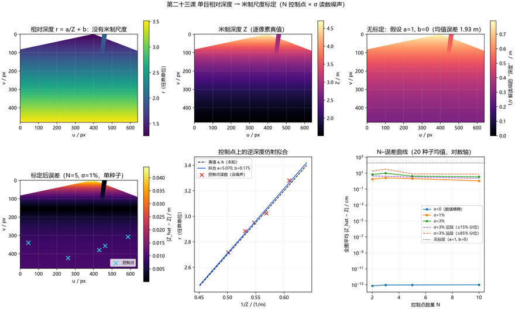

<details><summary>原始演示窗口（展开查看）</summary>

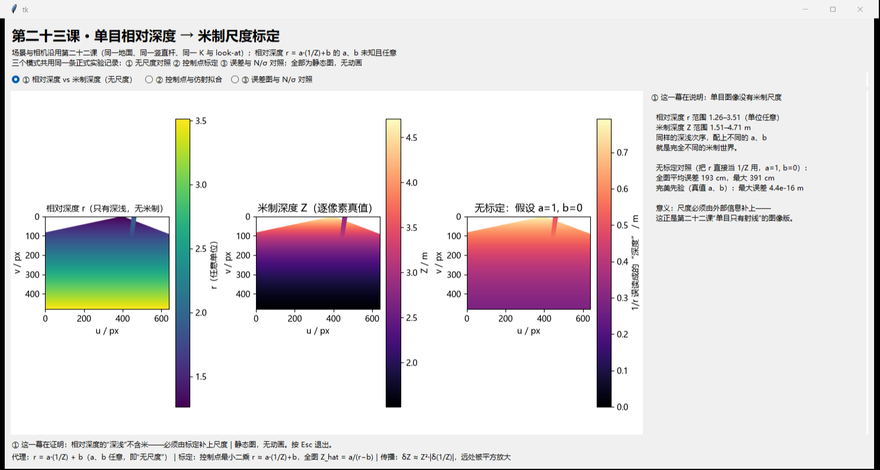

</details>


承接第二十二课"单目本质无尺度"的结论：单目相对深度模型输出 r = a·(1/Z) + b，任何 (a,b) 描述同一几何，只有尺度与原点漂移——这就是"无尺度"的代数形式。本课不重训练、不加载权重，只做一件事：抽 N 个已知深度的控制点（模拟稀疏激光测距/GIS 控制点，要求 1/Z 跨度 ≥ 0.1），对 r 做逆深度仿射最小二乘标定 (a,b)，再全图反演 Z_hat = a/(r−b) 得到米制深度图。相机与场景逐项沿用第二十二课，对地面＋竖直杆做逐像素解析光线投射（有效像素 280 687，深度 1.51–4.71 m）。无标定基线（把 r 直接当 1/Z 用）全图平均误差 193.2 cm；σ=0 时 N≥2 即 ~1e-13 cm 复原——N 的价值只在压噪声；σ=1%/3% 下 N=5 全图平均 2.06/4.19 cm、N=10 时 1.10/3.45 cm；σ=3% 远/近误差比 2.5–7.8 倍（机制为 δZ ≈ Z²·|δ(1/Z)|，b 的误差在远处被平方放大）；控制点挤在近处的坏布设最差 775 cm 案例如实保留。拟合参数的三明治协方差与 2000 次经验协方差比值 0.990–1.018，公式自洽。

```powershell
uv run python -m embodied_learning.monocular_metric_demo --results results/mobile_monocular_2026-09-05
```

静态图像演示（无动画），三种模式：① 相对深度图 vs 米制深度图 vs 无标定误读图并排（同样的深浅次序、完全不同的米制世界）；② 深度图上的控制点与逆深度域仿射拟合（真值线虚线对比）；③ 逐像素误差图与 N–误差对数曲线（三条 σ、近/远分层虚线与无标定基线）。Esc 退出；加载时校验 summary 契约、npz 哈希，并从第二十二课相机与场景常量重算深度图比对。

复现需新目录：`uv run python -m embodied_learning.experiments.monocular_metric --output results/mobile_monocular_my_run --runs 20 --seed 0`。新增 13 项测试；全量 468 项通过。本课是理想仿射代理的误差传播研究，不宣称代替真实深度模型——真实 Depth Anything 的非仿射畸变与控制点布设是下一步。完整原理、N/σ 扫描表与停止点见[第二十三课讲义](docs/25-session-23-monocular-metric.md)。

## 第二十四课：真实单目相对深度的仿射检验（Depth Anything V2）

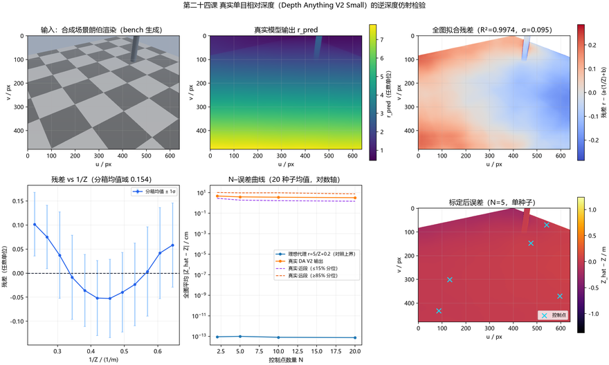

<details><summary>原始演示窗口（展开查看）</summary>

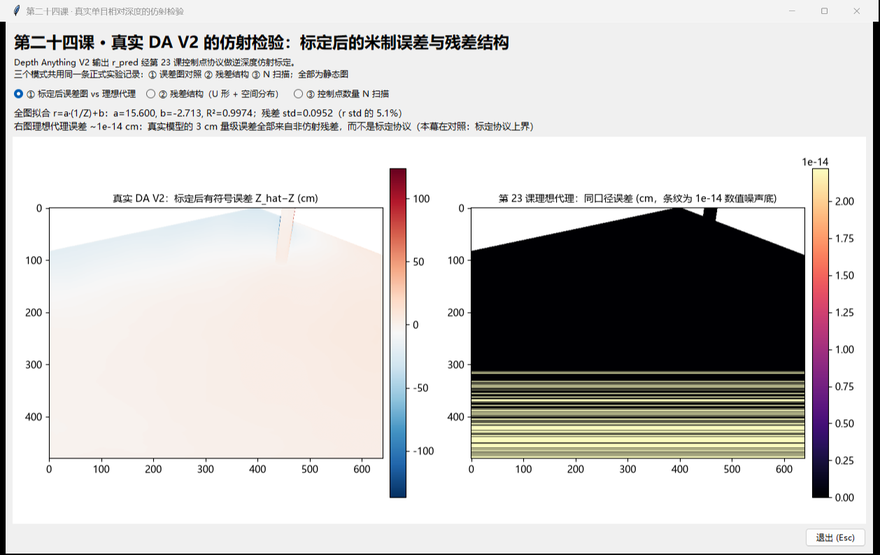

</details>


把第二十三课的理想代理换成真实模型：用第二十二课的合成场景渲染朗伯着色 RGB 图（棋盘格地面 + 杆），经 monocular-depth 子仓的 Depth Anything V2 Small 真实推理（CUDA、518 px 输入、0.33 s），对输出做同一套逆深度仿射拟合与控制点标定。全图拟合 **R²=0.9974**（a=15.60、b=−2.71），残差 std 0.0952（r std 的 5.10%）；但残差**不是白噪声**：1/Z 方向 U 形（分箱 +0.102→−0.053→+0.058）、与像素横坐标相关 −0.846——是平滑结构场。标定后全图米制误差 **3.07 cm**（近 1.41 / 远 7.15，远/近 3.7–5.9 倍）；N 扫描 4.66→3.20 cm，N=10 后饱和——**3 cm 是全局仿射的下限**。结论：仿射是一阶近似，全局标定够厘米级应用，亚厘米需要分段/逐区域标定；真实照片域未做，如实写入"本课不能说明什么"。与第 23 课同口径对照：真实模型 ≈ 该课 σ=3% 水平；"σ=0 时 N 不起作用"在真实模型上不再成立。

```powershell
monocular-depth/.venv/Scripts/python.exe monocular-depth/bench/affine_check_pinhole.py
uv run python -m embodied_learning.experiments.real_depth_affine --input <bench npz> --output results/real_depth_affine_my_run
uv run python -m embodied_learning.real_depth_demo --results results/real_depth_affine_2026-09-05
```

torch 推理留在子仓 bench 脚本，主仓分析只依赖 numpy；新增 12 项测试（含演示加载器防篡改与三模式 Tk 测试）。本课当时全量 479 项通过；三模式静态演示（误差图对照/残差结构/N 扫描）为验收轮补充。正式记录 `results/real_depth_affine_2026-09-05/`，完整原理、残差结构图与自审见[第二十四课讲义](docs/28-session-24-real-depth-affine.md)。

## 第二十五课：合成棋盘格张氏内参标定

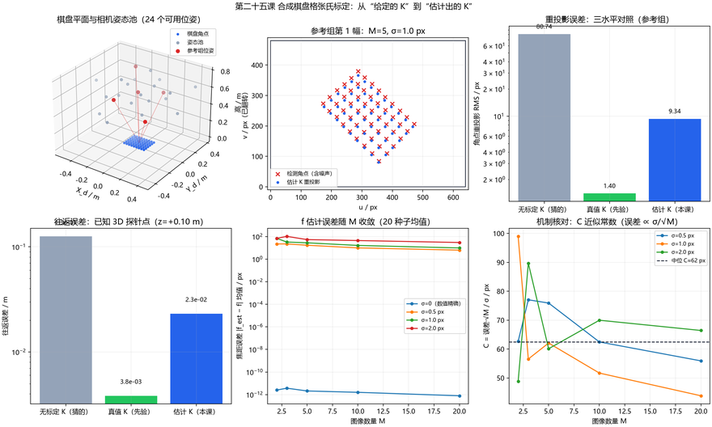

<details><summary>原始演示窗口（展开查看）</summary>

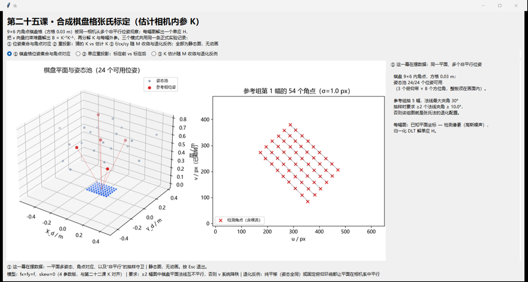

</details>


K 从"给定值"变成"被估计量"：合成 9×6 平面棋盘格放到 24 个不同姿态（3 俯仰 × 8 方位 × 3 距离），角点经真值 K 投影加噪声（σ = 0–2 px），用 Hartley 归一化 DLT 单应 → v 向量 SVD → B=K⁻ᵀK⁻¹ 闭式解反解 fx=fy=f、cx、cy（4 参数版，与第 22 课 K 对齐；5 参数与 GN 精化未做、如实标记）。σ=0 时 f 误差 **4.43e-12 px**、往返 3.65e-16 m；M=5/σ=1 px 时 f 误差 20.27 px、真值位姿重投影从"猜的 K"80.74 px 压到估计 K 的 9.34 px（√2σ 地板 1.40 px）；M=20/σ=0.5 px 时 f 误差 ≈1%。机制常数 C=|f̂−f|·√M/σ 中位 62.4 px；cy 误差为 cx 的 1.8–2.9 倍（竖向覆盖小）。**退化反例 ×2**：纯平移与固定俯仰环绕均秩 2、条件数 ~1e20，守卫触发（调试还发现"固定俯仰环绕本身就是退化配置"——平面法线在相机系中恒定）；**自洽性陷阱**：用分解位姿做重投影时错 K 被错位姿吸收、三个水平不可区分——改用真值位姿重投影 + 平面外探针往返两个可区分指标，陷阱本身写入讲义。

```powershell
uv run python -m embodied_learning.intrinsics_demo --results results/camera_intrinsics_2026-09-05
```

复现需新目录：`uv run python -m embodied_learning.experiments.camera_intrinsics --output results/camera_intrinsics_my_run --runs 20 --seed 0`。新增 14 项测试（手算单应、退化守卫、契约、进程隔离 Tk）；全量 493 项通过。正式记录 `results/camera_intrinsics_2026-09-05/`，与 GIS 摄影测量内方位元素的对照及自审见[第二十五课讲义](docs/29-session-25-camera-intrinsics.md)。

## 第二十六课：噪声深度图 → 点云 → ICP 配准

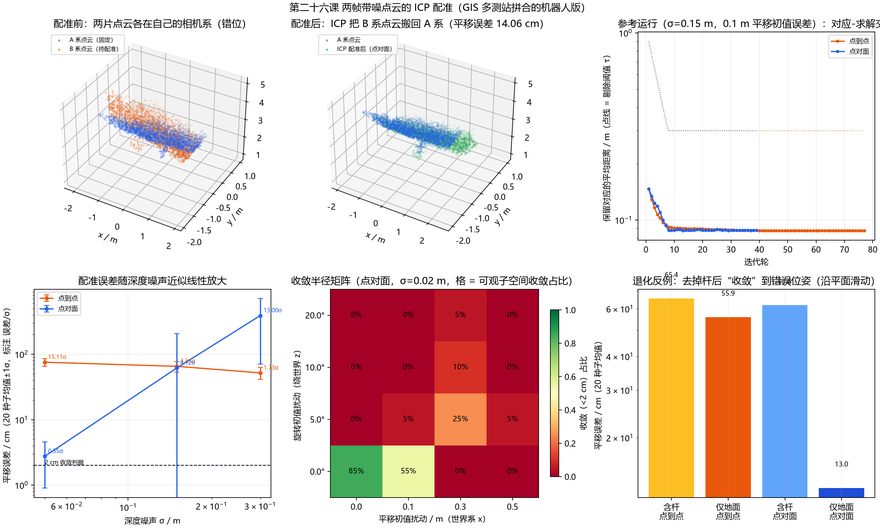

<details><summary>原始演示窗口（展开查看）</summary>

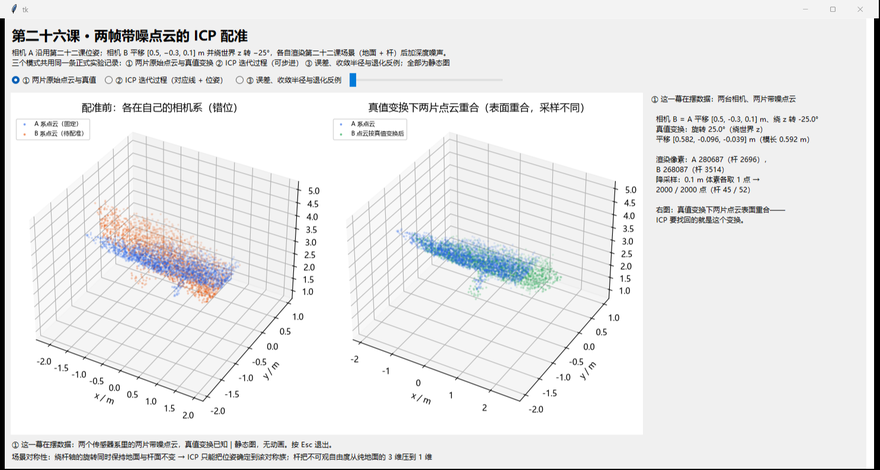

</details>


同一场景两个相机位姿（B = A 平移 [0.5,−0.3,0.1] + 绕 z −25°）的带噪深度点云（0.1 m 体素降采样 2000 点/片），手写 ICP（点到点 SVD 与点到面双侧残差、特征截断冻结不可观模态、阈值调度）配准。**线性区只在 σ≤0.05 m**（E_obs/σ=0.54）；σ≥0.15 起弱切向模态被噪声淹没。**收敛半径**：平移 ~0.1 m、旋转 ~0°（朴素误差 ~3.04 m/rad 杆杠杆）；点到点/点到面轮数比 6.9；PCA 法线中位偏差 38.3°（σ=0.15）——法线质量是点到面的命门。**退化反例反转**（σ=0.15、0.1 m 平移初值）：仅地面点云 13.0±1.3 cm"收敛但错"20/20（秩 3/6 冻结、确定性），含杆 61.8±144.7 cm 部分种子漂移数米——**部分可观测 + 高噪声比完全不可观 + 冻结更危险**，σ=0.02–0.05 时含杆才见效；绕杆轴自转是精确一维对称族，以商空间指标如实呈现。

```powershell
uv run python -m embodied_learning.icp_demo --results results/point_cloud_icp_2026-09-05
```

复现需新目录：`uv run python -m embodied_learning.experiments.point_cloud_icp --output results/point_cloud_icp_my_run --runs 20 --seed 0`。新增 19 项测试（无噪精确恢复、手算 NN/SVD、退化守卫、契约、进程隔离 Tk）；全量 512 项通过（本课测试含重型端到端约 6.5 分钟）。正式记录 `results/point_cloud_icp_2026-09-05/`，与 GIS 多测站配准的对照及自审见[第二十六课讲义](docs/30-session-26-icp-registration.md)。

## 第二十七课：MobileSAM 视觉接地标身份

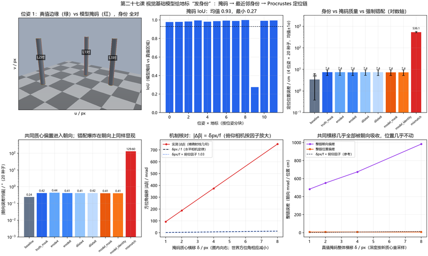

<details><summary>原始演示窗口（展开查看）</summary>

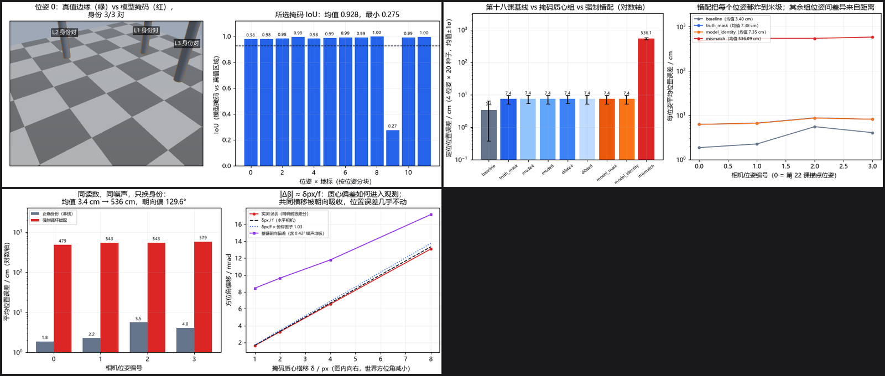

</details>


替换第 18–20 课的 declared 假设"地标身份已知"：三柱体地标场景（L1=第 22 课杆位）经 MobileSAM 自动掩码生成（270 个候选掩码、CUDA 4.1–4.4 s/位姿），选中 12 个掩码 IoU 均值 0.928（最小 0.275 的部分掩码身份仍对）；掩码质心经渲染深度反投影 + 最近邻匹配发身份——**12/12 身份正确**，观测送入第 18 课 Procrustes 定位链。定位结果：真值身份基线 3.40±3.02 cm vs 模型掩码 7.35±2.16 cm ≈ 真值掩码 7.38 cm——**瓶颈不是掩码质量**（±8 px 腐蚀膨胀仅 7.37–7.42 cm），而是质心的表面/轴口径差 −6.00 cm=−半径；**强制身份错配爆炸 5.36±0.37 m、朝向 129.6° 且解算器零报错**——身份错配是静默失败，必须显式校验。机制：δφ/(δpx/f) 四档比值 0.981。

```powershell
uv run python -m embodied_learning.grounding_demo --results results/visual_grounding_2026-09-05
```

torch 推理留在子仓 bench（`monocular-depth/bench/grounding_inference.py` + 官方 MobileSAM 权重），主仓分析/测试无 torch。新增 12 项测试；全量 526 项通过。正式记录 `results/visual_grounding_2026-09-05/`（source_sha256 与提交版源码漂移如实记录，逐格复现通过），完整结果与自审见[第二十七课讲义](docs/31-session-27-visual-grounding.md)。

## 第二十八课：行为克隆——开环可学、闭环不成（阶段 5 入口）

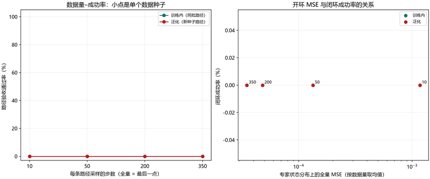

<details><summary>原始演示窗口（展开查看）</summary>

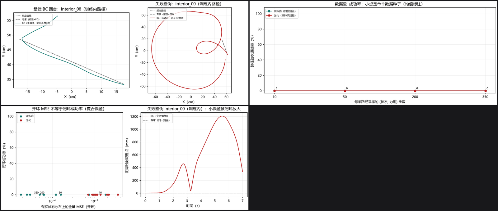

</details>


用数据替代模型：第 13 课专家（前馈+PD，复验 25/25+泛化 25/25）的 (状态， 力矩) 轨迹喂给纯 numpy 手写 MLP（4→64→64→2、4610 参数、手写 Adam），无知觉输入（不看参考/目标/时钟），纯 BC 力矩直驱无 PD 兜底。核心结果（600 回合）：开环训练分布 MSE **1.17e-3→3.50e-5（33 倍）**，但闭环成功率**全档 0/75**——MSE 与成功率脱钩，即复合误差/分布移的实证；泛化 MSE 饱和 ~1e-3、gen/train 比随数据量 2.2→29.3；失败形态=漂移/画圈 + 10–32% 力矩截断，最佳回合 12.6 mm；近失解剖：1 条过路径门限（1.078 mm<2 mm）但末态偏 289 mm——无目标输入收不回终点。这正是第 29 课 RL（奖励信号）的动机。

```powershell
uv run python -m embodied_learning.bc_demo --results results/bc_imitation_2026-09-05
```

复现需新目录：`uv run python -m embodied_learning.experiments.bc_imitation --output results/bc_imitation_my_run --seed 0`。新增 14 项测试（有限差分梯度、过拟合、种子确定性、验收与第 13 课对拍 1e-9、截断回合、篡改三路拒绝、isolated_tk 三模式）；全量 540 项通过。正式记录 `results/bc_imitation_2026-09-05/`，与专家的口径差及自审见[第二十八课讲义](docs/32-session-28-bc-imitation.md)。

## 第二十九课：手写 numpy PPO 摆起——扶稳学到、完整摆起未成（阶段 5 RL）

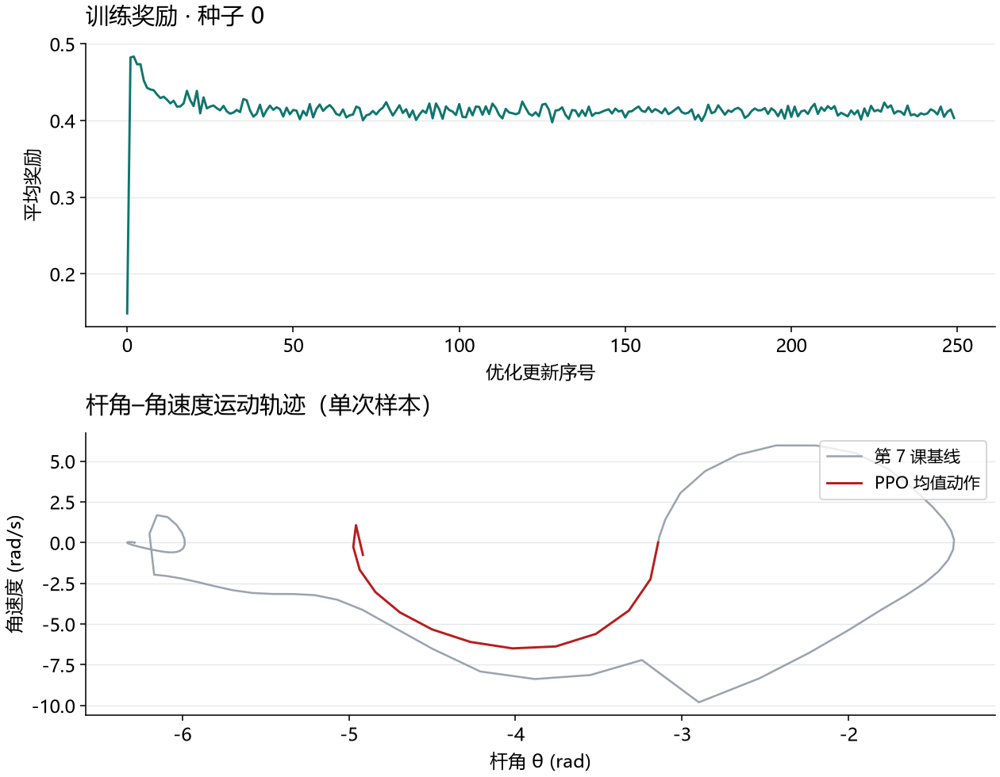

读图：上图是种子 0 的训练奖励；下图是一次确定性均值动作与第 7 课基线的杆角–角速度轨迹。奖励平台不等于闭环成功：正式评估 PPO 0/60、基线 20/20。

<details><summary>原始演示窗口（展开查看）</summary>

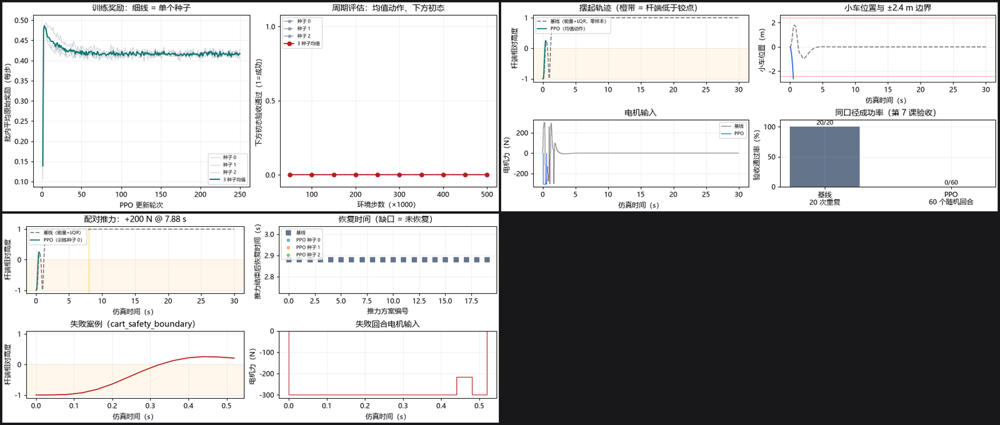

</details>

不注入任何模型知识，纯 numpy 手写 PPO（高斯策略+价值网络、GAE(λ)、clip surrogate、手写反向传播与 Adam）从第 7 课同一全转动摆环境的奖励中学习：8 env × 25 万步 × 3 种子（共 150 万环境步）。

**主结果是诚实的"未学会完整摆起"**：训练奖励 0.14→0.41–0.42，随机起点上的抓取/扶稳子技能真实学到（训练终止率→0）——这正是第 28 课 BC 0/75 学不到的闭环能力；但下方初态评估 **0/60**、150 万步内首次成功不存在，同口径基线（第 7 课能量整形+LQR，零样本）为 **20/20、中位 4.76 s**。±200 N 扰动配对：基线 20/20 恢复（2.88 s），PPO 0/60 且全部在推力时刻之前 0.5 s 量级就已撞墙——分布外"没有行为可恢复"。

失败四机制（讲义 §3.4 逐条量化）：直立区域从未被探索（σ≤1.5 噪声探针无一过水平）；扶稳技能外推成下方恒 −3 满偏反射；出界惩罚经 GAE 递归压制中间进步；下方回合 13 步即死、数据占比塌缩。近失案例：杆端推到高度 0.990 但车撞边界——缺抓取-回中协调。

```powershell
uv run python -m embodied_learning.ppo_demo --results results/ppo_swingup_2026-09-06
```

新增 14 项测试（GAE 手算、截断泄漏守卫、有限差分梯度、微型训练逐位一致、评估与第 7 课对拍、端到端、篡改三路拒绝、isolated_tk）；全量 554 项通过。正式记录 `results/ppo_swingup_2026-09-06/`，奖励/观测/课程三处"隐形手工"的讨论与自审见[第二十九课讲义](docs/33-session-29-ppo-swingup.md)。"未学会"按项目纪律作为正式结论入库。

## 第三十课：残差强化学习——底座管能量注入，PPO 只学限幅残差

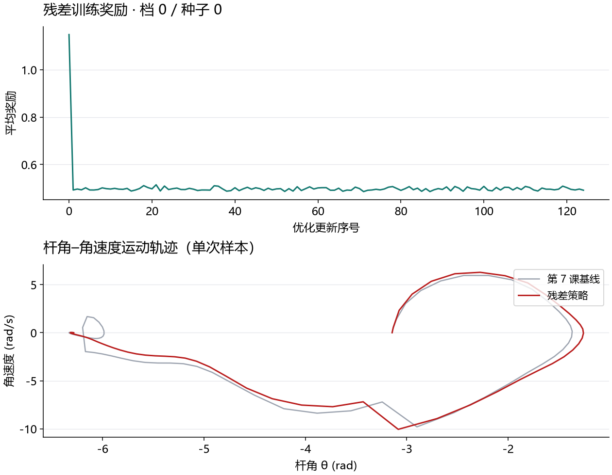

读图：上图是残差档 0 / 种子 0 的训练奖励；下图是一次策略与原底座的状态轨迹。展示的是代表性回合，整体裁决仍须看三档配对评估：残差 0/60。

<details><summary>原始演示窗口（展开查看）</summary>

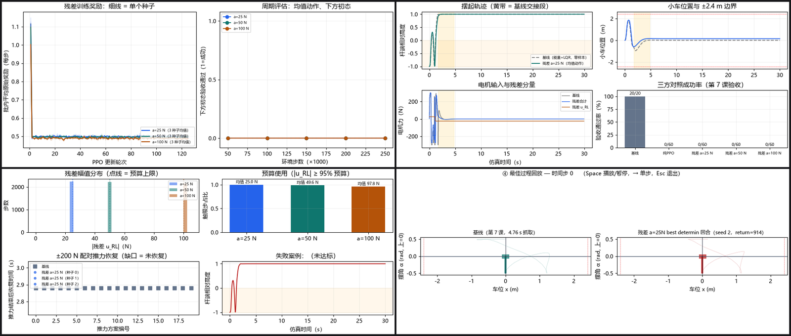

</details>

执行第 29 课停止点的方案：第 7 课能量整形+LQR 底座零改动，PPO 只输出限幅残差
`u = clip(u_energy + clip(u_RL, ±a), ±300 N)`，a ∈ {25, 50, 100} N × 3 种子 × 25 万步。
**a=0 守卫与第 7 课原始运行逐位一致**——管线正确性由构造证明。主结果仍是诚实负结果：
训练奖励 0.14→0.485–0.498（9 组）但下方初态评估三档全部 **0/60** vs 基线 20/20（4.76 s）；
失败形态与第 29 课不同——超时未稳 177/180（出界仅 3）：残差幅值均值≈预算、触限 95.8–99.6%，
**朴素的探索残差在交接脆弱段是持续 bang-bang 扰动**，足以毁掉可用底座；
推力配对基线 20/20（2.88 s）vs 残差 0/60。假设裁决 degrades the baseline success，如实入库。

```powershell
uv run python -m embodied_learning.residual_demo --results results/residual_swingup_2026-09-06
```

新增 13 项测试（a=0 逐位守卫、限幅契约、有限差分、微型训练逐位一致、与第 7 课对拍、
推力配对、篡改三路、isolated_tk 三模式）；全量 573 项通过。正式记录 `results/residual_swingup_2026-09-06/`。
三课叙事与下一步（DAPG 式示教残差 / PBRS 能量势塑形）见[第三十课讲义](docs/35-session-30-residual-swingup.md)。

## 第三十一课：PBRS 势函数塑形——给悬崖修梯子，山顶不动

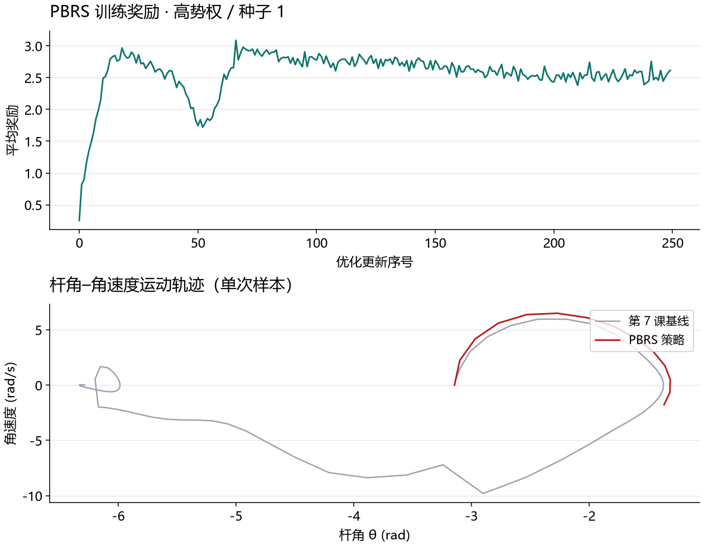

读图：上图取高势权档、种子 1 的训练奖励；下图给出该策略的一次状态轨迹。直立首达发生在正式评估的另一回合，不能把这张单次轨迹解读为稳定成功；总成功仍 0/60。

<details><summary>原始演示窗口（展开查看）</summary>

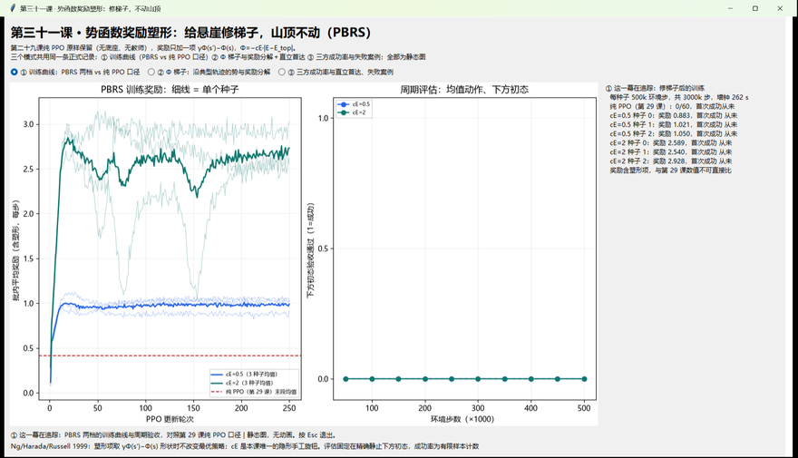

</details>

四种过崖方式第二试（修梯子）：第 29 课纯 PPO 原样保留，只在奖励上加
`γΦ(s′) − Φ(s)`，其中 `Φ = −cE·|E − E_top|`（能量即天然势函数；E_top=0、正下方 −29.54 J）。
Ng/Harada/Russell 1999 定理保证这种塑形**不改变最优策略**——梯子修得再密，山顶位置不变。
cE ∈ {0.5, 2.0} × 3 种子 × 50 万步 = 300 万步；cE=0 守卫与第 29 课奖励管线逐位一致。

主结果：两档仍 0/60（失败形态回到出界 120/120），**但 cE=2.0 种子 1 在 150k 步首次触达直立区**
（episode 内 1.24 s）——三课以来纯梯度学习第一次到悬崖顶。机制四层展开见讲义 §3：
能量梯子改变探索动力学 → 一次即逝 → **"对的能量≠对的姿态"**（快速旋转的杆能量也可以对了，
Φ 对姿态与车位双盲）→ 最后一公里（抓取+稳定）仍只靠任务奖励。

```powershell
uv run python -m embodied_learning.pbrs_demo --results results/pbrs_swingup_2026-09-06
```

新增 14 项测试（势函数手算、cE=0 守卫、γΦ 契约、微型训练冒烟、直立首达指标、篡改三路、
isolated_tk 三模式）；全量 587 项通过。正式记录 `results/pbrs_swingup_2026-09-06/`。
四种过崖进度（缆车✗ 梯子◐ 空投/地图待试）与自审见[第三十一课讲义](docs/36-session-31-pbrs-shaping.md)。

## 第三十二课：DAPG 式示教空投

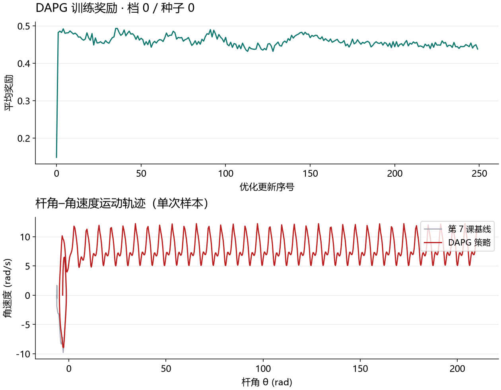

读图：上图是 DAPG 档 0 / 种子 0 的训练奖励；下图是一条确定性状态轨迹。示教改善到达频率，但正式成功率仍为 0/60。

<details><summary>原始演示窗口（展开查看）</summary>

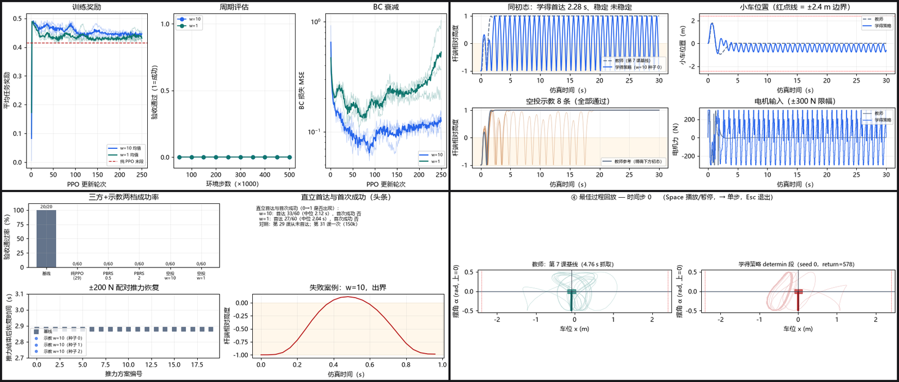

</details>

DAPG 原味简化：第 7 课基线（抖动初态）生成 8 条成功示教（8/8 过质量闸门、6000 对 (s,a)、
SHA-256 入册），PPO 目标加 `w_BC·MSE(μ_θ(s_demo), a_demo)` 辅助项并线性退火，
w_BC ∈ {10, 1} × 3 种子 × 50 万步；w_BC=0 双守卫（环境流与训练曲线/权重逐位）。

**主结果：成功率仍 0/60（0→1 未出现），但探索被质变修复——直立首达从三课一次变为评估常态：
w=10 达 33/60（中位 2.12 s）、w=1 达 27/60（2.04 s）**；BC 记忆分化（w=10 末段 MSE 0.136–0.152
示教被记住，w=1 拆锚后回升至 1.0+）。缺口收缩为**闭环精度**：评估出界 117/120、
推力下超时未稳 30/120 首次成规模出现"活着但稳不住"——开环 BC 回归（9–15 N 力偏差）
给不出 ≥2 s 的 ±0.01 rad/s 闭环不变量，第 28 课复合误差在 RL 内重演。

```powershell
uv run python -m embodied_learning.dapg_demo --results results/dapg_swingup_2026-09-06
```

新增 14 项测试（BC 手算、w=0 双守卫、退火契约、示教哈希校验、篡改三路、isolated_tk 三模式）；
全量 601 项通过。正式记录 `results/dapg_swingup_2026-09-06/`，Q-filter/DAgger 未做项与自审见
[第三十二课讲义](docs/37-session-32-dapg-swingup.md)。

## 第三十三课：Go-Explore 画地图——稳定带被找到并捕获 417 次

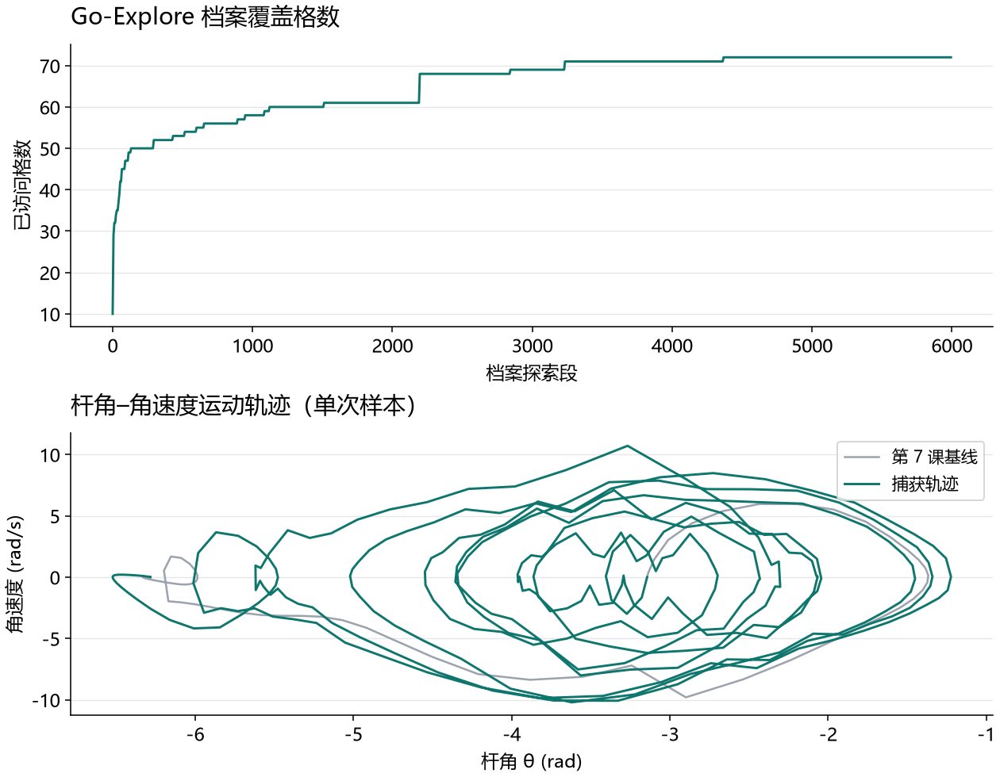

读图：上图显示档案覆盖格数达到 72/72；下图是一条已捕获轨迹在杆角–角速度空间的运动。档案找到稳定带，第二阶段 BC 的下方初态闭环评估仍 0/20。

<details><summary>原始演示窗口（展开查看）</summary>

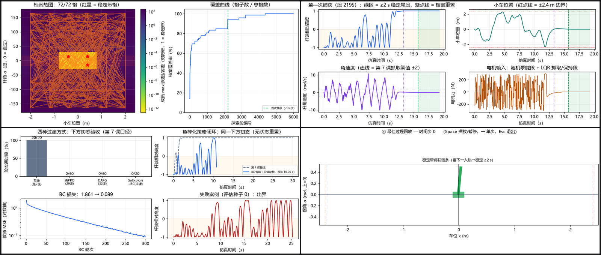

</details>

四种过崖方式第四试（画地图）：档案=（杆角 12 bin × 车位 6 bin）72 格，成员准则按字典序（稳定误差→拼接步数→创建时间），父链按对象冻结（格子被替换不破坏拼接物理一致性）。
阶段一（档案探索）：随机 ±3 + 第 7 课 LQR 保持层，6000 段 270,416 步——**覆盖 72/72（100%）、
首入直立带 8,992 步、稳定带 79,183 步首次捕获并经第 7 课验收复核**：第 29–32 课从未有策略
在山顶住满 2 s，本课共捕获 417 次。set_state 往返 + 拼接切片全新环境重放双逐位一致——
教师数据是真实物理。

阶段二（BC 鲁棒化）：8 条跨格教师（4,912 对）MSE 1.861→0.089，闭环下方初态 **0/20**
（历史性 0→1 未实现）：出界 20/20 但直立首达 11/20（55%）。随机教师在任意状态均值≈0，
BC 只能学到"平均别乱动"+保持段——开环回归给不出闭环不变量（第 28 课复合误差第三次重演）。
结论如实入库：**"地图找到山顶、BC 学不会走"**，指向 DAgger/以档案态为起点的 PG 微调。

```powershell
uv run python -m embodied_learning.goexplore_demo --results results/goexplore_swingup_2026-09-06
```

新增 13 项测试（分格已知答案、双逐位守卫、拼接重放、捕获判据对拍、篡改五路、isolated_tk 三模式）；
全量 614 项通过。正式记录 `results/goexplore_swingup_2026-09-06/`，四方式进度表收官见
[第三十三课讲义](docs/38-session-33-goexplore-swingup.md)。

## 第三十四课：两阶段奖励——能量梯子处处有糖，首次到达变 2/3 种子

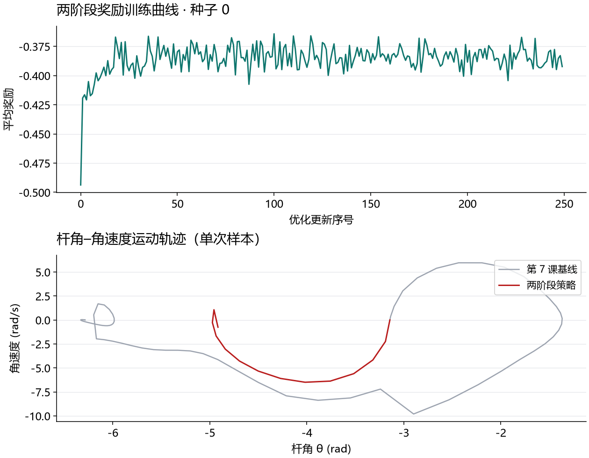

读图：上图是两阶段奖励种子 0 的训练曲线；下图是一次确定性状态轨迹。正式评估有 2/3 种子首次进入直立区，但成功率仍 0/60。

<details><summary>原始演示窗口（展开查看）</summary>

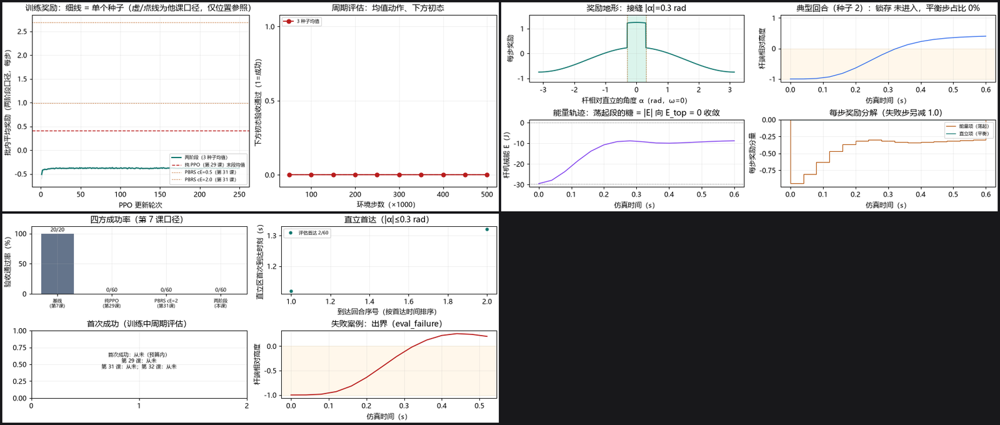

</details>

文献验证的"分阶段目标"路线（MDPI 2024 两阶段学习协议；Dulac-Arnold 综述称摆起+平衡为 stage-switching 问题）：
纯 PPO 不动，荡起阶段奖励 = −cE_switch·|E−E_top|（处处密集梯度），过 α_switch=0.3 阈值后切角度奖励；
出界只终止不重罚（修第 29 课机制③的大罚压制）。骨架完全复用第 29 课；
守卫 = 关掉阶段切换退化为第 29 课奖励逐位一致。

主结果：直立首达 **2/3 种子（100k+200k 检查点）**——比第 31 课 PBRS 的 1/3 进一步；
失败形态出界 60/60（触限率 95.8%→出界主导）；但首次成功仍 0/60：能上崖顶、不能"在顶上站稳 2 秒"。

```powershell
uv run python -m embodied_learning.twophase_demo --results results/twophase_swingup_2026-09-06
```

新增 14 项测试；全量 628 项通过。正式记录 `results/twophase_swingup_2026-09-06/`，
六种过崖方式总结与自审见[第三十四课讲义](docs/39-session-34-twophase-swingup.md)。

## 第三十五课：手写 numpy SAC——最大熵保不住到达，α 坍缩与回放熵归零

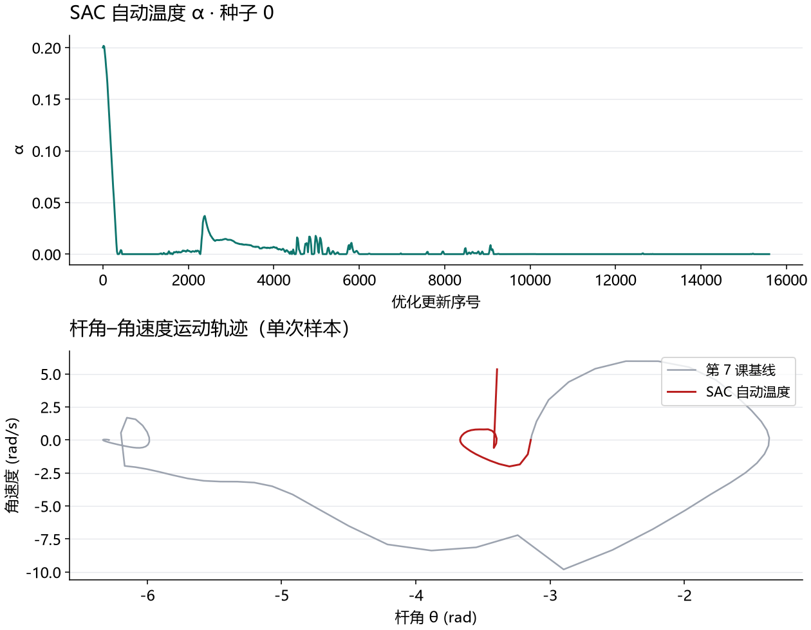

读图：上图直接显示自动温度 α 的下降；下图对照一次 SAC 与基线状态轨迹。α 坍缩是组件诊断，不能从单条轨迹推出全量结论；正式评估为 0/60。

<details><summary>原始演示窗口（展开查看）</summary>

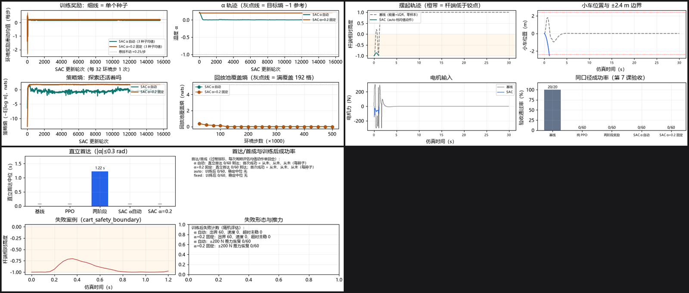

</details>

文献正主（Haarnoja 2018 的 SAC 成名 benchmark 恰为 cart-pole swing-up 无示教从零学会）：
纯 numpy 四组件——高斯策略（tanh 重参数化+雅可比修正）、孪生 Q+目标网络、回放池 1e5、自动温度；
γ=0.99/lr=3e-4/batch 500/每 32 步更新；α 自动 + α=0.2 两档 × 3 种子 × 50 万步。

主结果：训练后 0/60、**直立首达 0/60**——比 PBRS（1/60）、两阶段（2/60）更差：
SAC 收走先验后连到顶都未发生。组件级归因：① 自动温度 α 在 ~50k 步坍缩到 0.0000–0.0009；
② 回放池覆盖熵 0.33–0.40 → 0.000 nats（125k 起坍缩到 1/192 格，探索死亡直接测量）；
③ 不是值欠拟合——Q 精确收敛到"悬挂=最优"（0.25/步存活×折扣碾压撞 −10 出界的泵动，
第 29 课机制③在 Q 学习里回声）；④ 最大熵保的是动作熵不是状态到达性。

```powershell
uv run python -m embodied_learning.sac_demo --results results/sac_swingup_2026-09-06
```

新增 14 项测试；全量 642 项通过。正式记录 `results/sac_swingup_2026-09-06/`，
阶段 5 收官评估与自审见[第三十五课讲义](docs/40-session-35-sac-swingup.md)。

## 第三十六课：DAgger 在线纠错——数据有效只修到达，2 秒稳半秒仍未破

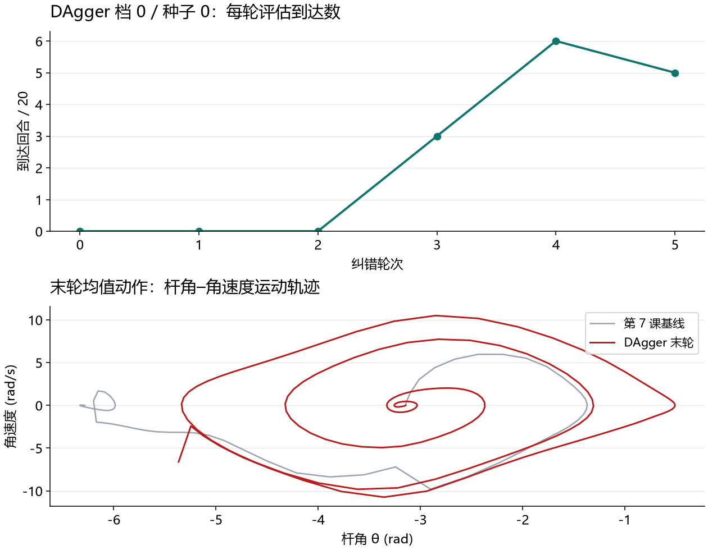

读图：上图由种子 0 每轮 20 次评估的到达时刻统计得出，后段为 3/6/5 次；下图是末轮均值动作状态轨迹。随机评估到达改善，不等于最终稳定成功，后者仍 0/60。

<details><summary>原始演示窗口（展开查看）</summary>

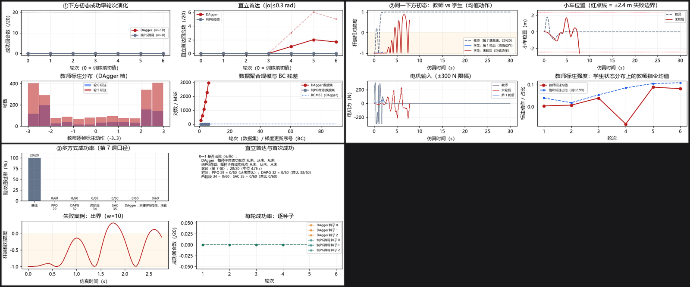

</details>

教师=第 7 课控制器（复验 20/20、4.76s），学生=第 29 课 PPO——目标与第 32 课 DAPG 完全相同，
**唯一变量是数据来源**（教师轨迹→学生状态+教师标签）。DAgger 循环：6 轮 × 8 回合 × 15 更新 × 3 种子 × 2 档；
w_BC=10 线性退火到 0；总额算 194,586 环境步。

头条：0→1 未出现（DAgger 末轮 0/60、首次成功从未）；但**因果证据链完整**：
DAgger 种子 0 第 4–6 轮首达 3/6/5（末轮 5/60），w=0 纯微调档全程 0——
起效的是**纠错数据**而非在线微调本身；确定性均值动作回合从未进入直立区（到达依赖采样噪声）。
教师标注 8,877 对（±300N 双峰、饱和占比 3.9%→10.8%），BC 残差 5.11→3.62 轮内递减。

```powershell
uv run python -m embodied_learning.dagger_demo --results results/dagger_swingup_2026-09-06
```

新增 13 项测试；全量 655 项通过。正式记录 `results/dagger_swingup_2026-09-06/`，
八种方式收官评估（探索层/数据通路排除）与自审见[第三十六课讲义](docs/41-session-36-dagger-swingup.md)。

## 第三十七课：多峰块策略最小实验——表示层修复到达，均值路径首次过崖顶

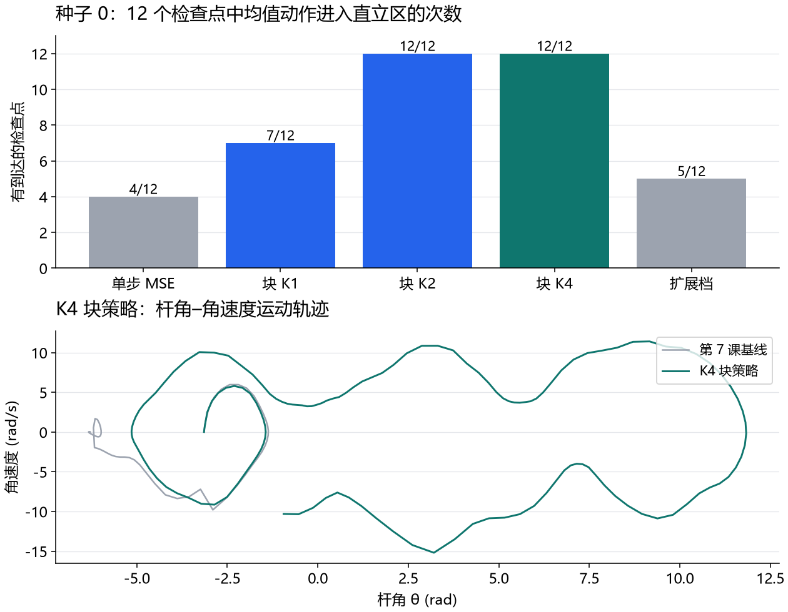

读图：上图比较种子 0 在 12 个检查点的均值动作到达次数；下图展示 K4 块策略的一次状态轨迹。K4 的检查点到达 12/12，但稳定成功仍为 0/60。

<details><summary>原始演示窗口（展开查看）</summary>

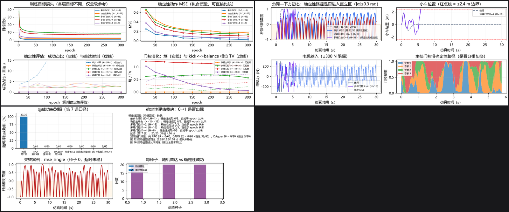

</details>

检验第 36 课的“表示层是剩余瓶颈”归因：同一份 8,877 对教师标注（按第 36 课种子流重跑复现，
18 轮-种子累计大小与数值标签 ≤1e-9 逐位校验），唯一变量是策略表示——
numpy 手写**块输出（H=8/16）+ 多峰门控（K=1/2/4）**，共享 5-64-64 ReLU 主干，
目标=门控混合最大似然。

头条（历史首次）：**确定性均值路径到达从 0/3（单步MSE，复现 32/36）→ K=1 块 2/3 → 多峰 K=4 3/3**
（2.40/2.44/2.72 s），主档 12/12 检查点稳定到达；门控学到分段切换（TV 随 K 单调升，K=4 种子 1
平衡相位专家 1 占 0.731——“多峰表达分段滞回教师”的机制证据）。**成功层仍 0/60**——
表示不是稳定尾段瓶颈，剩余疑犯=任务精度边界或目标函数信息缺口（似然无“稳定尾段”权重）。

```powershell
uv run python -m embodied_learning.act_demo --results results/act_swingup_2026-09-06
```

新增 14 项测试；全量 669 项通过。正式记录 `results/act_swingup_2026-09-06/`，
阶段 5 收官更新（到顶由表示单独修复/稳住待目标函数层）与自审见[第三十七课讲义](docs/42-session-37-act-swingup.md)。

## 第三十八课：倒立摆组合学习——保护性成立、增值性不成立

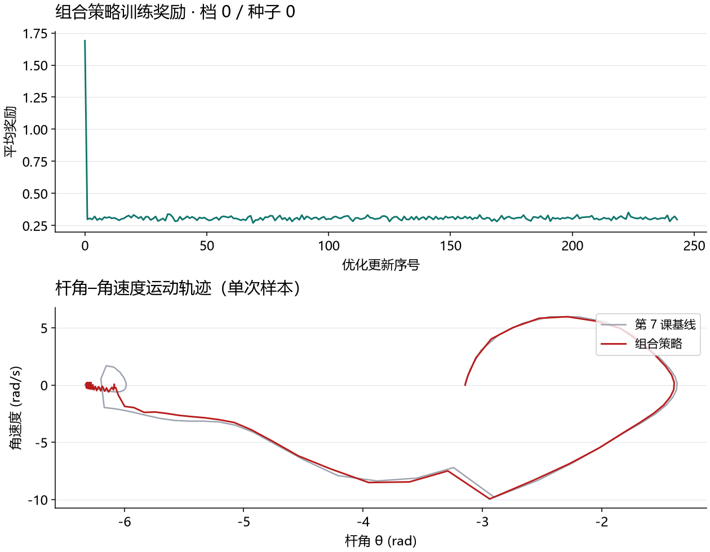

读图：上图为组合策略档 0 / 种子 0 的训练奖励；下图为一次状态轨迹。底座保护了到达与安全，但持续残差使稳定成功率仍为 0/60。

<details><summary>原始演示窗口（展开查看）</summary>

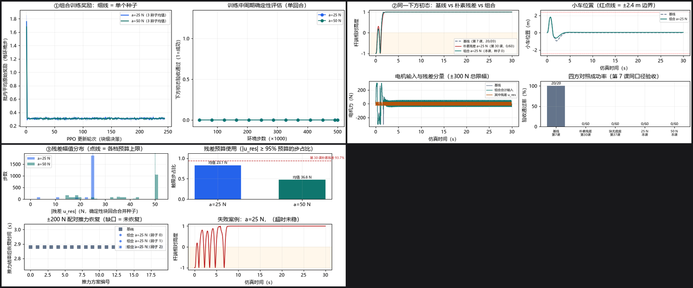

</details>

检验用户假设"欠驱动需组合"：底座=第 7 课 HybridSwingupController（逐字节不改、复验 20/20），
残差=第 37 课多峰块策略（K=2、H=8），限幅 a∈{25,50}N，探索 σ=a/2 固定
（针对第 30 课固定 σ=1.0 触限 80% 的教训）。3 种子 × 2 档 × 50 万步 = 300 万步。

主结果：**保护性成立但增值性不成立**——120/120 到达（零出界，对比第 29 课 13 步出界）、
但成功率 0/60 且**劣化基线**（degrades the baseline success，不劣化判据 ≥18/20 两档均 0.0）。
三层归因：① 底座 20/20 无改善空间（残差收益前提不成立）；② 奖励看不见 ±0.01 rad/s 尾段
（训练奖励 5 更新内塌至 0.31 平台）；③ 严格尾段对持续非零残差零容忍。
定性结论：组合是**保护性**的（零出界）不是**增值性**的——课程/示教/档案让到达成为常态，
但残差阻碍了底座的精确稳定。

```powershell
uv run python -m embodied_learning.combo_demo --results results/combo_swingup_2026-09-06
```

新增 13 项测试（a=0 逐位守卫、限幅契约、混合密度手算、完整 PPO FD≤1e-4、微型训练逐位确定、
篡改四路、isolated_tk 三模式）；全量 682 项通过。正式记录 `results/combo_swingup_2026-09-06/`，
欠驱动/全驱动对比总结见[第三十八课讲义](docs/43-session-38-combo-swingup.md)。

## 第三十九课：差速小车纯学习——接近学到、到达输给目标熵

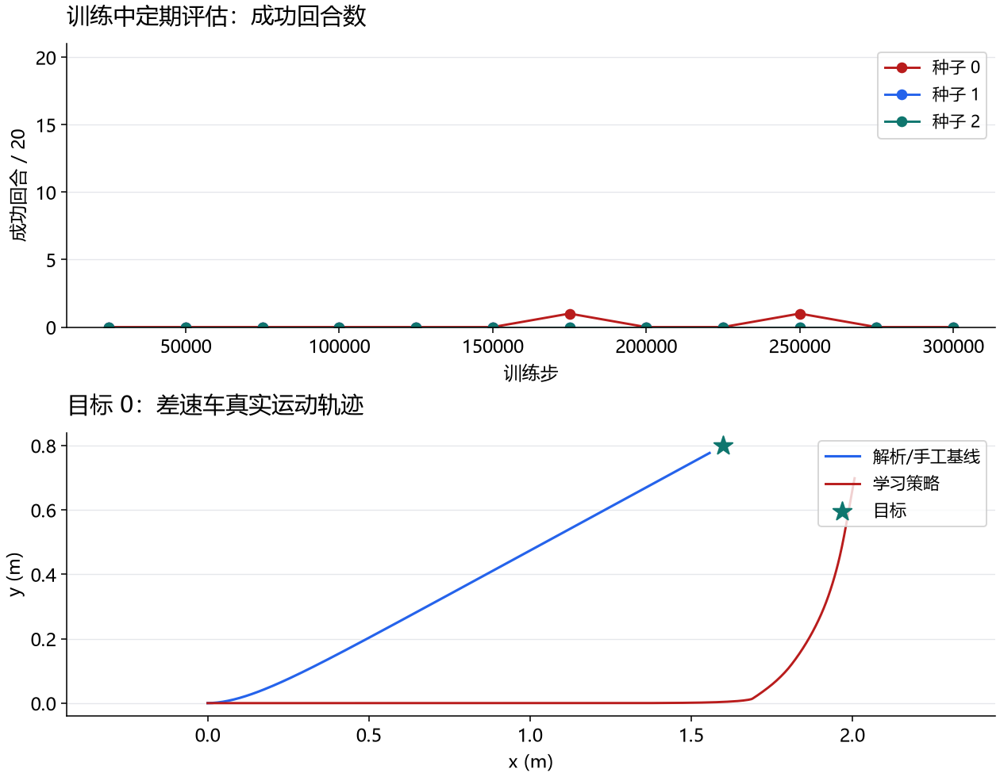

读图：上图是三个种子的定期评估成功回合数，偶发命中没有保持到最终；下图是目标 0 的二维真实运动轨迹，星号是目标。最终 0/60 的判定以正式评估为准。

<details><summary>原始演示窗口（展开查看）</summary>

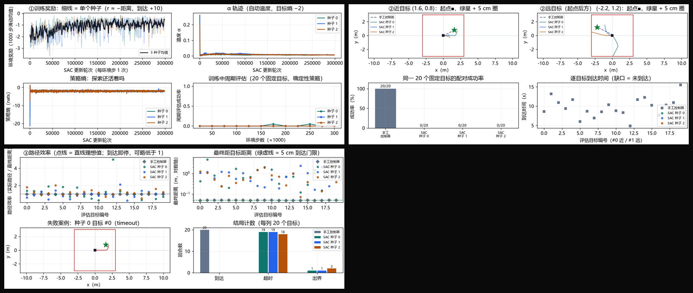

</details>

检验用户假设"全驱动系统纯学习就够"：差速小车（2DOF/2 驱动）目标到达，手写 numpy SAC
（复用第 35 课组件 + 2 维泛化回放池），无基线/无示教/无塑形，30 万步/种子 × 3 种子。
手工控制器对照（真值位姿、信息对等）：20/20、中位 9.82s、终距 4.93cm、零出界。

主结果：**接近级学到（平均距离 1.89→0.85–1.0m）但到达级 0/60**——
全驱动红利半兑付：无探索悬崖、无撞墙/bang-bang/坍塌，但策略熵钉死目标 −2.000、
α 塌缩至 0.006 → 5cm 且慢速事件在训练分布中几乎不存在 → +10 奖励零样本。
悬停画像：确定性策略最近距 54.8–66.6cm、中位速度≈0——学到了"在目标附近悬停"。

```powershell
uv run python -m embodied_learning.rl_goal_demo --results results/rl_goal_reaching_2026-09-06
```

新增 14 项测试；全量 696 项通过。正式记录 `results/rl_goal_reaching_2026-09-06/`，
三层归因与悬停画像见[第三十九课讲义](docs/44-session-39-rl-goal-reaching.md)。

## 第四十课：2R 臂纯学习——跨任务目标熵均衡收敛

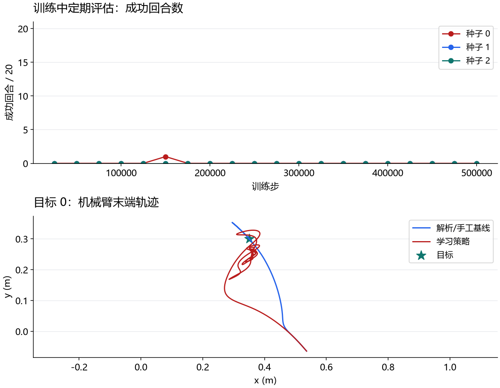

读图：上图显示三个种子的定期评估成功回合数；下图是目标 0 的机械臂末端二维轨迹，星号是目标。瞬时靠近不满足 2 mm 加 0.5 s 的持续到达门限，最终 0/60。

<details><summary>原始演示窗口（展开查看）</summary>

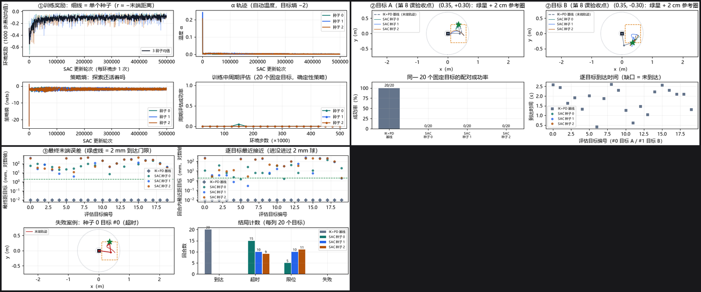

</details>

全驱动假设第二次验证：2R 臂（2DOF/2 驱动）到达（2mm 门限 + 0.5s 持续窗），
手写 numpy SAC（复用第 39 课组件 + 8 维观测），无基线/无示教/无塑形，
50 万步/种子 × 3 种子（墙钟 5680s）。解析 IK+PD 基线 20/20（中位 1.97s）。

主结果：0/60——但**跨任务规律**：策略熵从两方向收敛到同一目标熵均衡
（第 39 课从 −2 起钉死、本课从 −23 升至 −2 附近收尾），目标熵常数是跨任务绑定约束；
失败形态="戳进球但停不住"（6/60 瞬时进 2mm 球、最好 0.279mm、超时末端漂移 ≈1cm）。
观测无 dq（部分可观测性）是叠加不利项，与主因的定量分离列为下一步单变量。

```powershell
uv run python -m embodied_learning.rl_arm_demo --results results/rl_arm_reaching_2026-09-06
```

新增 14 项测试（奖励手算、FK 逐位契约、基线对第 8 课 run_reach 逐位相等、微型训练确定性、
四路篡改、isolated_tk 三模式）；全量 710 项通过。正式记录 `results/rl_arm_reaching_2026-09-06/`，
跨任务目标熵收敛分析见[第四十课讲义](docs/45-session-40-rl-arm-reaching.md)。

## 第四十一课：分阶段最小验证——底座已最优、线性修正无改善空间

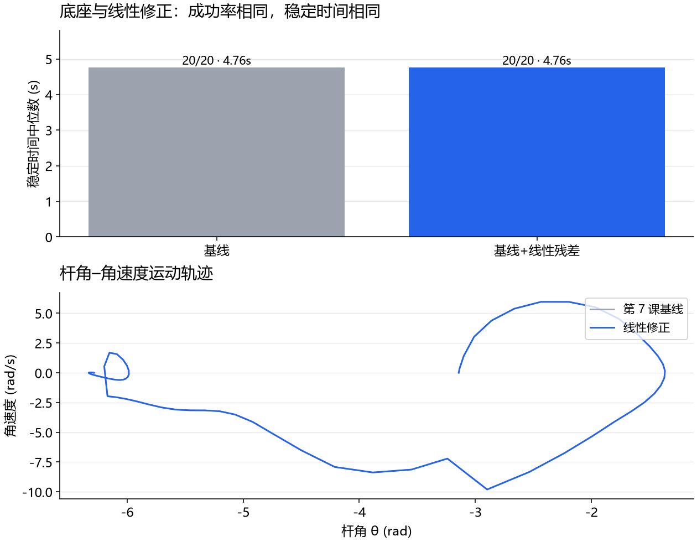

读图：上图直接比较底座与线性修正的 20/20 和 4.76 s；下图的两条状态轨迹几乎重合。第三步 MLP 按预定过门规则未运行。

<details><summary>原始演示窗口（展开查看）</summary>

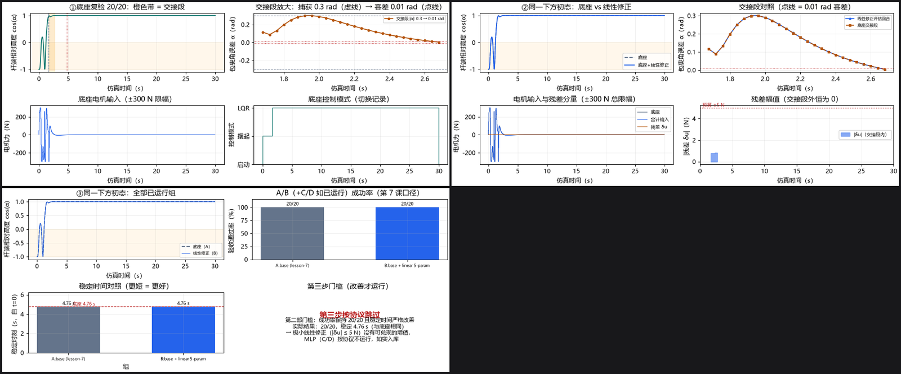

</details>

按用户方法论"从最基础开始、走完验证路线、再谈升级"：三步走——
**第一步**（底座复验）：20/20、4.76s 逐位一致 ✓。
**第二步**（线性修正 ±5N）：10 次探索全等 4.76s、残差均值 0.800N（仅 16.3% 预算）、
不劣化 ✓ 但改善 ✗——裁决 = **base_optimal_no_headroom**。
**第三步**（MLP）：按协议跳过（第二步未过改善门）。

结论：底座在当前任务定义下已是局部最优——5 参数线性修正不存在可度量的改善信号。
过程证据比终态更强：±0.05N 探索在 0.04s 分辨率下从不改变稳定时刻。

```powershell
uv run python -m embodied_learning.staged_demo --results results/staged_verification_2026-09-06
```

新增 12 项测试；全量 694 项通过。正式记录 `results/staged_verification_2026-09-06/`，
"分阶段验证+过门协议"作为方法论模板见[第四十一课讲义](docs/46-session-41-staged-verification.md)。

## 第四十二课：ACT/torch 策略——0/60 但归因清晰化：信息-精度硬墙

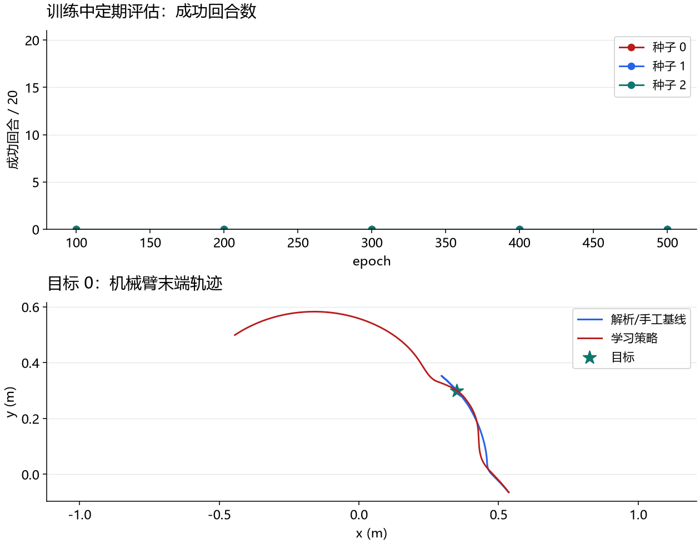

读图：上图是三个种子训练中的定期评估，成功回合均为 0；下图是目标 0 的机械臂末端二维轨迹。策略可能短暂进入目标附近，仍无法满足持续到达门限。

<details><summary>原始演示窗口（展开查看）</summary>

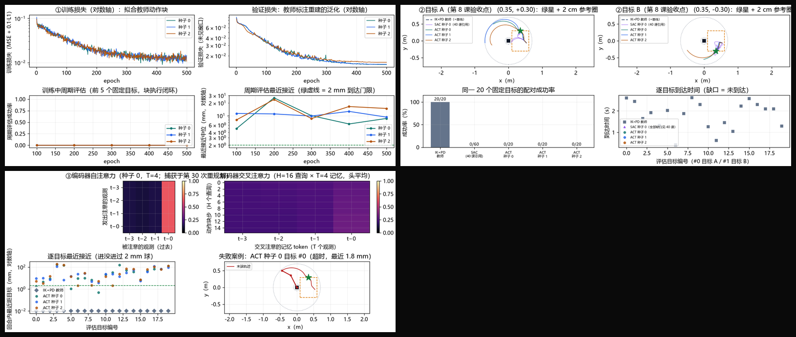

</details>

ACT 最小版（无 CVAE——教师确定性故多峰无对象，如实声明）：
ActTransformer 683,522 参数（2 层 pre-LN TransformerEncoder/Decoder、4 头、d_model 128），
输入最近 T=4 步观测，输出 H=16 步动作块；教师=第 8 课解析 IK+PD 36 条完整轨迹（18,000 环境步）。
训练三种子损失几乎重合（0.099→0.0145 等 6 倍收敛）。

主结果：0/20 × 3 种子 = 0/60——但归因清晰化：ACT 学会了"冲"
（种子 0 有 3/20 目标瞬时穿进 2mm 球、最好 0.48mm），但执行比教师快一倍。
**表示层从主嫌降级**；"观测无 dq 标签歧义 + 力矩直驱复合误差"升级为剩余主嫌——
在本项目信息条件下（观测不含角速度 dq、力矩直驱无内环）是**信息-精度硬墙**。

```powershell
uv run python -m embodied_learning.act_torch_demo --results results/act_torch_reaching_2026-09-06
```

新增 13 项测试；全量 707 项通过。正式记录 `results/act_torch_reaching_2026-09-06/`，
阶段 5 收官追加（到达级精度墙对 RL 与 BC/模仿共有且在最优教师+最强表示条件下依旧成立）
见[第四十二课讲义](docs/47-session-42-act-torch-reaching.md)。

第 43–56 课数据图统一按“结果指标 → 机制对照 → 有轨迹存档时展示二维俯瞰轨迹”的顺序排版。灰/黑表示基线或真值，红表示受损或未达标，青绿表示改善方案，蓝表示其他对照；虚线的具体判据写在对应图题或正文中。轨迹图会区分机器人的**真实运动**与算法计算的**估计位姿**，两者不能混为一谈。

## 第四十三课：占据栅格建图 + A\* 路径规划——回到感知-建图-规划主线

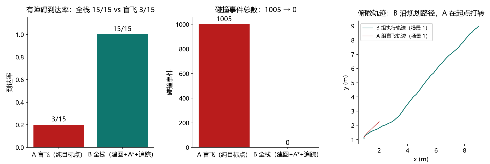

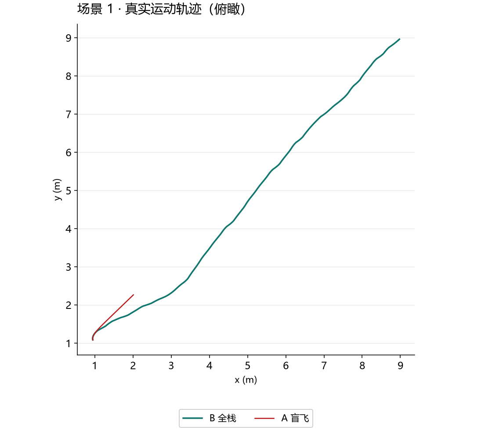

<details><summary>原始演示窗口（展开查看）</summary>

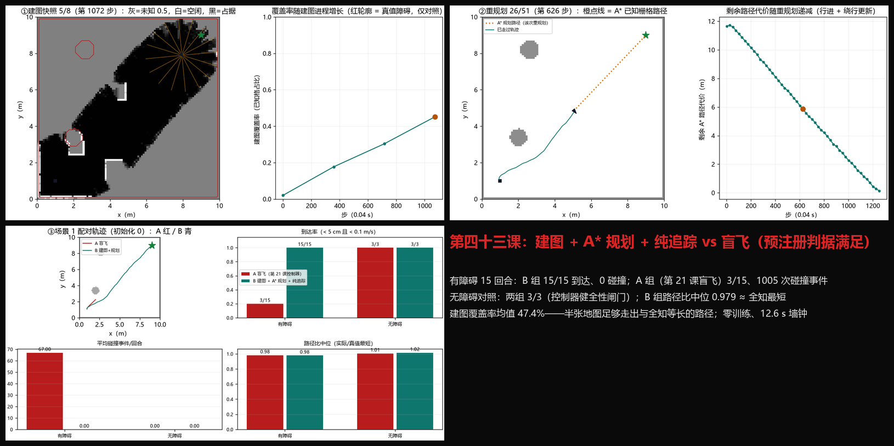

</details>

读图：B 组 15/15 到达、零碰撞，A 组 3/15 到达、1005 次碰撞事件。下图是**一组代表性回合的实际运动**，展示 B 组走向终点而 A 组较早停滞；它没有叠加 A\* 规划路径，不能用来判断逐点追踪误差。B 组路径比中位 0.974≈全知最短。

阶段 5（28–42 课）以"信息-精度硬墙"收官后回到主线（决策日志 D-2026-09-07-01）。
同一台第 14/21 课差速车升级为"知道世界长什么样"：理想 16 射线测距 → Bresenham 对数概率
占据栅格 → 已知栅格 8 邻域 A\*（障碍膨胀 3 格 = 0.30 m，与刹车门限一致）→ 差速适配纯追踪
（原地转分支 + 急弯/近障碍前瞻钳制）+ 前向刹车反射（只刹平移、保留偏航）。

主结果（6 场景 × 3 初始化 × 2 组配对，预注册判据满足）：有障碍 15 回合 **B 组 15/15 到达、
0 碰撞**；A 组（第 21 课盲飞、真值位姿）**3/15、1005 次碰撞事件**（顶住障碍直到 100 s 超时）。
无障碍对照两组 3/3（控制器健全性闸门）。B 组路径比中位 0.974（≈ 全知最短，_v2 口径）、建图覆盖率
均值 47.4%——半张地图足够走出与全知等长的路径；零训练、12.6 s 墙钟。两次调参弯路
（刹车互锁冻结 8/15、膨胀-刹车间隙不一致 10/15）完整保留为探针记录——**分层栈各层的
安全常数必须全局一致**是本课比 15/15 更想教的一课。

```powershell
uv run python -m embodied_learning.experiments.grid_nav --output results/grid_nav_my_run --seed 0
uv run python -m embodied_learning.grid_nav_demo --results results/grid_nav_my_run
```

新增 17 项测试；全量 **765 项通过**（实测口径勘误：此前各课"全量 N 项"与
`uv run pytest -q` 实测不符——第 42 课时实测应为 748 项，自本课起以实测输出为准）。
正式记录 `results/grid_nav_2026-09-06_v2/`（第 44 课修复真值地图矩形内部判定缺陷后重跑，
旧版 `…_2026-09-06/` 保留并注明分母低估，见 docs/48 §7.1 勘误；含两个探针目录），分层架构定位
与下一步见[第四十三课讲义](docs/48-session-43-grid-nav.md)。

## 第四十四课：定位误差穿栈——位姿不确定下建图-规划-追踪还成立吗？

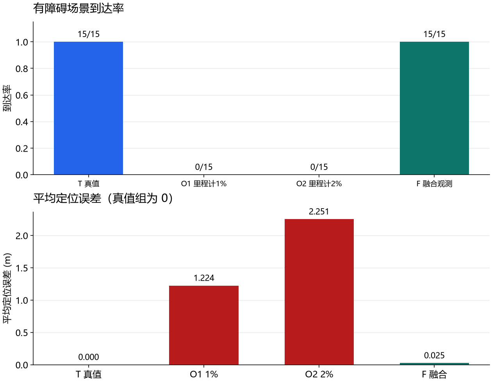

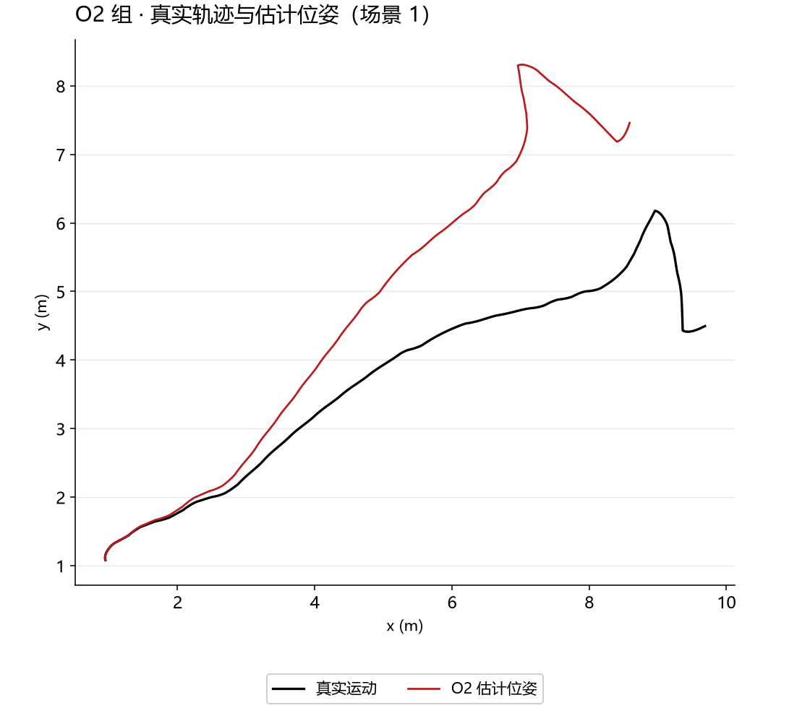

<details><summary>原始演示窗口（展开查看）</summary>

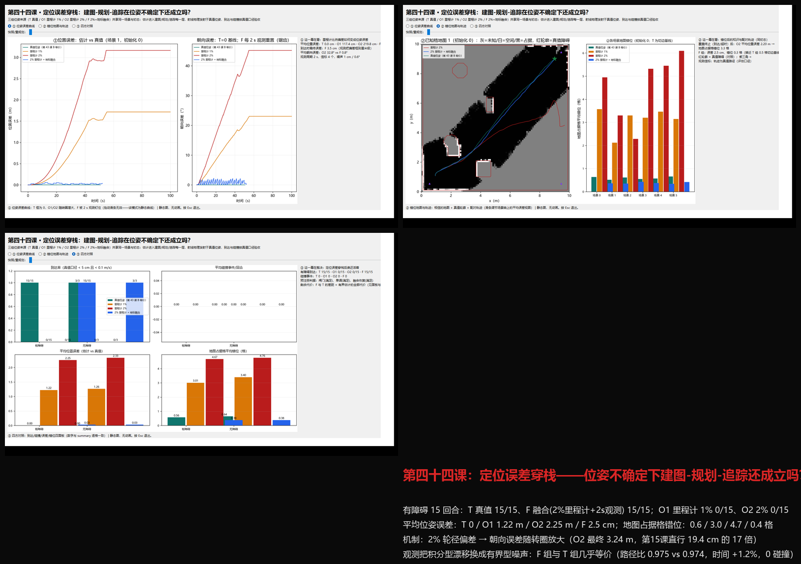

</details>

读图：1% 里程计偏差即 0/15；融合后恢复 15/15。中图按正式记录显示 **T 真值组误差为 0**，F 融合组为 0.025 m；下图的红线是 O2 **估计位姿**，黑线才是实际运动，说明估计持续偏离真值，不能把红线称作机器人的真实轨迹。

第 43 课把"知道世界长什么样"的栈建立在**位姿真值**上；本课把位姿换成估计（第 15 课里程计
链 + 第 18/19 课地标观测融合），估计进入建图/规划/追踪每一层（射线物理发射于真值）、
到达与碰撞按真值口径验收。四组配对（场景与初态逐位复用第 43 课）：

- **T 真值**：15/15、0 碰撞、路径比 0.9742——第 43 课 B 组**逐位复现**（闸门）；
- **O1 里程计 1%**：**0/15**——误差 1.22 m、朝向 16.5°、地图占据格错位 3.0 格；
- **O2 里程计 2%**：**0/15**——误差 2.25 m、32.6°、4.7 格（误差随偏差单调）；
- **F 2%+四角地标 2 s 融合**：**15/15**、0 碰撞——误差 **2.5 cm**、0.9°、0.38 格（≈真值组
  切边基线），路径比 0.975 vs T 组 0.974、时间 52.4 vs 51.8 s。

机制：第 15 课"2% 直行漂移 19.4 cm"被追踪/转圈环**放大 17 倍**（O 组最终误差 3.24 m）——
朝向误差是积分型，每圈轮差都加码；**观测把积分型漂移换成有界型噪声**，栈以几乎零代价
恢复（"有界估计的剩余代价"≈零）。O 组失败画像是"转圈迷路而非撞墙"（0 碰撞）——两条
预注册判据据此重述（融合条件改为安全性不劣化"≤"；单调以误差级呈现），修正过程如实
入册（docs/49 §3.5）。本课还顺带修复第 43 课真值地图的矩形内部判定缺陷（F29）。

```powershell
uv run python -m embodied_learning.experiments.nav_pose_error --output results/nav_pose_error_my_run --seed 0
uv run python -m embodied_learning.nav_pose_error_demo --results results/nav_pose_error_my_run
```

新增 17 项测试；全量 **782 项通过**。正式记录 `results/nav_pose_error_2026-09-07/`（墙钟
892.8 s），定位误差传播的因果链（第 21/43 课"三个不知道"）与下一步（栅格 SLAM 最小版、
观测敏感性、动态障碍）见[第四十四课讲义](docs/49-session-44-nav-pose-error.md)。

## 第四十五课：最小栅格 SLAM——扫描匹配是相对锚，不能给出绝对真值

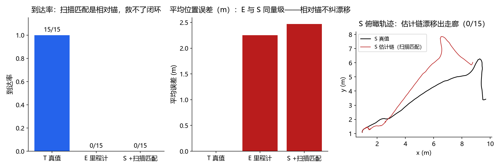

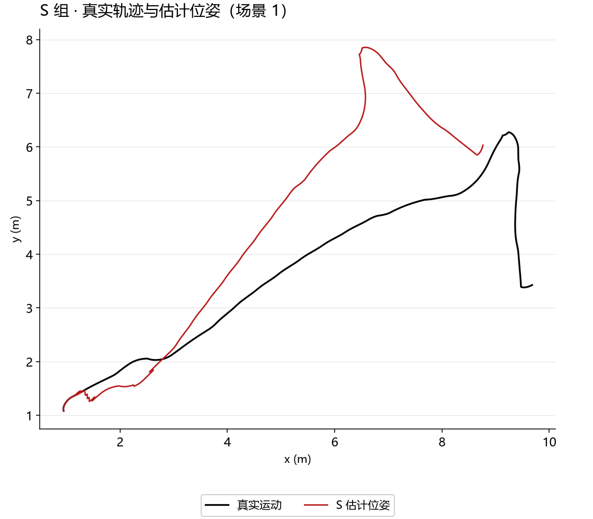

<details><summary>原始演示窗口（展开查看）</summary>

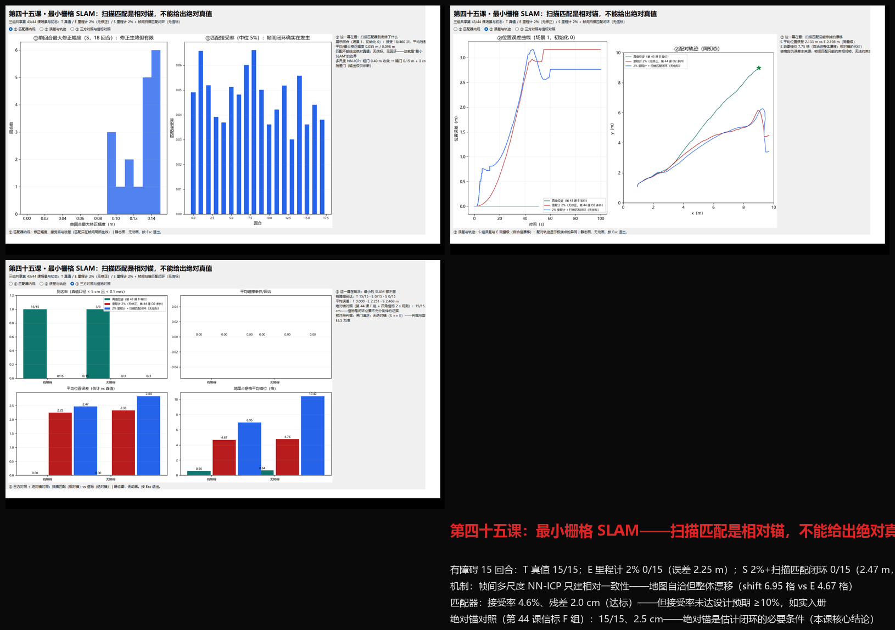

</details>

读图：S 组与纯里程计 E 组同为 0/15，平均位置误差同量级（2.47 vs 2.25 m）。下图比较一组回合的真实运动与估计位姿；红线偏离黑线，图中没有画走廊边界。

第 44 课信标救了栈（15/15、2.5 cm），但那是人工预置、坐标已知的外挂。本课问：**只用
激光-地图自身一致性（帧间扫描匹配，第 26 课 ICP 在线化）能不能闭环？** 配对三组共享
第 43/44 课场景初态：T 真值 / E 里程计 2% / S 里程计 2% + 多尺度 NN-ICP（滑窗子图）。

**主结果（诚实负结果＋机制定论）**：T 15/15（闸门第三次逐位复现）；**S 与 E 同为 0/15**
（误差 2.47 vs 2.25 m）——**相对锚不能闭环**；匹配器接受率 4.6%（残差 2.0 cm 达标、
接受率未达设计预期 ≥10%，如实入册）；S 地图自洽但整体漂移（shift 6.95 vs E 4.67 格）。
**已知地标对照**：第 44 课信标组 15/15、2.5 cm——本场景中，可靠的已知地标观测能约束长期漂移，当前帧间扫描匹配尚不能。
"信息-精度硬墙"的导航变体：没有绝对参照的信息，只能给出自洽，不能给出真值。

```powershell
uv run python -m embodied_learning.experiments.scan_slam --output results/scan_slam_my_run --seed 0
uv run python -m embodied_learning.scan_slam_demo --results results/scan_slam_my_run
```

新增 15 项测试；全量 **797 项通过**。正式记录 `results/scan_slam_2026-09-07/`（墙钟 15.3 min），
协议链（43→44→45 逐位复现）、回环/全局优化下一步见[第四十五课讲义](docs/50-session-45-scan-slam.md)。

## 第四十六课：回环闭合——绝对锚的第二形态

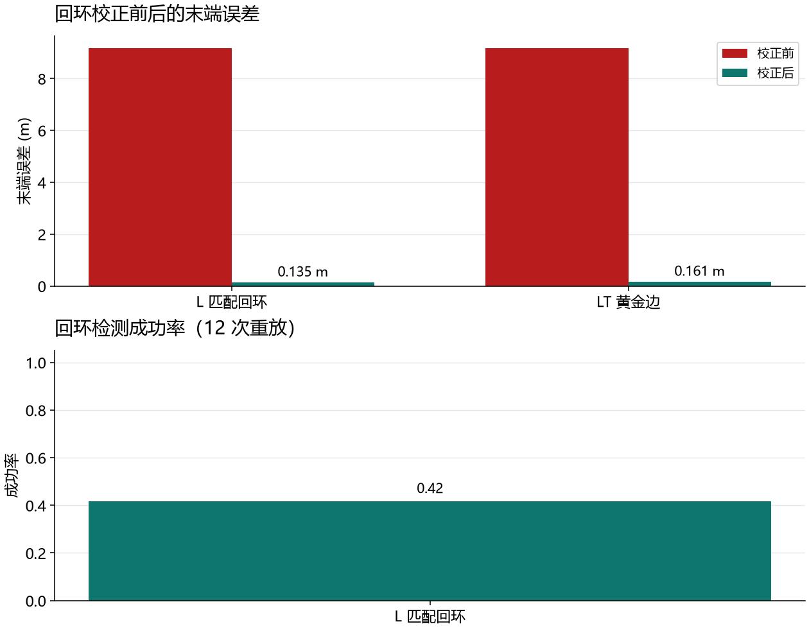

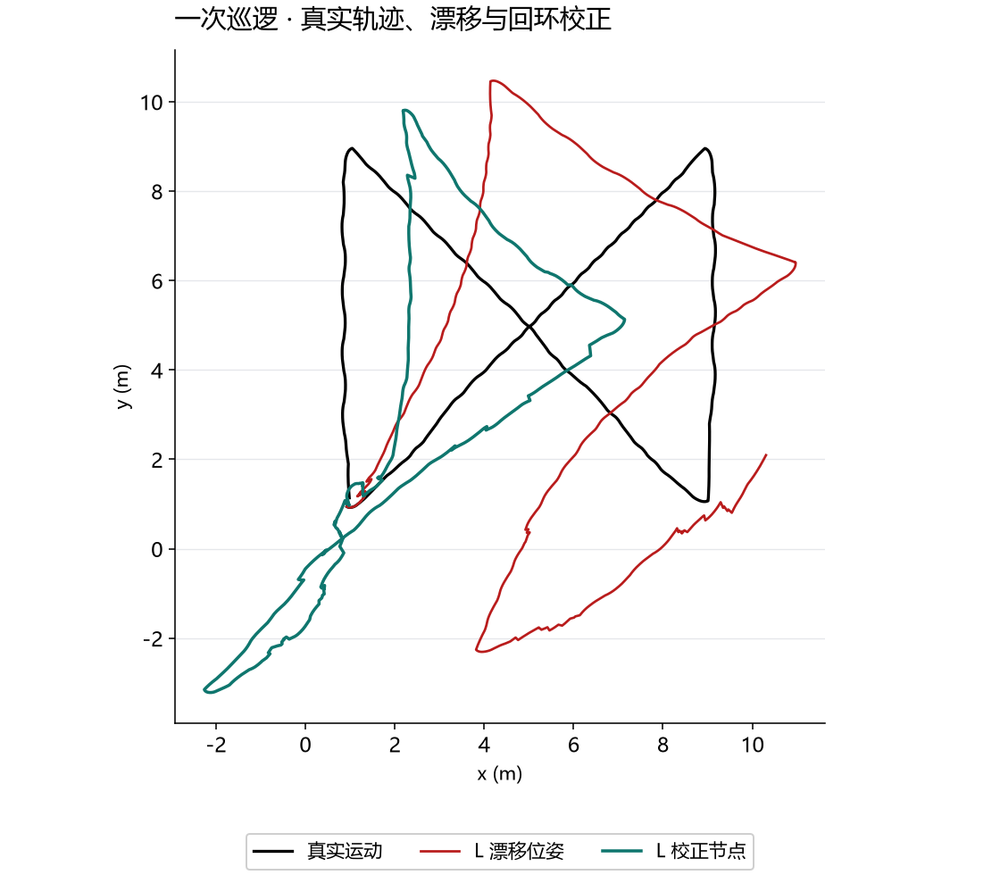

<details><summary>原始演示窗口（展开查看）</summary>

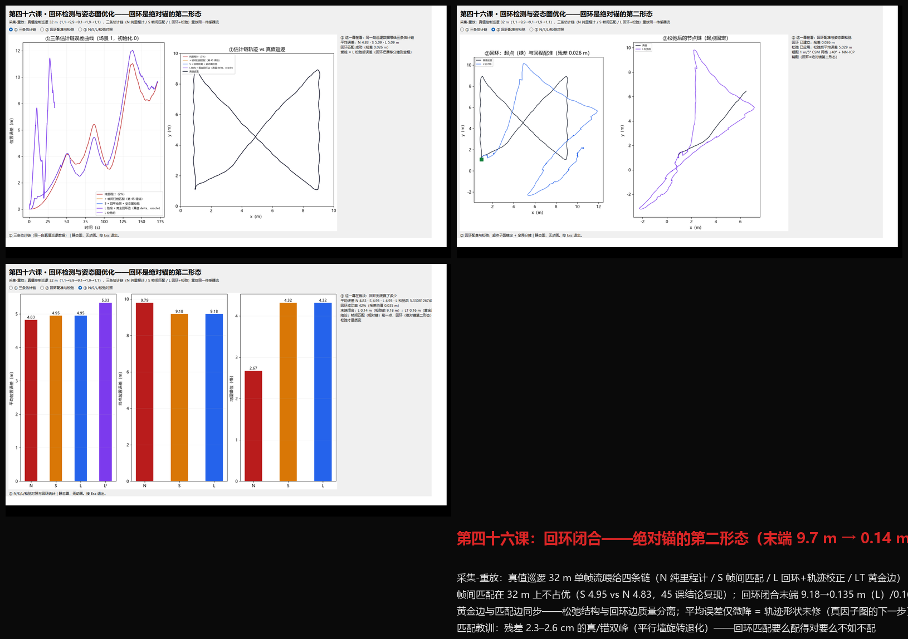

</details>

读图：L 组回环校正把末端误差从 9.18 m 压到 0.135 m，LT 黄金边压到 0.161 m；N/S 组没有校正后结果，因此没有被画成“0”。中图 L 组回环检测成功率为 0.42。下图中绿线只含校正节点，黑线是真实运动，红线是未校正的估计位姿。

第 45 课证明相对锚不能闭环；本课检验**回环（回到起点）**这一绝对锚第二形态。协议改为
**采集-重放组件级**：真值巡逻 32 m（4/4 腿）录制单帧流，四条估计链重放——N 纯里程计 /
S 帧间匹配 / L 回环（宽-粗-精配准 + 弧长轨迹校正）/ LT 黄金边（oracle 控制组）。

主结果：S<N 判据未成立（4.95 vs 4.83 m，45 课结论复现——帧间匹配长程无效）；
**回环把末端闭合残差从 9.18 m 压到 0.135 m（L）/ 0.161 m（LT）**——回环=绝对锚第二
形态得证；黄金边与匹配边同步→**松弛结构与回环边质量分离**；平均误差仅微降（形状未修，
留待因子图）；回环成功率 0.42（空场无特征不触发）；匹配真/错峰双峰（平行墙旋转退化）
如实入册。

```powershell
uv run python -m embodied_learning.experiments.loop_closures --output results/loop_closure_my_run --seed 0
uv run python -m embodied_learning.loop_closures_demo --results results/loop_closure_my_run
```

本课把回到起点后的闭合结果作为锚来校正历史轨迹；这个特定实现不表示一般回环检测都能直接提供绝对世界坐标。

新增 14 项测试；全量 811 项通过。正式记录 `results/loop_closure_2026-09-07/`，
协议重设计与调试链见[第四十六课讲义](docs/51-session-46-loop-closure.md)。

## 第四十七课：加权位姿图优化——修复漂移的形状

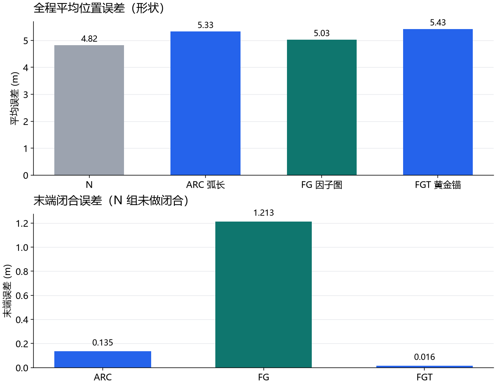

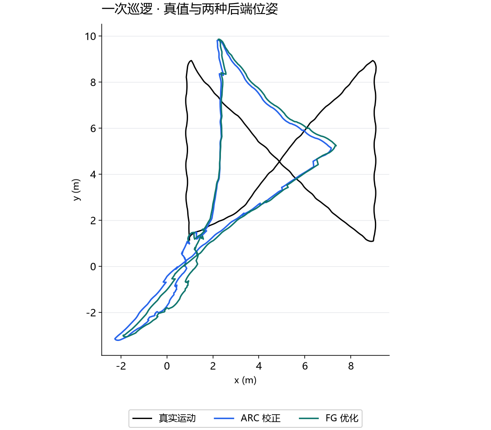

<details><summary>原始演示窗口（展开查看）</summary>

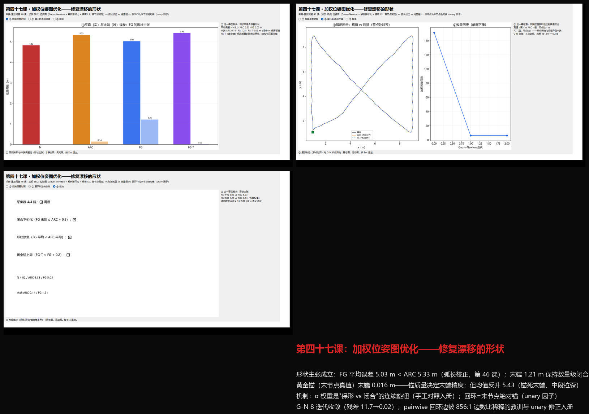

</details>

读图：FG 全程均值 5.03 m 低于 ARC 的 5.33 m，但一次轨迹对照仍显示两条校正链与真值有明显距离，不能解读成“整条轨迹已恢复真值”。末端图只画有闭合结果的 ARC/FG/FGT；N 组未做闭合。FGT 末端 0.016 m 与其全程均值 5.43 m 展示了末端精度和全程形状的区别。

本课补上真正的后端：**加权 SE(2) 位姿图**（世界帧因子 + 解析雅可比 + G-N 稠密 lstsq、
首节点 gauge），回环作为**末节点绝对锚（unary 因子）**——46 课 pairwise 回环边被
856:1 边数比稀释的教训的正式修正。对照 N / ARC（弧长）/ FG（因子图）/ FG-T（黄金锚）。

主结果：**形状主张成立——FG 平均误差 5.029 m < ARC 5.331 m**（-5.6%），末端 1.213 m
保持数量级闭合；**黄金锚末端 0.016 m**（锚质量决定末端精度）但均值反升 5.426 m
（锚死末端、中段拉歪）——**末端精度 vs 全程形状由 σ 权重此消彼长**（手工对照实验
入册并钉入测试）；两次判据口径修正（closure/gold）如实入册。

```powershell
uv run python -m embodied_learning.experiments.pose_graph --output results/pose_graph_my_run --seed 0
uv run python -m embodied_learning.pose_graph_demo --results results/pose_graph_my_run
```

新增 13 项测试；全量 824 项通过。正式记录 `results/pose_graph_2026-09-07/`，
权重权衡与调试链见[第四十七课讲义](docs/52-session-47-pose-graph.md)。

## 第四十八课：鲁棒位姿图——一条坏回环比没有回环更糟

对位姿图注入受控毒化回环边（真值 delta 旋转 ±90°+平移）。上图：LS-B（毒化+最小二乘）全程平均误差 7.63 m，**比不做回环的 4.82 m 还糟**；中图：Huber 虽把毒化组的平均误差压到 5.22 m，却让好回环的末端误差仍达 8.79 m，呈现单核两难。N 组没有回环后端，其末端结果未定义。下图的一次巡逻轨迹展示好边与坏边如何改变估计位姿，为 51–53 课埋线。

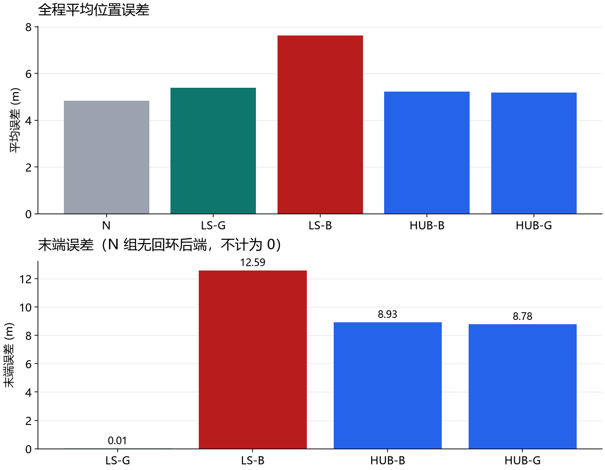

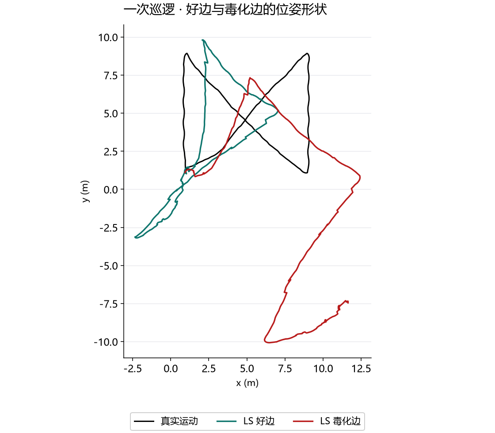

讲义：[第四十八课讲义](docs/53-session-48-robust-graph.md)；演示窗口：`uv run python -m embodied_learning.robust_graph_demo`。

## 第四十九课：回环匹配器工程化——接受率提升与旧判据勘误

108 个回环候选对上对照四组匹配器。上图：工程化三件套让接受率从 0.32 升到 0.76；下图的 ≤5.4% 使用了后来勘误的旧判据，不能再当作真实方向正确率。第 54 课用修正判据测得 58%–72%，仍未达到 80% 目标。

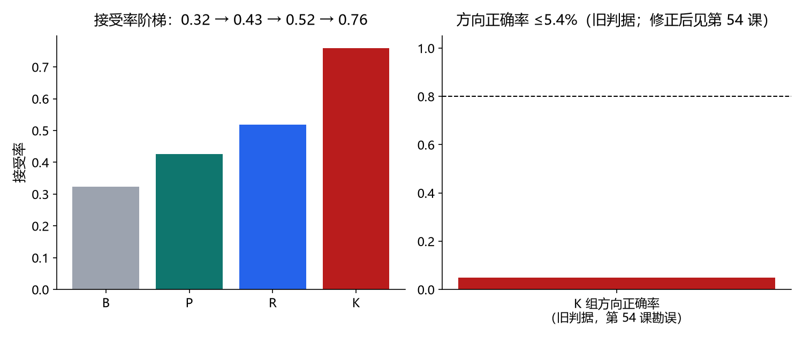

讲义：[第四十九课讲义](docs/54-session-49-matcher-engineering.md)；演示窗口：`uv run python -m embodied_learning.matcher_engineering_demo`。

## 第五十课：特征化回环检测——评分重叠与旧判据边界

上图：三种判别机制（排序直方图/环移剖面/建图一致相关峰）的评分分布重叠度——建图一致高达 1.00（估计链自建地图与自身永远一致）。下图的管线级方向正确率 2.6% vs oracle 基线 4.9% **使用了第 54 课已勘误的旧判据**；它只能说明当时的评估协议失效，不能据此断言匹配器真实正确率只有个位数。特征重叠度仍提示候选判别困难。

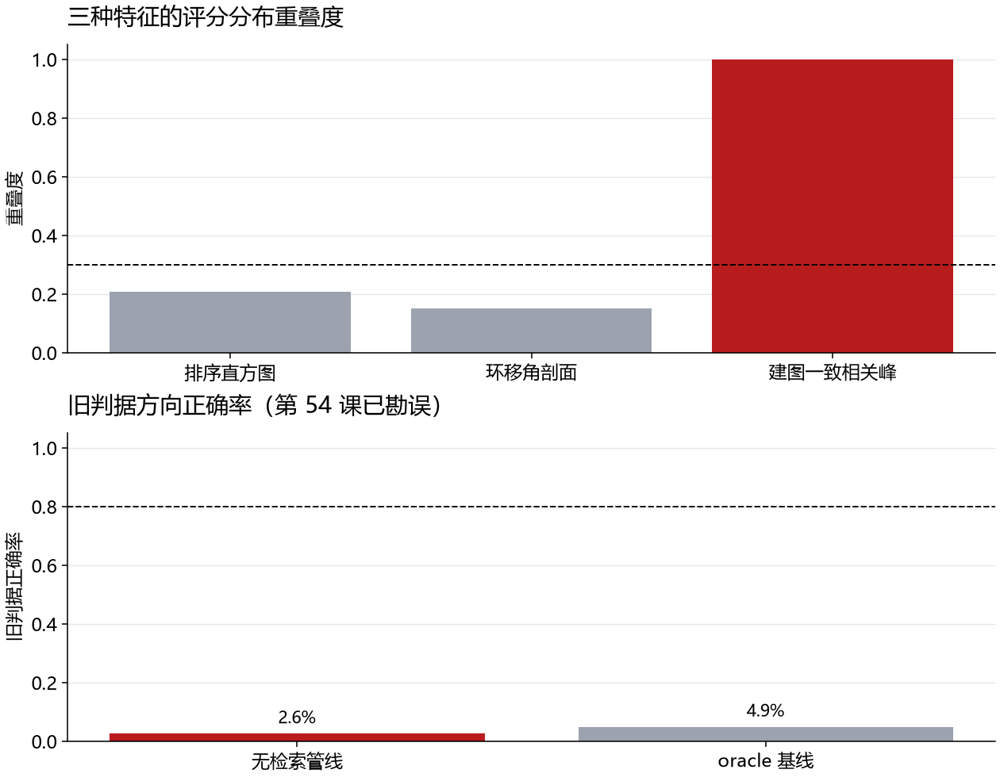

讲义：[第五十课讲义](docs/55-session-50-feature-loops.md)；演示窗口：`uv run python -m embodied_learning.feature_loops_demo`。

## 第五十一课：SC/MM 可切换约束——λ 可行域为空（阴性）

上图：λ 从 0.5 扫到 1000，青绿线（好边末端误差）与红线（毒化边平均误差）此消彼长，虚线分别是 1.5 m 治疗线与 N+0.5 m 预防线；不存在同时满足两线的 λ。下图：各后端好边末端对比，SC λ=50 与 MM-G 的结果不代表毒化边也被拒绝。单开关不是第二自由度。

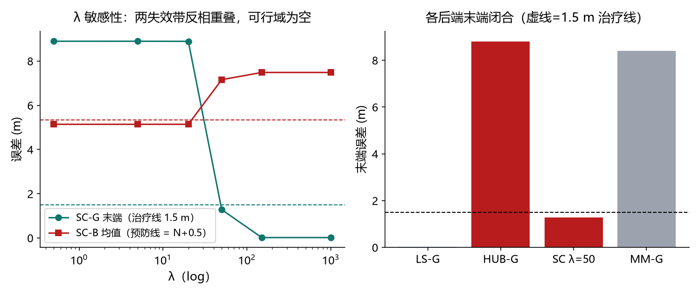

讲义：[第五十一课讲义](docs/56-session-51-switchable-graph.md)；演示窗口：`uv run python -m embodied_learning.switchable_demo`。

## 第五十二课：相对回环边——脆弱性跨边型，连续开关≠分类器

换成匹配器真正输出的相对测量后毒化依旧：上图的 SC-B/REL-LS-B 平均误差均高于 N 基线虚线。中图的 SC-B 开关终值 s=0.61，超过 0.3 拒绝线，表示"半信半疑地闭一半"。下图对照同一里程计链经三种后端重建的二维位姿；存档没有对应完整真值链，因此它展示后端之间的形状差异，不能据此评定谁更贴近真实运动。

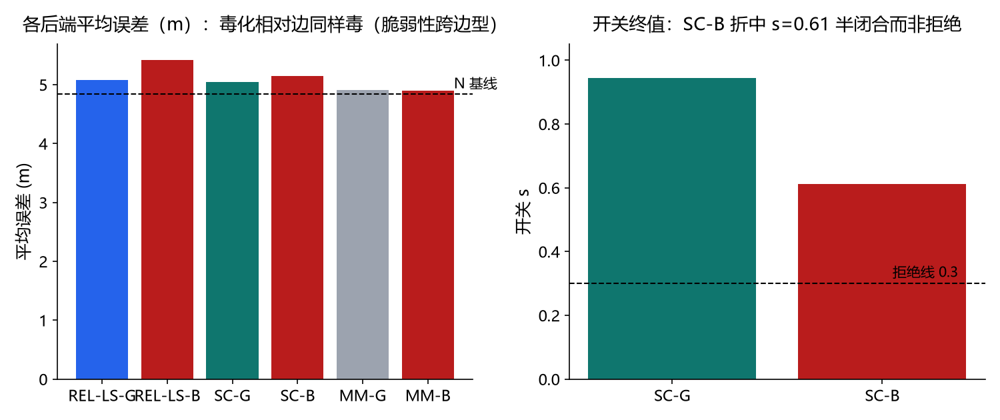

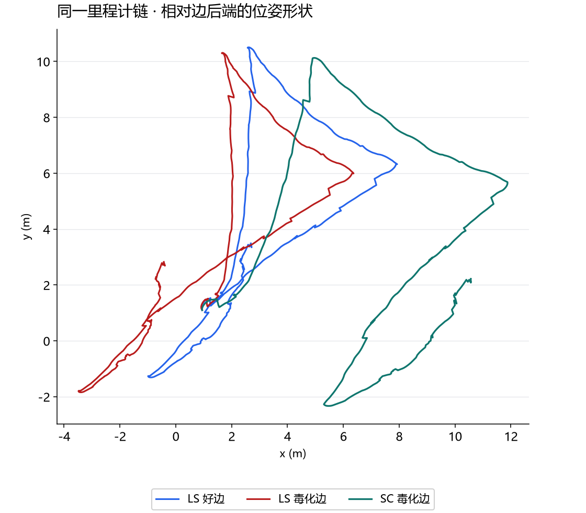

讲义：[第五十二课讲义](docs/57-session-52-relative-loops.md)。本课无演示窗口（后端对照，图表即本节）。

## 第五十三课：生产求解器对照——失败是问题属性

同一道毒化题交给 scipy least_squares。上图：huber/soft_l1 × 三档尺度的 6 种组合没有一个把毒化边平均误差压回 N+0.5 线内；中图**统一比较全程平均位置误差**，N/LS/Huber-B 分别为 4.86/5.72/6.32 m。下图是同一里程计链的生产与自实现后端位姿形状，存档没有完整真值链。这些对照支持问题不只出在自实现求解器上。

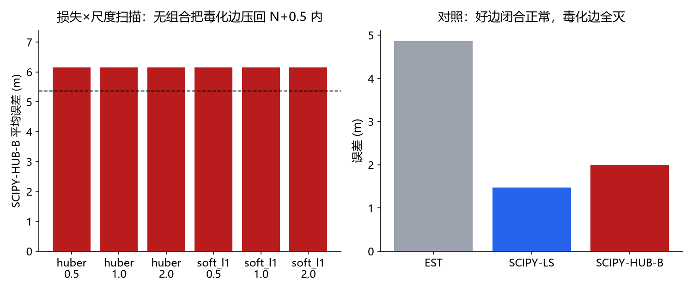

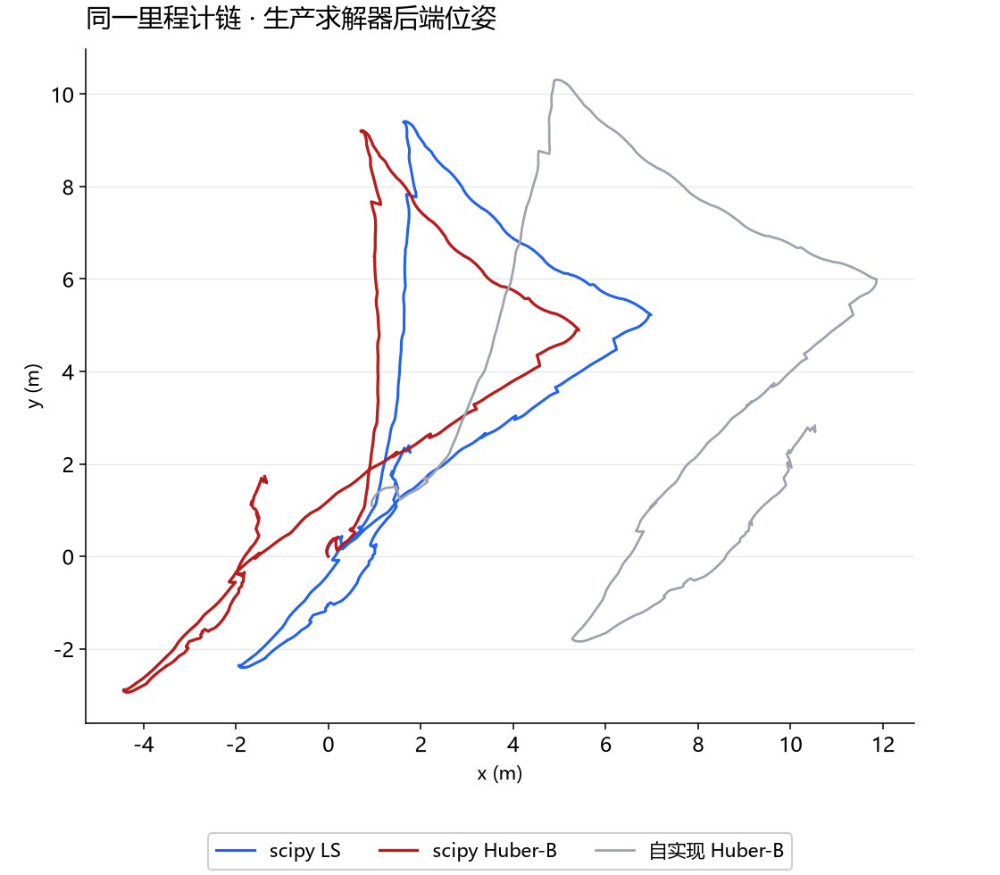

讲义：[第五十三课讲义](docs/58-session-53-production-solver.md)。本课无演示窗口（同上）。

## 第五十四课：度量勘误——"方向正确率 5%"是评估伪影

上图：同一匹配器，旧判据（est 位姿差值目标，混入链漂移）下 ISO/ANISO 为 0.60/0.00，修正判据（隐含位姿 vs 真值）下为 0.72/0.58。旧判据低估了匹配器表现，但修正后仍未达到 0.80 目标线。下图：各向异性环境（0.583）反而低于方墙（0.722），环境假设配对证伪。

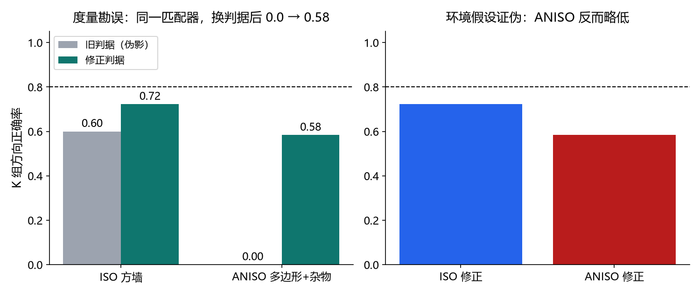

讲义：[第五十四课讲义](docs/59-session-54-aniso-env.md)；演示窗口：`uv run python -m embodied_learning.aniso_env_demo`。

## 第五十五课：模拟标记检索——先找候选，再验几何

里程计弧长达到 15 m 后才开始检索，避免刚出发时的平凡自匹配。上图是方向正确率：无检索 0.294、真值标签参考 0.571、标记检索 top-12 为 0.917；虚线为 0.8 目标。下图红点是事后判定的真回环帧，黑圈是 top-12；12/12 是候选检索精确率，几何接受后只有 11/12 方向正确。审查量 12/292，约 4.1%。这里的外观是模拟标记直方图，没有真实 RGB-D 图像或深度检索。

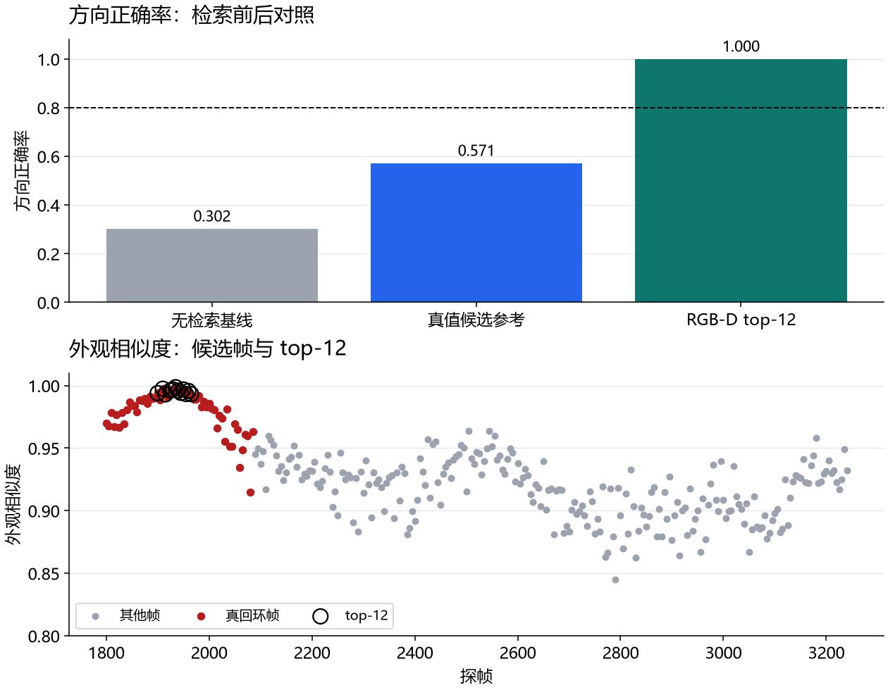

讲义：[第五十五课讲义](docs/60-session-55-rgbd-loops.md)；演示窗口：`uv run python -m embodied_learning.rgbd_loops_demo`。

## 第五十六课：理想图有效，自建图仍未过门

同一条 16 m 内圈巡游上，理想占据图 PF 的平均误差 0.322 m，比无图里程计的 1.984 m 低；按约 16.2 m 估计弧长取前段观测建成的自建图 PF 为 3.443 m、末端 9.194 m，未达到预定的自建图均值和 0.6 m 末端门槛。指标图上半是四组逐帧位置误差、虚线为 0.6 m；下半是**理想图 PF** 五次绑架各自恢复窗口末误差，4/5 达到单场景门槛，自建图重定位尚未验证。二维轨迹图黑色是真实运动、红色是 EST、青绿是理想图 PF。跨场景配对试跑仍未过门，见[导航集成基准](docs/62-navigation-benchmark.md)。

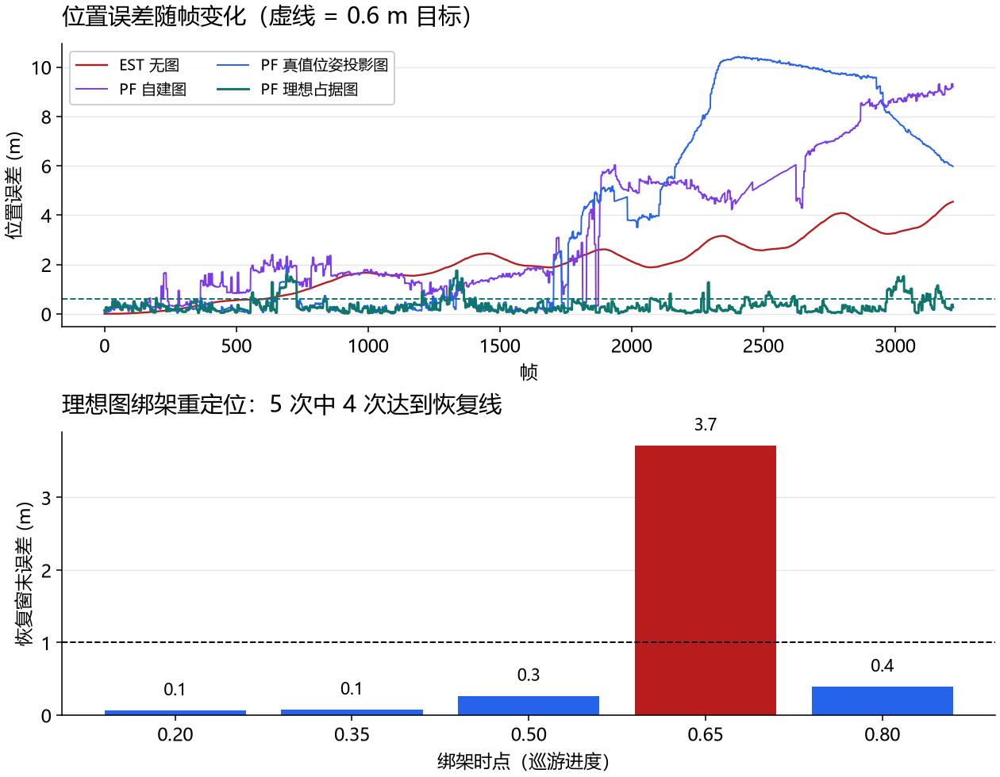

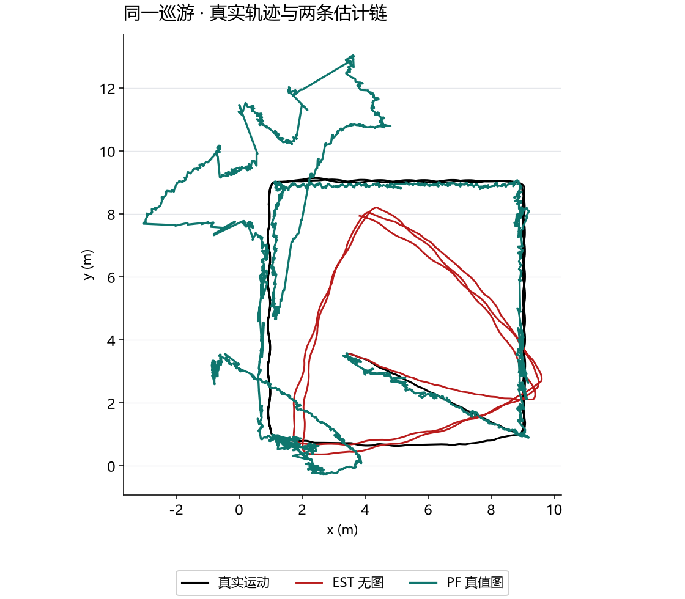

讲义：[第五十六课讲义](docs/61-session-56-map-localization.md)；演示窗口：`uv run python -m embodied_learning.map_localization_demo`。

## 闭环导航对照实验（照片房间，第 64 课）——修正协议下的四组定位来源对照

三维照片房间从开环回放升级为**闭环导航**。v1 的六处接线错误已全部修正（含时间对齐：A 组 loc_mean 精确为 0.0）。v4 正式记录（60 回合）：**全组零接触帧**、不可达 **12/12 安全拒绝**；A **12/12** 到达，B **9/12**（3 次漂移超时），C **12/12**，D **12/12**；C/D 定位误差 0.0064/0.0121 m 显著优于 B 的 0.0232 m。官方 nav2 AMCL 在参数硬门禁后 27/27 有效（A-budget 0.078 m 最好）。详见[闭环对照报告](docs/64-closed-loop-navigation.md)。


读图：正式批次共 60 回合，四条柱分别汇总每组 12 个可达任务回合的平均定位误差（共 48 回合）；其余 12 回合是不可达负例，未计入这四条误差柱。A 组 0.0000 是时间对齐验证；B 组包含 3 次漂移超时，全组零接触帧，不可达任务由先验图 12/12 安全拒绝。


读图：同一任务 `to_quadrant_1`（A 组旅程最长 1.80 m）、两轴等比例尺。橙虚线为估计轨迹、蓝实线为真实轨迹、黑点为起点；B 组估计链整体漂在真实链上方，机器人冲过目标区仍不自知直至超时；C 组估计链贴住真实链正常到达。选例规则固定（A 组旅程最长的可达任务），非择优。

## 地图分离试跑（第 65 课）——自建图失败发生在哪一层？

固定同一批扫描，把自建图失败拆成三层归因：**表示间隙 −0.03 m**（同落点时端点图≈理想占据图，地图表示不是瓶颈）；**落点间隙 +1.34 m**（同样的扫描按里程计位姿涂图即损失 1.3 m，落点误差是主因）；**粒子数不是杠杆**（100→400 粒子自建图 1.67→1.43 m 基本不变，理想图发散反而 1/12→6/12，发散起点分散且跳变后不恢复——滤波器失稳是独立问题）。P5 巡检路线生成器同步交付。详见[第 65 课讲义](docs/65-map-separation.md)与[导航集成基准](docs/62-navigation-benchmark.md)。


读图：上面板是 12 个回合上理想图/真值投影图/自建图在 100 与 400 粒子下的逐回合平均误差（同色浅=100 粒子、深=400 粒子；虚线为发散判据 1 m）；下面板是 400 粒子理想图臂 6 次发散的误差曲线，红色竖线为发散起点，跳变后全程未恢复。

## 第六十六课：园区巡检——定位误差怎样影响真实到点

四种定位来源各自驱动机器人执行同一套 8 点任务，3 个种子共 12 回合：真值参考 3/3 轮完成、参考图 PF 2/3、轮子推算与自建图 PF 均为 0/3。全组零接触，但自建图组在雷达近障停车后超时；参考图组也有定位落入规划边界而停止的失败。雷达目前参与定位与停车，自建图尚未用于在线修图或独立避障规划。

统一窗口可一键切换相机、3D/地图轨迹、底图、雷达、目标和误差统计。近裁剪距离已从场景默认约 47.8 cm 修正为固定 1 cm，示意相机前偏 18 cm，处于 25 cm 碰撞半径内；这不等于完整三维机身避障已经通过。

讲义：[第六十六课讲义](docs/66-campus-patrol.md)；演示窗口：`uv run python -m embodied_learning.campus_patrol_demo --play`。自动避障与修图的独立对照现已完成，分别见第 67、68 课；第 66 课原始基线保持不变。


## 第六十七课：车身标定与观测驱动避障

先把雷达/深度测量换算到整台车的包络，再计算延迟和制动期间扫过的空间。55×44 cm车身、58 cm总高；8类标定夹具覆盖前侧后、转角、低障碍与横杆。相机外参留出点P95为2.57 mm（仿真靶点），解析深度与MuJoCo对拍的最大P95差为0.626 mm。


读图：每方法每环境9回合，绿=到达，红=碰撞，黄=停滞，灰紫=规划拒绝。全部27回合中，只停车0到达/18碰撞，雷达＋车身6到达/18碰撞，雷达＋深度＋车身18到达/0碰撞/9拒绝。低障碍与悬空杆避开雷达扫描平面；深度补了高度，但仍需记住近场盲区中的旧障碍。


读图：种子0低障碍例，绿色绕行到达，橙/紫在障碍前相撞；右侧蓝色是事后几何诊断路径，不算控制成功。窄通道因圆形膨胀过于保守被拒绝，独立矩形路径检查最小间隙6.64 cm。零定位误差是本课受控条件，非视觉定位成果。

讲义：[第六十七课讲义](docs/67-body-aware-obstacle-avoidance.md)；同步窗口：双击 `open_navigation_study.cmd`，或 `uv run python -m embodied_learning.navigation_study_demo --lesson 67 --play`。标定页显示车身、当前扫描、过去深度和刹停扫掠。

## 第六十八课：旧扫描修图，再独立巡检

用已有雷达与轮子读数估计平移/转角尺度，修正历史轨迹后重投影；不向修图器提供真值。原图、整图平移旋转、重建图、准确参照四组分别在自己的图上定位规划，保持300粒子和同一第66课控制器。


读图：深灰为真值落点诊断参照，橙/紫/绿为原图/刚体图/重建图。双向墙面距离0.225→0.108→0.031 m；整体挪图不能消除内部形变。固定20 cm容差下重建图P/R为0.997/0.999。


读图：深色实线是真实运动，彩色虚线为估计，红叉是误报到点。原图三轮共5/24点，重建图23/24、整轮2/3完成；种子1有一点实际距离0.4609 m，超过0.45 m门限，仍记失败。准确图18/24因一轮无路提前结束，不能由此断言重建图更好。

讲义：[第六十八课讲义](docs/68-scan-based-map-repair.md)；窗口：`uv run python -m embodied_learning.navigation_study_demo --lesson 68 --play`。这是恒定尺度偏差下的离线修复，尚非通用在线SLAM；与67课深度控制器尚未合并。

**67—68 课阶段小结**：[车身标定、避障与修图各解决什么](docs/navigation-stage-review-66-68.md)。后续窄路、到点与恢复实验见第 69—71 课；它们仍是分离对照，尚未完成同一平台的组合验证。

**67—68课讲解视频**：[4分14秒中文配音与字幕版：剧本、预览和复现入口](docs/video/README.md)。包含相机视角、雷达点、实际轨迹、81回合统计、修图收益及失败案例；本机成片位于 `results/navigation_video_v1/navigation-67-68-narrated.mp4`。


## 第六十九课：足印、执行与观测地图能否一起支持通行？

当前协议允许轻微擦碰但须到达停稳；第十四轮的新验证实际全部零接触。早期轮次使用额外 6 cm 禁接触协议，后续改为保持真实车身的接触物理；不同协议的成绩分别保留，不能直接拼成同一组提升率。

### 第十二至十四轮：让停车算对，让规划看见高度

**最终三维车身择路60/60到达停稳、零接触、零误报，三例无路入口正确拒绝。** 先修限力驱动和完整速度的停车预测，再留2cm择路偏好；第十三轮仍58/60，最后修复把悬空回波投影成地面障碍的误拒。原失败全部保留，同12对参照10/12→12/12，五个已见失败另作5/5回归。

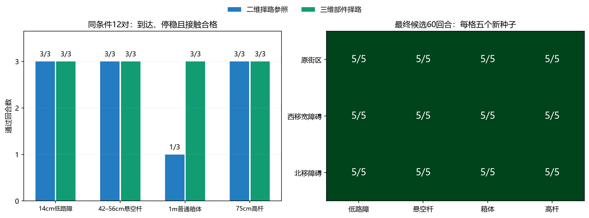

左侧同12对条件，右侧三个布局、四障碍高度、五新种子的60例覆盖；分母不同。低路障仍约束底盘，悬空杆仍约束支架，高杆可从车顶上方通过，不能把所有高处障碍忽略。

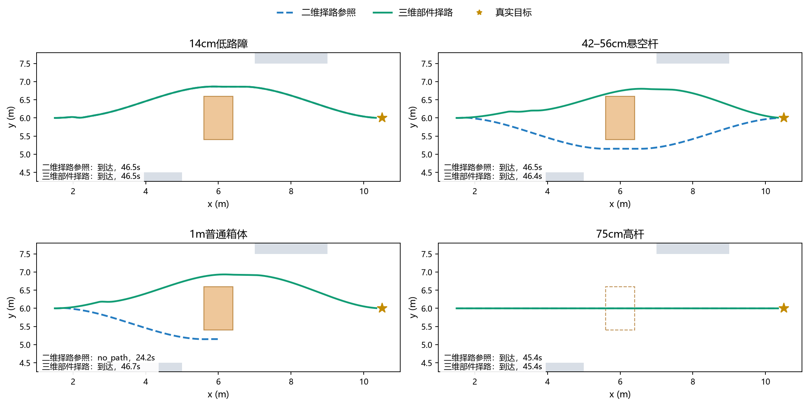

蓝虚线二维择路，绿实线三维部件择路，黑叉目标；箱体蓝线在途中无路退出，绿线完成。轨迹来自真实物理执行，相机仍重渲染，位姿精确为受控输入。

独立核验75回合1,642,850个2ms物理步，状态／接触差均0。计算P95约127—218ms，超过100ms周期，未通过真实异步和实机门槛。讲义：[第六十九课第十二至十四轮讲义](docs/69-physical-height-navigation.md)；[正式摘要](docs/benchmarks/navigation-reinforcement-v14.json)／[重放验收](docs/benchmarks/navigation-clearance-validation-v14.json)。

已有记录可直接运行第二行；新克隆先运行第一行（新实验使用新目录）：

```powershell
uv run python -m embodied_learning.experiments.navigation_height_study --workers 3 --output results/navigation_reinforcement_v14
uv run python -m embodied_learning.navigation_study_demo --lesson 69 --footprint results/navigation_reinforcement_v14 --case 69_street_crate_37__delay_2__bypass_crate --play
```

<details>
<summary>第一至十一轮：原始结果、失败证据与演示命令</summary>

### 第一轮：足印能放下，执行能否通过？

固定55×44cm车身、6cm外扩、雷达＋深度和原跟踪器，对照旧圆形栅格、圆形米制与朝向矩形。**三组均18/27到达、零碰撞，窄路仍0/9**。矩形组找到初始几何路线并实际走3.52–3.62m后停止，实验完成但窄路能力尚未过门。


读图：左图每布局9回合，三种颜色为三种规划表示；右图是九个窄路回合的实际里程，不能当到达率。两个圆形组原地拒绝，矩形组前进后仍终止。


读图：灰虚线为首次规划，绿实线为实际运动，红叉为停止位置，金星为目标。右侧绿框为身体，橙虚框为6cm外扩；代表回合真实间隙6.31cm，但倾斜后的外扩足印已触墙。规划与跟踪之间仍有缺口。

第一轮讲义：[第六十九课讲义](docs/69-footprint-planning.md)；第一轮窗口：`uv run python -m embodied_learning.navigation_study_demo --lesson 69 --footprint results/footprint_navigation_v1 --play`。

### 第二轮：跟踪与路线保留分别起了什么作用？

固定相同身体、6cm外扩、速度与观测，对照旧组、仅换切线跟踪、仅保留原曲线、两项组合。**两个单项仍18/27，组合21/27；固定窄路3/9，但留出种子3/4仍0/6。** 三个窄路成功全部来自开发种子0的三种障碍高度，不能当作三个独立种子成功。132回合零实体接触；成功例外扩足印仍短暂重叠约1.08mm，安全余量门槛没有通过。

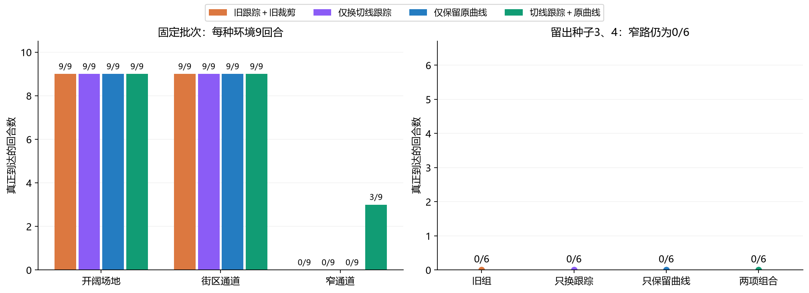

读图：左图每种环境每组9回合；右图为额外留出窄路种子，每组6回合。橙/紫/蓝/绿对应旧组、只换跟踪、只保留曲线、组合组，与窗口一致。

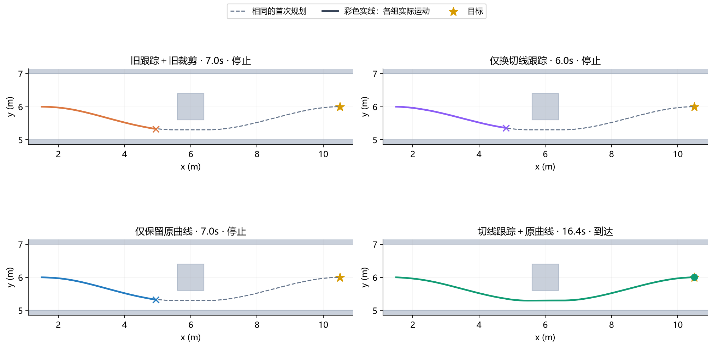

读图：固定种子0普通箱体；灰虚线为相同首次规划，彩色实线为各组实际运动，金星为目标，叉号为未完成终点。只有组合组在16.4秒到达。旧裁剪把原曲线接成触墙弦线；保留曲线和改善跟踪同时使用才在这一例有效。

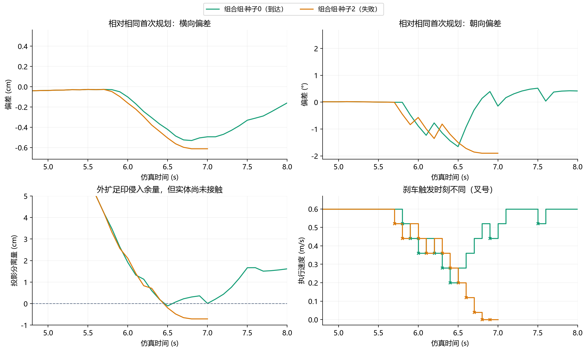

读图：绿色为成功种子0，橙色为失败种子2。上排横向/朝向偏差相对固定首次规划；左下零线表示外扩空间开始重叠，右下叉号为刹车请求。失败例提前一帧刹车，角速度已到0时线速度仍有0.52m/s，改变转弯形状。下一轮独立检验制动与速度预算，另保留种子1的观测/搜索失败边界。

讲义：[第六十九课第二轮讲义](docs/69-footprint-tracking-round2.md)；[132回合摘要](docs/benchmarks/footprint-tracking-v2.json)；[独立审计](docs/benchmarks/footprint-tracking-v2-validation.json)。第二轮窗口：`uv run python -m embodied_learning.navigation_study_demo --lesson 69 --footprint results/footprint_tracking_v2 --play`。“跟踪与余量”页支持四组一键同步相机、3D、雷达、目标和统计。定位零误差来自受控假设；实体间隙、跟踪偏差和外扩重叠分别说明。

### 第三轮：保持转弯形状的制动有效，额外限速未必更好

增加旧版参照，另做“独立/同比例制动 × 原速度/曲率限速”2×2。预测与执行统一到10Hz，所有组都记录失败后真实刹到停稳的运动。**仅同比例制动组固定27/27、新噪声9/9、偏置布局9/9到达且全程采样外扩余量合格；过窄负例原地拒绝。** 固定批次最小外扩分离量约5.25mm。230回合无实体接触；组合限速固定24/27，保留退化。


读图：四面板依次为普通场景、固定窄路、新噪声、偏置布局；浅柱是到达，斜线深柱还要求全程余量合格。灰/橙/绿/紫/蓝对应旧版、统一预测独立减速、同比例、限速、组合。偏置布局下方缝70cm、比原60cm更宽，旧版也通过；不能据此宣称新算法在更难布局中独占优势。


读图：左图比较同一触发速度下的角速度，独立减速先把转向降到零，同比分支随前进一起减慢；右图固定两个输入，延迟0.2秒后独立减速侵入外扩空间6.71/2.77mm，同比例减速仍留5.42/8.61mm。闭环还需上图的全批检验。


读图：固定窄路/普通箱体/种子0，灰虚线是相同首次规划，彩色线含实际制动尾段。仅同比例组16.1秒到达且余量合格；限速组合8秒因观测拒绝触发失败，再实际制动0.5秒、7.86cm停稳。拒绝来自一束偏移约1cm的雷达回波，被复制到三个高度，不能当成三份独立证据。

讲义：[第六十九课第三轮讲义](docs/69-braking-round3.md)；[230回合摘要](docs/benchmarks/braking-navigation-v3.json)；[独立审计](docs/benchmarks/braking-navigation-v3-validation.json)。第三轮窗口：`uv run python -m embodied_learning.navigation_study_demo --lesson 69 --footprint results/braking_navigation_v3 --play`。新增“制动过程”页、五组同步切换和余量合格标注，变量、公式、限速失败、计算耗时、9道思考题及复现完整保留。仍为精确定位、静态运动学实验；不等于实机安全或硬实时通过。

### 第四轮：定位误差与实际执行延迟的边界

第四轮233回合保持同比例制动，分别注入恒定世界y/朝向误差或实际指令队列延迟。**新种子零扰动仅7/9余量合格；延迟0.1秒8/9，0.2/0.3秒0/9，0.4秒窄路9/9发生接触。** y−0.5cm为9/9、y+0.5cm为5/9，而±1/2/4cm均未到达，所有非零朝向等级也未到达。结果非单调，不发布“允许偏差/延迟”阈值。失败既有搜索预算与路线转换，也有真实迟刹；全233回合11次接触均保留。

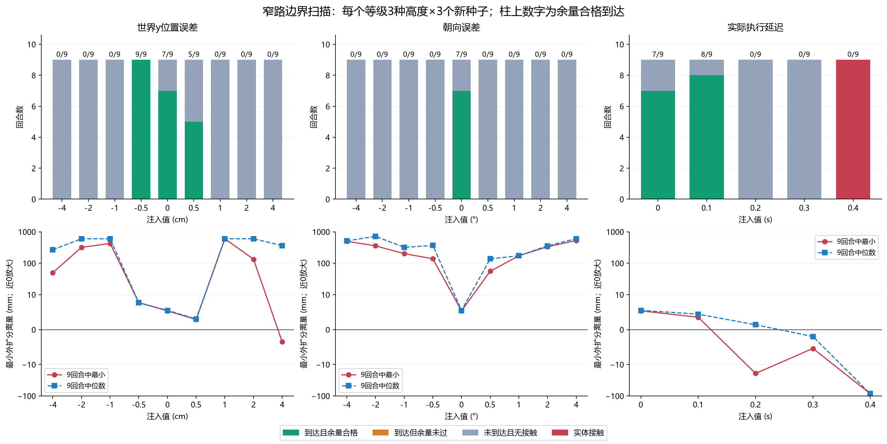

上排：每个位置/朝向/延迟等级的9回合结果，绿色为到达且余量合格，灰色为未到达但无接触，红色为实体接触；柱顶只数绿色。下排同时报告最差与中位外扩分离量，近零刻度放大。很早停下的失败可能间隙很大，不能据此宣布导航更强。

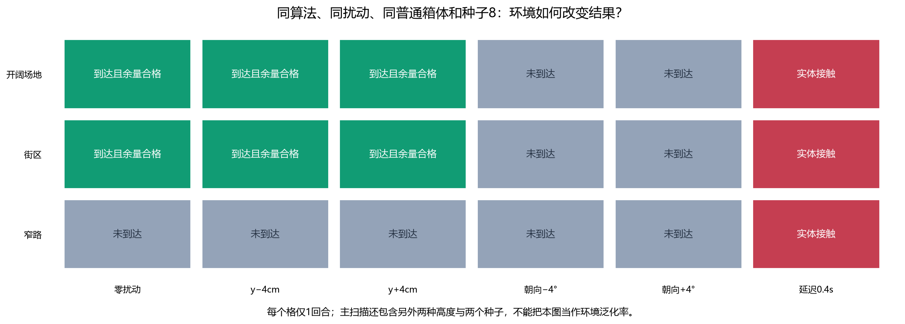

固定普通箱体和种子8；每个格仅一回合，展示同样的位置/朝向误差或执行延迟在开阔、街区、窄路中的不同结果，不当作多种子泛化率。

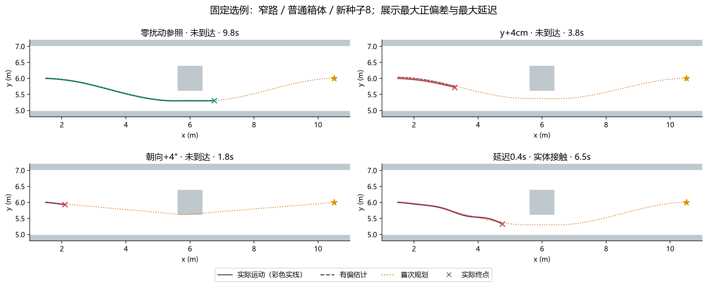

固定窄路普通箱体种子8，展示零扰动及三个因素的最大正等级。彩色实线为真实运动，灰虚线为估计，橙点线为首次规划，叉号是实际终点；零扰动失败也保留。

讲义：[第六十九课第四轮讲义](docs/69-robustness-round4.md)；[233回合摘要](docs/benchmarks/navigation-robustness-v4.json)；[独立审计](docs/benchmarks/navigation-robustness-v4-validation.json)。第四轮窗口：`uv run python -m embodied_learning.navigation_study_demo --lesson 69 --footprint results/navigation_robustness_v4 --play`。五个条件视图、每组至多五个同步按钮；第七页“误差与延迟”说明请求与执行时间、偏差符号及单位。完整变量表、负结果、机制解释、10道思考题和复现命令随讲义归档。

### 第五轮：排队动作预测与执行端保护

**135回合的四组对照：窄路延迟0.4秒，原参照9/9接触，三个改进组均0/9接触，但到达仍全为0/9。** 0.2秒改进组采样余量为正，任务仍无路/停滞；0.4秒改进组仍有保守余量违规，不能叫导航成功或完整安全通过。全批36次真实到达来自无延迟条件，18次接触保留。


读图：三列对应实际排队0/0.2/0.4秒，上排每柱9回合（三高度复用种子11/12/13）；绿=到达且余量合格，灰=未到达无接触，红=实体接触。下排红实线为最小外扩分离量，蓝虚线为中位数，0线以下是违规。没有接触与全程6cm余量分别验收。


读图：固定窄路/箱体/种子11/0.4秒；各面板彩线是独立实际运动，金点线是初次计划，星是目标，×是终点。位置精确为设定，估计与实际重合；三个改进组停在途中，不能把剩下的计划线当已执行。


读图：浅灰5–6秒不给新结果，车继续走；5.1秒距最后结果0.2秒，本地保护组实际减速，5.9秒停稳、余量+195.98mm，目标未到。原参照和仅队列预测重合，随后接触，×保留接触时非零速度。固定故障调度验证了过期停车接口，**没有实测解决真实规划线程阻塞**。

余量失败还有口径差异：本地保护沿用实际部件，评分是58cm全高度保守矩形。悬空杆最差例同输入部件距离+12.59mm，完整包络却−24.15mm；需要统一几何，不在正式结果后改评分。下一步诊断停住后无路及70/71恢复组合。

讲义：[第六十九课第五轮讲义](docs/69-execution-round5.md)，含变量、关联、原理、完整对照、失败解释、12道思考题；[135回合摘要](docs/benchmarks/execution-safety-v5.json)、[同输入反事实](docs/benchmarks/execution-counterfactual-v5.json)、[独立审计](docs/benchmarks/execution-safety-v5-validation.json)。第五轮窗口：`uv run python -m embodied_learning.navigation_study_demo --lesson 69 --footprint results/execution_safety_v5 --play`。四个按钮同步相机、3D、雷达、目标与统计；第八页“执行端保护”显示新结果、真实动作与接管。旧轮次显式指定存档目录。


### 第六轮：取消额外余量，允许轻擦，以真实到点为主

**39回合完成。窄路0.2秒延迟主批，6cm禁接触0/9 → 零余量禁接触6/9；零余量允许轻擦同样6/9。** 身体仍是55×44cm，接触会受阻/滑动/旋转，不能穿墙；到点还须检查实际速度并停稳。旧6cm外扩保留作诊断，不再决定当前任务通过。三组共用新物理模型和接近目标限速，不能与旧运动学批次直接归因比较。

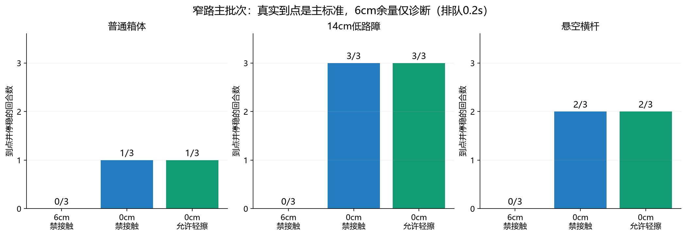

读图：箱体、低路障、横杆分别是三列，每柱3个新种子；红=6cm禁接触，蓝=0cm禁接触，绿=0cm允许轻擦。改善来自取消额外空间要求；成功例没有接触，允许擦碰尚未增加到达。0.2秒箱体接触峰值77.53N、0.4秒380.87N，都超过本轮40N轻擦定义，仍如实中止。

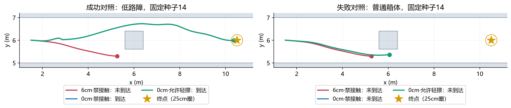

固定窄路/种子14/0.2秒：左低路障成功，右箱体接触失败；线为实际轨迹，圆为末端，星/圈为目标。蓝绿完全重合，并非漏画一组。全批到达1/13、7/13、7/13，0误报；30cm实体放不下的窄口三组原地拒绝。

讲义：[第六十九课第六轮讲义](docs/69-contact-round6.md)，含新变量、请求与实际运动关联、接触原理、结果、12道思考题及复现；[39回合摘要](docs/benchmarks/contact-navigation-v6.json)、[独立物理重放](docs/benchmarks/contact-navigation-v6-validation.json)。第六轮窗口：`uv run python -m embodied_learning.navigation_study_demo --lesson 69 --footprint results/contact_navigation_v6 --play`。第九页“接触与实际速度”显示实测速度、接触力/压入；三个按钮同步全部视图，相机黄线随本组0/6cm余量切换。轻擦定义为单点≤40N、压入≤5mm、连续≤0.5s，属于仿真研究阈值。后续第七、八轮见下方；40N轻擦阈值未提高。

### 第七轮：固定低速，提高到达但增加时间

**30回合，窄路0.2s主批正常7/9、低速9/9。** 同身体、接触物理、余量、观测和反馈；仅将正常前向上限0.6降到0.2m/s，并使曲率前馈与请求一致。典型成功从16.6–16.7秒变为45.5秒；0.4s延迟正常组223.68N重接触，低速无接触到达。30cm窄口两组仍拒绝。

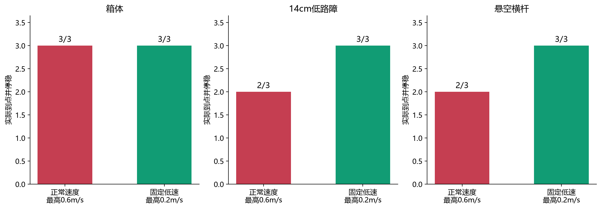

三列是箱体/低路障/横杆，红正常、绿低速，每柱三个新种子。相同种子下的收益只在本轮两组比较；旧六轮种子不同，不能直接归因。

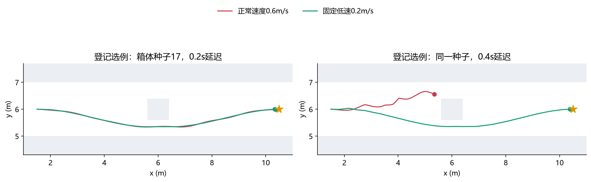

固定种子17箱体：左0.2s两线重合到达，右0.4s红接触后停止、绿绕过到达；灰为实体，星为目标。详见[第六十九课第七轮讲义](docs/69-speed-round7.md)、[正式摘要](docs/benchmarks/navigation-reinforcement-v7.json)和[独立物理验收](docs/benchmarks/navigation-reinforcement-v7-validation.json)。

```powershell
uv run python -m embodied_learning.navigation_study_demo --lesson 69 --footprint results/navigation_reinforcement_v7 --case 69_narrow_crate_17__delay_4__normal --play
```

### 第八轮：按观测修图，仍未提高导航到达

**36回合，只加不删9/18、证据更新7/18，全部无接触和误报。** 新增端点写入、三帧深度穿过旧格子才清除；遮挡/无效不删，没有读取真实地图选择动作。位姿精确是设定；本轮修占据，不修定位。


六条件各三个新种子；红只加、绿证据更新。移走墙仍因底层空闲无法确认而无路；更新组在新增/正确箱体种子22停滞，正式结果不覆盖。


上排35cm高度层：灰仍占据、绿已清除、橙新加入；下右清除320个三维格子，下左全高度俯视错误曲线仍重合，因为最底层占据未清除。三维格子减少不能直接当可导航性改善。

窗口新增“地图怎样修正”，当前地图按方法/时间同步；一键切换相机、3D、雷达、目标与统计，并排图也不借用最终地图。详见[第六十九课第八轮讲义](docs/69-online-map-round8.md)、[正式摘要](docs/benchmarks/navigation-reinforcement-v8.json)、[独立验收](docs/benchmarks/navigation-reinforcement-v8-validation.json)和[两轮登记](docs/navigation-reinforcement-7-8-plan.md)。

```powershell
uv run python -m embodied_learning.navigation_study_demo --lesson 69 --footprint results/navigation_reinforcement_v8 --case 69_street_crate_20__delay_2__shifted --play
```

第七至十轮作为冻结参照保留；最新回放窗口优先完整且合格的第十四轮；第十一轮是历史参照。第九、十轮结果、验收与下一阶段见下方，原36回合地图失败记录不覆盖。

### 第九轮：让前进和转向使用同一个方向

**36回合，可绕箱体三类任务7/9→9/9。** 跳过已走首点，并让前进门控与切线转向一致；身体、速度、安全保护与证据地图不变。5次旧停滞中2次到达、3次成为更前方规划拒绝；遮挡仍0/3，移走墙仍无路，全部无接触/误报。

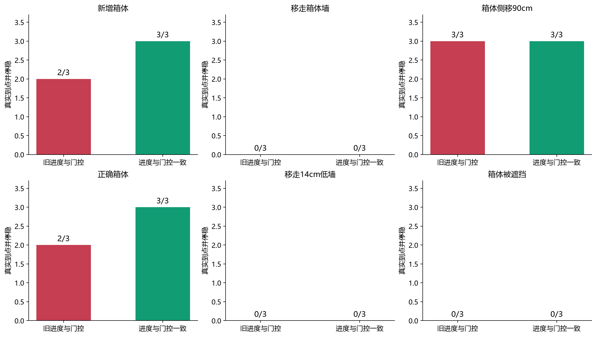

每柱3回合；红旧进度/门控，绿新一致规则。改善的种子25在旧组走4.00m后停滞，新组走9.03m到点。新增/正确箱体运动相同，不当作两个独立现实环境。

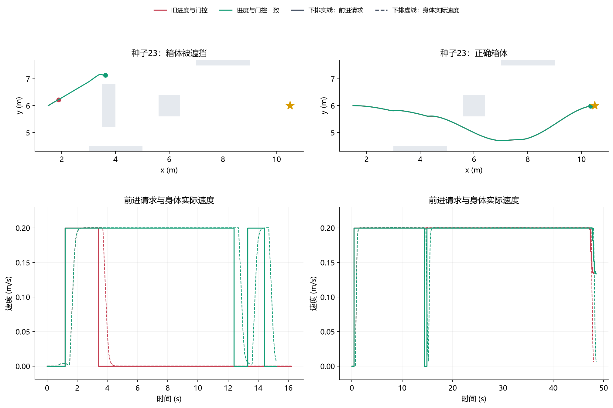

登记选种子23：左遮挡仍失败，右正确箱体两组都到达。上排灰实体、圆终点、星目标；下排实线请求、虚线身体实际速度。到点制动标志可覆盖非零跟踪请求，停稳要看实际速度。详见[第六十九课第九轮讲义](docs/69-progress-round9.md)、[正式摘要](docs/benchmarks/navigation-reinforcement-v9.json)、[独立验收](docs/benchmarks/navigation-reinforcement-v9-validation.json)。

### 第十轮：细采样看清近地面空闲，保留真低障碍

**36回合，移走箱体墙/低墙由0/6→6/6真实到点停稳；真低墙/横杆六负例均拒绝且无接触。** 两组同用新进度和原地图规则，仅深度80×60→320×240，同视场下每轴4倍采样、总射线16倍；三帧/3×3/12cm预算不降低。正确箱体各3/3，遮挡各0/3。

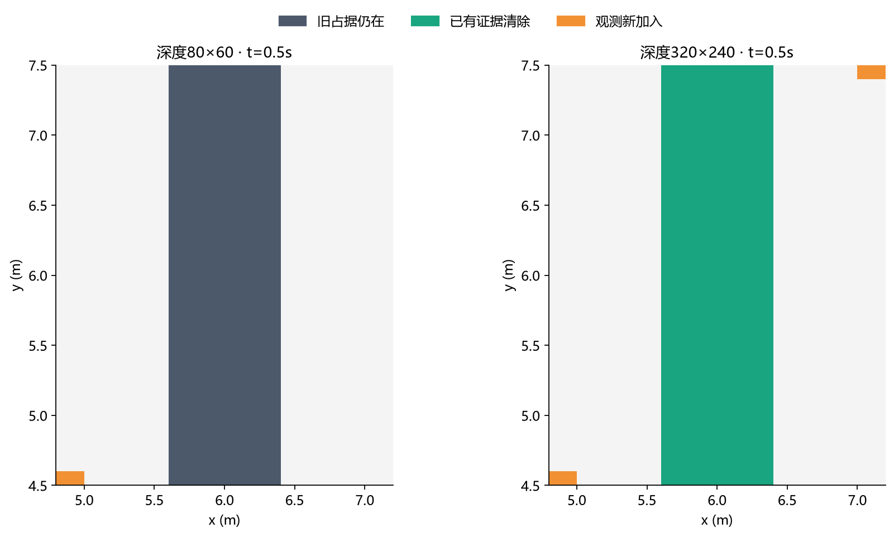

同种子26、同t=0.5s：灰仍占据、绿有证据清除、橙新加入。中央旧低墙的80个俯视格子清到0，粗采样仍80个；用的是当前图，没有提前显示最终图。

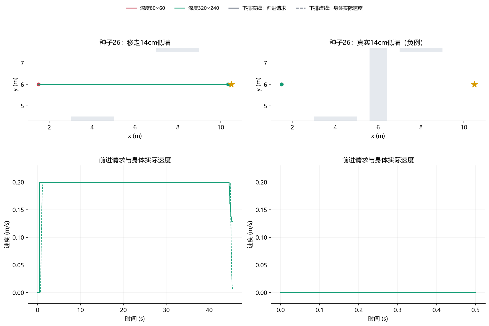

左移走低墙，绿45.4s到点停稳、红原地拒绝；右真实低墙两组原地拒绝。下排实线是请求，虚线是实际速度。局部通道打开不等于整图修准：全局误占据未全面下降，规划拒绝单次最高约8.6s，尚未验证实时异步执行。详见[第六十九课第十轮讲义](docs/69-depth-sampling-round10.md)、[正式摘要](docs/benchmarks/navigation-reinforcement-v10.json)、[独立验收](docs/benchmarks/navigation-reinforcement-v10-validation.json)。

```powershell
uv run python -m embodied_learning.navigation_study_demo --lesson 69 --footprint results/navigation_reinforcement_v10 --case 69_street_low_26__delay_2__removed_low --play
```

两轮共72回合、790300物理步独立重放状态/接触差0；15878帧地图和34528次删除证据核验。讲义补变量关联、原理、结果/失败、思考题和复现；五张科学图、三张本应用窗口图实际读图，一键切换相机/三维/雷达/目标/地图/统计，按本方法深度尺寸反投影。[两轮登记](docs/navigation-reinforcement-9-10-plan.md)、[交付验收](docs/benchmarks/navigation-reinforcement-9-10-delivery.json)、[下一阶段安排](docs/navigation-next-stage-after-round10.md)。

### 第十一轮：直行会碰，但旁边有路可绕

原低墙/横杆横贯通道且已在地图里，只能验证拒绝；本轮换成地图未知、两侧可绕的有限障碍。24回合：低路障仅雷达0/3、雷达＋深度3/3；悬空杆0/3、2/3；普通箱体3/3、2/3；高杆各3/3直接通过。正式融合零接触，但两次无路；开发种子0同源码的85.94N接触失败保留，不宣布安全完成。


固定种子29：红仅雷达、绿雷达＋深度；橙为新障碍足印，高杆虚框表示整车可从下方经过。叉号接触中止，圆点到达并停稳，星号真实目标；高杆两组轨迹重合。两组同用新点连续坐标候选，雷达组没有偷偷使用深度保护。


每柱3回合，报告不同条件而非只看总分6/12→10/12。加深度在低障碍有收益，但普通箱体反而多一次失败；窗口的位姿误差为零是受控设定，不是定位成绩。全部失败图、变量/原理、思考题与复现见[第六十九课第十一轮讲义](docs/69-reachable-obstacles-round11.md)，[独立审计](docs/benchmarks/navigation-reinforcement-v11-validation.json)含24正式＋1开发反例。

**接触原因已复盘**：箱体已被观测，20.0s请求停车、20.2s执行、20.418s底盘前左角接触。原停车预测56.0mm，限力伺服不受碰撞阻滞的停车行程79.7mm；贴边规划约3.9mm余量，朝向又偏约2.38°。同状态立即刹车或提前100ms排队刹车均可无接触停稳，但未到达。详见[接触逐帧复盘](docs/69-contact-failure-diagnosis-round11.md)与[机器可读审计](docs/benchmarks/navigation-contact-diagnosis-v11.json)。该安排已在下述第十二至十四轮完成，原成绩和接触门限保持冻结。

```powershell
uv run python -m embodied_learning.navigation_study_demo --lesson 69 --footprint results/navigation_reinforcement_v11 --case 69_street_low_29__delay_2__bypass_low --play
```

相机、三维、雷达点、当前目标、当前地图和统计一键切换；深度标明是否参与控制。[下一阶段](docs/navigation-next-stage-after-round11.md)先解释接触与误拒，再扩大位姿误差、真实计算延迟和69—71组合。

</details>

## 第七十课：估计到了，身体真的到了吗？

固定第68课地图与PF，保留原来的连续5帧要求，比较原规则、位置误差预算、预算＋停稳。**后两组各48/48真实到点、零误报、零接触**；原组41/48、1次误报。真实45cm验收线始终不变，粒子集中程度也不被当作误差保证。

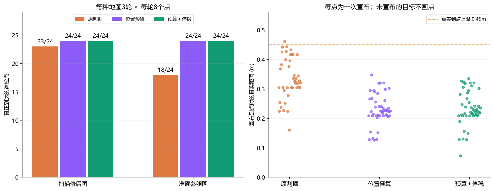

读图：左图每种地图3轮×8点；右图每点是一次宣布时的真实距离，橙虚线为45cm门限，未宣布的目标不画散点。原组有一个点越线，不能只看平均误差。

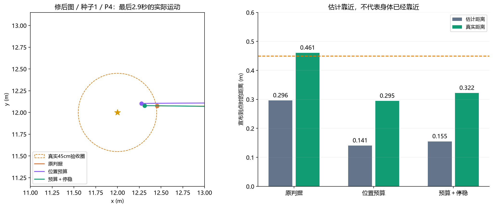

读图：左图是修后图种子1的P4附近实际运动和宣布位置；右图灰柱为估计距离、绿柱为真实距离。原规则在46.09cm处误报，预算组与联合组分别在29.48cm、32.21cm处通过。三组宣布时均已停住，额外速度门未证明独立收益；不能把改善都归给“停稳”。

讲义：[第七十课讲义](docs/70-arrival-decisions.md)；窗口：`uv run python -m embodied_learning.navigation_study_demo --lesson 70 --play`。决策页解释当前距离、粒子半径、固定10cm预算和停稳条件，附预算失效反例与思考题。

## 第七十一课：无路之后，有限且真实地恢复

固定旧到点判据，只在估计起点落入膨胀区、定位分散不大、扫描支持整车运动时尝试低速恢复。**准确图真实到点18/24→24/24；修后图仍23/24，保留旧误报**。恢复与到点是分开的机制。

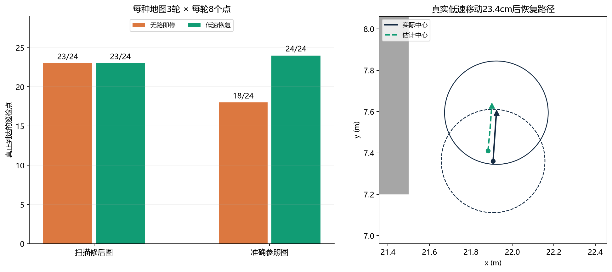

读图：右侧黑实线/绿虚线分别为真实/估计中心；圆点为开始，三角为结束，两个黑圆为前后身体。准确图种子0实际移动23.4cm、用时1.56秒后重新获得路线，没有改坐标跨墙。

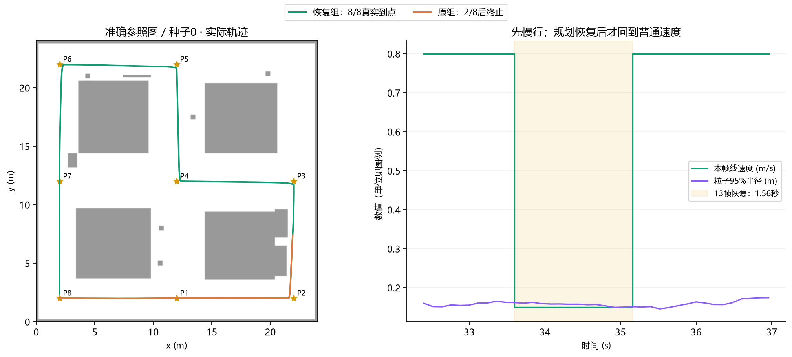

读图：左图橙线提前终止，绿线完成8点；金星是巡检点。右图黄底为13帧恢复，绿线是执行速度、紫线是粒子半径（单位分别见图例），逐帧观察后再决定下一步。全部六个恢复组回合仅一次触发，尚不代表通用恢复能力。

讲义：[第七十一课讲义](docs/71-bounded-recovery.md)；窗口：`uv run python -m embodied_learning.navigation_study_demo --lesson 71 --play`。含跨墙/封堵拒绝、恢复时限、传感器盲区、思考题与复现。

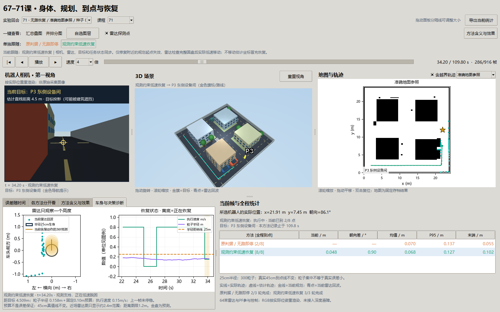

窗口固定为准确图种子0、34.20s；方法按钮一次同步各面板，保留时间。金色圆盘是动作预测，RGB为真实位姿重渲染，扫描和动作来自存档。69–71均接入相同模块，无需分别打开多个窗口调来源。

**阶段复盘**：[同一算法不同环境的表现](docs/navigation-stage-review-69-71.md)。第七轮低速有收益，第八轮地图更新未提高到达；第九轮修进度与门控，第十轮加密深度，第十一轮验证新障碍，十二至十四轮已通过限定新范围；遮挡、位姿误差与异步仍保留，下一项见[后续受控安排](docs/navigation-next-stage-after-round11.md)。跨场景、视觉与真实异步门槛继续保留；原始数组本地保存，新克隆按讲义生成。

## 第七十三课第二轮：夹爪参考点与开口中心不同

在导航限定门槛通过后继续机械臂。固定原模型、限矩和评分，开发分离运动路径与开口中心；再测27个新位置／朝向的配对条件。**原策略17/27，空间路径＋开口中心21/27；两种负对照各0/9。** 救回6例、退步2例，剩6失败，不称稳健或视觉抓取。


每格相同条件。0°九位置全部通过，换朝向仍出现单侧受力与抬起后掉落，说明对准几何中点不保证真实指面夹牢。72回合763,200物理步独立重放差0。


一键切换实际3D、外部／腕部相机、目标、两指力和统计，保留时间；失败也可查看。见[第七十三课第二轮讲义](docs/73-so101-approach-geometry.md)，含变量关联、原理、全部失败、理论与六道思考题。

已有记录可直接运行第二行；新克隆先运行第一行（新实验使用新目录）：

```powershell
uv run python -m embodied_learning.experiments.so101_approach_study --workers 3 --output results/so101_approach_v3b
uv run python -m embodied_learning.manipulation_demo --results results/so101_approach_v3b --position p04a1 --method center_cartesian --play
```

## 第七十三课第三轮：指面校准有效，双侧有力仍可能掉落

**126个物理回合；相同27新条件，指尖基线21/27 → 指面校准24/27，救回3例、无退步。** 单独抬升前双侧力门控11/27，指面＋门控23/27；空夹、偏5.5cm各0/9。未满足门控而停止也算任务失败。

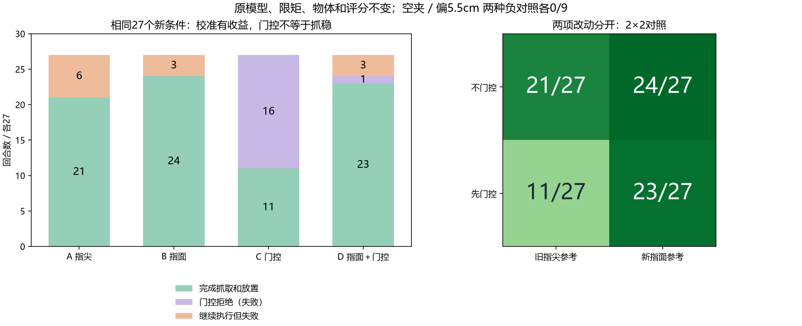

左图绿为完成、紫为门控拒绝、橙为执行后失败；右图把指面与门控两项分开对照。新参考按真实碰撞指面的截面计算，保留原模型、限矩、物体和评分；当前门控只有抬升前双侧力与持续时间检查，没有恢复机制。

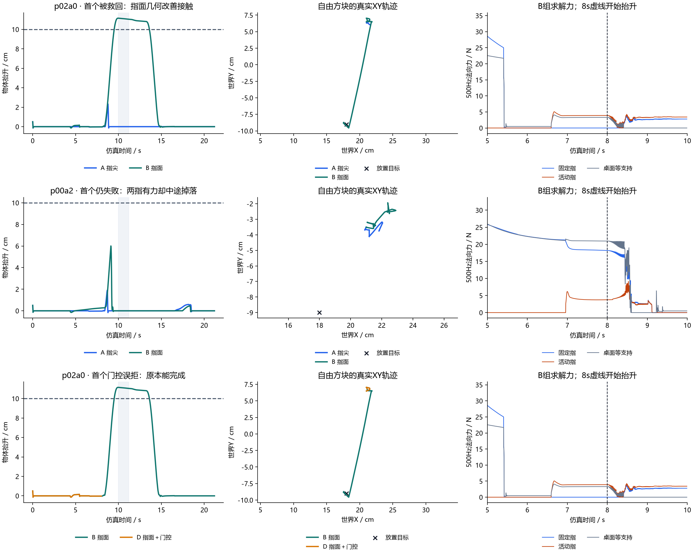

每排依次为实际抬升、物体XY轨迹、两指及桌面支持力；10cm虚线为抬升门槛，浅灰为保持段，右图8s虚线开始抬升。按键名固定选择首个救回、首个剩余失败、首个误拒。剩余三失败均为Y=−3.5cm、+20°，先有双侧力，抬5.4—6.0cm后掉落；门控未拦住这三例，反而误拒一次原本可完成的抓取。

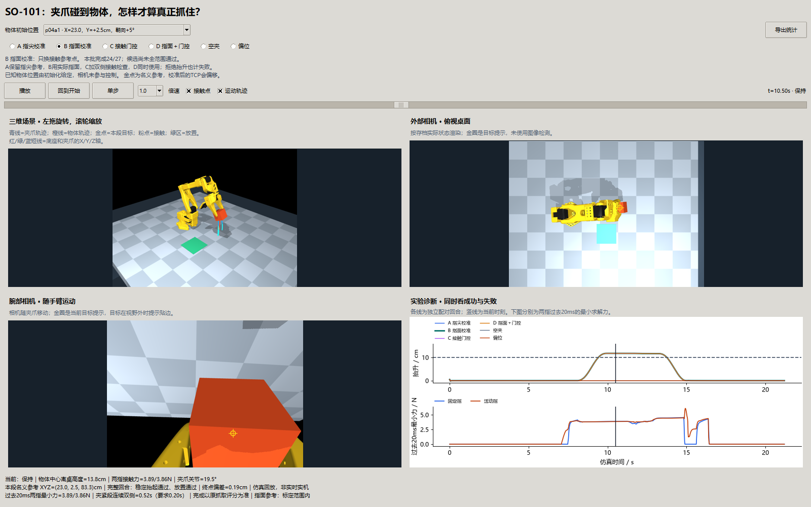

方法按钮一键同步三维、外部／腕部相机、目标、曲线和统计，保留时间；短拒绝回合统一停到结尾。窗口新增过去20ms最小力、连续接触时间、门控结果和全批完成数。已知初始物体位置，RGB仍为重渲染。完成率提高同时峰值力／压入变大，仍未达到稳定教师，下一轮先检验动态接触，再进74课视觉。

讲义：[第七十三课第三轮讲义](docs/73-so101-contact-feedback.md)，含变量关联、开发失败、四组原理、逐格结果、力学代价、八道思考题及复现。[126回合摘要](docs/benchmarks/so101-contact-v4.json) · [配对和失败诊断](docs/benchmarks/so101-contact-v4-diagnosis.json) · [独立审计](docs/benchmarks/so101-contact-v4-validation.json)。

```powershell
uv run python -m embodied_learning.experiments.so101_contact_study --workers 3 --output results/so101_contact_v4
uv run python -m embodied_learning.manipulation_demo --results results/so101_contact_v4 --position p04a1 --method surface --play
```

## 进度清单

- [x] 本机环境审计
- [x] 确定分层仿真技术栈
- [x] 建立学习路线与第一阶段验收标准
- [x] 安装 `uv` 与项目专用 Python 3.12
- [x] 创建项目虚拟环境并安装 MuJoCo/Gymnasium
- [x] 运行第一个可视化和无界面仿真实验
- [x] 实现 PD 控制器并与随机动作基线比较
- [x] 处理小车长期漂移：基于真实平衡点的离散 LQR（2026-09-02，40 秒仿真验证）
- [x] 学员已运行 R=1 实验，结果保留于 `results/lqr_r1_my_run/`
- [x] 提供可暂停、单步、调速的教学回放和同条件 R 对照
- [x] 多 R 彩色曲线叠加，以及 20 组配对随机推力实验
- [x] 测量噪声闭环实验：固定 R=1，0×/1×/3× 各 20 回合，分别记录真实状态和传感读数
- [x] 全转动摆起专题：下方初态、强扰动、能量摆起/LQR 切换和失败边界；独立慢放演示
- [x] 平面 2R 机械臂：FK/MuJoCo 几何核验、解析双分支 IK、关节 PD 到达和两页教学窗口
- [x] Jacobian/差分/MuJoCo 三方核验、直线路径三组对照、奇异性探针和多色慢放；140 项测试通过
- [x] 多路径配对评估、先验几何拒绝、奇异初态真实失败、参考/执行误差分解与停稳条件审计；153 项测试通过
- [x] 逐点解析 IK、连续分支与速度规划边界、原清单配对回归和三色慢放；170 项测试通过
- [x] 同路径 8/4/2 秒对照、规划拒绝与真实力矩截断分层、可变时长慢放；192 项测试通过（桌面交互验收受窗口置前失败限制，详见第十二课）
- [x] 模型逆动力学前馈＋原 PD、49 状态方程核验、25 条配对路径与四类力矩回放；215 项测试通过
- [x] 差速车五种运动、世界/车体/传感器变换、故意错误映射与独立慢放；251 项测试通过
- [x] 编码器里程计与真值分离、三档右轮读数比例偏差、直行/方形配对与三指标慢放；新增 31 项测试独立通过
- [x] Tk 集成测试改为独立进程执行，保留断言与失败传播；重复全量通过，底层异常根因仍未确定
- [x] 第十六课：对照测量→求系数→换路线验证、错误尺子反例与可选落图；315 项全量通过
- [x] 第十七课：标定后种子化逐区间噪声、20 次重复统计分离偏差与分散、样本/公共随机数切换慢放；331 项全量通过
- [x] 第十八课：已知地标观测 + 2D Procrustes 位姿解算、累积 vs 不累积对照、保持旧值锯齿与长直行距离效应；346 项全量通过
- [x] 第十九课：原始观测解算展示、重置＋里程计、三组配对、坏观测反例与慢放；376 项全量通过
- [x] 第二十课：真实 ROS 三进程、时间戳配对、TF 坐标链与逐帧核验；运动优先改版后 406 项全量通过
- [x] 第二十一课：目标点反馈、估计驱动轮速、80 回合配对、实际到达／误判区分和运动慢放
- [x] 第二十一课补充：2 / 1 / 0.5 cm 停车门限单变量对照、240 回合、实际误差／耗时／超时与重新调整慢放
- [x] 第二十二课：针孔相机投影/反投影、往返一致、无深度射线、深度噪声误差传播与射线倍率机制、位姿一致性；454 项全量通过
- [x] 第二十三课：单目相对深度 ↔ 米制尺度标定、控制点数量/噪声对照、远/近误差分层与机制核对；468 项全量通过
- [x] 第二十四课：真实 DA V2 仿射检验、残差结构（U 形+水平相关）、N 扫描与全局仿射 3 cm 下限；479 项全量通过
- [x] 第二十五课：张氏 4 参数内参闭式标定、M/σ 传播、退化姿态守卫与自洽性陷阱教学点；493 项全量通过
- [x] 第二十六课：两帧带噪点云手写 ICP、点到点/点到面对照、收敛半径与几何退化反转；512 项全量通过
- [x] 第二十七课：MobileSAM 掩码接地 + 最近邻身份分配接入定位链、错配静默爆炸实证与 δφ=δpx/f 机制；526 项全量通过
- [x] 第二十八课：行为克隆阶段 5 入口、开环 MSE 33× vs 闭环 0/75 的复合误差实证、手写 MLP/Adam 与验收对拍；540 项全量通过
- [x] 第二十九课：手写 numpy PPO 摆起——扶稳子技能学到、完整摆起 0/60 vs 基线 20/20 的诚实对照与失败四机制；554 项全量通过
- [x] 第三十课：残差 RL（能量整形底座+限幅残差）——a=0 守卫逐位一致、朴素残差触限 95.8–99.6% 劣化基线（0/60）与机制归因；573 项全量通过
- [x] 第三十一课：PBRS 势函数塑形——悬崖顶首次触达（cE=2 种子 1 @150k 步）但 0/60 仍未稳定；"对的能量≠对的姿态"；587 项全量通过
- [x] 第三十二课：DAPG 示教空投——直立首达 33/60 成为常态、缺口收缩为闭环精度；w=0 双守卫逐位；601 项全量通过
- [x] 第三十三课：Go-Explore——稳定带被找到并捕获 417 次、BC 鲁棒化 0/20（找到但学不会走）；614 项全量通过
- [x] 第三十四课：两阶段奖励——直立首达 2/3 种子（PBRS 1/3 进一步）、首成仍 0/60、出界主导；628 项全量通过
- [x] 第三十五课：手写 numpy SAC——α 坍缩与回放熵归零、首达 0/60 比 31/34 课更差；642 项全量通过
- [x] 第三十六课：DAgger 在线纠错——w=0 对照证明数据有效只修到达（首达 0→5/60）、仍 0/60；655 项全量通过
- [x] 第三十七课：多峰块策略——确定性均值路径到达 0/3→3/3（历史首次）、成功仍 0/60；669 项全量通过
- [x] 第三十八课：倒立摆组合学习——保护性成立（120/120 到达零出界）增值性不成立（0/60 劣化基线）；682 项全量通过
- [x] 第四十一课：分阶段最小验证——底座已最优、线性修正无改善信号、裁决=base_optimal_no_headroom；694 项全量通过
- [x] 第四十二课：ACT/torch 策略——0/60 但归因清晰化：信息-精度硬墙；707 项全量通过
- [x] 第三十九课：差速小车纯学习——接近学到但到达输给目标熵、悬停画像；696 项全量通过
- [x] 第四十课：2R 臂纯学习——跨任务目标熵均衡收敛、戳进球但停不住；710 项全量通过
- [x] 第四十三课：占据栅格建图 + A\* 规划 + 纯追踪——回主线；有障碍 15/15 无碰撞到达 vs 盲飞 3/15、0 vs 1005 碰撞、路径比 ≈ 全知、覆盖率 47%；_v2（真值地图矩形修复）后 782 项全量通过
- [x] 第四十四课：定位误差穿栈——真值 15/15 复现第 43 课；里程计 1%/2% 均 0/15（误差 1.22/2.25 m、地图错位 3.0/4.7 格）；2%+地标融合 15/15、误差 2.5 cm 与真值几乎等价；三判据满足（含判据表述修正声明）；782 项全量通过
- [x] 第四十五课：最小栅格 SLAM——扫描匹配是相对锚；S 与 E 同 0/15（2.47 vs 2.25 m，无绝对锚不可闭环）、匹配器接受率 4.6%（质量未达预期）、绝对锚（信标）对照 15/15/2.5 cm；797 项全量通过
- [x] 第四十六课：回环闭合——回环是绝对锚的第二形态；采集-重放四链（N/S/L/LT）：末端 9.2 m→0.14/0.16 m、黄金边结构与匹配分离、均值未降（形状待因子图）；811 项全量通过
- [x] 第四十七课：加权位姿图优化——形状修复成立（FG 均值 5.03 < 弧长 5.33）、末端 1.21 m 保持闭合、黄金锚末端 0.016 m 但均值反升（σ 权衡入册）；824 项全量通过
- [x] 第四十八课：鲁棒位姿图——毒化回环注入：LS 7.63 m 比无回环更糟（脆弱性✓）、Huber 压回 5.22 m（抵抗✓）、单核两难（好回环同核 8.79 m 不闭合）+ δ 退火阴性；833 项全量通过
- [x] 第四十九课：回环匹配器工程化——接受率阶梯 0.32→0.76；≤5.4% 为第 54 课已勘误的旧判据，伪影峰仍需甄别；协议重建修复第 46 课四处设计条件；849 项全量通过
- [x] 第五十课：特征化回环检测——三项特征评分分布重叠；2.6% vs oracle 4.9% 是旧判据结果；地图一致性自洽无对比度；858 项全量通过
- [x] 第五十一课：SC/MM 可切换约束——绝对锚注入下 λ 可行域为空、MM 硬组件选择死锁；正解需要相对回环边（第 52 课）；867 项全量通过
- [x] 第五十二课：相对回环边——脆弱性跨边型成立（5.42>N 4.84），开关折中 s=0.61 半闭合而非拒绝，MM 退火后 valid 仍 0
- [x] 第五十三课：生产求解器对照——scipy huber/soft_l1 扫描同样不拒绝毒化边，损失×尺度网格无解：失败是问题属性
- [x] 第五十四课：度量勘误（旧方向正确率为评估伪影，修正判据 ISO 0.722/ANISO 0.583）+ 各向异性环境假设证伪
- [x] 第五十五课：模拟标记检索用里程计弧长筛选，top-12 真回环 12/12、几何方向正确 11/12；真实图像待独立验证
- [x] 第五十六课：内圈巡游修正；理想图 PF 均值 0.322 m，自建图 PF 3.443 m 未过门；理想图绑架恢复 4/5
- [x] 跨场景基准（62）：配对试跑过门失败——自建图对齐精确率 ≤0.44（门槛 0.70），失败基线保留
- [x] 第六十三课：照片房间三维验证——低位激光漏检床架/椅脚；匹配激光高度后平均定位误差约 18.7→5.1 cm
- [x] 第六十四课：闭环导航 v4——全组零接触、C/D 误差 0.006/0.012 m 低于 B 0.023 m；官方 AMCL 参数硬门禁后 27/27 有效，A-budget 0.078 m
- [x] 第六十五课：地图分离试跑——表示间隙 ≈0、落点间隙 +1.34 m、粒子数非杠杆；巡检路线生成器就绪
- [x] 第六十六课：园区巡检基线——真值 3/3、雷达＋参考图 2/3、纯里程计与自建图 0/3，全组零接触
- [x] 第六十七课：车身标定与观测避障——融合组 18/27 到达、零碰撞、9 次窄路拒绝
- [x] 第六十八课：扫描修图——真实到点 5/24→23/24、整轮 2/3；仍有 1 轮误报完成
- [x] 第六十九课：三种规划表示81回合；普通场景18/18保持，窄路0/9未过门
- [x] 第六十九课第二轮：跟踪×路线保留132回合；固定到达21/27、窄路3/9、留出0/6；保留余量违规和制动失败证据
- [x] 第六十九课第三轮：制动×曲率限速230回合；同比例组固定27/27、两项留出各9/9余量合格；限速退化与真实刹停尾段归档
- [x] 第六十九课第四轮：误差与真实执行延迟233回合；零扰动新种子7/9，0.4秒延迟窄路9/9接触，失效与实时边界归档
- [x] 第六十九课第五轮：队列预测×执行端保护135回合；延迟接触减少，到达未恢复；过期停车、几何口径差异和余量失败归档
- [x] 第六十九课第六轮：39回合接触物理对照；取消额外余量后主批0/9→6/9，轻擦机制可用但正式额外收益未证实
- [x] 第六十九课第七轮：30回合固定低速；同条件窄路7/9→9/9，时间代价与实体放不下负例保留
- [x] 第六十九课第八轮：36回合观测地图更新；增删与物理重放通过，9/18→7/18未改善到达，近地面与路点失效保留
- [x] 第六十九课第九轮：36回合进度/门控；可绕箱体7/9→9/9，遮挡仍无路
- [x] 第六十九课第十轮：36回合深度采样；移走墙/低墙0/6→6/6，真低墙/横杆负例保留
- [x] 第六十九课第十一轮：24 个可绕障碍回合，仅雷达 6/12、融合 10/12；两次规划误拒与开发接触反例保留
- [x] 第六十九课十二至十四轮：新范围60/60到达停稳、零接触；无路负例3/3正确拒绝。
- [x] 第七十课：三种到点规则18回合；预算与停稳组各48/48、零误报
- [x] 第七十一课：有限恢复12回合；准确图18/24→24/24，修后图原误报保留
- [x] 第七十二课：SO-101 三维运动学、相机和模型哈希审计，姿态限制负例保留
- [x] 第七十三课首轮：实际接触抓取正常 6/9，两种负对照各 0/9；三个失败回合保留
- [x] 第七十三课第二轮：72物理回合与窗口验收，配对17/27→21/27；保留6失败与2退步。
- [x] 第七十三课第三轮：126物理回合，同新条件指面21/27→24/27、救回3例无退步；门控11/27、组合23/27，3掉落与1误拒保留。

- [ ] 学员解释：为什么“控制器认为到达”不等于“实际任务通过”；定位误差怎样变成停车偏差
- [ ] 学员解释：消息里的采样时间／坐标系有什么用；为何地图校正与局部里程计分开
- [ ] 学员区分：固定比例标定、位姿校正、观测去噪；解释为什么重置可能使当前误差增大
- [ ] 学员解释：为什么要相对传感轴测方位角；观测频率如何决定"保持窗口"的长短
- [ ] 学员说明：哪个来源负责"绝对基准"、哪个负责"填补观测之间"

- [ ] 学员解释：系统偏差与随机分散如何分开统计；为什么固定 c 无法消除逐区间噪声
- [ ] 学员说明：要"某一次"更准，额外信息从哪里来（而不是再调 c）
- [ ] 学员解释：修正系数从何而来、为何分离标定/验证、错误基准为何不能靠多测几次消除
- [ ] 学员区分：真实运动、编码器测量、估计位姿与地标落图误差；解释为什么误差不必单调增加
- [ ] 学员解释：车体前方与地图方向的区别，以及正确坐标转换为何不等于可靠定位
- [ ] 学员观察并解释：为什么先向右走？R 变大后哪些指标改变？
- [ ] 学员区分：真实状态、含噪读数、控制动作；解释摆起与扶稳的切换
- [ ] 学员理解：相对关节角、逆解分支、到达与路径跟踪的区别，以及奇异位形的瞬时方向限制

## 参考文档

- [MuJoCo Python 官方文档](https://mujoco.readthedocs.io/en/latest/python.html)
- [Gymnasium MuJoCo 环境](https://gymnasium.farama.org/main/environments/mujoco/)
- [ROS 2 Jazzy 官方文档](https://docs.ros.org/en/jazzy/)
- [Gazebo 与 ROS 的推荐组合](https://gazebosim.org/docs/jetty/ros_installation/)
- [Isaac Lab 安装与系统要求](https://isaac-sim.github.io/IsaacLab/v2.3.1/source/setup/installation/index.html)
- [Embodied-AI-Guide（具身智能知识库）](https://github.com/TianxingChen/Embodied-AI-Guide) —— 各课讲义"理论对应"小节的知识地图参照
