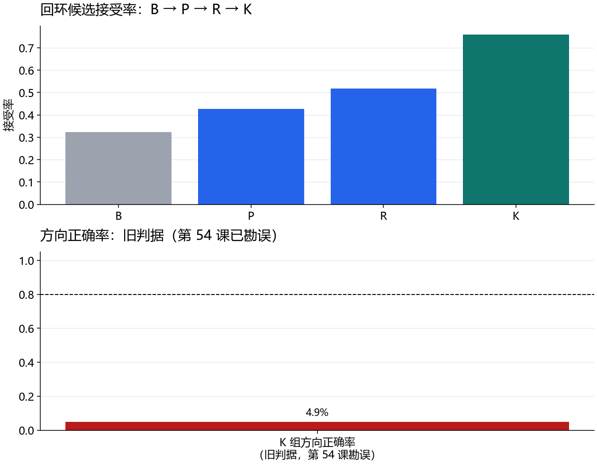

# 第四十九课 · 回环匹配器工程化——量化“正确 vs 伪影峰”的边界

## 把变量、实验和结果连起来

1. **先认变量。**接受率是候选对中有多少通过匹配阈值；方向正确率还要比较估出的相对位姿与评价目标。两者分母和含义不同。锚定、精化、弧长重采样与 top-k 假设先增加能找到的对齐解。
2. **看因果与对照。**108 个候选对上，B/P/R/K 的接受率 0.324→0.426→0.519→0.759，工程改进确实让更多候选通过。但直墙可以沿墙滑出更小残差，单靠几何贴合仍无法可靠判别地点。原记录中的 K 方向正确率 0.049 属旧评价目标；第 54 课证明它把位姿链漂移算进了真值，不应拿来断言匹配器真实正确率只有 4.9%。
3. **接下一课。**第 50 课给候选加形状特征；第 54 课再用正确判据重新量一次方向。阅读本课下文的旧表时，必须带着这条勘误。



> 主线：感知 → 建图 → 导航。第 46 课用宽匹配 CSM+NN-ICP 单假设管住了第一个回环闭合，
> 第 48 课以受控毒化证明“一条坏回环比没有更糟”。本课是匹配器本身：为什么单假设点对点
> 匹配不够；工程化三件套（锚定-抛光、当前帧弧长重采样、top-k 假设）带来什么、带不来什么；
> 以及原预登记主张的实验历史。原“方向退化”判定所用指标在第 54 课勘误；本课应以
> 接受率提升和直墙滑移假峰为当前可用的结论。

## 1. 研究问题

第 46 课 `wide_match` 的关键事实：真峰与假峰残差几乎相同（2.3 vs 2.6 cm——平行墙
退化）。第 45 课帧间匹配接受率 4.6%。本课把“回环候选”放大成 108 个候选对（3 场景 ×
2 圈巡游 × 弧长窗采样），基准化四组匹配器，量化“接受门槛”与“方向正确率”两个指标。

## 2. 基准重建——匹配基准与导航协议的四处差异

在构造基准时发现，第 46-48 课的采集-重放协议有**四处**使扫描匹配基准良定：

| # | 问题 | 证据 | 本课修复 |
| --- | --- | --- | --- |
| 1 | 菱形巡逻（9,9→9,1→1,9→1,1）一圈净旋转 ~71°：返回帧的体坐标系射线与起始帧
  看到的不是同一批墙面，**刚体对齐在几何上不存在**（真值位姿映射把墙面点投到墙外） | 
  真值位姿对齐 median NN = 1.03 m、cov 44% | 封闭正方形巡逻（净旋转 0），
  返回视角与起始一致 |
| 2 | `initial_poses` 的起始航向均匀随机：机器人先转体入线，起始自旋进入“相对旋转”，
  污染回环（θ 差 ~−90° 量级） | est 相对旋转 −95.7° | 起始朝向对齐第一腿（±3° 抖动） |
| 3 | 起始子图 25 帧（~1.2 m）< 候选窗 1.5 m：返回帧的视图在子图覆盖区之外，
  真值峰变浅（0.218）而滑移稳像更深（0.14） | 60 帧后真值 med 0.14-0.23 | 
  子图 60 帧（~3 m），覆盖候选窗 |
| 4 | θ 先验 ±35°（46 课“2%×转角≈14°”假设）：2% 偏航在整圈转向下累积 ~−40°，
  真峰在窗外 | 真峰 θ=−36..−40° | θ 先验 ±50° |

四处的共同教学点：**导航闭环的协议（几何、起始、覆盖、先验）对匹配是否良定具有
决定性影响——第 46 课“回环成功率 0.42”正是这些累积问题的表现，而不是匹配器更差。**

## 3. 工程化三件套与两个副发现

- **锚定-抛光**：多尺度点对点梯子（0.8/0.4/0.2/0.15 m，第 46 课原样）锁定盆地，
  再切点对面 GN 抛光。纯点对面在两直墙/光滑卷上**沿切向滑移**（平面残差≈0 的错位解，
  实测滑 0.56 m）——锚定是抛光成立的前提。
- **弧长重采样**（当前帧）：命中点按射线弧长均匀抽样（缺口>0.45 m 断链）。副发现：
  对**子图**重采样会毁掉多帧点集结构（R/K 两组接受率塌缩到 0），只应作用于当前帧。
- **top-k 假设**：粗网格非极大抑制取 top-5（抑制半径 2 格），逐个精化后按
  中位 NN 距离排序。

坐标系约定（本课明确记录）：匹配器返回的 Δ 是旋转后平移（R(Δθ)p+t）；真值评估目标
是**估计链相对位姿** `t_r−R(Δθ)t_c`（这是位姿图要消费的回环比边），而非真值相对位姿
（两者相差估计漂移——漂移的正确性是 46-48 课的主题）。

## 4. 预登记主张与实测

**读表前先看勘误：**下表保留第 49 课当时的预登记判据与原始计数，便于复核实验历史；其中“方向正确率”的评价目标在第 54 课被证明混入估计链漂移。接受率仍可按原值解读，方向正确率及由它推导的“方向退化成立”不能再作为当前结论。

| 主张 | 判据 | 实测 | 判定 |
| --- | --- | --- | --- |
| ① 采集器 | 108 候选对、每巡游 ≥2 圈 | 3×36=108，laps=2 ✓ | **成立** |
| ② 动机 | B 未过一条验收线 | B 接受率 0.324（≥10%）但方向正确率 0.0（<80%） | **成立** |
| ③ 达成 | K 双线达标（接受率 ≥10% 且 方向正确率 ≥80%） | K 接受率 **0.759** ✓；
  方向正确率 **0.049** ✗ | **如实证伪** |
| ④ 方向退化 | 各组 accepted 中 correct ≤10% | B 0/35、P 0/46、R 3/56、
  K 4/82（全部 ≤5.4%） | **成立** |

接受率阶梯单调（工程化有效）：**B 0.324 → P 0.426 → R 0.519 → K 0.759**；
方向正确率阶梯几乎不动（0.0 → 0.0 → 0.054 → 0.049）。

## 5. 机理：为什么对齐质量做不了判别

对同一批候选的深度分析：

- 真值峰：median NN 0.14–0.23 m、cov 0.87–0.93；
- 滑移稳象峰（接受选中）：median NN **0.10–0.12 m**、cov 0.84–0.89。

**直墙环境下“伪影峰”的刚性对齐质量比真值峰更好**——长直墙提供的滑动不变性加上
差异视角，使得任何基于对齐距离/覆盖率的阈值都选择稳象。这从机制上解释了第 46 课
0.42 的成功率与第 48 课毒化的可注入性：**残差不是方向性的**。

## 6. 结论与边界

- 结论：匹配器工程化提升了“可用候选”的数量（接受率 0.76）；当时的“方向正确率约 5%”
  使用错误评价目标，不能证明工程化没有改善真实方向正确率。直墙滑移造成的假峰仍在，
  需要用修正判据与对齐质量之外的信息继续检验（第 54–55 课）。
- 边界：单一环境（长直墙+墙角）、真值几何产生候选（检测留第 50 课）、估计链组合误差
  会进入子图；四组数值均在本记录的 `aggregates` 中如实入册。

## 勘误（第 54 课，2026-09-09）

本课的「方向正确率」指标（4.9%（K 组））为评估目标伪影：把匹配器的内容对齐输出与 est 位姿差值比较，而 est 位姿差值烤入了估计链漂移（2-9 m），内容对齐原理上不可见漂移。修正判据（隐含位姿 vs 真值位姿）下的重分析见第五十四课（docs/59，results/aniso_env_2026-09-09/）：同协议 ISO 臂修正后 0.722。本课的接受率阶梯、对齐深度（伪影峰深于真值峰）分析不受影响；第 51-53 课结论不受影响（位置误差直接评估）。

## 7. 复现与文件

```powershell
uv run python -m embodied_learning.experiments.matcher_engineering
# 正式记录 results/matcher_engineering_2026-09-08/（summary.json + trajectories.npz + metric_bars.png）
uv run python -m embodied_learning.matcher_engineering_demo --results results/matcher_engineering_2026-09-08
uv run pytest tests/test_session49_matcher_engineering.py -q
```

关键实测数字：采集 3 场景×1 起点×2 圈（7203/7053/7088 帧）；候选 108 对；
K 接受 82/108、正确 4/82；B 接受 35/108、正确 0/35。演示真机自检三模式截图
见 `results/_matcher_engineering_demo_check/`。
