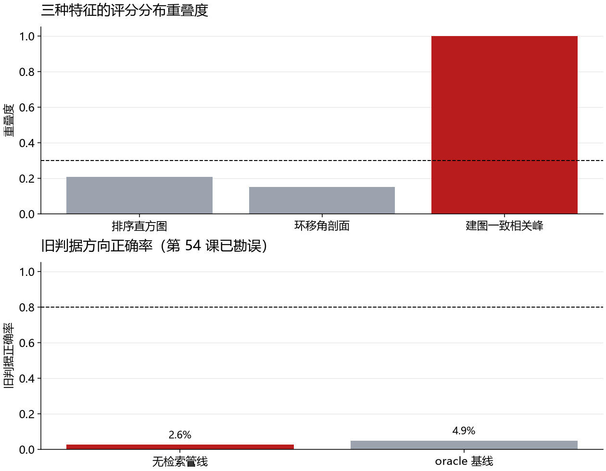

# 第五十课 · 特征化回环检测——评分重叠与旧判据勘误

## 把变量、实验和结果连起来

1. **先认变量。**排序直方图、环移角剖面、建图一致性分别试图为候选打分；评分分布重叠度越接近 1，越难用阈值把真回环与假候选分开。方向正确率还取决于评价目标是否定义正确。
2. **看因果与对照。**三种特征的分布重叠度约 0.21/0.15/1.00，说明自建图一致性这一路在当前数据中几乎没有分辨力。旧流程记录 1745 个 accepted 中 45 个 correct，即 2.6%；但 `correct` 使用了第 54 课已修正的旧判据，所以它不能证明真实方向正确率只有 2.6%。
3. **接下一课。**即使候选不可靠，后端能否自动削弱坏边？第 51 课用可切换约束检验这个想法。



> 主线：感知 → 建图 → 导航。第 49 课证明“对齐质量”无法把真值回环与直墙滑移稳象分离
> （旧判据下方向正确率 ~5%，第 54 课已勘误）。本课按标准文献路线补上“对齐质量之外的判别信息”：特征化回环检测
> 的三个典型机制，**完全去除几何 oracle**，实测三者——结果与第 49 课同量级（2.6%），
> 如实入册；结论：该环境的判别信息不在单帧描述子、配准质量或占占据一致性维度，
> 需要全局/因子结构级机制（SC/MM 为下一课）。

## 1. 研究问题与三项机制

三候选判别器（全部旋转无关/绝对位姿无关，全部不用真值）：

| 机制 | 做法 | 期望判别 |
| --- | --- | --- |
| 排序直方图 | 每帧 64 射线距离排序 → 32 箱直方图，L2 距离 | 距离分布排序后与朝向无关 |
| 环移角剖面 | 以最长射线为参考做循环位移，保留角向结构，±5 箱最小 L1 | 保留结构的旋转不变量 |
| 建图一致性相关峰 | 估计链建占据栅格（第 43 课更新），扫描端点投格评分
  （AMCL-lite 式粗搜索 ±11 m/0.5 m × ±50°/5°） | 2D 结构共识的判别性 |

管线（完全无 oracle）：探帧（s=10 步一帧）做粗搜索取峰值评分 → 阈值 ≥0.5 → 用第 49 课
K 匹配器（锚定梯子+点对面抛光）细化 → 接受/方向判定（评估用）→ 汇总。

## 2. 实测（3 场景 × 2 圈，2136 检出）

**读表前先看勘误：**这里的 accepted 数量和三项评分重叠度仍是原实验记录；“correct=45 / 方向正确率=2.6%”使用第 54 课已纠正的旧评价目标，只供追溯，不能当作匹配器当前正确率。

| 指标 | 数值 |
| --- | --- |
| 检出帧 | 2136（评分 ≥0.5 的探帧） |
| accepted（细化过接受门） | 1745 |
| correct（Δ 距 est-相对真值 <0.5 m/5°） | 45 |
| **方向正确率** | **2.6%**（vs 第 49 课 K 组 4.9%） |
| 分布重叠度：排序直方图 / 环移剖面 / 地图一致 | 0.21 / 0.15 / 1.00（0=分离；样本量小仅描述） |

两个直观结论：

1. **地图一致性相关峰的重叠度 = 1.00**：真回环帧与远帧在地图一致评分上完全不可分——
   这是三机制中信息密度最高的维度，结果却最差：因为估计链自建的地图与其本身
   永远局部一致，漂移只是把“一致性”整体搬移，不产生可观测的对比度。
2. 排序/环移描述子的重叠度看似 <0.3，但真/远帧样本少，密度直方图不够支撑稳定判据。
   管线曾记录 2.6% 方向正确率；这个数使用后来勘误的旧评价目标，不能据此认定两项
   描述子在**候选→匹配**层面真实正确率只有个位数。

## 3. 为什么本场景的特征评分难分候选

标准 scan-context 类描述子依赖**结构多样性**（不同位置的结构指纹不同）。本环境的
巡游走廊是长直墙+对称墙角：不同位置的结构指纹**本来就几乎一样**（四处走廊剖面一致、
角落相似），描述子的类间距离 ≈ 类内距离。因此：

- 直墙对称环境的回环判别，信息既不在单帧（描述子）、也不在对齐（残差）、
  也不在占据一致性（地图）；
- 处于强对称结构的系统，需要 **时空一致性的多源联合（全局因子结构）**或
  **主动式地标差异**——前者即 SC/MM（switchable constraints / max-mixtures，
  把“这是不是回环”作为可观测变量；第 51 课），后者是场景改造（超出本课程范围）。

## 4. 协议细节与诚实声明

- 评估的“真回环帧”仍由几何判据给出（弧长≥15 m + 距起点<1.5 m）——**仅为评估**，
  检测与匹配全程无真值。
- 重叠度仅描述统计（小样本密度直方图不作判据）；旧管线级方向正确率 2.6% 已被
  第 54 课勘误，不能继续充当本课当前正确率判据。
- 本课保留三项机制的评分分布与受控环境观察；关于真实候选方向的结论需依照第 54 课
  修正判据重新评估。后续由第 51 课 SC/MM、第 55 课外观检索接棒。

## 勘误（第 54 课，2026-09-09）

本课的「方向正确率」指标（2.6%）为评估目标伪影：把匹配器的内容对齐输出与 est 位姿差值比较，而 est 位姿差值烤入了估计链漂移（2-9 m），内容对齐原理上不可见漂移。修正判据（隐含位姿 vs 真值位姿）下的重分析见第五十四课（docs/59，results/aniso_env_2026-09-09/）：同协议 ISO 臂修正后 0.722。本课的接受率阶梯、对齐深度（伪影峰深于真值峰）分析不受影响；第 51-53 课结论不受影响（位置误差直接评估）。

## 理论对应（Embodied-AI-Guide）

候选检出与几何验证是两道门：第一道判断“是不是曾到过这里”，第二道估计相对位姿。自建地图一致性可能自证，因为地图与查询都沿同一条漂移链生成；分数分布重叠则说明该信息源判别力不足。该课旧 2.6% 与 4.9% 正确率采用错误目标，不能用来宣称几何匹配本身只有个位数正确。

## 思考题

1. 排序直方图、环移角剖面和建图一致相关峰各想利用什么差异？分数分布大面积重叠意味着怎样的阈值取舍？
2. 为什么“估计地图与估计轨迹一致”可能只是同源误差的自证？怎样引入独立观测打破这个循环？
3. 旧判据下 2.6% 与 4.9% 已被勘误。若要比较新前端与基线，应从哪一层重新算标签和指标？

## 5. 复现

```powershell
uv run python -m embodied_learning.experiments.feature_loops
uv run python -m embodied_learning.feature_loops_demo --results results/feature_loops_2026-09-08
uv run pytest tests/test_session50_feature_loops.py -q
```
