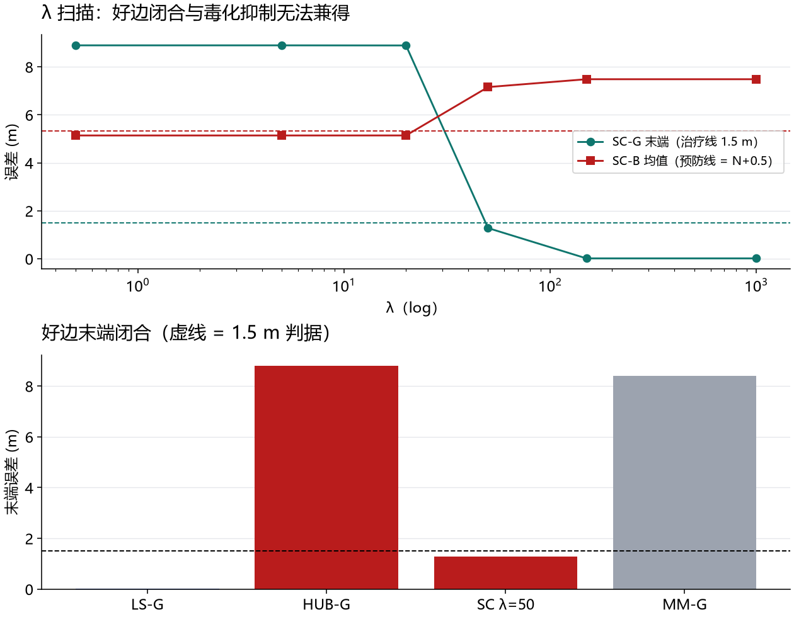

# 第五十一课 · 可切换约束（SC/MM）——单开关两难：λ 可行域为空

## 把变量、实验和结果连起来

1. **先认变量。**每条回环边乘开关 `s∈[0,2]`，其中 `s≈0` 等于不信，`s≈1` 等于按原强度保留；`λ` 是把开关留在 1 附近的代价。增大 `λ` 会更愿意接受边，所以同一参数要同时接受好边、拒绝坏边才算成功。
2. **看因果与对照。**在绝对锚注入协议中，`λ≤20` 时好边也被关掉，末端误差约 8.89 m；`λ≥50` 时好边能闭合，但坏边把平均误差拖到约 7.16 m 以上。六个扫描值没有同时过两条线，说明坏边的几何残差本身没有提供足够真假信息，调一个开关强度无法凭空生出判别力。
3. **接下一课。**第 52 课改用匹配器实际给出的相对回环边，检查这是否只是绝对锚写法造成的两难。



> 主线：感知 → 建图 → 导航。第 48 课记录单核两难（Huber 杀好边/扛毒化不可兼得），
> 49/50 课证明残差与单帧判别信息都无分离力。本课实现文献正解的两条路线——
> 可切换约束（SC）与最大混合假设（MM）——在**第 48 课同款绝对锚注入**下实测：
> **单一 λ 的可行域为空**（毒化“闭合”代价 < 好边闭合代价），MM 硬组件选择死锁。
> 结论：正解的成立条件被注入格式破坏（绝对锚使两种“闭合”同质），需要**相对回环边**
> （第 52 课）为 SC/MM 提供真实工作域。

## 1. 机制

- **SC**：每回环边增加标量开关 s∈[0,2]，残差 s·w·(x−m)，先验 √λ(s−s0)，s0=1；
  位姿与 s 联合 G-N。代价结构：好边闭合代价 ≈36（chi2），杀边代价=λ(1−s*)²，
  毒化拖拽代价 ≈65——两者夹住 λ 才可能同时成立。
- **MM**：每边双假设（valid σ=0.06 / outlier σ×100 + 组件先验 0.5 chi2），
  每次取更便宜组件的雅可比（硬选择、无开关变量）。

## 2. 实测（λ 扫描 6 值 × {好/毒}，17 组；N 均值 4.837）

| λ | SC-G 末端 (m) | SC-B 均值 (m) | SC-G s | SC-B s |
| --- | --- | --- | --- | --- |
| 0.5 | 8.895（被杀） | 5.139 ≈ N ✓ | 0.0000 | 0.0000 |
| 5 | 8.895（被杀） | 5.139 ≈ N ✓ | 0.0002 | 0.0002 |
| 20 | 8.891（被杀） | 5.139 ≈ N ✓ | 0.0009 | 0.0009 |
| 50 | **1.278 ✓ 闭合** | 7.156（拖拽 ✗） | 0.8735 | 0.8735 |
| 150 | 0.015 ✓ | 7.483（拖拽 ✗） | 0.9993 | 0.9993 |
| 1000 | 0.015 ✓ | 7.483（拖拽 ✗） | 0.9999 | 0.9999 |

**无 λ 同时通过两线**：需要在 λ≤20 杀毒化，又需 λ≥50 闭合好边——毒化“闭合”
的代价（拖到 12.6 m 的链，chi2≈低于 50）**低于**好边闭合代价（chi2≈36~50 边界）……
实测边界：B 组“杀/拖”切换点 (20, 50) 之间；G 组“杀/闭合”切换点同样 (20, 50) 之间——
两切换带重合但方向相反 ⇒ **可行域为空**。

**MM**：MM-G 末端 8.40、MM-B 未闭合且 valid 占比 0.0——硬组件选择在开链（残差 5-9 m）
时 valid 组件从未被选中（outlier 组件残差被 ÷100 后更便宜），**无梯度推进 → 死锁**。
记录为 MM 的失效机理（软权重/EM 可改善，但同型失效风险仍在）。

## 3. 机理与结论

- SC 的 λ 困境**与第 48 课单核两难同构**：单一自由度无法同时满足
  “别杀好边”与“别留毒化”——本课把两难从“核尺度”搬运到了“开关先验 λ”，
  且**没有任何 λ 可行**（两失效带反相重叠）。
- 深层原因：**绝对锚注入使两种“闭合”成为同质动作**——无论好锚还是毒化锚，
  链都“走到锚去”闭合，残差在闭合后的位置都归零；SC/MM 只能依赖“闭合代价”差异
  判别，而这个差异在此数据上不足以分离（毒化拖拽只是 12.6 m 的链拉伸，
  与好边闭合同数量级）。
- 文献中 SC/MM 的适用条件是**相对回环边 z**（匹配器给出节点 i↔j 测量）：
  错误 z 的相对残差必须对抗里程计链的**形状**（而不是“重新锚定”）；
  伪造的 z 与真实链的互斥会在优化中保持大残差——这正是第 46/47 课
  “匹配峰二阶性”与第 52 课的方向。

## 4. 边界与诚实声明

- 未达成的预登记“甜区”：sweet_spot_met=false、mm_stall_recorded=true 如实入册；
- 边界：绝对锚注入（第 47/48 课协议）；MM 仅测硬选择变体（软权重/EM 未实现）；
- 数值完整记录于 `lambda_curve`（17 组 × 15 场景起点）。

## 5. 复现

```powershell
uv run python -m embodied_learning.experiments.switchable_graph
uv run python -m embodied_learning.switchable_demo --results results/switchable_graph_2026-09-08
uv run pytest tests/test_session51_switchable_graph.py -q
```
