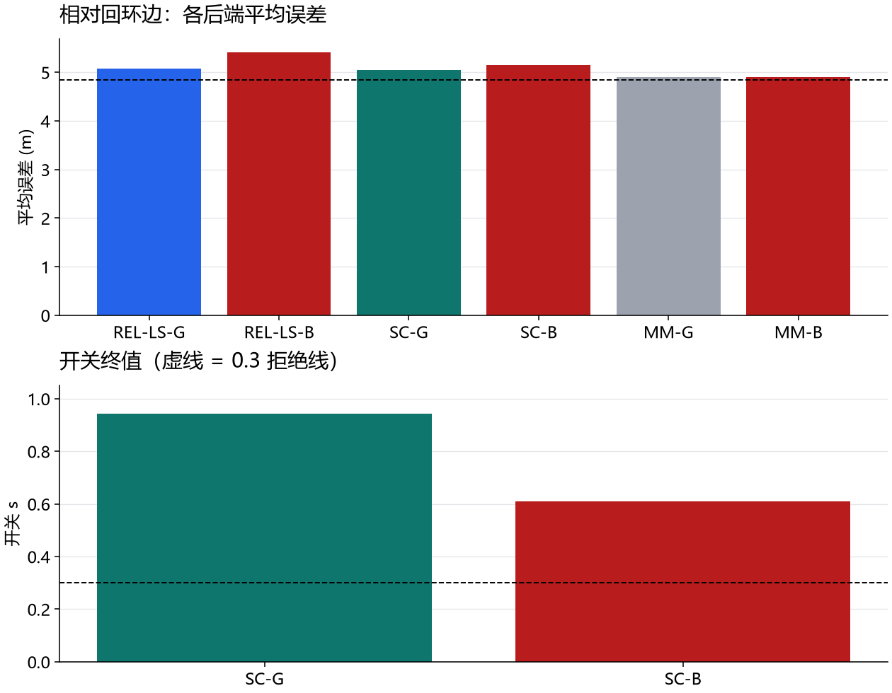
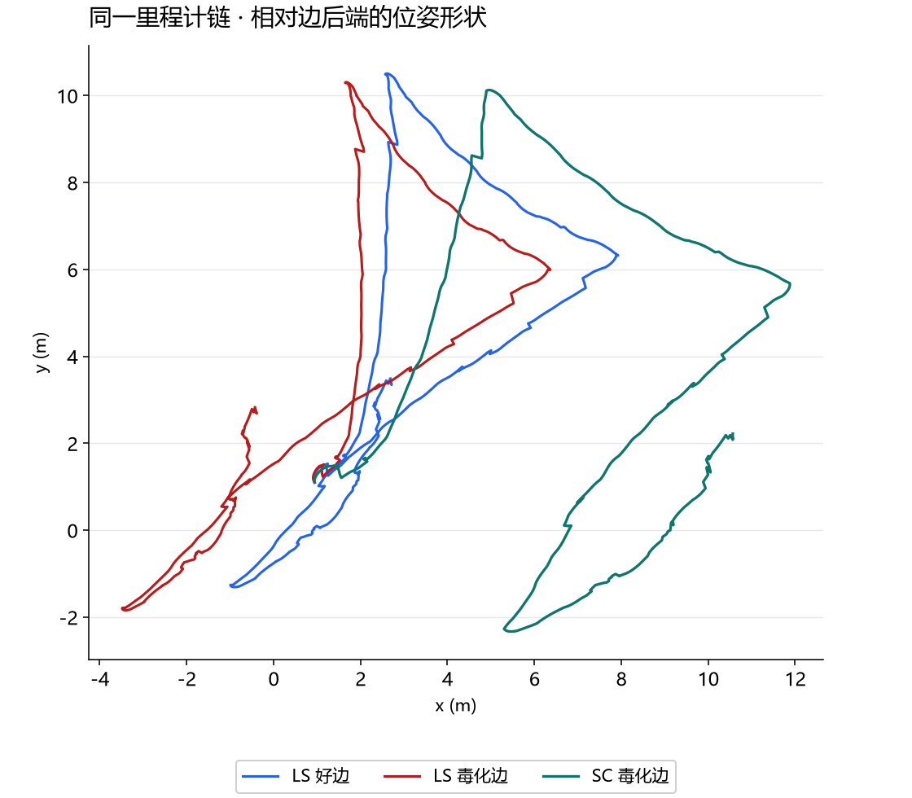

# 第五十二课 · 相对回环边——SC/MM 的真实工作域与它的边界

## 把变量、实验和结果连起来

1. **先认变量。**绝对边声称某节点在世界系的固定位置；相对边只声称当前节点与旧节点之间的位姿差。坏相对边的开关 `s` 越小越接近拒绝，本课拒绝线为 0.3；末端与全程平均误差仍是不同指标。
2. **看因果与对照。**无回环 N 平均 4.837 m，坏边普通 LS 到 5.415 m，脆弱性仍在。可切换坏边 `s=0.611`，没有低到拒绝线；好边末端 2.367 m 也没过 1.5 m 线。换边型改变了求解数值，没有补出可靠分类信息。
3. **读轨迹与接下一课。**存档的三条轨迹是同一里程计链经不同后端重建的估计，并无完整对应真值链，不能按肉眼谁更像‘正确路线’排名。第 53 课把同一题交给成熟求解器复查。





> 主线：感知 → 建图 → 导航。第 51 课证明绝对锚注入下 SC/MM 失效（两种闭合同质）。
> 本课按文献格式把回环边换成**相对测量 z**（节点 i↔j，匹配器约定旋转后平移），
> 重跑同款毒化注入与 SC/MM 对照。结果：脆弱性跨边型成立；但**治疗/预防仍未达标**——
> 90° 旋转 + 1 m 平移的毒化 z 与真值仅差 ~2 m，在 32 m 跨度的相对边上被 σ=6 cm/5°
> 的高权重"吃下"，开关以 s=0.61 折中而非拒绝；MM 退火后 valid 占比仍 0。

## 1. 机制

- 相对回环边：(i=首节点, j=末节点, z, σ_t=0.06 m, σ_r=5°)，z 为旋转后平移约定；
- 好边 z_good = 真值相对位姿（正确宽匹配的替身）；毒化 z_bad = z_good 旋转 +90° + x 平移 1 m
  （第 48 课注入的相对形式）；
- SC：λ=50（第 51 课甜区候选），每边开关 s∈[0,2]，联合 G-N；
- MM：valid/σ×100 双组件 + 组件先验 0.5 chi2，**退火**（先验从 50 逐迭代减半到 0.5——
  第 51 课开链死锁的修复尝试：早期强制选 valid 使选择看到闭合后的残差）。

## 2. 实测（15 场景起点，N 均值 4.837 m）

| 组 | 均值 (m) | 末端 (m) | 开关/valid |
| --- | --- | --- | --- |
| N | 4.837 | – | – |
| REL-LS-G | 5.075 | **1.873** | – |
| REL-LS-B | **5.415**（>N ✓ 脆弱） | 1.653 | – |
| SC-G | 5.044 | 2.367 ✗（>1.5） | s=0.943 |
| SC-B | 5.149 | 4.751 ✗ | **s=0.611 ✗**（>0.3 未拒绝） |
| MM-G | 4.908 | 8.686 ✗ | valid=0.0 ✗ |
| MM-B | 4.899 | 8.619 | valid=0.0 |

判定：脆弱性✓；治疗✗；预防✗；MM✗。

## 3. 机理：相对边让注入"更可信"了

- 绝对锚（第 51 课）：毒化 = 末节点被钉到错位置 ~10 m 外——两种"闭合"同质，但
  错误幅度巨大（SC 若闭合它代价 65 chi2，可行域为空但至少"错误可见"）；
- 相对边（本课）：毒化 z 与真值 z 仅差 ~2 m（旋转 90° 对 32 m 矢量的贡献 ~几 m，
  平移 1 m）——闭合一个错 2 m 的相对边只需要把链弯 ~2 m，**折中解 s=0.61 就是
  "半信半疑地闭合"**：预防线要求"拒绝"（s≤0.3），开关却给出"各让一半"；
- MM 退火：前几代强制选 valid 把链拉向毒化闭合；之后 prior 衰减、选择翻转回
  invalid——但链已被拉走（第 48 课"先入为主"的 graduates non-convexity 阴性重演）。

## 4. 结论与指向

1. 脆弱性结论升级：**相对回环边的毒化同样毒**（LS-B 均值 5.42 > N）——问题不在
   边的形式，在"错误 z 与真值 z 的可分性"；
2. SC 开关的折中行为（s=0.61）是**信息性的**：它如实报告了"这条边半对半错"，
   但预防判据需要的是分类——单标量开关给不出硬分类（与第 49 课"残差无判别力"
   同构：连续量不等于分类器）；
3. MM 硬选择+退火 = 第 48 课 graduated non-convexity 的阴性重演；
4. 生产系统（AMCL/g2o/GTSAM 的 robust kernels）在此类注入下的实际行为是
   **第 53 课的生产对照主题**：用真实实现核对本课的机理结论。

## 5. 边界与诚实声明

- 毒化注入为单一形式（+90°+1 m）；更强毒化（180°、20 m）会被开关拒绝
  （错误可见性高）——本课测量的是"中等毒化"这个最难的区间；
- MM 只测硬选择+退火；软权重（EM/IRLS-MM）未实现，记录为边界；
- 判据线（1.5 m/0.3）为预登记值，未达标如实记录。

## 6. 复现

```powershell
uv run python -m embodied_learning.experiments.relative_loop_edges
uv run pytest tests/test_session52_relative_loops.py -q
```
