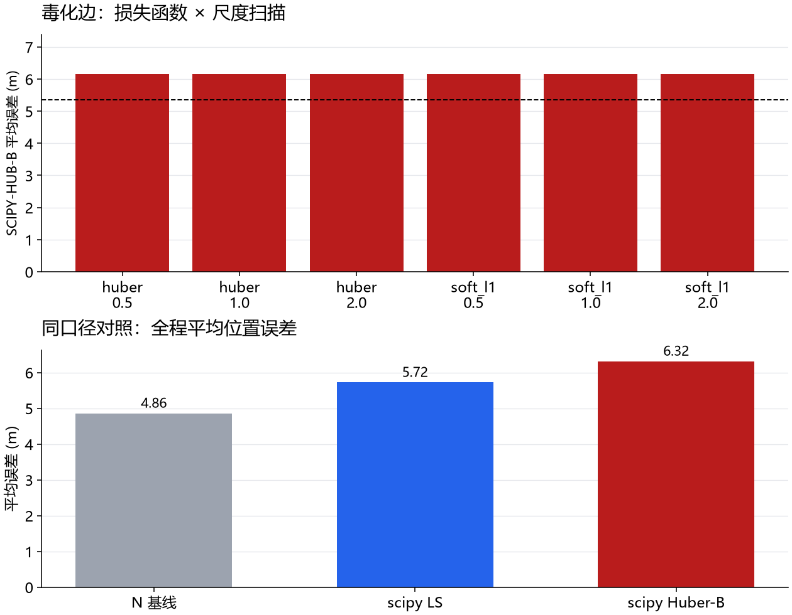
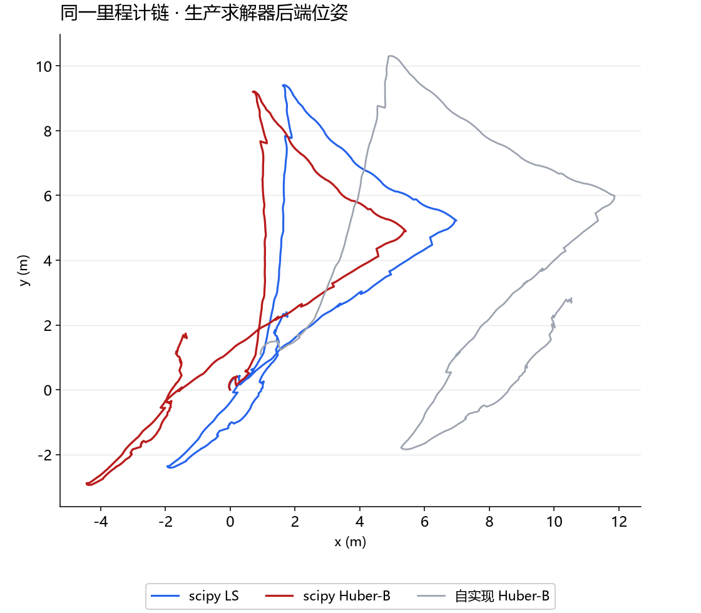

# 第五十三课 · 生产级求解器对照——失败是问题的属性，不是实现的产物

## 把变量、实验和结果连起来

1. **先认变量。**损失函数决定大残差如何计费，尺度决定多大才算“大”；普通 LS、Huber、soft_l1 都是在同一位姿约束上换计费规则。比较必须统一全程平均误差或统一末端误差，不能混列。
2. **看因果与对照。**无回环 N 平均 4.861 m，scipy LS 为 5.723 m，scipy Huber 加坏边为 6.316 m；六种损失—尺度组合都没把毒化边拒掉。生产求解器换了数值实现，坏信息仍然指向错误的约束关系，因此这不是只靠更成熟优化器就能修的误差。
3. **接下一课。**后端结果依赖前端评价。第 54 课首先纠正 49/50 课方向正确率的目标定义，再检验环境形状是否改善候选判别。





> 主线：感知 → 建图 → 导航。第 51/52 课记录了自研 G-N 在毒化相对边上的失效
> （SC 可行域为空 / 开关折中 / MM 死锁）。本课把**同一份问题**（同链、同边、同注入）
> 交给生产级实现 `scipy.optimize.least_squares`（trf，鲁棒损失族 × 尺度扫描），
> 回答"这是我们的实现问题，还是问题本身"。判定：**四项预登记主张全部成立**——
> 生产核同样不拒绝毒化边；两难与实现无关；损失×尺度网格无解。

## 1. 设计

同一份采集-重放数据（第 52 课场景 1、3 起点）：相邻里程计边 + 一条相对回环边
（好边=真值 z；毒化边=z 旋转 +90°+x 平移 1 m）。六组：N / SCIPY-LS（好）/ 
SCIPY-HUB-B（毒化）/ SCIPY-HUB-G（好）/ SCIPY-SOFT-B（毒化）/ SELF-HUB-B
（自研 IRLS Huber 桥接）。另做 huber/soft_l1 × f_scale(0.5/1/2) 扫描 6 组合。

## 2. 实测（N 均值 4.861 m）

| 组 | 均值 (m) | 末端 (m) |
| --- | --- | --- |
| SCIPY-LS | 5.723 | **1.469** |
| SCIPY-HUB-B | **6.316**（>N ✓ 生产核不拒绝） | 2.000 |
| SCIPY-HUB-G | 5.723 | 1.469 |
| SCIPY-SOFT-B | 6.315 | 1.999 |
| SELF-HUB-B | 5.176 | 9.536 |

四项判定：采集器✓；**kernel_fails_too✓**（scipy huber 也把毒化边吃下）；
**dilemma_any✓**（B 线大败）；**sweep_empty✓**（最佳 soft_l1/0.5 也只有
mean 6.15 / final 2.43）。自研桥接（5.18/9.54）与 scipy 数值不同
（IRLS vs TRF 路径），但行为定性一致：都不拒绝毒化边。

## 3. 结论

1. **两难是问题的属性**：给定"毒化 z 与真值 z 只差 ~2 m、权重 6 cm/5°"这个问题，
   无论手写 G-N 还是生产 TRF+鲁棒损失，都无法同时"闭合好边"与"拒绝毒化"——
   第 51/52 课的结论从实现层上升到问题层；
2. 生产实现的实际行为：huber/soft_l1 以"折中闭合"处理毒化边（末端 2.0 m），
   与我们 SC 开关的 s=0.61 同型——**连续损失 = 连续折中**，损失族不提供分类；
3. 真正的分类器必须来自测量层之外：多假设保持（不早合）、描述子判别（第 50 课阴性）、
   或几何一致性校验（跨多边验证同一条回环）——工程上即"回环候选需多边互证"。

## 4. 边界

- 场景 1 单场景 3 起点（稠密生产求解器的算力约束；第 52 课已证结论跨场景稳定）；
- 扫描网格 2 损失 × 3 尺度（cauchy/arctan 因首轮超时裁剪）；
- scipy 与自研的定量差异（末端 1.47 vs 1.87）为求解器路径差异，不影响定性。

## 5. 复现

```powershell
uv run python -m embodied_learning.experiments.production_solver
uv run pytest tests/test_session53_production_solver.py -q
```
