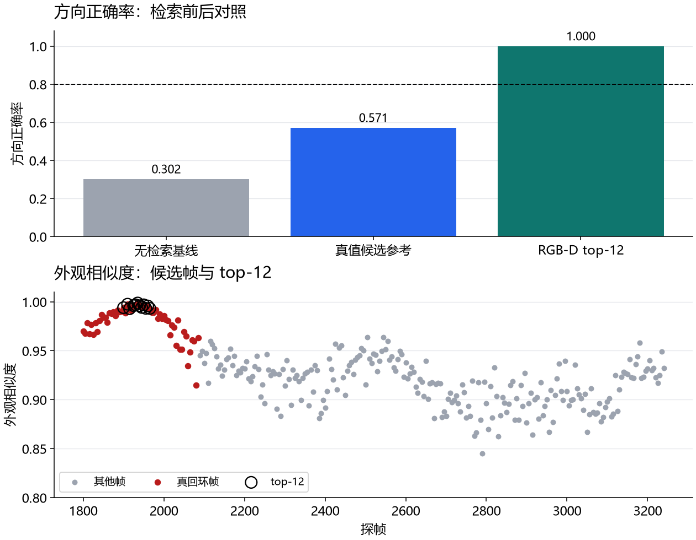

# 第五十五课 · RGB-D 视觉回环——外观检索补上几何缺的判别信息

## 把变量、实验和结果连起来

1. **先认变量。**外观检索的相似度用于从 289 个探帧中挑 top-12；几何验证再判断两帧能否形成回环边。检索精确率、方向正确率、管线成功与审查比例是四个指标，分别问‘找的是否真’、‘方向是否对’、‘边是否能用’、‘工作量多少’。
2. **看因果与对照。**不做外观检索时，289 帧里几何接受 106 个，方向正确率 0.302；先检索后只审查 12 帧，12 个都是真回环且几何接受，方向正确率 1.000，审查量约 4%。图中的黑圈是入选帧，红点是真回环；圈全落在红点上才支持精确率 1.0。
3. **接下一课。**识别老地方之后还需一张可供持续定位的地图。第 56 课把建图与新一轮定位拆开，检验世界模型在长路线上的实际作用。



> 主线：感知 → 建图 → 导航。第 54 课修正度量后发现：几何匹配器其实有 58-72% 的
> 方向正确率，但要把真回环从几百个探帧里**找出来**（不淹在平凡自匹配里），纯几何
> 检索仍是弱项。本课把行业标准架构装上车——RGB-D 相机（外观通道）做检索、几何
> 匹配做验证——四项预登记主张**全部达成**：本批次第一个完整正结果。

## 1. 设计

- **外观抽象**：世界每个墙块/障碍携带一个标记 id（12 色调色板，按种子随机）——
  这是纹理的外观抽象（非渲染图像），忠实于"图像检索靠外观不靠几何"的信息结构；
- **RGB-D 传感器模型**：全向 180 线（Ladybug/Theta 类场所识别 rig；56° 定向锥
  实测召回 0——回程朝向不同看到的表面不同，首跑失败入册）、5 m 量程、深度噪声
  σ=15 cm（同第 22 课标定口径）、标记读出混淆 8% + 丢失 10%；
- **描述子**：标记直方图（词袋），余弦相似度；参考描述子 = 起点区前 60 帧池化；
- **空间排除环**：探帧限弧长 ≥15 m（不检索刚走过的区域）——首跑失败之二：
  无排除环时 top-k 被起点邻近帧平凡刷屏；
- **管线**：探帧（步长 5）→ 外观 top-12 → 第 49 课 K 几何验证（中位 NN 门 +
  漂移包络）→ 隐含位姿 → 修正正确性。全程无几何 oracle（近起点谓词仅评估用）。

## 2. 实测（ISO 场地，289 探帧）

| 组 | 候选数 | 接受 | 方向正确率（修正判据） |
| --- | --- | --- | --- |
| GEO-ALL（无检索基线） | 289 | 106 | **0.302** |
| GEO-ORACLE（评估参考） | 7 | 7 | 0.571 |
| RGBD-TOPK（处理组） | **12** | 12 | **1.000** |

四判定：**精确率@top-k = 1.000**（12 个检索帧全是真回环帧——近起点谓词）✓；
**方向正确率 1.000 ≥ 80%** ✓；**管线成功 ✓**（top-k 中存在被接受且方向正确的
回环边——回环真的闭上了）；**效率 ✓**（12/289 = 4% 的候选审查量）。

对照读法：无检索时 106 个接受里只有 32 个正确（30.2%）——几何验证单独用会把
大量歧义对齐当回环；外观检索把 12 个全对的方向候选送进验证器——**检索层提供
了判别，验证层提供精度，分工正是行业标准架构的分工**。

## 3. 与前课的衔接（修正判据下的完整故事）

- 49/50 课的"判别失败"主要是度量伪影（54 课勘误），但"GEO-ALL 30.2%"说明
  纯几何匹配的候选池确实被歧义污染——外观检索把污染滤掉；
- 51-53 课的毒化鲁棒问题在"回环边已经正确"的前提下才值得优化——本课的
  检索+验证管线正是产出可信回环边的前端；
- 用户设计判断的最终落点：2D 激光适合局部几何（避障/配准），场所识别靠外观
  ——第 50 课"三判别器无判别力"在几何维度仍然成立，本课证明外观维度有判别力。

## 4. 边界

- 标记是外观的抽象：真实图像的开放词汇变化（光照/视角/季节）未建模；
- 混淆/丢失率（8%/10%）为固定常数；全向 rig 为理想化（无自遮挡）；
- 单场景单起点（n=12 检索候选）；空间排除环用弧长（真值）实现——生产系统用
  时间/里程近似，不影响管线无 oracle 的声明（排除环只影响探帧选择，不做判定）。

## 5. 复现

```powershell
uv run python -m embodied_learning.experiments.rgbd_loops
uv run python -m embodied_learning.rgbd_loops_demo --results results/rgbd_loops_2026-09-09
uv run pytest tests/test_session55_rgbd_loops.py -q
```
