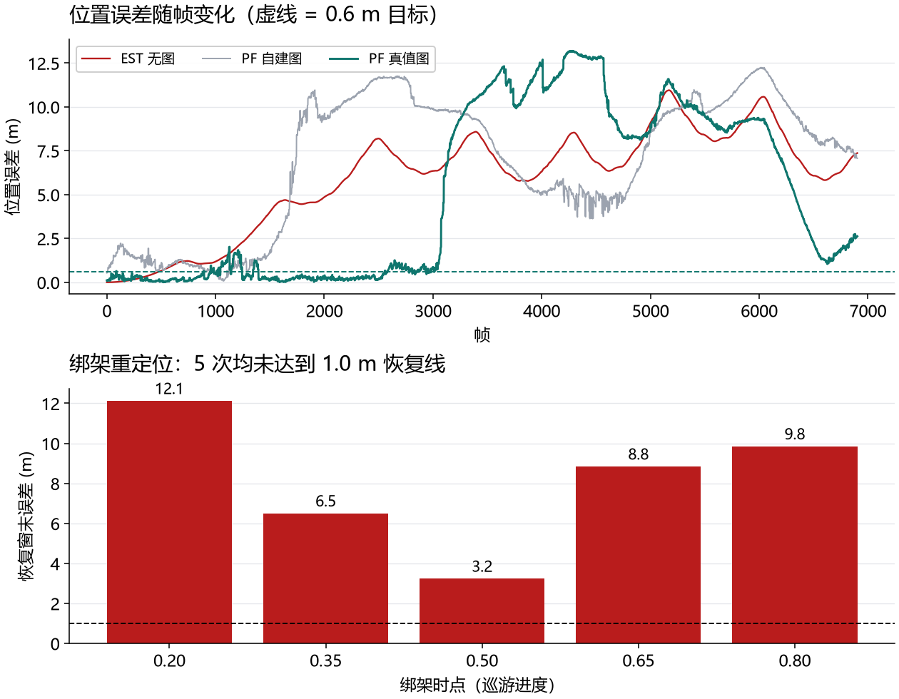
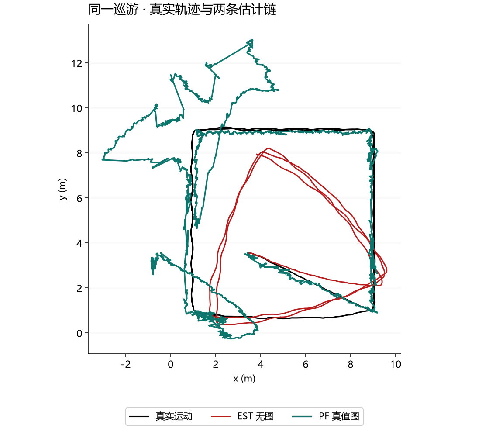

# 第五十六课 · 建图-定位分离——末端改善，途中仍有大偏差

## 把变量、实验和结果连起来

1. **先认变量。**建图阶段用估计位姿给占据格与标记图落点；定位阶段的粒子 `PF` 各自提出一个可能位姿，用里程计移动预测，再用地图和当前观测打分、重采样。`EST` 是无图累积推算，`PF-TRUEMAP` 用优质图，`PF-SELFBUILT` 用自身建的图；这三组不能混称‘同一个 PF’。
2. **看因果与对照。**无图组平均/末端误差 5.931/7.367 m，优质图组 5.084/2.624 m，说明地图改善了这一轮终点；但优质图组途中峰值 13.19 m，高于无图组 10.95 m，不能说全程有界或一直贴近真值。自建图组平均 7.380 m、地图命中率仅 0.23，说明建图时的位姿漂移会把图涂错，再反过来伤害定位。
3. **看失败边界。**五次绑架重定位 0/5；稀疏标记、方形对称和 400 粒子不足共同限制全局找回位置。末端改善、途中大偏差和重定位失败必须一起报告，才是这一课完整结论。





> 主线：感知 → 建图 → 导航的收官一课。43 课建了图（只喂规划）、46-55 课做了无图
> 回环、54 课修了度量、55 课加了外观——本课把它们拼成生产 SLAM 的标准形态：
> **建图与定位分离**。结果混色：世界模型的价值得到实证（末端误差 7.37 → 2.62 m，
> 2.8×），但预登记的"0.6 m 有界"与"绑架重定位 ≥4/5"未达成——两个失败都有明确的
> 机理解释，如实入册。

## 1. 架构

- **阶段一（建图）**：真值受控巡游一圈，机器人用**自己的估计位姿**建图——
  占据栅格（第 43 课机器，首圈帧 + 双遍更新）+ **标记图**（0.5 m 粗格直方图，
  按观测位姿涂色——"站在哪会看到什么标记"，第 55 课外观层）；
- **阶段二（定位）**：新噪声实例的第二条巡游，**粒子滤波（AMCL 式，400 粒子）**
  对自建图定位：里程计传播 + 似然场测量（距离变换预计算，Thrun 教材 6.4 节）
  + ESS 重采样；
- **绑架试验**：5 个时点把真值切到建图巡游的真实路径上（跨流绑架——刚性平移
  整条剩余路径不可行，实测全部撞墙，入册）；绑架后观测重新合成（新位置射线投射
  + 噪声），ESS 塌塌触发表观重seed（多航向）。

## 2. 实测（修正判据；EST = 无图漂移链）

| 指标 | EST（无图） | PF-TRUEMAP（优质图） | PF-SELFBUILT（自建图） |
| --- | --- | --- | --- |
| 平均误差 (m) | 5.931 | **5.084** | 7.380 |
| 末端误差 (m) | 7.367 | **2.624** | — |
| 图命中率 | – | – | 0.23（首圈+双遍） |

判定：采集器✓；**末端误差部分改善**——末端 2.62 m（2.8× 改善），但均值 5.08 m
未达预登记目标，途中峰值 13.19 m 高于 EST 的 10.95 m；**绑架重定位 0/5 如实证伪**。

## 3. 世界模型的价值与边界（本课的核心知识）

**成立的一半**：在本次巡游中，优质图 PF 的末端误差从 EST 的 7.37 m 降到 2.62 m，
平均误差从 5.93 m 降到 5.08 m。地图观测有时能把偏离的粒子拉回，但这只是部分路段的
现象：PF 途中峰值达到 13.19 m，甚至高于 EST 的 10.95 m。因而不能据这轮数据声称
“误差已被图约束为有界”或“PF 全程贴着真值”。二维轨迹图应与逐时误差图一起读。

**失败的一半及机理**：
1. **均值未达线**：直墙走廊的沿墙滑移让 PF 在无特征段偏离——
   与第 49 课"沿墙滑移"同源；本轮还有更大的短时误差峰值，不能称为全程有界；
2. **绑架重定位 0/5**：三个叠加原因——标记图稀疏（94/400 格有数据）、方形场地
   的 4 重对称（90° 歧义位形）、400 粒子不足以全局搜索。生产系统的答案是
   **更密的图 + 更多粒子 + 更丰富的描述子**（视觉词袋/深度学习描述子）；
3. **SLAM 鸡生蛋的实证**：自建图命中率仅 0.23（建图位姿自身带漂移，图被涂抹）
   ——用漂移链建的图反过来限制基于图的定位。**图的质量是定位的上限**；
   生产系统用带回环闭合的完整 SLAM 建图（46-52 课的链正是建图阶段的回环件）。

## 4. 本课的工程教训（全部实测入册）

- **似然场 > 射线步进**：距离变换预计算 + 端点查表，对图离散化宽容且快
  （射线步进版对图穿透脆弱、权重无判别力——wmax 0.003 的游走实测）；
- **测量似然尺度必须贴合噪声+量化**（0.3 m 钝尺度 = 无判别）；
- **观测射线与预测射线的角度必须逐一对齐**（linspace 子采样的不规则间隔
  曾让正确位姿的残差也是噪声级）；
- **PF 传播噪声按运动比例放大**（AMCL 标准调参：云的展布要可比于似然锐度）；
- **PF 盲初始化不可行**（400 粒子覆盖不了 78 m²）——起始位姿已知是前提；
- **标记图按观测位姿涂色**（按端点涂色会把重定位粒子种进墙里）；
- **绑架的跨流模型**：刚性平移剩余路径必然撞墙；"被搬到另一条真实路径上"
  物理自洽且可行。

## 5. 停止点

地图构建探索线到此闭环：**建图（43）→ 无图盲对齐极限（49-53）→ 度量勘误（54）
→ 外观检索（55）→ 建图-定位分离与鸡生蛋实证（56）**。开放方向（未排期）：
 richer maps / 更强描述子的绑架重定位；Nav2 AMCL 生产对照（WSL 需装 nav2）；
动态环境下的地图维护。

## 6. 复现

```powershell
uv run python -m embodied_learning.experiments.map_localization
uv run python -m embodied_learning.map_localization_demo --results results/map_localization_2026-09-09
uv run pytest tests/test_session56_map_localization.py -q
```
