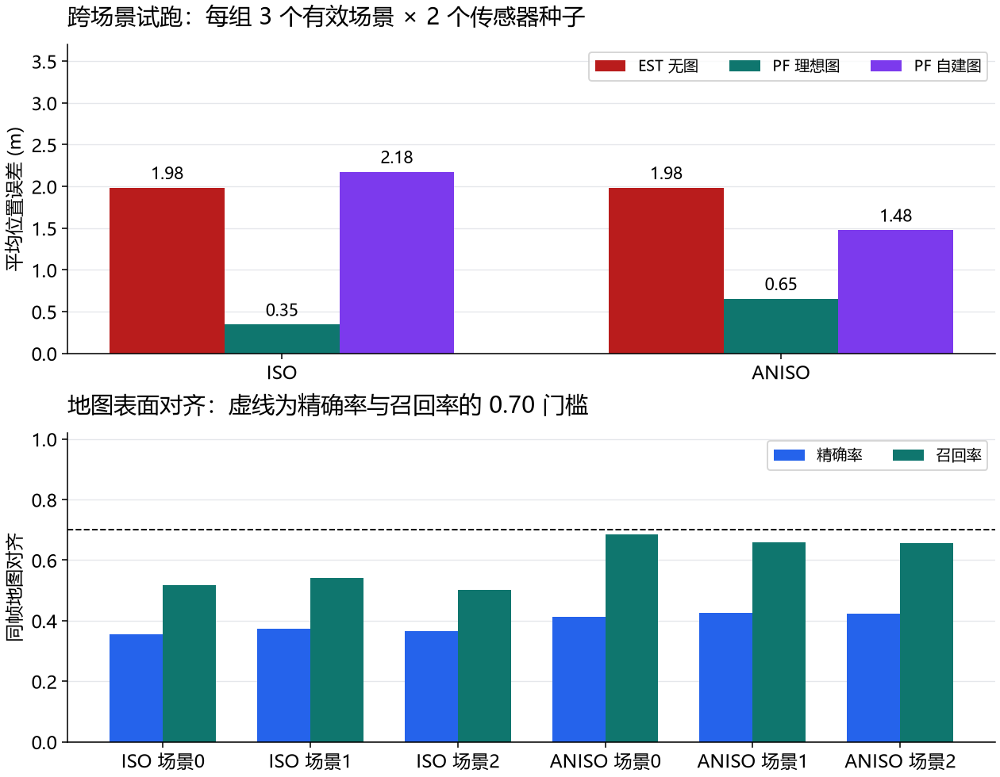

# 二维导航集成基准 · 从单场景结论走向跨场景复验

这是一份**第 56 课之后的综合基准**，不是第 57 课。先让建图和定位在多个场景中成立，再把定位接到自主导航。当前只完成第一轮配对试跑，预定过门条件**未通过**。

## 变量怎样影响结果

- `world_seed` 决定场景障碍，是独立场景单位；同场景的多个帧不能冒充多个独立样本。
- `sensor_seed` 改变定位观测噪声和粒子滤波随机性；同一场景的两次运行应成对读，不能只挑最好的一次。
- `arm` 为 ISO 方墙或 ANISO 不规则墙；两组各自统计有效场景、无效采集和定位表现。
- `EST` 用车轮里程计，不使用地图。三个 PF 输入分别为理想占据图、同一批激光按真值位姿投影的图、同一批激光按估计位姿投影的自建图。这样既能看到理想几何是否有用，也能把地图落点误差从激光数据差异中分离出来。
- 地图对齐精确率/召回率以同帧真值位姿投影图为参考，允许两个栅格（0.30 m）偏差；定位用全程平均和第 95 百分位位置误差，不只看最后一帧。

## 1. 实验流程与预定门槛

第 56 课 v5 修正了巡游路线与建图选帧：ISO/ANISO 都显式沿 16 m 内圈 `PATROL_INSET` 走两圈，建图使用估计里程计弧长前约 16.2 m 的观测。真值控制器负责让两阶段走相同的物理路线；定位器只估计位姿，**还没有用估计位姿闭环控制机器人**。处理流程不读取真值作建图落点或定位决策；理想图与真值投影图仅作诊断对照。

预定正式基准为每组场景种子 0–4，每个场景传感器种子 0–2，共 30 次。过门需**两组各至少 5 个有效场景**，其中各至少 4 个场景满足所有传感器种子下：(1) 自建图 PF 的平均误差小于 EST；(2) 第 95 百分位误差也小于 EST；(3) 同帧地图对齐精确率与召回率都至少 0.70。只有达到该门槛，才接 Nav2 AMCL 作外部实现对照。

本次是预先限定的**试跑**：ISO/ANISO × 场景 0、1、2 × 传感器 0、1，100 粒子；第 56 课单场景正式记录使用 400 粒子，不能直接把两者的 PF 数字合并。试跑不能因样本量小而“提前通过”正式门槛。
聚合器 schema 2 把“有效场景数”限定为**传感器种子齐全的场景数**；修复场景 2 的规划退化并整体重跑后，本次两组各有三个完整场景。

## 2. 试跑结果（2026-09-24）

| 场景组 | 有效场景/计划场景 | 有效运行 | 无效运行 | EST 平均误差 | 理想图 PF | 自建图 PF | EST / 自建图 P95 |
| --- | ---: | ---: | ---: | ---: | ---: | ---: | ---: |
| ISO | 3/3 | 6 | 0 | 1.985 m | 0.345 m | 2.175 m | 3.927 / 4.062 m |
| ANISO | 3/3 | 6 | 0 | 1.985 m | 0.655 m | 1.476 m | 3.927 / 3.053 m |

上图按场景组汇总六次有效运行的平均位置误差；下图按独立场景展示同帧地图表面对齐精确率和召回率，虚线为 0.70 门槛。每个场景的建图扫描固定，两个传感器种子只改变后续定位观测与 PF 随机性，因此下图每场景画一组地图指标。



初次试跑时，两组场景 2 都因规划器只产生一个路点而采集无效。修正同栅格起终点的短路径后，**三场景全部有效**，本表与图来自修正后完整重跑，旧试跑保留在本地历史目录。ISO 的 3 个场景均未在全部传感器种子下同时改善均值、尾部误差与地图对齐；ANISO 场景 1、2 的定位均值与 P95 改善，但地图对齐精确率仅 0.43，仍未过 0.70。有效场景的地图对齐精确率 ISO 为 0.36–0.37、ANISO 为 0.41–0.43；召回率分别约 0.50–0.54 与 0.66–0.69。完整逐运行数值、NPZ 校验值见[试跑摘要](benchmarks/navigation-paired-pilot-v4.json)。

**实际判定：过门失败。**理想地图在有效场景常明显降低定位误差，但自建图改善不稳定，六个场景的地图对齐精确率均未达 0.70。正式门槛还要求每组 5 个完整场景；当前 3 场景试跑不能代表 5 场景。不过 ISO 已有 3 个场景没通过联合门槛，即使剩余 2 个全通过，也达不到“5 个中至少 4 个”的要求。因此应先调整建图/定位方案，再执行正式规模评估。

## 3. 哪些原因已经查明，哪些还不能下结论

第 55 课原检索池使用真值弧长：已改成里程计弧长重跑。处理组 12/12 检索真回环、几何方向正确 11/12，且只审查 12/292 个探帧；仍是模拟标记，不是真实 RGB-D 图像。见[第 55 课](60-session-55-rgbd-loops.md)和[新记录摘要](benchmarks/lesson55-odometry-probes-v2.json)。

第 56 课已修正传感器生成位置、粒子运动传播、航向汇总、绑架评分时点、内圈采集路线及首圈建图阈值。400 粒子、ISO 场景 0 的 v5 记录里，理想图 PF 平均误差 0.322 m、自建图 3.443 m、无图 1.984 m；**理想图**绑架恢复 4/5 达到单场景门槛，但自建图定位仍失败。见[第 56 课](61-session-56-map-localization.md)和[新记录摘要](benchmarks/lesson56-inset-patrol-v5.json)。

同一批扫描按不同位姿投影后，自建图与真值位姿投影图的对齐偏差可量化；但真值位姿投影图的 PF 有时仍不如理想占据图，甚至不如自建图。由此**只能确认地图落点存在误差，不能断言它是定位失败的唯一原因**。端点图与理想占据图的表示差别、似然场参数、粒子退化和初始化都需要分别控制。100 与 400 粒子的结果也不能当成单调的“粒子越多越好”证据。

## 4. 下一次实验的次序

1. 路径规划退化已修复；继续给场景 3、4 增加采集有效性冒烟，但不把其结果补进本次固定的三场景试跑。
2. 固定同一批扫描与路线，单独比较理想占据图、同帧真值位姿投影图、自建图；再分别扫描粒子数和似然参数，查清地图表示与滤波器哪个环节让结果失稳。
3. 锁定改进方案后另立版本，用原先登记的 5 场景 × 3 传感器种子正式运行，保留本试跑作失败基线。
4. 自建图基准过门后，把定位输出接入规划与控制，测到达、碰撞、停车误差和失定位后的安全行为；随后才做 Nav2 AMCL 对照。真实 RGB-D 图像与三维感知是另一个独立证据链。

## 思考题

1. 为什么同一场景的几千帧只算一个 `world_seed` 样本？传感器种子 0 成功、1 失败时，应怎样判这个场景？
2. ISO 理想图 PF 平均 0.345 m、自建图 PF 2.175 m，可以证明哪些事？为什么还不能说“只要把建图位姿修好就一定解决”？
3. 场景 2 规划器只给一个路点时，把该场景删掉会怎样改变实验结论？修好后它的定位表现怎样，为什么必须整体重跑？

## 5. 复现

```powershell
uv run python -m embodied_learning.experiments.navigation_benchmark --arms ISO,ANISO --world-seeds 0,1,2 --sensor-seeds 0,1 --particles 100 --output results/navigation_benchmark_recheck
uv run python scripts/test.py quick tests/test_navigation_benchmark.py tests/test_session55_rgbd_loops.py tests/test_session56_map_localization.py
```

`results/` 中的 NPZ 和完整摘要由 Git 忽略；仓库追踪 `docs/benchmarks/` 中的精简 JSON 摘要与 SHA-256，既保留结论的数字来源，也不覆盖历史实验目录。
