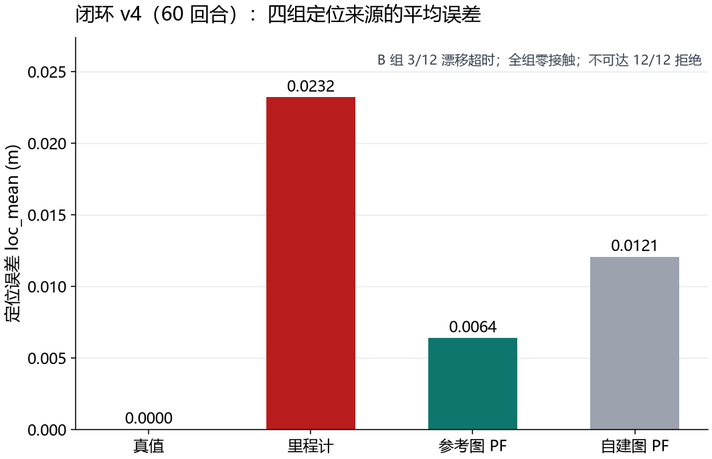
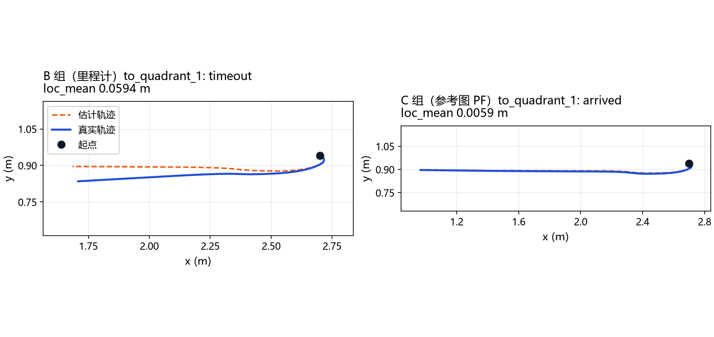

# 第 64 课：闭环导航对照——修正协议下的四组定位来源对照（v4）

> v1 五处接线错误 + 时间对齐 + 随机数分流 + 统一入口 + 稳定任务编号全部修正后，
> 修正协议 v4 的 60 回合结果：**全组零接触帧**；不可达 **12/12 安全拒绝**；
> A **12/12**（loc_mean **精确 0.0**，时间对齐证明）；B **9/12**（3 次漂移超时）；
> C **12/12**（loc_mean **0.006 m**）；D **12/12**（loc_mean **0.012 m**）。
> v4 与 v3 数字一致——本轮加固只改协议与测量，不改变结论；
> 新增：分段资源测量、代码版本/导入路径/任务编号溯源、AMCL 参数门禁（见 §4/§5）。

## 1. 修正协议（v1→v4）的完整清单

| # | 修复 | 说明 |
|---|---|---|
| 1 | PF 增量当速度→前进预测少 25× | 增量÷DT→速度→body_velocity |
| 2 | 扫描时序错位 | 传播→扫描→测量→控制→执行 |
| 3 | 运动噪声固定 5 cm/步 | 按运动比例（α×\|ds\|+基值） |
| 4 | 权重递推缺失 | posterior ∝ prior × likelihood |
| 5 | 真值代为宣布到达 | 估计连续 10 帧在门内才宣布 |
| 6 | 估计链 off-by-one | 不预初始化，循环内按时间戳追加 |
| 7 | 里程计借用真实朝向 | 里程计用自身朝向积分 |
| 8 | PF 传播读旧变量（零增量） | 使用带偏差测量增量 |
| 9 | 重采样后权重未同步 | weights = pf.w.copy() |
| 10 | 停车阈值未传入控制器 | control_step 接收 stop_distance 参数 |
| 11 | 随机数流共用 | SeedSequence 派生独立子流（传感/PF 分流） |
| 12 | 不可达按标签跳过 | 走同一规划器入口，标签只给评分器 |
| 13 | 存档用 Python hash | zlib.crc32 稳定编号 |

v4 新增（协议加固，均配回归测试）：

| # | 修复 | 说明 |
|---|---|---|
| 14 | 最后一拍"只观测不执行" | 循环末拍发命令却无人观测——未被观测的推进还可能隐藏末步碰撞 |
| 15 | 每项修复配"能抓住原 bug"的测试 | PF 吃测量增量 / 链长对齐 / 停车阈值接线 / 同一入口 / 随机数分流 / 权重同步 |
| 16 | 资源分段测量 | world_setup / mapping_patrol / navigation 三段 wall/CPU/RSS 入报告 |
| 17 | AMCL 批量参数硬门禁 | 见 §4——launch 参数化 + `ros2 param get` 回读断言，不匹配即失败 |

## 2. 实测（v4，60 回合，results/photo_room_navigation_v4）

| 组 | 到达 | 超时 | 接触帧 | loc_mean (m) |
|---|---|---|---|---|
| A 真值 | **12/12** | 0 | **0** | **0.0000** |
| B 里程计 | 9/12 | **3** | **0** | 0.0232 |
| C 参考图 PF | **12/12** | 0 | **0** | **0.0064** |
| D 自建图 PF | **12/12** | 0 | **0** | **0.0121** |
| 不可达拒绝 | – | – | – | **12/12** ✓ |

溯源：code_rev `61fb97f`、实际导入路径与完整配置、任务稳定编号（crc32）均写入
summary.json；资源分段：world_setup 0.26 s / mapping_patrol 0.14 s /
navigation 31.6 s（RSS 峰值 126 MB）。

## 3. 关键发现（自写 PF 闭环）

1. **时间对齐验证**：A 组 loc_mean 精确 0.0——off-by-one 修复有效；
2. **B 组 3 次超时**：2% 轮偏差在部分任务上累积出足够漂移导致超时；
3. **C/D 定位误差显著低于 B**（0.006/0.012 vs 0.023 m）：PF + 地图定位
   在闭环中有效。注意这是"有地图 vs 没地图"的比较，**不是**更新频率的
   比较——本批任务短、误差已接近传感噪声下限，不能据此外推更新频率
   无关紧要或决定性；
4. **D 与 C 接近**：自建图（里程计 2% 偏差涂抹）在这批短任务中仍然够用；
5. **全组零接触帧 + 不可达 12/12 安全拒绝**：先验避障图 + 规划器正确判定。

### 3.1 变量表

| 符号 | 通俗含义 | 单位 | 固定/变化 | 影响 |
| --- | --- | --- | --- | --- |
| `group` | 定位来源（A 真值 / B 里程计 / C 参考图 PF / D 自建图 PF） | – | 本课变量 | 控制器相信的位置 |
| `wheel_bias` | 编码器公共刻度误差（平移与转角同乘 1+b） | – | 固定 0.02 | 里程计距离与转角读数同步偏大 2%；无直线段曲率漂移（不同于第 15 课仅右轮模型）；转角刻度误差随总旋转累积航向偏差 |
| `sensor_sigma_m` | 激光测距噪声 | m | 固定 0.01 | 观测质量 |
| `particles` | PF 假设数 | 个 | 固定 300 | 计算量/随机性 |
| `alpha_*` | 传播噪声比例与基数 | – | 固定 | PF 散布 |
| `announce_frames` | 宣布到达需连续在门内的帧数 | 帧 | 固定 10 | 抑制瞬时误判 |
| `seed` | 主种子 | – | 固定 0 | 传感/PF 独立子流 |
| 任务 | 起点→目标 | – | 5 个（4 可达+1 不可达） | 先验图判定可达性 |

### 3.2 结果图与代表性轨迹


读图：正式批次共 60 回合，四条柱分别汇总每组 12 个可达任务回合的平均定位误差（共 48 回合）；
另 12 回合是不可达负例，未计入误差柱。A 组 0.0000 是时间对齐验证，
B 组含 3 次漂移超时，全组零接触帧。


选例规则（固定，非择优）：s0 种子下组 A 旅程最长的可达任务
`to_quadrant_1`（1.80 m）。B 组在此任务**超时**——橙（估计）链整体漂在
蓝（真值）链上方，里程计相信的位置领先于真实位置，机器人冲过目标区仍
不自知；C 组估计链贴住真值、正常到达。同一任务、同一指令序列的差速器
指令不同，因为控制器只看自己的估计。轨迹两轴等比例尺；地图分离结果图
（同批扫描三种地图 × 两种粒子预算与发散定位）见[第 65 课](65-map-separation.md)。

## 4. 官方 AMCL 生产对照（v4，参数门禁后的 27 次回放）

### 4.1 为什么必须先修批量执行器

审查发现 v3 批量执行器的 launch 文件**生成后从未被使用**——bridge 内部
硬编码单一 launch 路径，三组"不同配置"实际跑的是同一份默认参数。追查
还发现两个隐藏问题：

1. **`laser_max_beams` 不是 nav2_amcl 的参数**（那是 ROS1 AMCL 的名字；
   nav2 叫 `max_beams`）——该参数在所有历史 launch 里被静默忽略；
2. **`update_min_d/a` 从未设置**——历史 AMCL 数字全部来自 nav2 默认
   门限（0.25 m / 0.26 rad），这解释了 3221 帧只有 ~148 次更新。

### 4.2 参数硬门禁

每次回放前，bridge 用生成的 launch 启动 AMCL，随后 `ros2 param get`
逐项回读实际生效值并与配置断言一致（写入 `params_effective.json`），
不一致或回读失败立即判该次运行失败。门禁自身在调试中拦截了两次真
问题（参数名错误、lifecycle 激活竞态导致初始位姿丢失→0 位姿输出，
现改为轮询到 active 态才发初始位姿，失败自动重试）。

### 4.3 结果（3 配置 × 3 输入种子 × 3 重复，27/27 有效）

| 配置 | update_min d/a | 粒子/束 | 更新次数 | aligned mean (m) | continuous mean (m) |
|---|---|---|---|---|---|
| A-base | 0.10 / 0.10 | 300 / 32 | 348 | 0.1036±0.0047 | 0.1052±0.0049 |
| A-dense | 0.01 / 0.01 | 300 / 32 | 1617 | 0.0885±0.0134 | 0.0887±0.0133 |
| A-budget | 0.01 / 0.01 | 1000 / 64 | 1617 | **0.0778±0.0018** | **0.0779±0.0018** |

同一冻结输入上的参照：自写 PF 0.061 m（每帧更新）、里程计 0.216 m。

### 4.4 发现（仅限本任务内）

1. **更新频率不是精度杠杆**：A-dense 更新次数是 A-base 的 4.6×，均值
   只从 0.104 → 0.089 m，且种子间方差反而更大（±0.013 vs ±0.005）；
2. **更重的滤波器收益更实在**：A-budget 在同样 1 cm 门限下把均值降到
   0.078 m 且方差最小（±0.002）——粒子数与波束数才是这批运行里的主变量；
3. **aligned ≈ continuous**（差 ≤0.016 m）：50% 覆盖率下，里程计传播
   补齐两次更新之间的位姿几乎不引入额外误差。

## 5. 撤回与勘误

- **撤回"AMCL 参数不敏感"**（v3 批量）：三组数字完全相同是执行器缺陷
  （launch 未被使用、参数名错误），不是 AMCL 的性质；
- **旧 148 次更新 / mean 0.126 m**（docs/34 D-2026-09-26-02）：重新定性
  为 nav2 **默认参数**单配置的测量值，不再作为"配置对照"证据；
- 不再从 P 门控实验外推"更新频率对精度无关"——正确表述见 §3.3。

### 5.1 阶段 0 审计结论（2026-09-27，路线图 Phase 0）

- **评分器审计**（[nav_scoring.py](../src/embodied_learning/experiments/nav_scoring.py) +
  9 项已知答案测试 tests/test_nav_scoring.py）：修复三个边界——连续位姿
  在首个修正前借用未来结果（现在记 NaN、只报有效覆盖率）；全程无输出的
  定位器得到伪有效零位姿（现在全 NaN、覆盖率 0）；时间匹配无容差（现在
  max_gap_s 外拒配、覆盖按唯一真值帧计）。用门禁后的 A-base 记录复核：
  aligned 0.0972 / continuous 0.0984 逐位不变——**已有 AMCL 结论不受审计影响**。
- **wheel_bias 模型澄清**：v4 的偏差是平移与转角**同乘 (1+b)** 的公共刻度
  误差（两轮同偏大 2%），不是第 15 课"仅右轮 +2%"的曲率模型；B 组超时
  来自距离/转角刻度误差，不是直线段弧线漂移。模型描述已写入 NavConfig
  与正式记录 config 字段。
- **资源字段口径**：wall=墙钟 perf_counter，CPU=进程 process_time，
  RSS 每段只采样入口/出口两次、"峰值"=两者较大（非真峰值），已在记录中
  标注采样方式。

## 6. 边界

- 自写 PF 与 AMCL 的比较在**冻结回放**协议下进行（同一 10 m grid_nav
  输入、3221 帧）；照片房间闭环（§2）是另一协议，两组数字不可互比；
- 单房间、单噪声幅度（1 cm 传感 / 2% 轮偏差）；AMCL alpha 与自写 PF
  运动噪声同为 0.10 量级——运动模型差异未单独对照；
- 27 次运行中 4 次因 lifecycle 竞态重试后成功（重试不改变已有效的种子值，
  重复间数字逐位一致）；
- D 组建图阶段为预定路线的运动学回放（非估计驱动闭环建图）。

## 7. 思考题

1. B 组的 2% 偏差同时放大平移和转角读数。若改成"仅右轮 +2%"（第 15 课
   模型），B 组的超时模式会怎样变化？哪个模型对差速车更真实？
2. A 组 loc_mean 精确为 0.0 依赖时间对齐修复。若估计链仍有一个系统性
   one-frame 延迟，哪些指标会先暴露它？
3. 不可达任务的拒绝来自先验避障图。若避障图改为运行时观测累积（第 65 课
   方向），"拒绝"还可能在任务开始时给出吗？安全含义有何变化？
4. 资源分段显示 navigation 阶段占 31.6 s / 126 MB。PF 粒子数增到 1000 时
   哪一段最先变慢？为什么 CPU 时间与墙钟几乎相等？

## 8. 复现

```powershell
uv run python -m embodied_learning.experiments.photo_room_navigation --output results/photo_room_navigation_v4
uv run pytest tests/test_photo_room_navigation.py -q
# AMCL 批量（WSL，ROS 2 Jazzy）：
#   python3 src/embodied_learning/experiments/run_amcl_batch.py --gate   # 参数门禁 3 次
#   python3 src/embodied_learning/experiments/run_amcl_batch.py          # 27 次
uv run python src/embodied_learning/experiments/score_amcl_batch.py     # 统一评分（无需 ROS）
```

## 原始来源与本地适配（2026-10-09补引）

[Probabilistic Robotics](https://robots.stanford.edu/probabilistic-robotics/)（Sebastian Thrun / Wolfram Burgard / Dieter Fox，2005）；[Nav2 Jazzy · AMCL 源码与参数](https://api.nav2.org/nav2-jazzy/html/amcl__node_8cpp_source.html)（Nav2 维护团队，Jazzy）。

本地对照、观测/评分权限与实际版本见正文；第64课另有实际官方 AMCL 参数回读对照，其他简化栈不当作已运行官方导航系统。 [完整采用关系与引用规则](references.md)。
