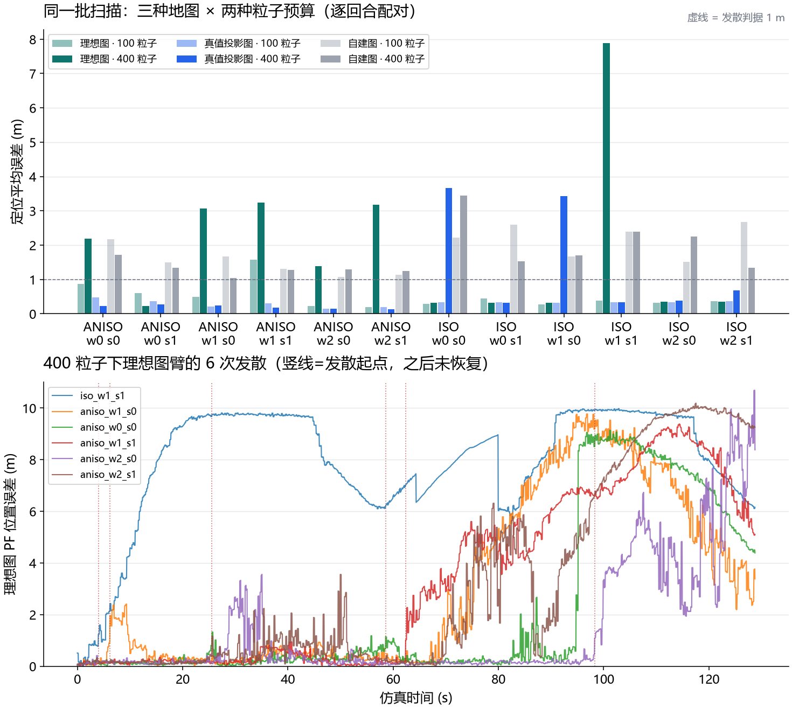

# 第 65 课：地图分离试跑——自建图失败发生在哪一层？

> 承接：docs/62 配对试跑的过门失败——理想图定位常明显改善，自建图却不稳定，
> 地图对齐精确率全部低于 0.70。当时无法回答：失败来自**地图表示**（端点图
> 天生不如理想占据图）、**落点误差**（扫描按里程计位姿涂到错误位置），还是
> **滤波器失稳**（粒子数不够）？本课固定同一批扫描，把这三个因素拆开测。
> 本文数字全部来自正式记录：100 粒子试跑 v4 与 400 粒子新扫描
> （results/nav_sep_particles400_v1），分解与发散定位见
> results/map_separation_v1；分析代码 [map_separation.py](../src/embodied_learning/experiments/map_separation.py)。

## 1. 变量表

| 符号 | 通俗含义 | 单位 | 来自哪里 | 改变它会影响什么 |
| --- | --- | --- | --- | --- |
| `world_seed` | 场景编号（障碍布局） | – | 生成器 | 独立场景单位 |
| `sensor_seed` | 定位观测噪声与 PF 随机性 | – | 采集器 | 同场景两次运行成对读 |
| 粒子数 | 滤波器假设的数量 | 个 | 本课单变量：100→400 | 计算量、随机性；不应改变地图本身 |
| 理想占据图 | 直接从几何画的干净地图 | 格 | `true_occupancy` | 定位上限参照 |
| 真值投影图 | 同一批扫描按**真值位姿**涂色 | 格 | `occupancy_from_observations(truth)` | 与理想图同落点、不同来源 |
| 里程计投影图 | 同一批扫描按**估计位姿**涂色 | 格 | `occupancy_from_observations(est)` | 部署可行的自建图 |
| 表示间隙 | 真值投影图 − 理想图（同落点） | m | 分解统计 | ≈0 说明端点图本身不差 |
| 落点间隙 | 自建图 − 真值投影图（同扫描） | m | 分解统计 | 大说明失败来自涂图位姿 |
| 发散 | 回合平均误差 > 1 m | – | 预登记判据 | 理想图臂发散=纯滤波器问题 |

## 2. 原理：一次只改变一个因素

配对试跑的数据已经含三种地图，但从未把两个间隙分开算。固定扫描、采集
路线、初始化与种子后：

- **表示间隙** =（真值投影图 − 理想图）的中位误差。两者落点都完美，唯一
  差别是地图来源：干净几何 vs 真实扫描端点。若 ≈0，端点图作为定位输入
  并不先天不足。
- **落点间隙** =（自建图 − 真值投影图）的中位误差。两者用完全相同的扫描，
  唯一差别是涂图位姿：真值 vs 里程计。若远大于表示间隙，失败在落点。
- 分解只在**理想图臂未发散**的回合子集上计算：发散回合的误差混合了两种
  追踪状态，会污染间隙估计。
- **发散判据预登记**：回合平均误差 > 1 m。理想图臂发散说明地图干净时滤波器
  自己也会失稳——这与地图质量无关，需要单独归因。

## 3. 对照设计与结果

固定 ISO/ANISO × 场景 0–2 × 传感种子 0–1（12 回合），先在 100 粒子
（旧试跑 v4）上分解，再以 400 粒子重扫同一批协议作单变量对照
（results/nav_sep_particles400_v1；先 1 场景冒烟 26 s/集通过，再全量
12 集，含 1 集缓存复用 wall 3.8 min）。

| 预算 | 理想图中位 | 真值投影中位 | 自建图中位 | 理想图发散 | 自建图发散 | 地图对齐 P/R |
| --- | ---: | ---: | ---: | ---: | ---: | --- |
| 100 粒子 | 0.373 m | 0.333 m | 1.670 m | 1/12 | 12/12 | 0.365 / 0.517 |
| 400 粒子 | 0.870 m | 0.295 m | 1.434 m | **6/12** | 12/12 | 0.399 / 0.620 |

分解（理想图未发散子集，中位数）：

| 预算 | 干净回合 | 表示间隙 | 落点间隙 |
| --- | ---: | ---: | ---: |
| 100 粒子 | 11 | **−0.03 m** | **+1.34 m** |
| 400 粒子 | 6 | +0.20 m | +1.08 m |



**发散起点**（400 粒子理想图臂 6 次，仿真时间轴）：iso_w1_s1 在 0.78 m 弧长
（第 ~100 帧）即跳变且全程未恢复；aniso_w1_s0 在 1.28 m；其余在 5–21 m
分散出现。**本批起点没有集中在单一固定位置**，记录表现为模式跳变后未恢复。
这支持滤波器失稳的判断，但不能排除重复几何、局部可观测性不足及其与采样的交互。
第 68 课 的平行走廊诊断进一步说明：低匹配残差也可能掩盖未被约束的运动方向。

## 4. 结果回答了什么问题

1. **地图表示不是瓶颈**：同落点时端点图与理想图把定位带到同一水平
   （100 粒子表示间隙 −0.03 m ≈ 0）。“端点图天生不如占据图”的假设被否定。
2. **落点误差是自建图失败的主因**：同样的扫描，按里程计位姿涂图就损失
   1.1–1.3 m（中位）。这与地图对齐精确率 ≤0.44 互相印证。
3. **粒子数不是杠杆**：100→400 粒子，自建图中位仅 1.67→1.43 m，地图对齐
   指标（与 PF 无关）逐位不变；理想图发散反而 1/12→6/12。docs/62 曾标记
   “100 与 400 粒子不可比”的混淆，本课在**同一批扫描**上消除了它：结论是
   增加粒子不解决失稳。
4. **滤波器失稳是独立的第二个问题**：理想图臂也会发散，起点分散、跳变后
   不恢复。这与落点误差正交——即使把落点修好，发散仍会偶尔毁掉一个回合。

## 5. 失败条件与边界

- 单一 10 m 世界族、两条巡游路线；发散判据 1 m 是预登记阈值，换阈值数字会变；
- “粒子数不改善”只在本批 12 回合、两档预算内成立，不外推到 1000+ 粒子；
- 表示间隙 ≈0 依赖建图巡游的观测密度；若巡游路线更稀疏，端点图可能变差；
- 真值投影图是诊断权限（用真值落点），部署上不可用——它只用来分离因素。

## 6. 理论对应

粒子滤波多峰后验与模式跳变：Thrun《概率机器人》第 8 章（蒙特卡洛定位）。
似然场测量模型：同书 6.4。地图落点误差对端点图的影响即 SLAM 的“死锁”
（deadlock）现象在无回环修正时的表现：估计位姿漂移→地图涂错→定位更差。

## 思考题

1. 表示间隙 ≈0 而落点间隙 1.3 m：把建图巡游的里程计偏差从 2% 降到 0.5%，
   落点间隙会按比例缩小吗？什么机制让它不按比例？
2. 400 粒子的理想图发散比 100 粒子**多**（6/12 vs 1/12）。这能证明“粒子
   越多越不稳”吗？需要什么对照才能下这个结论？
3. 发散后滤波器为何无法自愈？设计一个**只用观测**（不读真值）的发散检测
   信号，说明它的误报与漏报各会在什么场景出现。
4. 地图对齐精确率与 PF 无关却逐位相同，而定位误差随粒子数变化。为什么
   这两个指标必须分开报告？

## 复现

```powershell
# 400 粒子单变量扫描（同一批扫描协议；新目录，不覆盖旧记录）
uv run python -m embodied_learning.experiments.navigation_benchmark --output results/nav_sep_particles400_v1 --particles 400 --world-seeds 0,1,2 --sensor-seeds 0,1
# 分解与发散定位
uv run python -m embodied_learning.experiments.map_separation --hundred results/navigation_benchmark_2026-09-24_pilot_v4 --four-hundred results/nav_sep_particles400_v1 --output results/map_separation_v1
# 图
uv run python docs/img/make_map_separation_figures.py
# 测试
uv run python -m pytest tests/test_map_separation.py tests/test_patrol_routes.py tests/test_nav_scoring.py -q
```

## 停止点与下一实验

按 docs/62 纪律：**两轮预先限定的单变量实验仍无改善则记录失败并换假设**。
粒子数这一轮已明确无效。下一项单变量实验（已登记、未执行）：固定粒子与
地图，扫**似然场参数**（σ_hit / 测量更新门控）；若仍无改善，转入发散检测
+重种子机制而不是继续调参。P5 巡检路线生成器（[patrol_routes.py](../src/embodied_learning/experiments/patrol_routes.py)）
已就绪：照片房间 4 可达 + 床足印拒绝 + 5.16 m 封闭环与旧基准场景网格
方向一致性均有测试；估计驱动巡检沿同一路点执行、不借真值纠偏，等定位
机制改善后接入。
