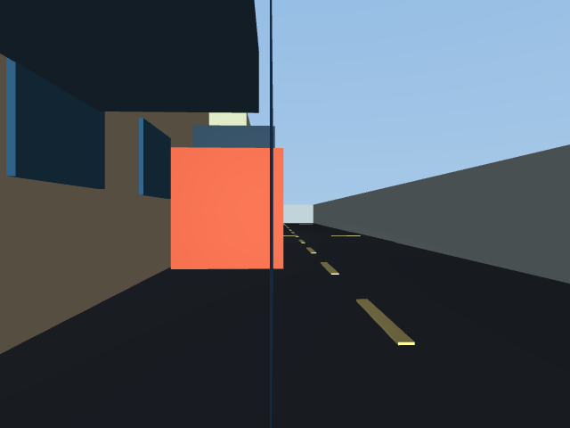
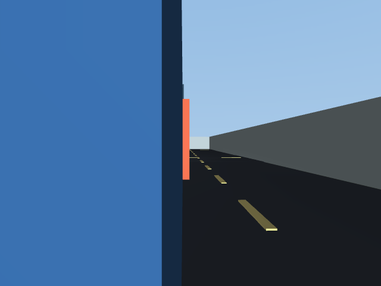

# 专题 66：街区式园区巡检——定位误差怎样影响真实到点

这次新增了实际运行的闭环实验和可交互回放窗口。机器人先用自己的定位结果规划，再根据规划发出运动指令；仿真环境执行指令并生成下一帧雷达。不同方法可以走出不同轨迹、停在不同地方。实验记录没有改成预设的成功动画。

承接专题 65：上一专题固定同一条运动记录比较位置估计；本专题把位置估计接入规划和控制，观察每种方法最终是否真正到达巡检点。本专题是园区综合项目的基线；自动绕行作为专题 67 的新对照实验，错误地图修复作为专题 68 的后续研究，后两个专题现已完成受控实验，见[专题 67](67-body-aware-obstacle-avoidance.md)与[专题 68](68-scan-based-map-repair.md)，本专题保留原始基线。

## 1. 启动窗口

双击 `scripts/open_campus_patrol_demo.cmd`，或：

```powershell
uv run python -m embodied_learning.campus_patrol_demo --play
```

默认是第 1 轮（种子 0），参考地图定位也在这一轮遇到了无法继续规划的问题。下拉框可以检查全部 3 轮，包含成功和失败记录。

| 看什么 | 怎样操作 |
| --- | --- |
| 所有方法走成什么样 | 点击“汇总叠图”，恢复全部轨迹；相机仍跟随最近选择的方法 |
| 某一种方法究竟错在哪里 | 直接点“单独跟随”中的方法：相机、3D、地图底图/轨迹、雷达、目标、误差曲线和统计高亮一起切换，保留当前时间与播放状态 |
| 避免轨迹互相遮挡 | 点击“并排分图”，恢复全部轨迹并显示独立小地图，使用相同坐标范围 |
| 只比较自己关心的几组 | 打开“自选图层”后勾选，自动转入汇总比较；下次点方法按钮会恢复一键联动 |
| 方法名称看不懂 | 查看选择器下的解释，或点击“方法含义与效果”阅读完整说明和本轮结果 |
| 雷达看到了什么 | 勾选“雷达探测点”；青点同时出现在地图和 3D 场景 |
| 它现在想去哪 | 金色星/旗是当前巡检目标，金线是当前规划路径；相机显示目标名称、估计直线距离和方向提示 |
| 对照同一时刻 | 暂停、单步、拖动进度条，或点击误差曲线；所有面板共用时间轴 |

相机总是跟随所选方法那一台机器人的**实际位置和朝向**。切换方法时，画面和目标也会切换。相机中的金色标记是导航叠加提示，可能指向被建筑遮挡的位置；不代表目标已被视觉识别出来。目标在身后、视野左右之外或前下方时，会给出对应提示。

## 2. 每一种方法是什么意思

“实际位置”是仿真用于评分的答案。“估计位置”是机器人以为自己所在的位置。比如机器人实际在墙边，但估计自己还在路中央，就可能选择错误的行驶方向。

| 新窗口名称 | 获得什么信息 | 要回答的问题 |
| --- | --- | --- |
| 知道真实位置 | 直接读取仿真实际位置 | 任务和控制器本身能不能跑通？这是参考组，不能当成可部署定位算法 |
| 只靠轮子推算 | 累计轮子运动量 | 不用雷达纠偏，轮子读数偏大后会发生什么？ |
| 雷达＋参考地图 | 有偏差的轮子读数、当前雷达回波、准确的事先地图 | 雷达与地图匹配能否纠正位置，从而完成巡检？ |
| 雷达＋自建地图 | 同样的定位方法，但地图来自另一次带里程计偏差的建图巡游 | 当地图上的墙已经画歪，定位还能否成功？ |

两种“雷达＋地图”使用粒子滤波（PF）：保留许多位置猜测，用雷达点是否贴合地图里的墙面给猜测打分，再综合得到当前位置。算法不保证每次都选对；好的地图、合适的初始位置和足够的环境特征都很重要。

旧窗口中的名称也已改写，记录仍然保留：

| 旧名称 | 现在怎么读 |
| --- | --- |
| 轮里程计 | 只靠轮子推算 |
| 理想图 PF | 雷达＋准确地图 |
| 真值投影图 PF | 雷达＋按真实位置建图：用真实位置把同一批扫描放到图上，保留测距噪声与漏扫，作为诊断对照；部署时不能偷用答案 |
| 自建图 PF | 雷达＋自建地图 |

专题 65 旧实验的这些线，是**同一次运动的多种位置估计**。旧档案没有独立规划目标，因此窗口明确标为未记录；不会把事后构造的目标说成当时的规划。旧雷达点也是按原几何与真实位姿重算的理想扫描，标注“几何重算”。园区实验的回波则来自实验中实际保存的数组。

## 3. 点、线、图和数字如何对应

- **实线**：机器人实际走过的路线。**虚线**：该方法估计的路线。两线贴合才表示定位准确。
- **青点**：该方法在当前时刻保存的雷达回波，按它估计的位置和朝向投到地图上。如果位置估错，点会偏离真实墙面。达到最大量程而没有命中的光束不画成障碍点。
- **金色星/旗和路线**：当前巡检目标与当时保存的规划路径。不同方法进度不同，当前目标可能不同。
- **当前位置误差**：这个时刻估计位置与该方法自己的实际位置之间的距离，不拿另一台机器人的轨迹当答案。
- **朝向差**：车头方向差几度，跨过 180° 时取正确的较小角度差。
- **均值/P95/末端**：全段平均误差、95% 的时刻不超过的误差、该方法结束时的误差。
- **全程到点数**：整轮真正到达的巡检点数。统计表下的任务状态另行显示当前时刻已到几个点。

各方法独立运行，时长与路径会不同。提前失败的记录可能平均误差很小，所以不能只按均值排名，也不能把它直接解释成同一路径的配对提升。先看任务是否完成，再解释误差和失败过程。

结束较早的记录在共同时间轴中保持末帧，相机明确显示“已结束，保留末帧”和原始结束时间；补齐的停留帧不参加均值/P95计算。结束之后“当前”误差显示横线，曲线标记停在原始结束时间，不伪造新的观测。

## 4. 场景和任务

场景是 24×24 m 的园区抽象模型，包含四栋不同高度的建筑、交叉道路、斑马线、停放车辆、配电柜、树干和支路围栏。碰撞检查、参考占据地图和雷达测距使用同一组米制几何；建筑窗户和路面标线仅作视觉装饰。树冠高于激光与车体，其下方树干参与测距和碰撞。

巡检顺序：南门岗亭 → 停车区 → 东侧设备间 → 中央路口 → 北侧消防点 → 西北仓库 → 西侧配电点 → 返回出发点。位置坐标保存在每批记录的 `protocol.json`，所有方法使用同一任务列表和起点。

任务结构参考 Nav2 的“依次到达航点、到点执行动作”机制，当前实现的是到点停车确认。Nav2 官方同时提供安保巡逻和到点巡检示例；这些参考用于任务设计，没有把本程序冒充为已经接入 Nav2 的系统。[Waypoint Follower](https://docs.nav2.org/rolling/configuration_and_development/configuration_guide/core_servers/waypoint_follower/)、[Simple Commander 示例](https://docs.nav2.org/rolling/configuration_and_development/simple_commander_api/simple_commander_api/)。

工业巡检常把路线、巡检点和每个点上的采集动作保存成任务，再运行和复核。这也是本窗口区分“实际位置、当前目标、任务完成结果”的依据。[Boston Dynamics 的巡检流程说明](https://bostondynamics.com/blog/automated-inspections-made-simple/)。室外园区中使用 LiDAR 里程计或先验地图定位也有真实项目案例，但这些案例不能作为本算法已达到相同能力的证据。[Clearpath 的大学园区定位示例](https://clearpathrobotics.com/blog/2025/02/the-power-of-3d-perception-with-ouster-os1-128/)。

## 5. 首轮实验协议

| 项目 | 固定值/口径 |
| --- | --- |
| 组数与重复 | 4 组 × 3 个随机种子，共 12 回合 |
| 机器人半径 | 0.25 m |
| 时间步长、最大速度 | 0.12 s、0.8 m/s；运动学执行，无真实车辆动力学 |
| 轮子误差 | 平移和转角测量同时乘 1.02，公共刻度误差；不是仅右轮多转 2% |
| 雷达 | 64 束、360°、最大 8 m；有效回波加标准差 0.03 m 的噪声 |
| PF | 300 粒子、32 束参与匹配；沿用既有似然场模型、递推权重和里程计相关传播噪声；测量向量化并显式使用命中标志 |
| 规划 | 所有组共享事先几何避障图；A*、车体膨胀和路径平滑；每 20 帧重规划 |
| 到点自报 | 估计距离小于 0.30 m，连续保持 5 帧 |
| 到点评分 | 自报时实际距离不超过 0.45 m 才计成功；不会把“它以为到了”计为真正到达 |
| 失败 | 最多 312 s；无法规划、接触障碍分别记录并结束；安全停止造成的停滞保留为超时 |

初始位姿已知，仅在其附近初始化 PF。自建图来自**另一次真值控制的诊断覆盖巡游**，按带偏差的里程计位置投影回波；建图不会在线读取后续巡检轨迹。它检验地图误差对定位的影响，不等于完成了自主 SLAM。

每帧同步保存实际位置、里程计、估计位置、雷达距离和命中标志、巡检目标编号与坐标、局部跟随点、当前规划路径、速度与转速指令。最后一帧只观测、不再执行未被记录的新运动。协议先写入磁盘，再执行各组；各组使用相同的传感噪声种子规则和分离的 PF 随机流，不根据结果挑选获胜种子。

## 6. 首轮结果：哪些有效，哪些还不行

正式记录：`results/campus_patrol_v1`。摘要与哈希：[campus-patrol-v1.json](benchmarks/campus-patrol-v1.json)。

| 方法 | 完成整轮 | 真正到达点数，累计 24 点 | 三回合各自均值再平均 | 接触障碍 |
| --- | --- | --- | --- | --- |
| 知道真实位置，仿真参考 | 3/3 | 24/24 | 0 m（直接用答案） | 0 |
| 只靠轮子推算 | 0/3 | 3/24 | 0.333 m | 0 |
| 雷达＋参考地图 | 2/3 | 18/24 | 0.071 m | 0 |
| 雷达＋自建地图 | 0/3 | 2/24 | 0.352 m | 0 |

解释：

1. 真值参考全部跑通，说明这组任务在当前几何和控制设置下可行。
2. 仅靠轮子的组会自报到达未真正到达的点，之后在停车区域停滞。零碰撞是安全停止的结果，不能当成巡检成功。
3. 参考地图定位在种子 1、2 完成全部 8 点；种子 0 只完成 2 点，在约 33.6 s 因估计所在格不满足规划安全条件而停止。其平均误差仅约 0.070 m，恰好说明“误差小”和“闭环成功”是两个判据。
4. 自建地图定位尚未改善任务完成率，三轮都超时。当前证据支持“准确地图下雷达纠偏在部分回合有效”，不能说自建图导航或园区自主巡检已经验证通过。

这是单一抽象街区、3 个噪声种子的首轮试跑，不足以外推真实园区、多场景可靠性或动态人车避障。当前相机只是三维重渲染，没有 RGB 定位参与；激光仍是水平二维扫描，机器人也只在平地运动。画面中的楼高、材质和相机机位不是实景重建或标定结果。

## 7. 复现与模块复用

已有数据可直接开窗口。新机器上先生成记录；已有目录会拒绝覆盖，复跑请给新目录：

```powershell
uv run python -m embodied_learning.experiments.campus_patrol --output results/campus_patrol_recheck --seeds 0 1 2
uv run python -m embodied_learning.campus_patrol_demo --record results/campus_patrol_recheck --seed 0 --play
uv run python scripts/test.py full tests/test_campus_patrol.py tests/test_replay_viewer.py
uv run python scripts/test.py quick
```

首轮 12 回合连同建图约 8.0 s（本机实测，不含窗口渲染）；它使用运动学与解析射线，不是实时速度的物理仿真录像，也不能拿这个时间替代旧全量测试耗时。

实验执行器 `experiments/campus_patrol.py`、数据适配器 `replay_viewer/campus.py`、投影提示 `goal_overlay.py`、比较说明面板 `analysis_panel.py` 相互独立。`ReplayRecord` 支持每条估计轨迹关联自己的实际轨迹，显式记录有效长度、扫描、目标和规划；旧地图分离实验继续使用同一窗口。

## 8. 验收与下一步

已检查：射线命中和无返回的已知答案；向量化 PF 与原似然公式一致；控制指令到下一帧实际位置的因果关系；假到达不计成功；独立实际轨迹评分与停止后补帧；目标前方/后方/侧方/前下方投影；实际 Tk 窗口中的方法切换、雷达点、分图、相机和目标同步。

下一项实验优先处理种子 0 的规划起点安全边界，以及里程计/自建图组的安全停止后恢复。应记录“为什么不能前进”，比较短暂停止、重新定位、重新规划等机制，并保存失败回合；之后再扩展街区布局和动态障碍。相机采集与视觉定位按既有多传感器路线图另行验收。

进一步的代码审计、Nav2/SLAM Toolbox/LT-mapper/ELite 研究对照，以及“局部绕行 → 修正建图 → 长期更新”的实施顺序，见[地图自我修正与课程安排](campus-map-repair-plan.md)。当前激光只参与定位和近障停车，尚未在线改图；自建图组的规划仍使用共享先验避障图。

## 9. 相机与机身的边界

本次查明并修复了近处物体“透视”的显示错误：MuJoCo 默认近裁剪距离随场景尺度扩大，在这个场景达到约 0.478 m，近处的车辆表面可能被裁掉。现在使用固定 0.01 m 近裁剪距离。展示相机距车体中心的前向偏移从 0.28 m 改为 0.18 m，回到半径 0.25 m 的包络内；高度仍为 0.55 m。这是展示参数修正，原始轨迹、雷达和成绩未变。

对旧机位逐帧检查，12 回合的相机中心均未进入障碍足印，但旧近裁剪面确实会越过近处表面。“穿模”的视觉现象不能直接当成机身穿过实体，也不能因此忽略碰撞检查。

同一存档帧（种子 1、自建图组、66 s），固定旧机位，仅改变近裁剪距离进行隔离检查：

| 修正前：近处蓝色车身表面被裁掉 | 修正后：蓝色车身表面正确遮挡后方 |
| --- | --- |
|  |  |

当前窗口另将机位收回到 18 cm，因此其构图会略有不同。图中的天空/道路仍可从车身右侧看到，不是整屏都应被障碍盖住。

当前实验使用平面圆盘碰撞模型，检查每个记录时刻的机器人中心到障碍的距离是否小于半径。专题 67 已另用完整身体夹具验证整段运动扫掠、侧向/后方、支架高度以及低矮与悬空障碍；本专题存档仍使用原圆盘模型。RGB 视野中没有物体，不等于整台车能通过；相机当前只用于显示，没有参与控制。

## 10. 理论对应

1. **闭环反馈**：估计位置改变规划起点和转向误差，动作再改变下一帧实际位置与雷达读数。某次估计错了，后续观测也会改变，因此各方法不再共享同一条轨迹。
2. **配置空间**：把车简化成半径 0.25 m 的圆，再给障碍做膨胀，相当于把“整台车能不能过”转成“车中心能不能落在这一格”。厘米级估计误差在边界处就可能改变可达判断。
3. **观测与状态估计**：雷达回波是距离；只有与位置和朝向组合，才成为地图上的点。位置错误会把正确测距放到错误位置，错地图又会反过来影响定位。
4. **任务层评价**：位置误差是中间指标，真正到点和整轮完成才是本实验任务指标。零碰撞、低均值和成功完成必须分别报告。

## 11. 思考题

1. 参考图组只差约 7 cm，为何仍会无法规划？结合膨胀格边界说明，不能只回答“精度不够”。
2. 自建图组零碰撞但整轮 0/3，雷达究竟做对了哪一步、还缺哪一步？怎样设计只改变局部规划器的对照？
3. 同一面墙在地图上偏了，什么证据能区分位置错、历史建图错和墙真的改变？为什么不能每次把地图硬拉到当前扫描上？
4. 为什么不能用提前失败后补帧的均值比较算法？运行长度不同的组还应该共同报告哪些指标？
5. 摄像机看见前方空地，但车身侧边擦到矮栏杆，属于定位、视觉覆盖还是碰撞包络问题？至少列两项验证。

## 12. 停止点与下一课

本专题完成到可复现的基线、原因审计与同步窗口；未实现自动绕行、在线修图或 RGB 定位。先完成传感/机身几何验收，再按专题 67 协议增加观测驱动避障，保持 `campus_patrol_v1` 不变。地图修复另设专题 68，沿用[研究与实验规划](campus-map-repair-plan.md)中的单变量对照。
