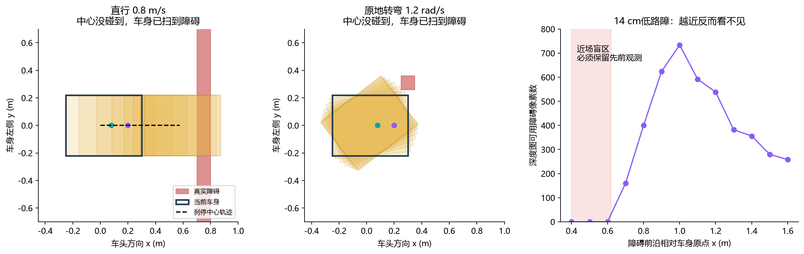
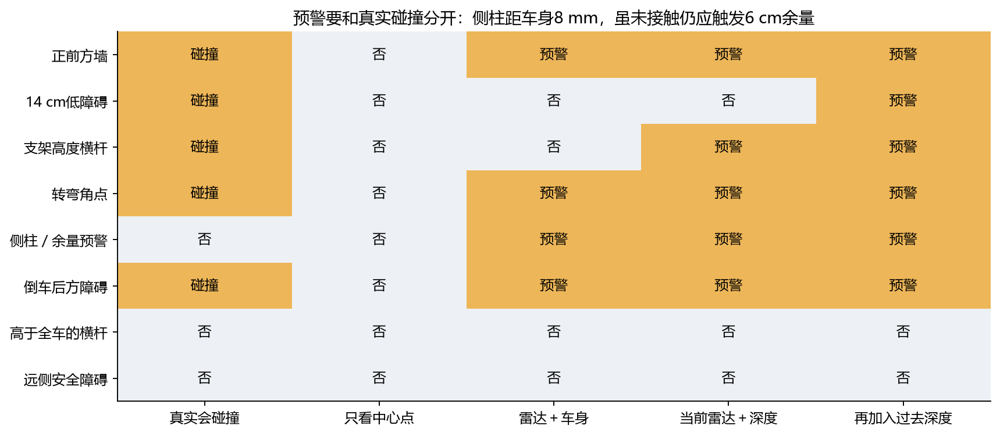
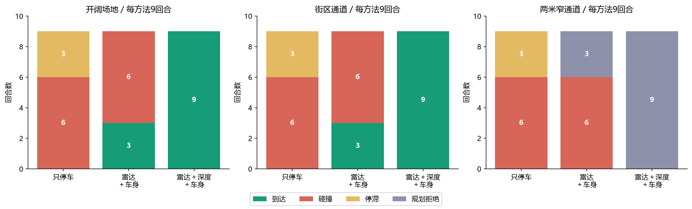
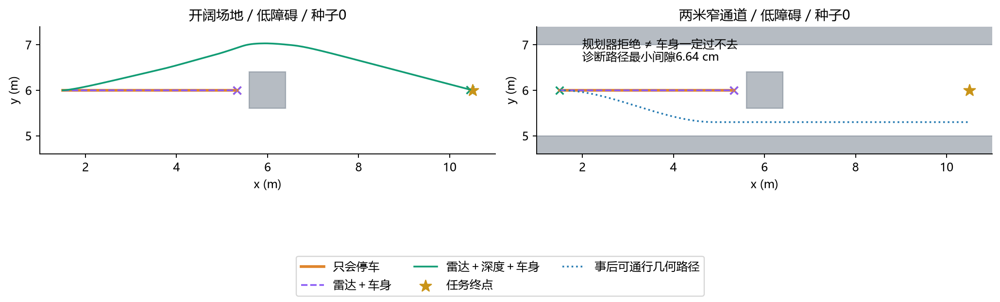
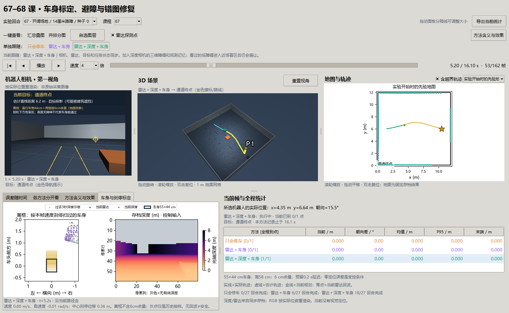

# 第 67 课：先知道自己有多大，再根据雷达和深度避障

承接[第 66 课](66-campus-patrol.md)：上一课能在雷达距离太小时停车，但不会根据新障碍绕路。本课先把“传感器看见的点”换算成“车身会不会扫到它”，再比较停车、雷达绕行、雷达与深度共同绕行。定位暂时使用无偏、无滑移的轮子里程计，隔离避障问题。

**本课已完成仿真几何标定、81 回合闭环对照和同步窗口。** 融合组 18/27 到达、0/27 碰撞，另外 9 回合规划拒绝；不是全部场景跑通。尺寸是本课明确定义的仿真机器人，尚未测量真实机器人。

后续：[第六十九课讲义](69-footprint-planning.md)保持这台身体与观测，分离圆形近似、米制表示和朝向足印；找到了几何路线，但仍保留窄路执行失败。本课原记录不被后续结果覆盖。

## 1. 先把三个问题分开

拿着手机经过门框时，手机画面没有撞上门框，不代表你的肩膀能过去。机器人同理：相机是一处观察点，底盘、支架和相机外壳共同占据一片空间。

1. **看得见吗？** 雷达只扫描离地 32 cm 的一个平面，14 cm 路障在它下面；相机也有视野边界。
2. **车身装得下吗？** 点在车头左边，可能碰左前角；点在底盘上面，可能撞相机支架。
3. **现在刹车来得及吗？** 检测、传输和执行需要时间，刹车也不能瞬间停下。必须检查未来一段运动中整台车扫过的区域。

相机近裁剪造成“近墙消失”的显示问题已在第 66 课 修复为 1 cm。本课进一步检查相机光线、身体尺寸和运动碰撞三者是否一致。

## 2. 新变量：在哪里定义，实验中怎样变化

统一使用车身坐标：原点在底盘参考点，`x` 向前、`y` 向左、`z` 向上。长度用米，角度计算用弧度。

| 变量或概念 | 数值 / 单位 | 它影响什么 |
| --- | --- | --- |
| 前伸 `front_m` / 后伸 `rear_m` | 0.30 / 0.25 m | 车长 0.55 m；雷达的距离不能直接当作保险杠距离 |
| 半宽 `half_width_m` | 0.22 m | 车宽 0.44 m；决定侧向通过空间 |
| 身体分块 `parts` | 底盘、支架、相机外壳三个长方体 | 按各自高度判断碰撞；最高处 0.58 m |
| 雷达外参 | 前移 0.08 m，高 0.32 m | 将每束距离转换到车身坐标；本次 180 束、量程 8 m |
| 相机外参 | 前移 0.20 m，高 0.55 m | 将相机三维点转到车身；相机光轴朝前 |
| 相机内参 | 80×60，垂直视场 65°，焦距约 47.09 像素 | 像素对应哪条射线；深度是光轴方向距离，不是斜距 |
| `v` / `w` | m/s、rad/s，随路径变化 | 直行、转弯、刹停的运动形状；正常前进上限 0.6 m/s |
| 延迟 `latency_s` | 0.20 s | 刹停预测先保留这段继续运动的距离；仿真没有另加实际通信排队延迟 |
| 线 / 角制动能力 | 0.8 m/s²、1.8 rad/s² | 控制速度每步有限变化；停车不是速度瞬时归零 |
| 安全余量 `margin_m` | 0.06 m | 身体横向包络外再预留空间，抵御小误差 |
| 占据格 / 观测记忆 | 网格 0.10 m，三维去重格 0.08 m | 保存传感器曾看见的障碍；本实验静态环境中持续保留 |
| 控制步长 / 重新规划 | 0.10 s / 每 10 帧 | 每步检查刹停包络，每秒重新找一次路径 |

“外参”就是传感器在车上的安装位置和朝向；“内参”描述相机如何把方向变成像素。尺寸不能从一幅普通 RGB 图中无条件猜出：本课先把尺寸作为可检查的输入，再估计传感器安装变换。

底盘范围是 `x∈[-0.25,0.30]，y∈[-0.22,0.22]，z∈[0,0.30]`。支架和相机比底盘窄，但更高。因而离地 0.42–0.57 m 的横杆会撞到上部结构，而 0.72 m 以上的横杆可以从车顶经过。这是三维高度检查的意义。

## 3. 传感器距离怎样变成碰撞判断

### 3.1 雷达：先减去安装位置与车头的差

正前方一束雷达返回距离 `r`，它从雷达位置开始量。车头比雷达还向前伸 `0.30−0.08=0.22 m`，所以车头与正前方墙的距离是：

`车头间隙 = r − 0.22 m`。

例如 `r=0.62 m`，实际车头间隙只有 0.40 m。斜向和转弯不能沿用这一维减法：要把点按方向放进车身坐标，再与整个身体比较。二维雷达不知道命中物体的完整高度，本课把回波保守地扩展为覆盖身体几个高度的竖向障碍；这会倾向于多挡一些空间。

### 3.2 深度：先反投影，再对齐车身

相机图像中的列、行分别记 `u、v`，光轴深度记 `Z`。先算相机坐标：

`X=(u−cx)Z/fx，Y=(v−cy)Z/fy`。

再用安装旋转 `R` 和平移 `t`：`车身中的点 = R × 相机中的点 + t`。这样雷达点、相机点与车身能在同一米制坐标中比较。本课去掉离地不超过 2.5 cm 的点来避免把地面当墙；因此更薄的障碍没有完成验证。

这里使用的是**米制深度几何**。彩色 RGB 用于窗口解释，并未参与外观识别或视觉定位；不能把本课写成“RGB 与雷达融合定位”。

### 3.3 提前量：速度越高，需要留得越远

直行、恒定减速度下，中心停止距离近似为：

`d_stop = |v| × 延迟 + v² / (2 × 制动能力)`。

0.8 m/s 时，`0.8×0.2 + 0.8²/(2×0.8)=0.56 m`。再加车头前伸 0.30 m 和余量 0.06 m，障碍距车身原点至少约 0.92 m 才有这份刹停空间。本课 0.04 s 离散预测稍保守，中心实际预测为 0.576 m，因此对应阈值约 0.936 m。

转弯时用线速度和角速度积分出弧线，将三个身体长方体逐步移动、旋转后取经过的区域。原地转弯中心几乎不动，左前角却会扫向旁边，这正是只检查中心点会漏掉的情况。预测发现障碍进入带余量的身体包络，就请求制动。



读图：左图深色矩形是当前车身，黄色矩形是刹停过程中经过的位置，红色是墙，黑虚线只表示中心；青点和紫点分别是雷达与相机的平面安装位置。中图中心不平移，车角仍会扫到红块。右图横轴从车身原点量起：14 cm 路障在 0.4–0.6 m 的本组采样中已经落到相机下方，障碍像素数为零；远处曾看到的点必须保留。

## 4. 标定怎样验收：拟合之外还要留出检查

用 100 个已知米制位置的仿真靶点，加入 1 mm 标准差的点测量噪声。60 点拟合安装变换，另外 40 点只验收，避免“用考试答案给自己打分”。相机拟合三维刚体变换；二维雷达拟合平面旋转和平移。

| 验收项 | 正式结果 | 含义 |
| --- | ---: | --- |
| 相机安装平移误差 | 0.469 mm | 拟合安装位置与仿真设定的差 |
| 相机留出点误差 P95 | 2.573 mm | 95% 留出靶点变换后的误差不超过此值 |
| 雷达平面安装平移误差 | 0.082 mm | 雷达平面原点估计误差 |
| 雷达朝向误差 | 0.00442° | 安装偏角估计误差 |
| 解析深度与 MuJoCo 独立渲染对拍 | 8 个夹具中，最大 P95 差 0.626 mm | 检查坐标方向、米制深度、遮挡、近裁剪；排除光栅边界像素 |

内参、车身尺寸作为已知夹具输入，没有声称从数据重新估计；单层水平雷达也不能凭平面靶点估出自身离地高度。控制器使用经过这组检查的名义几何参数，未把带噪声拟合值替换进去。真实车还需要尺量/标定板、载荷下制动试验，以及完整外参和时间同步标定。

8 个碰撞夹具覆盖正面、侧柱、倒车、原地转角、低路障、支架横杆，以及两个安全负例。



第一列由独立的长方体相交检查给出“本次运动是否真的会碰”；后四列是各预测方法是否报警。5 个真实碰撞夹具中，只看中心点检出 0 个，雷达加车身检出 3 个，加入当前深度检出 4 个，再加入之前 60 cm 处看见的深度后检出 5 个。**5/5 仅是这些已观测夹具，不能保证从未被看见的障碍也安全。** 侧柱实际还差约 8 mm 没碰，但小于 6 cm 余量，预警是预期行为。

## 5. 闭环实验怎样保持公平

3 种布局 × 3 种障碍 × 3 个噪声种子 × 3 种控制方法，共 81 回合。场地都是 12×12 m；起点 `(1.5,6)`，目标 `(10.5,6)`。新障碍占 `x,y∈[5.6,6.4]`，**不写入先验图**。

- 布局：开阔场地、有两栋建筑的街区通道、墙间宽 2 m 的窄通道。
- 障碍：普通箱体高 1 m；低路障高 14 cm；悬空横杆离地 42–57 cm。
- 只停车：保留前方近障停车规则，仍按旧图走。
- 雷达＋车身：把新回波写进临时通行图，再规划；对实际可执行速度预测刹停包络。
- 雷达＋深度＋车身：在同一逻辑上加三维深度及观测记忆。

控制器只收到先验图、里程计、当前扫描和深度，不收到真实障碍列表。真实障碍只用于传感器生成与独立评分。每种方法走出的路不同，同种子不代表全程每帧看见相同内容。噪声仅是小幅独立测距噪声：雷达 5 mm、深度 3 mm，尚无掉帧、玻璃或强光失效。

成功要求距目标小于 0.25 m 且线速度小于 0.05 m/s。碰撞以整个运动段检查，采样间的平移加车角位移不超过 1 cm；这是离散几何验收，未声称精确连续碰撞检测。碰撞后该回合终止；12 s 无足够进展记停滞；规划找不到路则记拒绝。

## 6. 正式结果与含义

| 方法 | 到达 / 27 | 碰撞回合 / 27 | 停滞 | 规划拒绝 |
| --- | ---: | ---: | ---: | ---: |
| 只停车 | 0 | 18 | 9 | 0 |
| 雷达＋车身 | 6 | 18 | 0 | 3 |
| 雷达＋深度＋车身 | **18** | **0** | 0 | 9 |



读图：每根柱是 9 回合，绿色到达、红色碰撞、黄色停滞、灰紫色规划拒绝。开阔场地和本课街区通道表现相同：新增建筑没有挤压主要绕行空间，因此“看起来更复杂”并没有自动使这批任务更难。雷达组只绕开普通箱体；低路障和横杆没有与它的扫描平面相交，加再多二维射线也不能凭空看到。



固定选例为低路障、种子 0。左图绿色实际绕行到达，橙色与紫色基本重合并撞到路障；叉号表示本组记录终点，金星为任务目标。右图融合组在起点拒绝了规划。蓝色点线是事后用真实几何检查的可通行路线，**没有注入控制器，不能算融合组完成**。

为什么拒绝？圆形包络半径约 0.372 m，加余量后在 0.1 m 网格上向上取整成 0.5 m。障碍两侧各留 0.6 m，经过两边膨胀后就被堵死。真实矩形车宽只有 0.44 m；独立曲线路径的 1801 个姿态检查，最小分离间隙约 **0.0664 m**。因此这是规划表示的保守损失，下一步应尝试考虑朝向的矩形足印规划，而非降低碰撞余量来凑成功率。

本批墙钟约 42.7 s，不含事先标定与图表生成。每回合另存控制运算 P95、长度、最小间隙和逐帧原因；它不是高保真刚体动力学或 GPU 摄像头实时预算。所有位置误差为零是受控里程计条件，并非定位算法突然达到完美。

## 7. 窗口怎么看

双击仓库根目录 `open_navigation_study.cmd`，或：

```powershell
uv run python -m embodied_learning.navigation_study_demo --lesson 67 --play
```

上方选择回合，点击“只会停车 / 雷达＋车身 / 雷达＋深度＋车身”之一，相机、3D、地图、当前目标、当前路径、雷达点、统计同步切换。保留时间与播放状态。下方“车身与刹停标定”页也跟随同一按钮。

- 第一视角黄线是 44 cm 车宽加两侧各 6 cm 余量的**直行地面投影提示**，不是传感器观测，也不是完整弯道安全证明。
- 标定页黄色轮廓显示按本帧执行速度预测的刹停扫掠，未画额外 6 cm 余量；紫点是当前深度，灰点是过去 3 s 抽样示意。算法实际保留静态观测的时间更长。
- 深度图单位为光轴米制距离，灰色表示无有效深度。只停车/雷达组仍记录诊断深度，但没有用它控制。
- 地图底图显示开始时先验，叠加当前回波和当前路径；不会把最终累积地图提前展示成机器人当时已知的信息。
- RGB 按存档真实位姿重渲染；连续归档的是深度与雷达。相机图像上的目标是导航提示，可位于遮挡物后面。



窗口实图：同一时刻的第一视角、三维场景、雷达地图、车身刹停包络、深度图和统计。图像可作为界面说明，科学结果以正文数据图和原始档案为准。

## 8. 理论对应与适用边界

车身足印和障碍膨胀对应配置空间思想：规划对象必须考虑机器人占据的空间。Nav2 的[足印说明](https://docs.nav2.org/jazzy/configuration_and_development/first_time_robot_setup_guide/footprint/setup_footprint/)也区分圆形近似与多边形足印。传感器直接触发制动可以与导航规划分层，可参考其[Collision Monitor 示例](https://docs.nav2.org/jazzy/tutorials/general_tutorials/using_collision_monitor/using_collision_monitor/)。本课没有接入这些 Nav2 节点，使用可检查的本地对照实现。

还有几个重要边界：未知空间未实现严格的“已观测自由空间走廊”约束；从未看见的近障仍可能漏检；历史点依赖短期里程计，不处理漂移或移动障碍；静态记忆没有射线清除机制；车身是保守盒模型，没有悬架、侧倾和软接触；场景不是新的盲测园区。以上都不能被本批零碰撞替代。

## 原始来源与本地适配（2026-10-09补引）

[Modern Robotics: Mechanics, Planning, and Control](https://github.com/NxRLab/ModernRobotics)（Kevin Lynch / Frank Park，2017）；[A Formal Basis for the Heuristic Determination of Minimum Cost Paths](https://ai.stanford.edu/~nilsson/OnlinePubs-Nils/PublishedPapers/astar.pdf)（Peter Hart / Nils Nilsson / Bertram Raphael，1968）；[Implementation of the Pure Pursuit Path Tracking Algorithm](https://publications.ri.cmu.edu/implementation-of-the-pure-pursuit-path-tracking-algorithm)（R. Craig Coulter，CMU技术报告1992）。

本地对照、观测/评分权限与实际版本见正文；第64课另有实际官方 AMCL 参数回读对照，其他简化栈不当作已运行官方导航系统。 [完整采用关系与引用规则](references.md)。

## 思考题

1. 雷达正前方读 0.50 m 时，车头实际剩多少空间？0.6 m/s、0.2 s 延迟下是否来得及停车？要把余量也算进去。
2. 原地旋转时中心速度为零，为什么仍会碰左前角？哪一项只依赖线速度的安全规则会失效？
3. 低障碍越来越近却消失在深度图中，是物体被移走了吗？需要什么证据才能删除旧障碍？
4. 为什么两米通道中仍会“无路”？如何设计矩形足印规划与圆形膨胀的单变量对照？
5. 如果相机支架变高 10 cm，只更新显示模型会发生什么？应同步更新哪些几何和验收夹具？

### 延伸问题（保留原题，不计入核心五题）

6. 把轮子偏差从 0 改为 2%，历史障碍记忆会怎样变形？怎样将避障失败和定位失败分开计数？

## 复现与停止点

```powershell
# 每次用新目录；正式记录拒绝覆盖
uv run python -m embodied_learning.experiments.body_calibration --output results/body_calibration_my_run
uv run python -m embodied_learning.experiments.observed_navigation --output results/observed_navigation_my_run
uv run python docs/img/make_navigation_study_figures.py --calibration results/body_calibration_my_run --avoidance results/observed_navigation_my_run
uv run python scripts/test.py full tests/test_navigation_geometry.py tests/test_navigation_study_viewer.py
```

正式记录为 `results/body_calibration_v1`、`results/observed_navigation_v1`；汇总、源码与输入 SHA-256 见[67–68 课基准摘要](benchmarks/navigation-studies-67-68-v1.json)。图表脚本同时读取第 68 课 记录；新克隆需要先按两课命令生成原始档案，原始大数组不随 Git 分发。

本课停止在“受控定位下，观测能够改变路径并避免已覆盖的碰撞”。窄路矩形规划、未知区限制、动态清除、外参误差与真实制动验证另立对照；第 68 课 先解决长期错图，避免将两种收益混到一次试验里。综合评估见[阶段小结](navigation-stage-review-66-68.md)。
