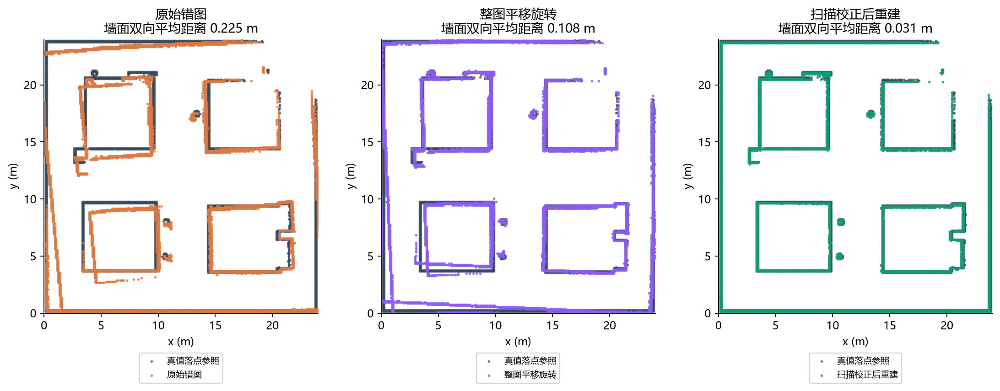
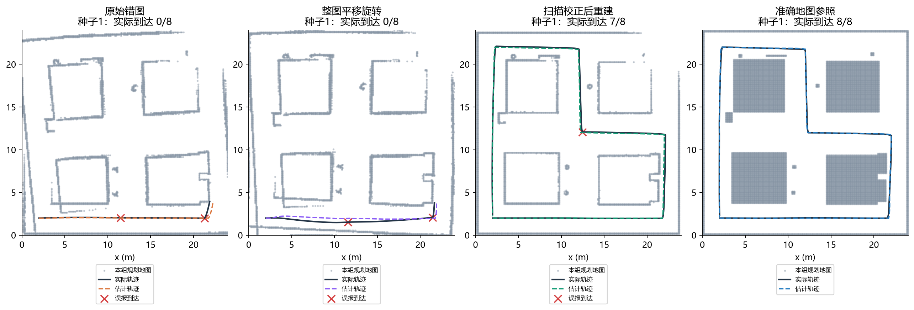
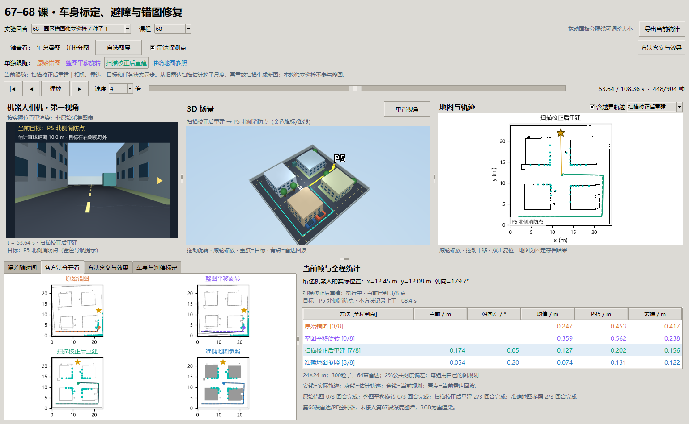

# 第 68 课：用旧扫描修正画歪的地图，再独立开一圈检查

承接[第 67 课](67-body-aware-obstacle-avoidance.md)：绕开眼前障碍能解决“这一步别撞”，但旧地图里的墙如果位置一直不对，定位和全局路线仍会受影响。本课固定一批第 66 课 的建图扫描，估计轮子读数的公共尺度偏差，重建地图后冻结，再执行新的巡检。

**本课已完成受控的离线修图实验。** 原图 3 轮只真正到达 5/24 个点，修图后 23/24，整轮完成 2/3。修图不是万能恢复：还有一轮误报完成，也没有实现通用在线 SLAM 或长期环境变化管理。

后续分别由[第七十课讲义](70-arrival-decisions.md)检验到点预算、[第七十一课讲义](71-bounded-recovery.md)检验无路恢复；保持本课冻结地图，原有23/24和误报记录保留，新的数字归入新批次。

## 1. 先讲清楚：到底修什么

想象沿街测绘。若每走 1 m 都记成 1.02 m，每转一个角也多记 2%，把墙面扫描放回地图时，误差就会随着运动积累。地图的不同路段会错开，不能只把整张纸向左挪一点就全部对齐。

我们的旧记录保留了两种东西：每个时刻雷达实际量到的距离，以及轮子推算的运动。距离没有因为落图错误而消失。因此可以重新解释“当时车在哪里”，再把同一批扫描重新投到地图中。

这与当前避障的区别是时间尺度和修改对象：第 67 课 改变下一步怎么走；本课改变过去的位姿和长期地图。两者需要最终协作，但本批先分别验证。

## 2. 变量、单位和信息权限

| 变量 / 概念 | 含义及单位 | 在实验中怎样变化 |
| --- | --- | --- |
| 里程计位姿 `(x,y,θ)` | 轮子累计得到的位置 m、朝向 rad | 固定输入，包含 2% 公共刻度误差 |
| 扫描 `ranges / hits` | 64 束距离 m、是否命中 | 固定的旧建图扫描；无命中不伪造墙点 |
| 关键帧 | 需要配准的一组稀疏时刻 | 累积平移大于 0.25 m 或转动大于 0.14 rad 选一帧 |
| 相邻运动 `ΔT` | 两个关键帧间如何平移、转动 | 先由里程计给初值，再由扫描匹配修正 |
| 点到线残差 | 扫描点离对应墙面多远，m | 匹配正确时缩小；重复结构下也可能虚假地很小 |
| 平移尺度 `s_t` | 轮子平移读数应乘的系数，无单位 | 从扫描约束估计，本次 0.974051 |
| 转角尺度 `s_r` | 轮子转角读数应乘的系数，无单位 | 从转弯扫描约束估计，本次 0.980178 |
| 刚体配准 | 整张地图只平移、旋转 | 作为对照，不改变内部各路段的相对形状 |
| 地图 P / R | 固定 0.20 m 容差下的精确率 / 召回率 | 判断画出的墙是否有对应、参考墙是否被覆盖 |
| 双向墙面距离 | 两张端点图各自到对方最近点距离均值再平均，m | 比单看一边更不容易被少画墙“骗高分” |
| 到点 / 自报到点 | 真实距离验收 / 算法宣布到达 | 必须分别计数，避免定位偏差造成伪成功 |

修图器只能读取 `odom、ranges、hits`，不读真实轨迹、建筑几何、真实偏差数值或查询段数据。所有轨迹从同一个已知初始坐标出发；不声称没有外部信息也能得到 GIS 绝对坐标。旧建图巡游本身是第 66 课 的真值控制诊断采集，不是自主 SLAM 探索成功的证据。

## 3. 原理：从两张局部扫描开始

### 3.1 找墙，比单纯找最近的点更合适

同一面墙在相邻时刻会被不同的激光束打中，两个点不一定代表同一块墙皮。我们把相邻回波构成局部线段，只对有效、相邻距离不超过 1.3 m 的点连接。根据里程计初值选附近线段，将当前点变换后，最小化它沿墙面法线方向的距离，即二维点到线 ICP。

ICP 可以理解为反复做两步：“为当前点找可能对应的墙”“微调本次移动和转角，让点更贴墙”。沿一面无限长直墙滑动，点仍然能贴墙，因此匹配小残差不等于运动已经确定。

本课使用 SciPy 鲁棒最小二乘，降低少量错配的影响；运动搜索范围限制在初值附近。内点比例、残差以及约束方向是否充分共同决定接受或拒绝，而不是只看最后误差一个数。

### 3.2 多个可信局部运动一起估计两个尺度

对每个被接受的平移约束，比较扫描估计的移动长度和轮子读数长度：

`扫描估计长度 ≈ s_t × 轮子读数长度`。

转角同理：`扫描估计转角 ≈ s_r × 轮子读数转角`。多个直行和转弯片段共同拟合两个系数。只有直行就不能可靠校准转角，只有很小的运动也容易被噪声淹没，因此设置最少平移和转弯约束数量。

本次 305 对候选中接受 142 对，其中 124 个足够长的平移约束、19 个足够大的转角约束，两类可重叠。拟合范围预设为 0.8–1.2，不把真实 `1/1.02` 当输入。事后对照的真实逆尺度为 0.980392；转角估计接近它，平移估计仍偏约 0.00634，不能称完全恢复真值。

### 3.3 用修正运动重走历史，再重新落图

将每步轮子增量分别乘 `s_t、s_r`，按运动学组合得到新的历史轨迹。每束旧扫描再从新位姿投出：同一堵墙的点就有机会重合。地图是由数据重新生成的，不是手工把墙拖到真实建筑上。

本实现只估计**整段恒定的两个尺度**，没有每帧位姿图优化、回环边、地图版本在线切换。它适合本次已知类型的系统性误差；遇到单侧轮偏差、打滑、时变尺度或错误回环，需要另一个模型。

## 4. 四组对照与独立查询

| 组别 | 地图怎样获得 | 新巡检怎样使用 |
| --- | --- | --- |
| 原始错图 | 旧有偏里程计投影 | 在原图上 PF 定位并规划 |
| 整图平移旋转 | 将原轨迹刚体对齐到同一份扫描修正轨迹，再投图 | 在刚体对齐图上定位、规划 |
| 扫描校正后重建 | 用两个尺度修正历史增量，重新投扫描 | 在修后图上定位、规划 |
| 准确地图参照 | 仿真建筑几何 | 在准确图上定位、规划，作为参照 |

刚体组也没有使用真值；它已获得同一份传感器修正轨迹作为对齐对象，是一个较有利的整体配准对照。它仍无法改变地图内部形变。

地图生成完就冻结。随后每组 3 个种子、每轮 8 个巡检点，共 12 回合；沿用第 66 课 的 300 粒子、64 束雷达、2% 轮子公共刻度偏差、跟随器和近障停车。**与第 66 课 的关键区别：这次每组在自己的图上规划；第 66 课 各组共享准确避障图。** 因而新旧成绩不能直接当作单变量提升比较。

本课没有接入第 67 课 新车身和深度避障，目的是先隔离地图质量。持续 RGB 没有参与定位，窗口相机只是重渲染。

## 5. 地图有没有真的变准



深灰色是同一批扫描按真值位姿投出的诊断参考；橙、紫、绿依次是原图、刚体图、修后图。左右和上下边界原本各自歪向不同方向，整体平移旋转后仍有双墙；重算历史运动后大部分墙面重合。

| 指标 | 原图 | 仅刚体对齐 | 扫描校正重建 |
| --- | ---: | ---: | ---: |
| 建图轨迹平均位置误差 m | 0.564 | 0.285 | **0.091** |
| 建图轨迹位置误差 P95 m | 1.461 | 0.804 | **0.136** |
| 地图精确率 P，20 cm 容差 | 0.611 | 0.804 | **0.997** |
| 地图召回率 R，20 cm 容差 | 0.688 | 0.856 | **0.999** |
| 双向墙面平均距离 m | 0.225 | 0.108 | **0.031** |

这里的地图指标比较的是端点图，不是建筑内部的整块占据面积；参考图又与候选图共享同一批测距噪声，因此高 P/R 不能替代独立查询。下一节正是为了避免“修自己用过的数据看起来很漂亮，就宣布导航成功”。

## 6. 修图之后机器人实际走得怎样

| 地图 | 整轮完成 / 3 | 真正到达 / 24 点 | 其余结束原因 | 碰撞回合 |
| --- | ---: | ---: | --- | ---: |
| 原始错图 | 0 | 5 | 2 轮误报完成，1 轮无路 | 0 |
| 整图平移旋转 | 0 | 0 | 2 轮无路，1 轮接触终止 | 1 |
| 扫描校正重建 | **2** | **23** | 1 轮误报完成 | 0 |
| 准确地图参照 | 2 | 18 | 1 轮无路 | 0 |



每格背景是该组实际用于规划的图。深色实线为真实运动，彩色虚线为估计运动；红叉表示自报到点但真实距离未过门。统一选择种子 1，既包含修复收益，也包含尚未解决的失败，不只展示成功种子。

修后图三轮平均定位误差分别约 0.118、0.127、0.119 m，说明误差已明显受控，但不是零。种子 1 在第 4 个点（53.64 s）宣布到达，实际还差 **0.4609 m**，超过固定 0.45 m 门限。保留失败、不放宽门限；算法自报 8/8，评分只记 7/8。

准确图种子 0 到第 3 个点途中于 33.6 s 无路。当时位置误差只有 **0.0549 m**，估计位置仍可能跨过离散膨胀图的安全边界，导致规划起点不合法。可见平均误差很小也不保证任务完整完成。修图组点数高于参照组，不足以证明修后图优于准确图：地图表示、所选路线和提前终止都不同，只有 3 个种子。

本批拟合、构图和 12 回合查询合计墙钟约 5.29 s；这是轻量运动学与二维扫描实验，不含窗口渲染或成熟 SLAM 系统的运行成本。

## 7. 为什么同样的扫描匹配换环境会变样

固定同一次相对运动，对长平行走廊、封闭房间、街角做几何诊断：

| 环境 | 无噪声时发生什么 | 原因 |
| --- | --- | --- |
| 长平行走廊 | 沿走廊仍有约 3.89 cm 平移误差，却能取得近零点到线残差；退化门拒绝 | 向前滑动几乎不改变与两侧墙的距离，缺少纵向约束 |
| 封闭房间 | 本已知对应附近问题恢复到数值精度 | 前后墙提供第二个方向，两个平移方向都被约束 |
| 街角 | 同样的运动可获得不同方向的约束 | 转角和非平行结构让错误移动更容易表现为残差 |

有噪声时还出现一个必须保留的负例：3 cm 噪声把平行走廊的最小奇异值抬到 0.654，超过当前 0.5 门限，于是门控错误接受了该退化场景；运动平移误差仍约 3.43 cm。**残差小、数值矩阵满秩，都不必然等于场景提供了可靠信息。** 后续需要相对条件数、尺度归一化、法向方向分布与多帧一致性共同检验，不能宣称目前退化检测已完善。

实现预试中也遇到真实失败：最初将点拉向有限线段的端部，平移尺度约 0.9498，地图反而收缩；修正为沿墙面法线的点到线残差后，得到当前 0.9741。预试目录保留在 `results/map_repair_probe1`、`probe2`，不混入正式 3 种子成绩。这解释了为何“换一个优化器”有时救不了问题：残差表达先要对应实际可观察的几何。

## 8. 理论对应、窗口和复现

扫描配准对应 ICP；二维点到线与三维点到平面具有相似的法向残差思路，可参照 [Open3D 官方 ICP 说明](https://www.open3d.org/docs/release/tutorial/pipelines/icp_registration.html)。本课实现使用 NumPy/SciPy，没有调用 Open3D，也没有接入 SLAM Toolbox。完整持续建图方案仍见[后续研究规划](campus-map-repair-plan.md)。

```powershell
# 没有第 66 课 数据时，先按第 66 课 讲义生成 campus_patrol_v1
uv run python -m embodied_learning.experiments.map_repair --source results/campus_patrol_v1 --output results/map_repair_my_run
uv run python docs/img/make_navigation_study_figures.py --repair results/map_repair_my_run
uv run python -m embodied_learning.navigation_study_demo --lesson 68 --repair results/map_repair_my_run --play
uv run python scripts/test.py full tests/test_map_repair.py tests/test_navigation_study_viewer.py
```

窗口默认种子 1，可看到那次 7/8。一键选择方法会同步当前底图、相机、雷达回波、3D、规划目标和统计；“并排分图”各自使用自己的地图。第一视角跟随各自实际执行的机器人，不能把估计轨迹误当作物体穿墙运动。

正式目录 `results/map_repair_v1` 保存 `protocol.json`、`constraints.json`、修前/修后轨迹、四张冻结地图和 12 段查询记录；[基准摘要](benchmarks/navigation-studies-67-68-v1.json)包含输入哈希与所有结果。大数组在本地，Git 保存实现、可读摘要与图表。



## 原始来源与本地适配（2026-10-09补引）

[Probabilistic Robotics](https://robots.stanford.edu/probabilistic-robotics/)（Sebastian Thrun / Wolfram Burgard / Dieter Fox，2005）；[Open3D · ICP registration](https://open3d.org/docs/release/tutorial/pipelines/icp_registration.html)（Open3D 官方实现文档）。

本地对照、观测/评分权限与实际版本见正文；第64课另有实际官方 AMCL 参数回读对照，其他简化栈不当作已运行官方导航系统。 [完整采用关系与引用规则](references.md)。

## 思考题

1. 整张图平移旋转后，为什么左下角好了、右上角仍不对？什么情况下刚体对齐其实足够？
2. 只有平行墙的走廊里，沿墙移动为什么不增加点到线误差？再加一根立柱会提供什么信息？
3. 为什么知道真实偏差是 2% 后，不能直接把 1/1.02 写进修图器再宣布成功？本课哪些信息只允许评分器访问？
4. 地图 P/R 接近 1，为什么独立巡检仍会误报一个点？定位误差、停车门限、停止速度应该怎样一起验收？
5. 如果轮子在湿地突然打滑，两个恒定尺度还能解释所有历史片段吗？应保存什么诊断量来拒绝这个模型？

### 延伸问题（保留原题，不计入核心五题）

6. 停车车辆今天消失了，能否直接用本课轨迹重放把它从长期图删掉？需要补什么观测和变化确认规则？

## 停止点与下一步

本课证明：在恒定公共刻度偏差、已知初始坐标和足够几何观测下，已有扫描能够自动约束历史运动，并改善冻结地图上的独立巡检。它没有证明通用错图恢复、在线形变优化、动态地图更新、真实相机融合或绝对地理配准。

下一步先处理两个暴露出的机制：窄路的朝向足印规划，以及完成判据和无路恢复；再把第 67 课 局部观测接到第 68 课 修后地图上，保持新对照与留出布局。完整的阶段判断、证据分级与推进顺序见[阶段小结](navigation-stage-review-66-68.md)。
