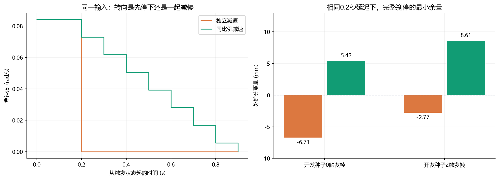
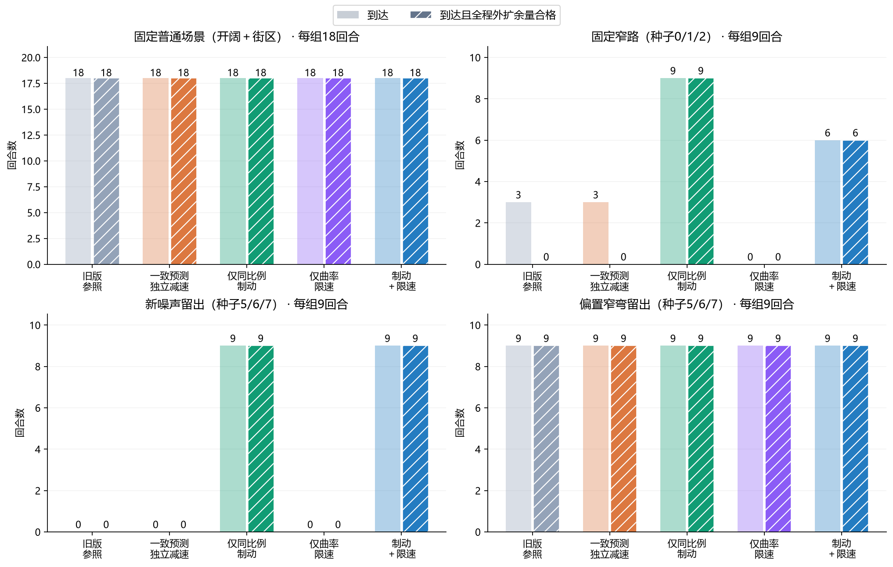
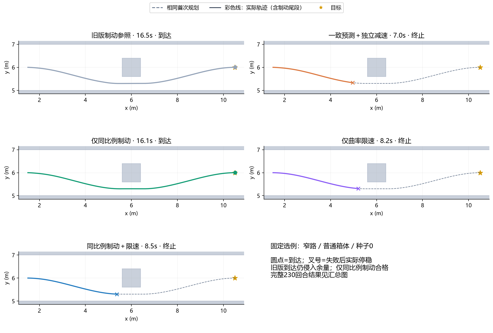
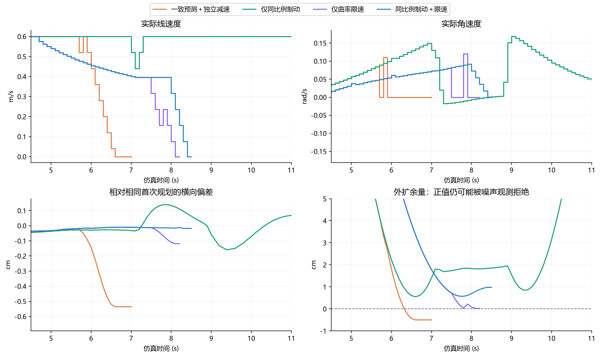
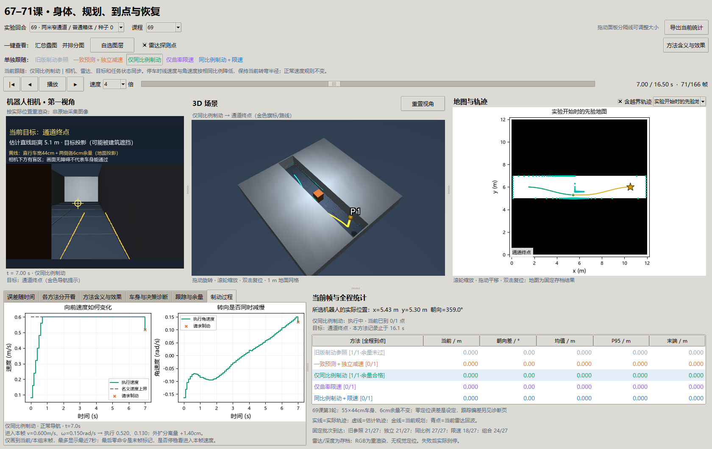

# 第69课第三轮：车要停下来，为什么还得继续转弯？

日期：2026-09-30。承接[第二轮讲义](69-footprint-tracking-round2.md)，按[第三轮预登记](69-braking-round3-plan.md)冻结参数后运行。仍属第69课，不把同一问题的迭代另编新课号。

**结论：保持转弯形状的制动，在本批受控实验中补上了窄路执行缺口。** “仅同比例制动”组固定批次27/27到达，新噪声留出9/9、偏置布局留出9/9，全部保持采样检查下的6cm外扩余量；过窄负例正确拒绝、没有移动。但叠加曲率限速后，固定批次退为24/27。其他组失败与余量违规全部保留。这里没有证明任意环境、真实定位误差或实机下都可靠。

## 1. 从一个具体动作理解问题

第二轮的一次制动前，机器人以0.6m/s向前走，同时以约0.084rad/s缓慢转弯。它每0.1秒更新一次命令。原规则允许一帧线速度最多减0.08m/s、角速度最多减0.18rad/s，于是请求停车后：

```text
原独立减速：  (0.600, 0.0840) → (0.520, 0.0000)
同比例减速：  (0.600, 0.0840) → (0.520, 0.0728)
              单位分别为 m/s、rad/s
```

第一种动作还在向前走，车头却不再转；第二种同时减慢前进和转向，短时间内保持原来那条弧线。窄缝两侧的容错只有厘米级，制动时切向内侧就可能吃掉全部余量。

因此本轮的核心不是再找一条更漂亮的计划线，而是核对：**预测它怎么停、实际让它怎么停、评分有没有把整个停车过程算进去。**

## 2. 变量、单位及相互关系

| 变量 / 概念 | 通俗含义 | 在本轮中怎样使用 |
| --- | --- | --- |
| `v`，m/s | 向前移动的速度 | 名义上限仍0.6；实际值受加减速度和保护动作影响 |
| `ω`，rad/s | 车头转动的速度 | 上限仍±1；停车时是否与v一起缩小是独立因素 |
| `ω/v`，1/m | 当前运动的曲率，v不为0时才有意义 | 比值保持，便保持当前转弯半径；纯转动另按速度缩放处理 |
| `a_v=0.8m/s²`、`a_ω=1.8rad/s²` | 两个方向允许的减速度 | 四组相同；同比例制动不可以突破任一上限 |
| `T`，s | 在这些减速度限制下至少需要多久降到零 | 取两项所需时间中的较大者 |
| `α` | 这一帧停车后还保留原速度的多少比例 | v与ω都乘它；不是增加额外推力 |
| `Δt=0.1s` | 命令更新间隔 | 预测和执行都按同样的离散步骤积分 |
| `latency=0.2s` | 为尚未来得及反应预留的保持时间 | 预测同时检查立即刹停和先保持两帧再刹停；实际闭环仍立即执行新命令，未注入真实延迟 |
| `H`，m | 向前看多少路线来决定速度 | 原35cm前视距离，加延迟行驶距离和估计刹停距离 |
| `K`，1/m | H范围内最大的绝对路径曲率 | 弯越急，允许的名义速度越低 |
| `a_lat=0.04m/s²` | 预设横向加速度预算 | 用于教学限速，不是实机标定值或安全保证 |
| `speed_cap` / 实际速度 | 希望不超过的速度 / 本帧真正执行值 | 降速需要时间，当前实际速度可暂时高于新上界，照常评分 |
| `incoming_velocity` | 进入这一帧时已经执行的速度 | 用它确认停稳，不能只看末帧人为写下的零命令 |
| 失败触发帧 / 制动尾段 | 决定结束任务的时刻 / 此后真正减到零的运动 | 分别记录原因、时间、距离和最小间隙 |
| 到达 / 余量合格到达 | 停在25cm目标圈内 / 还要求全程外扩足印分离量大于0 | 表格分列，防止把“没撞上”当作“保持了预留空间” |

55×44cm身体、58cm高度、各边6cm外扩、雷达与深度噪声、先验地图、切线反馈、原曲线保留、矩形规划均沿用。精确轮里程计仍是受控条件，所以定位误差为零；这是设定，不是定位算法的新成绩。RGB仍为重渲染，控制使用存档对应的雷达和解析深度。

## 3. 两个实验因素的原理

### 3.1 同比例制动：先保证两项都来得及停

```text
T = max(|v| / a_v, |ω| / a_ω)
α = max(0, 1 − Δt/T)
下一帧停车速度 = (αv, αω)
```

当T小于等于一帧时，两项直接变0；本来已经停稳也保持0。因为T取较大值，较难停下的那一项决定整体减速比例，另一项跟着它慢下来。每一步都检查没有超过原线/角减速度。只有停车请求采用这个规则；正常跟踪的转向反馈不变。

曲率保持只是几何性质，不保证这条弧线本来就安全。当前弯线若指向墙，保持它照样危险。因此新组仍须检查车身扫过的空间；传感器没看见的东西也不会因公式成立而自动被发现。

### 3.2 曲率限速：另一个开关，不能自动归功给制动

```text
H = 0.35 + 0.2|v| + v²/(2×0.8)
K = 前方H范围内的最大绝对曲率
名义速度上界 = min(0.6, sqrt(0.04 / max(K, 10⁻⁹)))
```

这来自`横向加速度约为v²K`的关系。例如K=0.5/m时，上界约0.283m/s。速度变化后，跟踪器的`v×κ`转向前馈也用新速度计算，横向纠偏和朝向增益不改。诊断中的`nominal_command`是限速后的请求；兼容记录`tracking_angular_raw`保留限速前的基础转向原始值。

这种限速与[Nav2 Regulated Pure Pursuit文档](https://docs.nav2.org/rolling/configuration_and_development/configuration_guide/controller_plugins/configuring_regulated_pp/)讨论的曲率速度调节有关，但本课是独立教学实现，未调用Nav2，也未实现它的完整碰撞与速度约束体系。参数0.04仅是预先登记的候选，不能因为正式结果不好就事后换参数再说原假设通过。

## 4. 为什么这次需要五组

旧版预测每0.04秒采样减速，执行每0.1秒更新；失败时又直接结束记录。若把预测和尾段补齐与新减速方式混在一起，只比较前后成绩，就无法区分收益来源。

| 组别 | 刹停预测 | 停车减速 | 曲率限速 |
| --- | --- | --- | --- |
| 旧版制动参照 | 第二轮旧预测 | 独立 | 关 |
| 一致预测＋独立减速 | 同执行10Hz，立即/延迟两分支 | 独立 | 关 |
| 仅同比例制动 | 同执行10Hz，立即/延迟两分支 | 同比例 | 关 |
| 仅曲率限速 | 同执行10Hz，立即/延迟两分支 | 独立 | 开 |
| 同比例制动＋限速 | 同执行10Hz，立即/延迟两分支 | 同比例 | 开 |

后四组形成2×2。旧版参照单独解释共同口径变化，不能用它与“仅同比例制动”的差值独立估算制动因果收益。应主要比较“一致预测＋独立减速”与“仅同比例制动”。

所有组都补录失败后的实际制动。旧版参照的27个固定回合，在旧终止帧前的全部既有执行数组逐位不变，旧末帧位置也一致；新增尾段另算。到点仍保留真实25cm圈与线速度低于0.05m/s的资格条件，但最终完成还要求线/角速度真正归零后仍在圈内。这个共同收紧的终止口径在本轮各组相同。

如果实际接触，则保留接触后的位姿和进入速度并终止运动学回合，不能通过写零命令假装已经停稳。本批未发生此类接触。

## 5. 先做同输入反事实，再看完整闭环

从第二轮种子0的5.8秒、种子2的5.7秒提取同一真实/估计位姿、已执行速度和截至该帧的观测记忆，只替换后续停车规则。四条立即/延迟轨迹使用相同身体与减速度，并做独立真实几何评分。

| 相同输入 | 立即独立减速 | 立即同比例减速 | 延迟0.2秒独立减速 | 延迟0.2秒同比例减速 |
| --- | --- | --- | --- | --- |
| 种子0触发状态 | +2.82mm | +14.77mm | −6.71mm | +5.42mm |
| 种子2触发状态 | +8.42mm | +19.64mm | −2.77mm | +8.61mm |

以上为完整停车过程的最小外扩分离量：正值分开，负值重叠，不是实体穿透深度。



读图：左侧固定种子2输入，橙线在保持0.2秒后角速度一帧降到0，绿线随前进速度逐步降低；右侧是两个输入在相同延迟下的最小余量。它支持一个局部机制，不代表整个任务一定完成。

然后只用开发种子0/2跑10回合：仅同比例制动两例都合格；限速组合仍有一例失败。保留预试和源码，按原参数冻结全部正式组，未使用种子5/6/7或新布局调参。

## 6. 全230回合结果

固定：三环境×三高度×种子0/1/2×五组=135。新噪声留出：原窄路×三高度×新种子5/6/7×五组=45。布局留出：偏置窄弯同样45。另有0.50m窄口负例五组各一回合。共230回合，运行墙钟502.88秒，约8分23秒，包含观测、规划、写档和事后诊断。

| 组别 | 固定总到达 | 固定窄路到达 / 余量合格 | 新噪声到达 / 余量合格 | 偏置布局到达 / 余量合格 |
| --- | --- | --- | --- | --- |
| 旧版参照 | 21/27 | 3/9 / **0/9** | 0/9 / 0/9 | 9/9 / 9/9 |
| 一致预测＋独立减速 | 21/27 | 3/9 / **0/9** | 0/9 / 0/9 | 9/9 / 9/9 |
| 仅同比例制动 | **27/27** | **9/9 / 9/9** | **9/9 / 9/9** | 9/9 / 9/9 |
| 仅曲率限速 | 18/27 | 0/9 / 0/9 | 0/9 / 0/9 | 9/9 / 9/9 |
| 同比例制动＋限速 | 24/27 | 6/9 / 6/9 | 9/9 / 9/9 | 9/9 / 9/9 |

五组在原开阔/街区都18/18到达且余量合格；所有230回合零实体接触。负例五组都在原地拒绝。负例初始外扩足印就放不下，所以它的负分离量应解释为拒绝依据，不能与可通行场景混算成“机器人行驶造成的违规”。



读图：四幅图分别是普通场景、固定窄路、新噪声、偏置布局。每种方法浅柱表示到达，斜线深柱表示到达且全程余量合格。灰色旧版、橙色一致预测独立减速、绿色同比例、紫色限速、蓝色组合，与窗口一致。

**同比例组的45个可通行回合全部完成且余量合格。** 固定批次最小实体分离间隙约6.93cm，最小外扩分离量5.25mm；新噪声最小外扩分离量5.37mm，偏置布局14.45mm。这些是有限采样和固定噪声下的结果，剩下几毫米余量不足以覆盖所有真实定位或执行误差。

每个9回合分母实际是三种障碍高度×三个种子，不能说成九个独立随机种子。偏置布局将新增箱体移到`[4.8,5.6]×[5.7,6.5]`，下方缝从60cm变为70cm、上方变为50cm。它改变了入弯位置，也给下方路线更多空间，旧版就能通过；这是“可用间隙影响算法表现”的证据，不是新算法在更难环境中独占成功的证据。

## 7. 相同路线，实际怎么走



固定选例为开发种子0、窄路普通箱体。灰虚线是相同首次规划，彩色实线含全部实际运动和制动尾段，金星是目标。旧版16.5秒到达但余量未过；同比例组16.1秒到达且余量合格。其余三组在7.0、8.2、8.5秒终止并实际停稳。

这里旧版到达时间与第二轮的16.4秒可能相差一帧，因为第三轮等到角速度也实际归零才结束；不应把这个口径差写成算法变慢。旧版与新组在本轮统一终止条件下比较。



读图：仍固定种子0，上排是实际线速度、角速度，左下是相对首次路线的横向偏差，右下是外扩分离量（局部显示−1到5cm，虚线0表示重叠）。仅同比例组的保护制动没有让转向瞬间消失，之后接回路线。组合组横向偏差很小仍失败，说明“跟得准”也不等于“观测认为可走”。

## 8. 为什么加了限速反而少到达三个回合

种子0组合组8秒触发无路时，真实外扩间隙仍有6.93mm，先验图单独检查也允许当前位置；加入累计观测后，外扩足印被拒绝。

诊断找到落在外扩矩形内的三点，其平面坐标相同：约`(5.6011,5.0100)`。它们是**同一束雷达回波复制到0.15、0.40、0.55m三个高度的保守柱状表示**，不是三束独立回波。真实下墙边界是y=5.0000，噪声落点向通道内偏约9.97mm，足以跨过约6.93mm间隙。定位在这里是精确的，不能把这种现象归因于PF漂移。

降低速度改变每个时刻的位置、后续采样和观测体素的覆盖；同一个种子不再在同一空间位置产生同一观测。因此不能仅凭上述例子断言“慢速必然积累更多噪声”，但可以确认：这次失败由观测约束拒绝触发，而非当时的真实墙或先验墙占住车身。

它随后以进入速度约`(0.3964m/s,0.0915rad/s)`执行同比例制动，继续移动7.86cm、0.5秒后停稳；整段仍保持外扩间隙。这个尾段在上一版会被截断。此处的正确结果是“安全停下但任务未完成”，不是“已经绕过去”。

全部51个可通行条件下的失败还包括先验足印确实无效，以及当前位置可行但后续路线/搜索不成立的情况，分类和触发帧见[完整摘要](benchmarks/braking-navigation-v3.json)。不能把它们全部叫噪声故障，也不能为避免误拒直接忽略单次危险回波。

## 9. 计算耗时与实时边界

以下为固定批次每组27回合的统计，包含初始规划；仿真仍等待计算，0.2秒只在安全预测中预留，不等于执行了真实传输延迟。

| 组别 | 整步P95 | 整步最大 | 首次规划P95 | 后续规划P95 / 最大 |
| --- | --- | --- | --- | --- |
| 旧版参照 | 20.2ms | 186.5ms | 178.0ms | 26.8 / 30.5ms |
| 一致预测独立减速 | 24.9ms | 180.5ms | 177.7ms | 27.1 / 31.0ms |
| 仅同比例制动 | 24.8ms | 185.3ms | 177.1ms | 26.6 / 48.0ms |
| 仅限速 | 23.7ms | 180.8ms | 176.6ms | 27.4 / 33.2ms |
| 制动＋限速 | 22.9ms | 183.4ms | 176.6ms | 26.6 / 30.5ms |

同比例组固定批次27/4365次整步计算超过100ms。首次规划应该在机器人静止时准备；进入运动后还需截止时间和失效策略，才能讨论硬实时。不能因为本批后续规划较快就宣布任意搜索都能赶上10Hz，更没有在这次五组中额外修改搜索预算。

在开阔/街区，原速度组完成约16.0–16.1秒，限速组约19秒。限速除了可能改变观测，还付出了行驶时间代价；本候选没有给出值得默认叠加的额外收益。

## 10. 窗口、讲义和验证如何对应



窗口固定展示种子0同比例组7秒。五个方法按钮一次同步第一视角、3D、地图、雷达点、目标、统计和当前诊断页。第六页“制动过程”显示实际速度、名义速度上界和制动请求；“跟踪与余量”保留横向偏差与外扩分离量。表格将“到达但余量未过”和“到达且余量合格”写在方法旁边，避免全零定位误差掩盖不同的导航结果。

曲线只显示当前及过去帧，提前结束的方法停在自己的实际末帧；当前帧进入速度与本帧命令分开显示。车身页按所选组重新计算延迟制动示意，并注明控制器还检查立即制动分支。黄色示意框不含6cm外扩，不能当完整安全评分图。

验证包括解析制动比例、双加速度限制、预测与独立圆弧积分、曲率预算、与旧版观测记忆一致、失败后真实刹停、过窄拒绝、五来源真实Tk同步。独立审计重新积分全部动作并用角点投影检查整段采样车身/外扩扫掠，核对旧参照27份执行前缀、46个条件的五组首次规划及源码哈希。详见[第三轮验收记录](benchmarks/braking-navigation-v3-validation.json)。

本轮quick839项通过，入口91.2秒；受影响完整选择集60项通过，34.8秒。旧算法源码未改，不重复运行不相关的历史慢层。测试通过与本实验门槛、连续安全证明和实机验收分别说明。

## 11. 思考题

1. 让v和ω分别最快降到零，为什么不一定是几何上最安全的停车方式？
2. 若v=0但ω不为0，同比例公式能否处理？若某项减速度较小，谁决定总停车时间？
3. 为什么同时检查立即制动和延迟制动？预留0.2秒空间与真的延迟0.2秒执行有什么区别？
4. 旧版参照与一致预测组同样21/27，能否认为改预测没有影响？比较具体回合和余量合格数。
5. 同一束回波的三个高度点能否当作三份独立证据？给点计置信度时应怎样保留来源？
6. 为什么新布局旧版也通过？怎样设计下一批才能区分更多间隙与更强算法？
7. 45/45合格是否说明0.5cm定位偏差也能通过？请把最小外扩分离量与误差来源分开考虑。
8. 最后一帧写了零命令，为什么还需要检查`incoming_velocity`、动作积分与完整尾段？
9. 如果把真实延迟、轮胎滑动或动态障碍加入模型，应新增哪些记录和失败门槛？

## 12. 复现与下一步

旧数据不覆盖，原始数组与源码快照本地保存，Git包含[230回合摘要与哈希](benchmarks/braking-navigation-v3.json)、图表脚本和本页。新克隆先按第一/二轮讲义生成依赖，再运行：

```powershell
uv run python scripts/check_braking_counterfactual.py
uv run python -m embodied_learning.experiments.braking_navigation
uv run python scripts/analyze_braking_navigation.py
uv run python docs/img/make_braking_figures.py
uv run python -m embodied_learning.navigation_study_demo --lesson 69 --play
uv run python scripts/check_braking_window.py
uv run python scripts/validate_braking_navigation.py
```

固定输出为`results/braking_navigation_v3`，已存在时拒绝覆盖。重复实验用`--output results/braking_navigation_repeat`，窗口用`--footprint results/braking_navigation_repeat`。正式图表/分析/审计默认仍指向冻结v3；重复数据不能代替原哈希。反事实脚本输出`results/braking_counterfactual_v3`也拒绝覆盖。开发冒烟用`--smoke --output results/braking_smoke_new`，只有种子0/2十回合。

本轮选择“仅同比例制动”作为后续受控窄路基线，限速候选保留为负结果，不默认叠加。接下来按以下顺序登记：

1. **先验证边界**：保留同一60cm缝，对位置/朝向误差、实际执行延迟做单变量扫描；以外扩余量和真实接触评分，不能拿当前精确定位结果代替。种子5/6/7已使用，下一轮留出另选。
2. **观测误拒单独研究**：保留回波来源、时间和噪声预算；先用“真实静态墙＋偶发偏移回波”和“真实新障碍”两个对照，比较重复支持、衰减或置信度。必须同时看减少误拒与漏障碰撞，不能简单删掉孤立点。
3. **回到70/71**：扩大到点判据的偏置集中反例、恢复的墙角/全封堵/无效量程反例，再在原圆盘平台做到点×恢复2×2。此阶段保持69矩形平台独立，避免再次混入不同身体与积分口径。
4. **统一与系统组合**：统一身体、传感器外参、执行模型及评分后，再把本轮制动接到修图/定位导航；先做静止首次规划，登记运行时截止预算，随后补完整连续RGB-D与视觉定位。65课似然场诊断、跨场景原门槛仍保留。

本轮在冻结批次完成后停止调整算法。可确认的是受控静态窄路上的机制收益；更多观测、更慢速度、更多模块都需要重新做对照。
