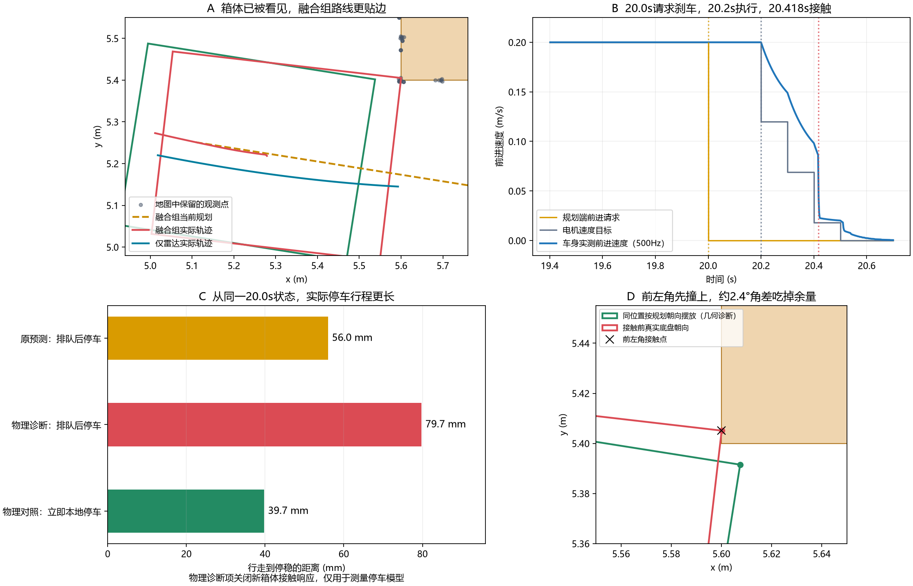

# 第六十九课接触复盘：为什么发了刹车请求，身体还是撞上了？

2026-10-01。复盘第十一轮开发种子0、普通箱体、雷达＋深度的85.94N接触中止。原始实验、源码和成绩保持冻结；本页是存档重建和停车机制对照。

## 1. 先说结论

箱体已经被传感器看到，并进入地图和安全检查。**直接问题是停车预测比物理身体停得更快**：预测把降速目标当成已实现的速度，限力电机却需要时间减速。保护以为还有空间，保留了排队中的两个前进请求。

同时，规划的路线过于贴边，接触前车头比规划朝向多偏了约2.38°，前左角伸到了箱体侧面。两者串起来就是：**几毫米余量的路线 → 转向误差挤掉余量 → 乐观停车预测允许继续执行旧请求 → 实际停不住 → 前左角接触 → 触发力阈值中止**。

因果证据是从保存的同一状态和完整速度重放：保留排队能精确重现接触；20.0s立即本地刹车，或19.9s提前一个控制周期发出排队刹车，都能无接触停下。它们只是停车对照，没有到达终点，不能记作导航成功。

## 2. 这次检查的对象和变量

正式种子29/30/31的融合组没有接触，两次失败是无路退出。这里检查的是同源码的开发反例，不能把它混入正式12回合的分母。仅雷达遇到低路障/悬空杆的137.87N接触属于高度盲区；本页箱体在32cm雷达平面上可见。

| 变量或概念 | 通俗含义 | 怎样影响这次失败？ |
| --- | --- | --- |
| 前进请求 | 规划器想让车怎样开 | 20.0s改为零，表达“开始停车” |
| 排队意图 | 已发出、还未执行的旧请求 | 19.8/19.9s的前进请求仍要先执行，刹车到20.2s生效 |
| 电机速度目标 | 驱动此刻尝试达到的速度 | 首次刹车目标从约0.20降到0.12m/s |
| 实测速度 | 身体真正还在怎样移动 | 第一段刹车结束仍为0.149m/s，没有瞬间降到0.12 |
| 停车包络 | 从当前状态到停稳，整个车身会占哪些地方 | 原预测长度偏短，因此危险被判得太晚 |
| 几何分离量 | 独立检查身体与箱体能否分开 | 正值表示分开、非正表示重叠；不是精确欧氏距离或物理压入 |
| 接触力 | MuJoCo接触求解器算出的法向力 | 单点85.94N超过登记的40N轻擦门限，触发中止 |
| 完整状态 | 位置、朝向以及世界x/y/转动速度 | 停车对照全部恢复，包含侧向运动，避免只恢复前进速度 |

“位置精确”仍是本轮人为固定条件；这次没有定位漂移。质量8kg、力限6.4N、伺服增益80、摩擦和接触刚度都是仿真设置。

## 3. 逐帧发生了什么？

| 时间 | 保存记录 | 含义 |
| --- | --- | --- |
| 19.5s | 从平滑路线切换为三点规划折线 | 第一条边的采样最小真实分离量只有3.884mm |
| 20.0s | 候选继续前进包络为负，发出`queue_body_brake` | 上游保护已发现继续走危险，开始请求停车 |
| 20.0s | 当前点预测排队停车仍有9.055mm | 它以为“先走完队列再刹车”仍来得及，没有即时本地接管 |
| 20.2s | 执行20.0s刹车请求，目标0.120m/s | 身体此刻仍以0.200m/s前进；目标和实际开始分离 |
| 20.3s | 实际速度0.149m/s，本地预测剩余间隙2.150mm | 电机减速慢于原运动学预测，本地保护仍放行 |
| 20.4s | 本地预测变为−4.208mm，接管 | 此时即使刹车也已经来不及 |
| 20.418s | 首个有力接触子步，`obstacle_6`与`body_0`接触 | 底盘前左角撞箱体朝向−x的侧面，两处竖向接触点各85.94N |
| 20.5–20.7s | 中止导航，真实减速到停稳 | 最后离目标约5.28m，没有到达 |

20.418s是500Hz存档子步结束时间，对应20.416–20.418s的积分步。接触位置约(x=5.60005m，y=5.40511m)，在底盘前左角；上部相机盒未首先接触。

## 4. 停车预测究竟错在哪里？

原预测先调用`brake_step`降低速度，再用降低后的速度积分整个0.1s。例如0.20m/s先减去`0.8×0.1=0.08`，便把下一整段当作0.12m/s运动。这个语义适用于原离散运动学执行器。

真实接触平台使用限力伺服：目标设为0.12m/s时，身体仍从0.20m/s开始，电机按速度差施力。速度差逐渐变小，制动力也变小。第一段实际平均减速度约0.509m/s²，而0.8m/s²是力限允许的最大值；最大值不能当成持续实现的减速度。

```text
预测：目标降到0.12 → 身体当作已经0.12 → 用0.12积分下一段
实际：目标降到0.12 → 身体仍约0.20 → 电机逐渐减速 → 段末约0.149
```

从20.0s状态算起，原预测排队停车行程约**56.0mm**；在相同质量、限力、伺服下，仅关闭新箱体的接触响应以测量不受碰撞阻滞的停车过程，物理行程为**79.7mm**。预测少算约23.7mm。碰到实体后的实际行程是74.0mm，因为接触改变了速度，不能用它代表无碰撞刹车能力。

停稳对照使用世界平移速度和角速度均小于0.01的原条件；没有把速度强制归零。原运动学预测则到零速终止，口径差异不会解释物理行程更长这一结果。

进一步把原预测轨迹交给真实几何评分，仍显示12.91mm正分离量；用全部本帧原始点检查也显示13.24mm。只换成真实几何或未压缩的点，同一条乐观停车轨迹仍会被判可行，说明停车动态不匹配已经足以解释这一保护缺口。

## 5. 路线、朝向和传感器各有什么责任？

**路线余量小。** 19.5s规划第一条边以约−9.005°行驶，1mm左右步长采样得到最小分离量3.884mm，与深度3mm、雷达5mm的噪声量级接近。规划器只要求观测点不落入身体，没有给跟踪误差和测量噪声明确预算。这个采样数值也不能当作连续空间安全保证。

**身体没有完全按那条边摆正。** 首次有力接触前，底盘朝向约比这条边多偏2.38°。在相同x/y位置只把身体摆回规划角度，独立几何检查得到约7.209mm正分离量，实际姿态则已重叠约0.109mm。这是几何敏感性检查，证明朝向会影响撞角；它不是另一个控制器已经安全通过的证据。

**融合改变了观测和后续驾驶，收益要分条件。** 相同种子和静止观测下，仅雷达组成功绕箱体，实际最小分离量约31.3mm；融合组选择了另一条更贴边的运动链。车辆开始走不同路线后视角也不同，不能仅凭此例断言“深度传感器更差”。当前组合还缺少抗观测/跟踪误差的可靠执行预算。

**箱体没有在撞击前一秒被地图删除。** 重建205帧观测更新，最后一秒箱体附近删除数为零；危险角附近仍有观测点。20.0s原始点的停车检查比存储点更宽松约4.19mm，未显示“压缩后漏掉这个危险才晚刹车”。早期点合并、删除、噪声是否改变选路仍需独立研究，本复盘没有排除所有上游地图影响。



逐图说明：

- **A**：橙色是真实箱体，灰点是20.0s地图保存的观测点；红线为融合组实际链，蓝线为仅雷达实际链，金色虚线为融合组当前规划。绿色底盘框在20.0s，红框在首次接触前。
- **B**：金色是规划端前进请求，灰色是电机速度目标，蓝色是500Hz实际前进速度。三条竖线分别标记请求刹车、执行刹车和首次接触。
- **C**：三条行程从同一20.0s状态开始；物理诊断项关闭新箱体接触响应测停车模型，立即本地停车项保留真实碰撞。它们都不是到点成绩。
- **D**：放大箱体角。红框是接触前实际底盘，绿框只改为规划角度，叉号是首次接触位置；可直接看到一点角差怎样移动前左角。

## 6. 改一个因素的停车对照

所有对照恢复同一存档中的位置、朝向、三个速度；已有队列只取当前时刻之前发出的请求，不读取未来规划。

| 停车条件 | 单点峰值力 | 停车过程最小几何分离量 | 能证明什么？ |
| --- | --- | --- | --- |
| 20.0s请求，按原0.2s队列执行 | 85.94N | −0.139mm | 全部后续物理状态与原存档一致，重现失败 |
| 20.0s本地立即刹车 | 0N | +26.57mm | 这个时刻存在无接触停车机会 |
| 19.9s请求，仍保留0.2s队列 | 0N | +9.04mm | 提前100ms足以在这个回合停住 |

这两种提前停车没有新选路、没有验证是否还能到达；结论只限于“本次接触可以由更早的物理制动避免”。

## 7. 为什么压入很小，仍被判接触失败？

用户允许轻擦后，登记口径是单点≤40N、压入≤5mm、最长连续≤0.5s，三项都必须满足。本例最大压入0.139mm、最长连续18ms满足后两项，但单点峰值85.94N超标，程序因此中止，不能再完成巡检。

40N是仿真实验的预设门限，不是已经对实机测定的损伤阈值。接触刚度和数值求解会影响峰值力；本复盘能证明撞角和门限触发，不能仅凭这个数值证明真实机器人会损坏。当前存档也不能证明解除门限后就能到达。

## 8. 下一步怎样修、怎样验？

优先级调整为：**先匹配停车预测与物理执行，再研究地图误拒和贴边选路。**

1. 新增独立候选，旧源码冻结。预测保留完整速度和电机响应，逐小步积分当前队列、候选请求、后续制动；同一观测点地图、跟踪、速度上限和40N口径保持不变。
2. 先验证不同初始前进/转动/侧向速度的预测误差。检验“预测停车扫掠”能覆盖无碰撞物理停车扫掠，不能只看终点或平均速度。
3. 在固定开发种子0上检查本反例是否避免接触，同时记录停车后能否重新规划到达；不能只停下来便宣称修好。
4. 再冻结候选，用新的噪声种子32/33/34和新布局验证低路障、横杆、箱体、高杆，单独报告到达、接触和误拒。若仍有接触，再分离观测不确定性与跟踪走廊，避免同时改多个因素。

思考题：为什么“刹车最大减速度”不等于“保证减速度”？为什么用完整真实几何检查一条错误停车轨迹仍可能漏判？允许轻擦以后，峰值力、持续时间、实际到达分别代表什么？同一算法加一个传感器，为何还需要重新验证选路与执行？

## 9. 复现和证据

```powershell
uv run python scripts/audit_navigation_contact_failure.py
```

脚本核验输入协议、全部冻结源码、两条存档SHA-256和静止期同观测，直接按保存的施力重放10350个2ms物理步，并重建205帧地图。状态和单点峰值力最大重放误差均为0；原队列停车的整段状态与实际存档逐项核对。图表由存档和明确标注的停车对照生成，并实际读图检查文字与图例。

[机器可读审计](benchmarks/navigation-contact-diagnosis-v11.json)包含选择规则、时间、接触对、预测检查、四个停车对照、源码和图像哈希。[开发原摘要](benchmarks/navigation-bypass-development-v11-metric.json)、[正式24回合](benchmarks/navigation-reinforcement-v11.json)保持原样。原始数组保留本地results，新克隆先按[第十一轮讲义](69-reachable-obstacles-round11.md)生成对应开发记录。本轮止于诊断，没有修改控制器或运行新正式批次。

## 原始来源与本地适配（2026-10-09补引）

[A Formal Basis for the Heuristic Determination of Minimum Cost Paths](https://ai.stanford.edu/~nilsson/OnlinePubs-Nils/PublishedPapers/astar.pdf)（Peter Hart / Nils Nilsson / Bertram Raphael，1968）；[Implementation of the Pure Pursuit Path Tracking Algorithm](https://publications.ri.cmu.edu/implementation-of-the-pure-pursuit-path-tracking-algorithm)（R. Craig Coulter，CMU技术报告1992）；[Modern Robotics: Mechanics, Planning, and Control](https://github.com/NxRLab/ModernRobotics)（Kevin Lynch / Frank Park，2017）。

在本地差速平台分离足印、动作队列、制动、观测地图和三维通行；这些受控扩展不是原 A* 或纯追踪自带的安全保证，各轮身体/权限/种子与失败分开。 [完整采用关系与引用规则](references.md)。
