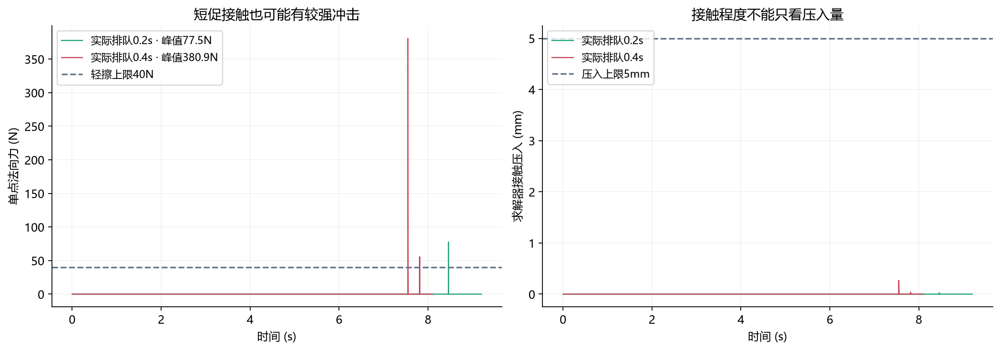
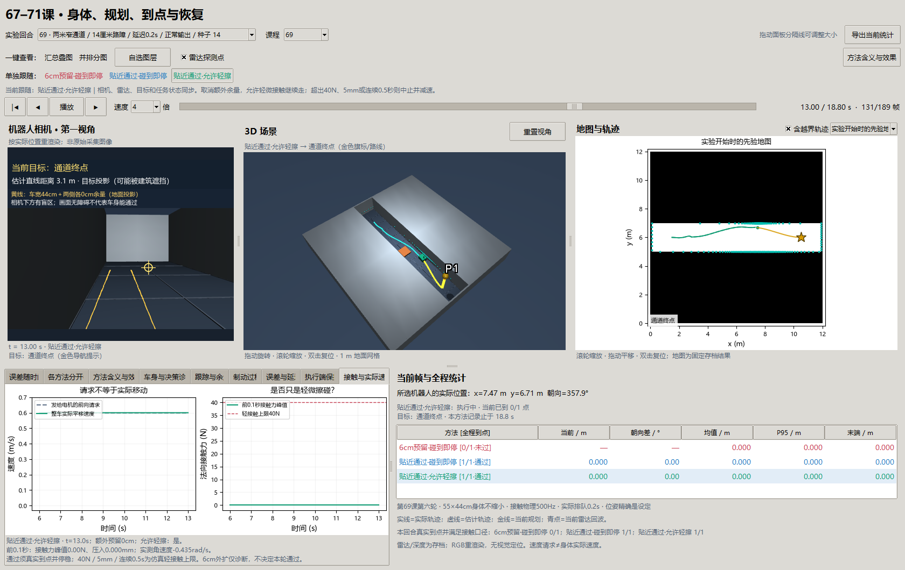

# 第六十九课第六轮：允许轻擦，能不能真正穿过窄路？

基线 `4de5f5a`，2026-10-01。接续[第五轮讲义](69-execution-round5.md)。用户将任务要求改为“允许轻微擦碰，只要能到达”。本轮保留真实车身尺寸，取消额外余量作为独立对照，并给接触加入真实物理响应。39回合、337.15秒；原数组位于本地 `results/contact_navigation_v6`，[完整摘要](benchmarks/contact-navigation-v6.json)随仓库保存。

**结论先说：减少额外预留空间确实让更多车通过。** 窄路主批次、排队0.2秒，6cm组0/9到达，零余量两组均6/9。允许轻擦没有再增加到达：成功回合没有接触；撞到的回合冲击超过本轮轻擦上限。因此证据支持“旧要求太保守”，尚不支持“靠擦着墙走解决了任务”。

## 1. 从生活直觉理解这次改变

搬一张桌子过门，桌子本身有宽度，你还可能想给两侧各留一点空间。门宽只比桌子大一点时，多留空间就会判定过不去；少留空间后可以慢慢过。但是，撞一下门框和把桌子穿进门框是两回事。

我们的车宽44cm，底盘长55cm，最高58cm。旧标准在两侧再各留6cm，直行时按56cm宽检查；若障碍旁只剩60cm通道，就只剩4cm总容错。取消额外余量后仍是44cm实体，绝没有把模型缩小。转弯时要看整车角落，不能只看44cm这一条横线。

此前的运动学实验每0.1秒把车沿圆弧推进一次，第一次身体重叠就终止。若只删除这个终止条件，车能直接穿墙，得到的“到达”没有意义。本轮改成物理接触：碰到墙会受阻，也可能沿边滑动、转向。相机、雷达、规划仍看同一套场景盒体；车身有底盘、支架、相机三个真实体积。

## 2. 新变量是什么，怎样一起变化？

| 变量 | 通俗含义与单位 | 在实验中的作用 |
| --- | --- | --- |
| `margin_m` | 身体外面额外想留的空隙，m | 三组分别为0.06、0、0；不是身体大小 |
| `requested_command` | 规划端本帧想让车怎么走，m/s、rad/s | 请求先排队，不一定立即生效 |
| `commands` | 执行端送给速度伺服的请求，m/s、rad/s | 已经过队列与保护，仍不是实际身体速度 |
| `world_velocity` | 身体实际x/y/yaw速度，m/s、rad/s | 接触后会侧滑或旋转，停车检查必须包含横向速度 |
| `incoming_velocity` | 实测速度投到车头方向，再加yaw速度 | 原跟踪/停车预测使用它；没有把请求当实测值 |
| `d估计` | 算法估计的车到目标距离，m | 所有组共同接近限速：请求速度不超过 `min(0.6, 0.8×d估计)` m/s |
| `F_n` | 一个接触点垂直于障碍表面的力，N | 单点最大值≤40N才符合本轮轻擦口径 |
| `penetration` | 接触求解器的压入量，m | 最大≤0.005m；不是允许把身体穿进墙5mm后随意前进 |
| `continuous_contact` | 持续有受力接触的最长时间，s | 最长≤0.5s；中间无受力则这一段结束 |
| `contact_events` | 从无受力变成有受力的次数 | 和接触点数、控制帧数不同；断开后重新接触另计一次 |
| `contact_impulse_ns` | 把各点法向力按时间累计，N·s | 描述累计接触负担，不替代单点冲击峰值 |
| `passed` | 到点、停稳且符合本组接触策略 | 本轮主结果；6cm外扩分离量仅诊断 |
| `six_cm_diagnostic_min_m` | 旧6cm全高度矩形在真实轨迹上的最小分离量，m | 保留旧口径供对照；负值不自动判本轮失败 |

关联顺序是：**观测和估计 → 路线/速度请求 → 排队和执行保护 → 限力伺服 → 实际运动/接触 → 下一帧观测。** 评分读取真实轨迹；控制器用估计位姿和当前/过去观测，不用真值障碍来挑动作。位姿精确是本轮人为设定，零定位误差不能归功于PF或RGB。

## 3. 接触与到点原理

### 3.1 为什么速度请求不是实际速度？

这里假设车质量8kg，靠力把实际速度追向请求速度。每2ms计算一次世界坐标中的目标速度和误差：

`F = 80 × (v目标世界 − v实际世界)`，然后把合力限制在6.4N以内。

无接触直行时，6.4N/8kg对应0.8m/s²最大推动加速度。转向力矩也受限：yaw惯量约0.330733kg·m²，力矩上限0.59532N·m。接触力另外由求解器产生，不能说撞墙时加速度也一定不超过0.8m/s²。摩擦系数0.25，接触采用软约束参数 `solref=(0.006,1)`、`solimp=(0.95,0.99,0.001)`；很小压入用于求解接触，不是穿墙动作。

控制10Hz，物理500Hz。车只在平面x/y/yaw三个自由度移动，高度、侧倾、俯仰固定；没有模拟轮胎悬挂、打滑模型或倾覆。这些质量、摩擦与伺服参数都是仿真假设，尚未实机标定。[MuJoCo接触原理](https://mujoco.readthedocs.io/en/stable/computation/index.html)解释了接触约束与力；力通过[官方API](https://mujoco.readthedocs.io/en/stable/APIreference/APIfunctions.html#mj-contactforce)读取，取接触坐标系法向分量，不能把力和力矩六个数一起求模。

### 3.2 为什么到点前还要降速？

种子0开发首试，零余量两组已经通过窄路，但仍按旧运动学刹车时机运行，停在距目标26.68cm处，略超25cm圈。请求排队、车减速也有过程，最后多滑了些距离。

正式冻结前，三组统一加入估计距离接近限速。离目标0.5m时，请求最多0.4m/s；离目标0.25m时最多0.2m/s，给排队与减速留下空间。第二次开发试跑到达且停稳，才冻结39回合。正式种子不用于挑参数。这个共同修改与新物理模型一起意味着：**只能在本轮三组间分离余量/接触策略的影响，不能把本轮与第五轮数字差直接归因于取消6cm。**

停稳要求世界x/y平移速度合模<0.01m/s，同时yaw速度绝对值<0.01rad/s；真实停点距目标<0.25m。车刚进入圈、最后给了零请求、或者被墙堵住，都不等于完成。

### 3.3 允许轻擦具体允许什么？

本轮预先定义：单点法向力峰值≤40N、压入≤5mm、最长连续接触≤0.5s，三条都满足才叫轻擦。允许组可以继续；首次接触禁行组中止任务并实际减速。超过轻擦上限的组也中止任务并减速，没有瞬间把速度清零。

阈值是本轮研究定义，并非真实机器人安全认证。允许擦碰只改变接触后的任务策略；规划仍尽量绕开实体，执行端仍检查停车空间，没有新增主动贴墙控制。原队列停车预测是精确圆弧模型，没有预测伺服滞后、接触侧滑，必须继续研究这个差异。

## 4. 对照怎么安排？

| 组 | 额外余量 | 接触策略 | 共同内容 |
| --- | --- | --- | --- |
| 6cm·禁接触 | 每边6cm | 第一次受力接触中止 | 同一接触物理、身体、观测、同比例制动、排队预测、本地保护、接近限速 |
| 0cm·禁接触 | 0 | 第一次受力接触中止 | 同上 |
| 0cm·允许轻擦 | 0 | 轻擦可继续，超限中止 | 同上 |

- 主批：窄路×箱体/低路障/横杆×种子14/15/16×排队0.2s×三组，共27回合。
- 延迟参照：窄路箱体种子14，排队0/0.4s×三组，共6回合。
- 街区参照：箱体种子14、排队0.2s×三组，共3回合。
- 身体放不下的负例：30cm口×三组，共3回合。窄口从x=3到9m，起点与目标在口外，没有将车初始化在墙内。

39回合是混合诊断批次，各条件单独列分母；全批统计不能当部署成功率。原第五轮135回合、原6cm评分与源码保持原样。

## 5. 正式数据说明了什么？


读图：三面板分别是三种障碍；红=6cm禁接触，蓝=0cm禁接触，绿=0cm允许轻擦。每柱3个新种子，上方明确写分子/分母；只有真实到点并停稳才计入。

| 条件 | 6cm禁接触 | 0cm禁接触 | 0cm允许轻擦 |
| --- | --- | --- | --- |
| 窄路箱体，0.2s | 0/3，无路 | 1/3；2次重接触中止 | 1/3；2次重接触中止 |
| 窄路低路障，0.2s | 0/3，无路 | 3/3，无接触 | 3/3，无接触 |
| 窄路横杆，0.2s | 0/3，无路 | 2/3；1次无路 | 2/3；1次无路 |
| 窄路箱体，0s | 1/1 | 1/1 | 1/1 |
| 窄路箱体，0.4s | 0/1，无路 | 0/1，重接触 | 0/1，重接触 |
| 街区箱体，0.2s | 0/1，无路 | 0/1，重接触 | 0/1，重接触 |
| 30cm窄口 | 0/1，原地拒绝 | 0/1，原地拒绝 | 0/1，原地拒绝 |

主批取消额外余量使0/9→6/9；全批分别1/13、7/13、7/13。总计15次到达，39次最终停稳，0次误报。成功停点距目标12.80–19.65cm，符合25cm圈。部分成功例仍违反旧6cm诊断，最差−57.12mm，这在本轮不再决定失败。

0cm两组运动记录除计算墙钟外一致，因为成功时没擦碰，失败接触均超出轻擦上限；接触策略没有遇到“允许组能继续、禁行组必须停”的正式样本。本轮不能证明轻擦有额外导航收益。

## 6. 轨迹如何解释成功和失败？


固定选例为窄路、种子14、排队0.2s，左低路障、右箱体。线是各组真实运动，圆点是末端，星和圈是目标。蓝绿重合，因为本轮两种零余量策略执行相同动作；不要把一条可见线误解为漏掉一个来源。灰块是实际障碍俯视，不能据俯视判断横杆高度。

左图红车中途拒绝路线，蓝绿绕过低路障到点。右图红车仍是无路；零余量车到箱体旁接触，之后真实减速，最后没有到目标。缩小“额外想留的空间”能扩大可规划区域，但不会消除执行误差或传感器噪声。

## 7. 为什么8ms的接触也不一定算轻擦？



固定窄路箱体、种子14、允许组，绿色排队0.2s、红色0.4s。左图单点法向力，右图压入；两条虚线分别是40N与5mm上限，使用2ms物理记录，不是按回放速度推出来的统计。

0.2s条件峰值77.53N，压入仅0.0261mm，最长连续接触2ms，总法向冲量0.3101N·s；0.4s条件峰值380.87N，压入0.2690mm，最长8ms，冲量2.5130N·s。持续短、压入少，但力峰值超限，仍不属于本轮轻擦。因此只放宽终止条件不能解决较快撞角。

已知答案检查则确实出现轻擦继续：低速0.2m/s斜靠墙、随后转离，峰值35.66N、压入0.0613mm、最长4ms，车继续前进并脱离墙。这验证了接触模块允许真实轻擦，不等于正式导航已利用好它。正撞墙检查受阻在x=0.700m，持续推挤1.316s、峰值430.36N，正确归为重接触。

## 8. 同一算法换环境，为什么表现不同？

窄路低障碍只占底盘高度，横杆占支架/相机高度，普通箱体同时挡住更多高度；当前融合观测记忆和路线离散化会形成不同的绕行曲线。种子14/15箱体行为完全相同，横杆14/15也相同：不同随机种子可能经过体素取整后产生同一有效控制输入，不能当作完全独立的现实环境样本。

街区没有窄路两侧的大墙，但固定箱体与排队0.2s仍复现77.53N接触。至少这一对照表明，失败并非只因为通道太窄；执行滞后与局部转弯也要检查。单个街区回合不能代表园区泛化。

30cm口连44cm真实身体都放不下。取消余量、允许擦碰均不能让实体通过，三组在口外原地拒绝。这个负例区分“少留额外空间”与“缩小身体/穿墙”。

## 9. 窗口怎么读，数据可信到什么程度？



固定低路障、种子14、13.0秒。这是行驶中截面，最终到达以摘要和末帧为准。一键按钮同时切换相机、3D、雷达点、当前目标、地图轨迹和统计；相机黄线按所选组显示0cm或6cm额外余量。

第九页“接触与实际速度”：左侧虚线是电机速度请求、实线是整车实测平移速度；右侧每点是此前0.1秒区间的单点法向力峰值，首帧为0。力的原始分辨率仍是2ms。下方说明压入、角速度、额外预留和轻擦标准。旧“车身与决策”黄框只是运动学预测示意，不能看作接触后实际轨迹。当前零位置误差是设定，RGB为真值位姿重渲染，没有新增视觉定位。

[独立审计](benchmarks/contact-navigation-v6-validation.json)从初态与XML出发，逐个物理步直接调用MuJoCo，使用存档施加力重新求解，不调用本轮伺服 `step()`；核对214850个物理步、4336个控制帧。位姿/速度和接触重放最大差均0；同时核对力上限、横向停稳、到点、接触策略、区间统计、接近限速、存档/源码哈希。接触量是求解器该步报告值，和步后姿态几何诊断不是同一时刻的精确穿透距离。

存档 `substep_state` 每行是步后x/y/yaw与世界x/y/yaw速度，`substep_force` 是这一步施加的Fx/Fy/力矩，`substep_contact` 是接触点数、单点力峰值、各点力总和、压入、连续接触时长。法向力≤1e−6N的数值噪声不计受力接触。`expanded_swept_min_m` 是本组余量下全高度矩形的2ms轨迹采样诊断，`safe_completed` 也是本组全高度矩形诊断结果；固定旧6cm请读 `six_cm_diagnostic_min_m`，当前通过读 `passed`。两种诊断都不能替代真实部件接触。

这证明记录与该物理模型自洽，不证明8kg/摩擦假设等同实机，也不证明真实异步规划已解决。普通仿真仍等待实际计算，固定队列延迟不包含墙钟耗时；动态障碍、失定位、完整RGB-D与恢复组合尚未在本轮验证。

## 10. 思考题

1. 44cm实体宽度和56cm规划宽度各是什么？为什么零余量不等于零碰撞？
2. 同为到达，旧6cm分离量为负为何本轮可以通过？比较历史成绩时应保留哪两个口径？
3. 为什么单纯删掉碰撞终止会得到假的到达？接触求解器多做了什么？
4. 速度请求已经是零，身体仍有横向速度，算停稳吗？
5. 接触只持续2ms、压入0.0261mm，为什么仍能判重接触？力、时间、冲量分别回答什么问题？
6. 允许组与禁行组都是6/9，能说轻擦策略有提升吗？需要怎样的正式样本才能说明差异？
7. 把速度降到0.2m/s，可能降低什么，仍未解决什么？如何保持其他变量相同？
8. 街区和窄路复现相同撞角，说明了什么，又不能推出什么？
9. 精确位置、RGB重渲染、深度用于避障，各自能支持哪类结论？
10. 独立物理重放误差为0，为什么仍需要实机质量、惯量、摩擦和传感器标定？
11. 不同随机种子得到相同动作序列，统计解释需要怎样收敛？
12. 30cm负例原地停稳，为什么不应该加入到达分子？

## 11. 复现和停止点

```powershell
uv run python -m embodied_learning.experiments.contact_navigation --output results/contact_navigation_v6
uv run python scripts/validate_contact_navigation.py
uv run python docs/img/make_contact_figures.py
uv run python scripts/check_contact_window.py
uv run python -m embodied_learning.navigation_study_demo --lesson 69 --play
```

前置：已有第五轮 `results/execution_safety_v5/summary.json` 用于源码冻结校验；本轮不读取第五轮轨迹。全新克隆先按第五轮及其上游讲义生成记录，本机已有这些资料。输出目录必须不存在，避免覆盖旧正式数据。最后一条默认选择本地最新第六轮；要看第五轮，显式加 `--footprint results/execution_safety_v5`。若已有正式目录，直接运行后三条，不重新覆盖。开发预试：`--smoke --output results/contact_navigation_dev_new`。

测试：`uv run python scripts/test.py full tests/test_contact_motion.py tests/test_contact_viewer.py tests/test_execution_safety.py tests/test_braking_control.py tests/test_navigation_robustness.py tests/test_navigation_study_viewer.py tests/test_replay_viewer.py`；再运行quick层。物理层已知答案覆盖自由加速、正撞受阻、轻擦继续/释放、持续接触拒绝、侧向速度停稳与口外负例；真实Tk验证三个按钮与接触页同步。

本轮停止调参，不改40N上限来把失败变成功。下一项优先以同一接触模型、零余量允许组比较正常速度与固定低速，分离冲击强度和排队影响；再诊断横杆无路。统一70/71前先对齐身体、运动、接触和到点口径。旧6cm保守包络保留作诊断，今后不再作为当前用户任务必须通过的门槛；真实身体放不下、明显冲撞和持续推墙仍不能称为轻擦到达。
