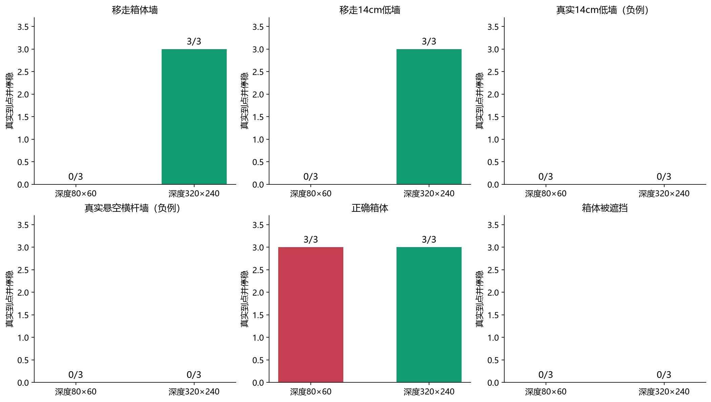
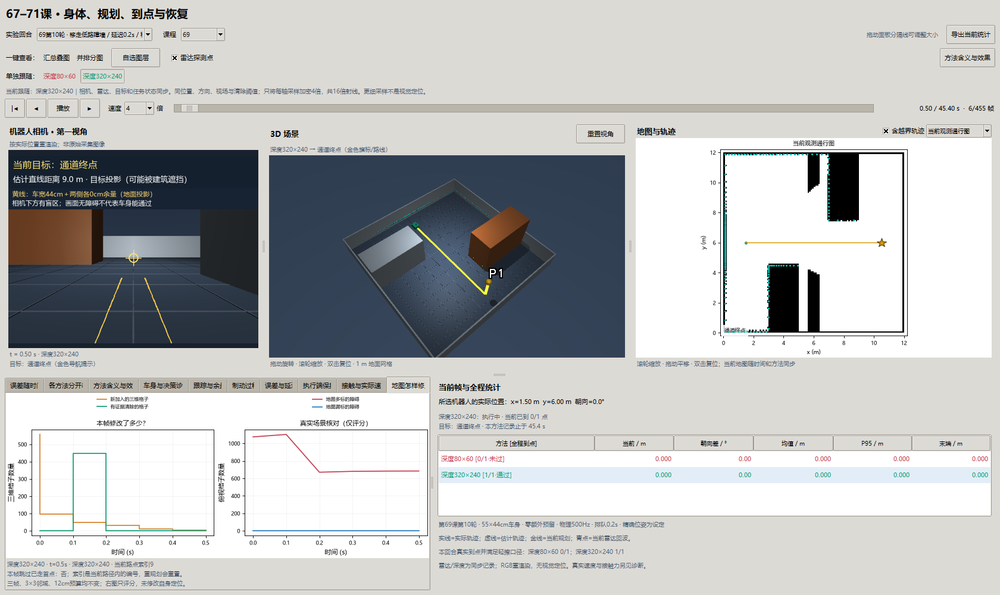
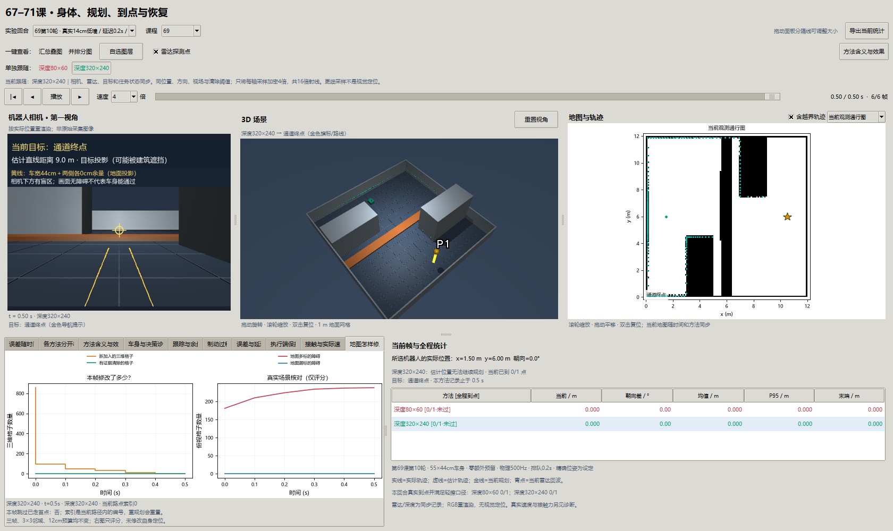

# 第六十九课第十轮：近地面的旧墙，为什么相机看不清它已经移走？

2026-10-01，接续[第九轮](69-progress-round9.md)，按[两轮登记](navigation-reinforcement-9-10-plan.md)完成36回合。

**结论：移走墙与低墙这六个正例，80×60为0/6，320×240为6/6真实到点停稳。** 真实低墙与横杆六个负例，两组均拒绝、均无接触；正确箱体两组各3/3，遮挡各0/3。全批粗3/18、细9/18，36回合无碰撞、无误报。完整采集/计算/写盘800.31秒（与其他批次并行运行）。

## 1. 已经看到更远，为什么地图还留着一堵墙？

旧地图声称通道里有墙，真实墙已移走。相机照到了远处和地面；但地图清除规则检查的不只是一个像素，而是旧格子中心附近3×3像素中最近的深度。低分辨率下，一个像素覆盖的角度很大，邻居可能提前打到地面。于是规则没有充分证据删除靠地面的格子。

这个保守拒绝有原因：雷达高32cm，扫不到14cm路障。若直接认为“雷达没有点，底层就是空的”，真实低墙也会被删，整台车可能撞上。本轮保持同样保守规则，只增加深度采样，看能否分清**移走的旧低墙**和**仍存在的真低墙**。

开发静止观测只用种子0：80×60没有打开中央通道；160×120仍留部分底层；320×240能清掉中央底层。由此选择320×240作正式对照，这是开发选择，未用于挑留出好成绩。

## 2. 新变量与已有变量的关系

| 变量 | 通俗含义 | 本轮怎样变化 |
| --- | --- | --- |
| `width`、`height` | 深度画面的采样宽、高 | 80×60与320×240；每轴4倍，总射线16倍 |
| `vfov_deg` | 相机上下看得多宽，65° | 不变；更多像素分同一个视场，不是看得更广 |
| `focal` | 像素坐标中焦距 | 随画面高度成比例变化，物理安装方向不变 |
| `depth` | 沿相机光轴的米制距离 | 4800与76800个采样；不是RGB颜色、不是斜射线长度 |
| `camera_x_m`、`camera_z_m` | 相机相对车的安装位置 | 向前20cm、高55cm，不变 |
| `FREE_DEPTH_BUDGET_M` | 射线必须越过格子中心的距离预算 | 两组均12cm，不放宽 |
| `FREE_CONFIRMATIONS` | 连续确认空闲次数 | 两组均3帧；10Hz下至少三次观测 |
| `occupied[y,x,z]` | 10cm三维占据格子 | 分辨率不变；图像加密不等于地图格子变小 |
| `grid`、`map_frames` | 给规划的当前俯视通行图 | 一柱内任何高度仍占据，该位置就保守不通行 |
| `map_counts`、`map_error` | 修改数量、真实场景核对 | 前者三维格子，后者俯视格子；后者只评分 |
| `SplitSensorNoise` | 雷达/相机分开的随机流 | 保证多算相机像素不会改变后续雷达噪声序列 |
| `passed`、`controller_p95_ms` | 真实通过、控制计算耗时95分位 | 加密可能提高通过，也增加计算/存档负担 |

逻辑链：同视场的更细采样 → 3×3邻域覆盖更小的实际区域 → 地面附近射线可能提供足够穿越距离 → 连续确认空闲 → 清除旧格子 → 通行图打开 → 重新规划 → 实际驾驶到目标。每一箭头都要看记录；只看删除格子数量不能证明后面的导航成功。

## 3. 原理：改变采样，保留清除纪律

相机投影近似为 `像素偏移 = 像素焦距 × 横向或高度偏移 / 前向距离`。在同一视场下，高度像素增加4倍，像素焦距也增加4倍；同一3×3窗口覆盖的角度约缩小到原来的四分之一。

底层格子中心高5cm，相机高55cm。远处地面回波与穿过该中心的射线方向很接近。较粗的邻居射线可能落在更近的地面，较细的邻域则可能都先穿过旧格子中心，再打到更远地面。三帧最短深度仍须超过中心光轴距离＋12cm才删除。

真实14cm低墙挡住这些射线，深度应在墙面停止，端点还会写回占据；真实42–56cm横杆同样由相应高度的深度采样保留。遮挡后的区域没有被看到，继续保留。NaN和普通无效值不能清除；解析仿真恰好8m无命中合同显式启用，不能直接移植到真实相机。

这是有限像素/格子采样下的占据修正，不是连续几何安全证明。小于采样间隙的物体、透明材质、真实深度坏点、地面起伏、误差位姿都未在本轮覆盖。没有识别物体身份，没有SLAM形变修正，没有视觉定位。

## 4. 固定什么、改变什么？

两组固定第九轮一致进度/门控、相同地图规则与三维格子、精确位姿、相机安装和65°视场、深度噪声3mm、雷达180束、低速0.2m/s、0.2s排队与0.5s准备。55×44cm车身和接触物理不变。没有扩大轻擦阈值，也没有将地面附近一律清空。

正式种子26/27/28，六条件×两分辨率=36回合。真低墙和横杆墙横跨通道，是应拒绝的负例；把它们的0/3算“算法无效”同样不正确。相机和雷达分开取噪声，因而不能把本批粗采样与第九轮不同随机流的总分直接作单变量比较。

| 条件 | 深度80×60 | 深度320×240 | 结果含义 |
| --- | --- | --- | --- |
| 移走箱体墙 | 0/3 | 3/3 | 确认空闲后打开通道 |
| 移走14cm低墙 | 0/3 | 3/3 | 底层格子不再把通道堵死 |
| 真实14cm低墙 | 0/3 | 0/3 | 应拒绝，不能撞过去 |
| 真实42–56cm横杆墙 | 0/3 | 0/3 | 应拒绝，雷达高度看不到不等于安全 |
| 正确箱体 | 3/3 | 3/3 | 本来可绕行的任务仍应完成 |
| 箱体被遮挡 | 0/3 | 0/3 | 仍有规划拒绝，不能称遮挡已解决 |



每柱3回合；红=80×60，绿=320×240。正例看真实到点；负例还要看是否误删、是否接触。混合总分不等于部署成功率。

## 5. 地图与身体都要验收


固定选种子26移走低墙，都是t=0.5s，尚未使用后续最终图。灰=旧占据仍在，绿=有证据清除，橙=观测新加入。这里是俯视通行图，底层清除后才真正打开通道；它与第八轮“删除上层很多格子但俯视仍阻塞”的图不同。


同一种子26，左列是移走低墙，右列是仍存在的低墙。上排实际轨迹/终点/真实障碍/目标，下排实线是前进请求，虚线是身体实际平移速度；终点停车标志可覆盖非零跟踪请求，因此停稳须核对实际速度。拒绝组的短记录不人为延长计分。

移走墙与低墙的高分辨率组均在45.4s到点停稳，终点距目标约16.06cm；粗组在准备期后无路，未移动。静止准备结束时，中央10×8个俯视格子的错误占据从80个清到0个，粗组仍80个。真正有用的是身体能走过这个开口，而不是总删除数量：高分辨率移走墙累计删除2871–2878个体素，移走低墙496–503个。真实低墙、横杆组删除0个体素，原地拒绝；它们已在先验中，尚不是“突然出现而地图完全不知道”的负例。





窗口的第一视角、三维、雷达、目标、轨迹、地图与统计一键切换。深度页保留两组各自的原始尺寸；车身诊断按照该方法的尺寸反投影，不能拿80×60焦距去解释320×240数据。RGB仍重渲染，不用于本轮控制。

## 6. 代价、边界与阶段结论

加密总射线16倍，但各回合到达长度和结束时机不同，不能按全批写盘量作纯性能倍数。可比较的正确箱体种子26：粗采样仿真48.5s、整回合墙钟21.83s、控制计算p95为54.09ms；细采样49.9s、墙钟58.08s、控制p95为57.17ms。控制耗时字段从传感器生成之后开始，**不包含射线生成、物理和压缩写盘**，不能据此说完整感知已满足10Hz。失败负例的搜索单次最高约8.60s；六帧短记录使其p95也很大，所以不将混合条件的中位p95当典型行驶延迟。当前计算时仿真没有后台持续积分，显式排队0.2s也不是这些墙钟耗时的自动模拟；实时/异步门槛未完成。

全局地图准确率没有因此全面改善：移走低墙种子26最初多标944个俯视格子，粗组结束1118个、细组1096个；传感器端点噪声和离散写入又在真实墙周围添加保守占据。细采样打开中央通道，但仍保留未看空的远处旧墙，也有新增误占据。不能把局部可通过写成整图已修准。遮挡条件两组均在行驶约15.2s后无路；细组删除513–523个可见格子仍不能保证路线存在。本批种子主要改变传感器噪声，成功直线路线可完全相同，未覆盖不同布局/位姿误差/动态移动障碍。

同一算法在不同环境表现不同：远处空闲证据充足，细采样有帮助；真障碍或被遮挡区域本来没有空闲证据，再多像素也不能随便清除；路线搜索或执行出问题，细采样也不会自动修好。第67课解决身体高度盲区，第68课修历史落点，第九轮修跟踪接口，本轮修采样造成的可观测限制，分别有证据和边界。

## 7. 思考题

1. 为什么相机视场不变、像素增加，3×3邻域覆盖的地面面积会变小？
2. 为什么不能把12cm预算改小来让旧墙更容易消失？需要哪类真实负例约束？
3. “清了更多三维格子”和“打开了可走通道”分别看哪个字段？
4. 为什么76800射线不等于实时可用？控制耗时、记录写盘、0.2s排队分别描述什么？
5. 加入位姿误差后，即使深度正确，空闲证据会被投到哪里？下一批应该怎样分离误差来源？

## 8. 复现、验收与停止点

```powershell
uv run python -m embodied_learning.experiments.navigation_progress_study --round 10 --output results/navigation_reinforcement_v10
uv run python scripts/validate_navigation_progress.py --round 10
uv run python docs/img/make_navigation_progress_figures.py
uv run python -m embodied_learning.navigation_study_demo --lesson 69 --footprint results/navigation_reinforcement_v10 --case 69_street_low_26__delay_2__removed_low
uv run python scripts/check_navigation_progress_window.py
uv run python scripts/test.py full tests/test_navigation_progress.py
```

输出目录须尚不存在，图表需第九轮也完成。公共[正式摘要](benchmarks/navigation-reinforcement-v10.json)和[独立验收](benchmarks/navigation-reinforcement-v10-validation.json)含哈希；原始NPZ本地保留，克隆后按命令生成。

独立重放333900个2ms物理步，状态/接触误差均0；重建6714帧地图，按各组相机尺寸独立投影核验18827次删除的三帧9像素证据。逐记录核对终点距离、实际停稳、接触口径、速度上限、源码与协议哈希。真实Tk已检查两分辨率切换后地图、相机、三维、统计、深度反投影同步；原图/当前图分离，不借用最终图。共同测试与视觉验收见[交付验收](benchmarks/navigation-reinforcement-9-10-delivery.json)。

按登记冻结本批，不能在这些新种子上继续优化再当留出结果。下一步先扩大遮挡/实际新增低障碍与位姿误差的反例，审查地图格子与连续点两套规划约束，再考虑统一69—71身体与评分。跨场景门槛、连续RGB-D、真实异步执行和视觉定位仍待完成。

## 原始来源与本地适配（2026-10-09补引）

[A Formal Basis for the Heuristic Determination of Minimum Cost Paths](https://ai.stanford.edu/~nilsson/OnlinePubs-Nils/PublishedPapers/astar.pdf)（Peter Hart / Nils Nilsson / Bertram Raphael，1968）；[Implementation of the Pure Pursuit Path Tracking Algorithm](https://publications.ri.cmu.edu/implementation-of-the-pure-pursuit-path-tracking-algorithm)（R. Craig Coulter，CMU技术报告1992）；[Modern Robotics: Mechanics, Planning, and Control](https://github.com/NxRLab/ModernRobotics)（Kevin Lynch / Frank Park，2017）。

在本地差速平台分离足印、动作队列、制动、观测地图和三维通行；这些受控扩展不是原 A* 或纯追踪自带的安全保证，各轮身体/权限/种子与失败分开。 [完整采用关系与引用规则](references.md)。
