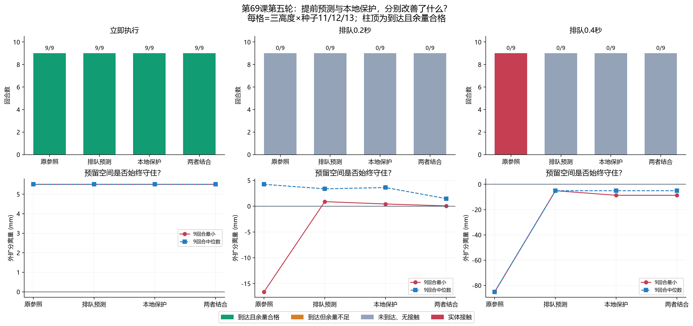
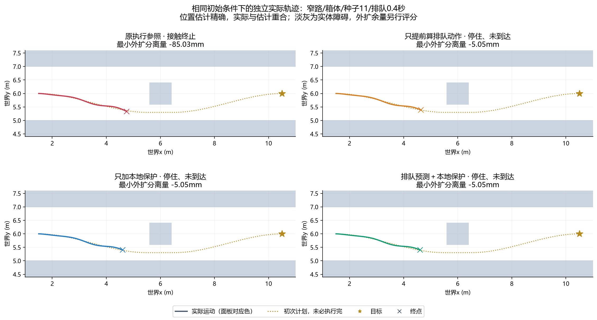
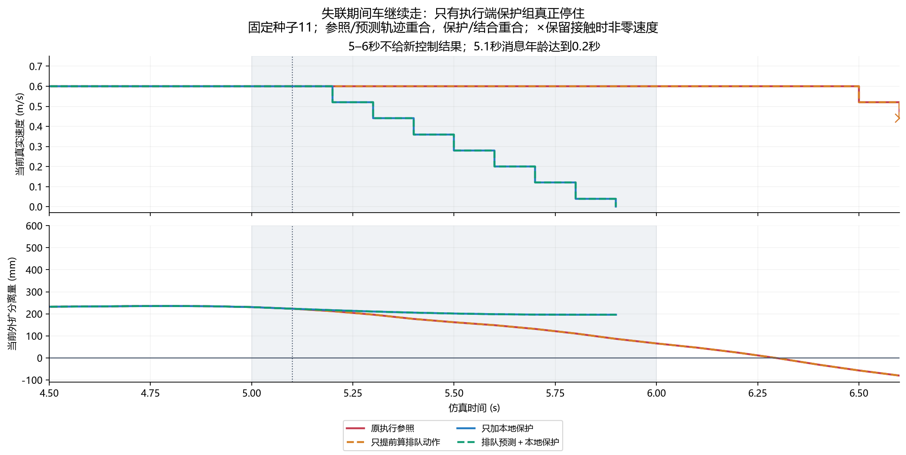
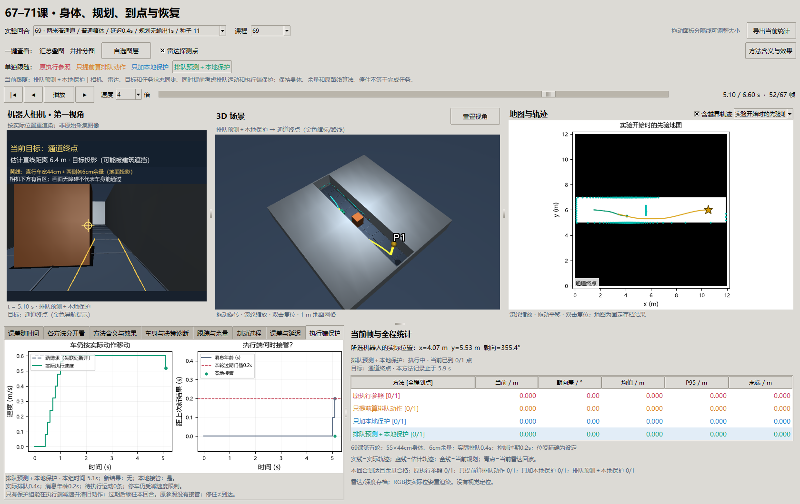

# 第六十九课第五轮：排队动作和执行端保护

2026-10-01。前置：[第四轮误差与延迟边界](69-robustness-round4.md)。[预登记](69-execution-round5-plan.md)、[135回合摘要](benchmarks/execution-safety-v5.json)、[独立审计](benchmarks/execution-safety-v5-validation.json)、[同输入反事实](benchmarks/execution-counterfactual-v5.json)。本轮沿用第69课，研究同一个导航闭环的执行问题。

**结论：提前考虑排队动作和本地保护都减少了接触，但还没有恢复延迟下的导航成功。** 窄路0.4秒延迟时，原参照9/9接触，三个改进组均0/9接触，四组到达仍都是0/9。改进组也有预留空间不合格的回合。规划无输出1秒时，只有本地保护组能停住，余量合格；停住后仍未到达。本轮没有解决真实规划线程卡住的问题。

## 1. 为什么“已经发出刹车”还会撞？

想象司机按下刹车，但指令要排队0.4秒才到车轮。在这段时间里，车还要执行刚才发出的前进、转弯动作。停车距离应包括这些动作，以及之后真正减速的路程。只拿此刻的速度估算，会遗漏队列里的加速和转弯。

第四轮固定例中，第一次保护请求在5.6秒发出，6.0秒才执行，期间走了约24cm。车身在窄路里只剩厘米级空间，24cm足以让预测和实际脱节。另一个问题是规划器没有新结果时，车轮并不知道“程序正在想”，可能继续旧动作。

所以本轮分开研究两个办法：发请求前把队列算进去；在车轮侧设置保护，让它在危险或信息过期时自己减速。第二个办法增加了执行端能力，必须如实说明，不能把原先排队的远端指令写成立刻生效。

## 2. 新变量分别是什么，怎样关联？

| 变量/概念 | 通俗含义和单位 | 实验中怎样变化、关联 |
| --- | --- | --- |
| 帧k、步长Δt | 每0.1秒看一次、执行一次 | 10Hz；k=50对应5.0秒 |
| v、ω | 当前已经在执行的前进速度m/s、转向速度rad/s | 每一步的进入速度来自上一帧实际动作，不能用新请求冒充 |
| 期望动作d | 控制器希望车怎样走，含v与ω | 仍由旧路线跟踪算法给出；执行前受加速度限制 |
| 排队长度L | 尚未到执行器的意图数量，条 | 0/2/4条对应0/0.2/0.4秒；初始槽是静止保持 |
| 队列Q | 按先后等待的目标速度、制动标志和来源帧 | 意图到期才根据当时真实执行速度计算下一动作，预测不能缓存未来速度 |
| 队列候选扫掠 | 执行旧意图、此次新意图，然后停车时整车经过的空间 | 队列中的加速、转向都会改变它；不只是一条中心线 |
| 排队停车扫掠 | 此刻发出停车请求，前面旧意图仍先执行时的空间 | 即使候选运动取消，此扫掠也可能已不安全 |
| 分离量g | 预测车身到观测点的有符号距离，m | g>0表示此次采样未重叠；g≤0触发保护。它不保证观测完整或准确 |
| 新结果fresh | 本帧有无新的控制输出，布尔值 | 普通试验始终有；无输出试验5–6秒没有 |
| 消息年龄a | 距上一次新结果多久，s | 没新结果每帧增加0.1秒，有结果清零；与运输延迟L不同 |
| 过期门槛 | 允许控制结果连续缺失的时间，本轮0.2秒 | a≥0.2秒时本地停车；是研究参数，不是实机认证阈值 |
| 本地接管override | 执行端替换即将执行的动作，布尔值 | 发生危险或过期时启动；不等待远端队列 |
| 清队列 | 删除未执行的旧运动意图，保留静止槽 | 防止停车后又被旧前进指令推走；队列长度不变 |
| 锁存latched | 过期后保持本回合停车状态 | 迟到的新路线也不能重启；自动恢复尚未实现 |
| 外扩分离量 | 真实全高度矩形足印逐边加6cm后，到真实障碍的分离量 | 离线评分，与观测点距离g不同。负值表示保守包络重叠，不是实体穿入深度 |

身体保持55×44cm、高58cm，逐边6cm余量；线速度上限0.6m/s、角速度上限1rad/s，线/角减速度0.8m/s²、1.8rad/s²。位置估计精确是本轮受控输入；没有测试定位算法。雷达和解析深度仍有原噪声，RGB仅按实际位姿重渲染，没有视觉定位。

## 3. 原理：从请求，到排队，再到真实运动

### 3.1 排队预测应模拟意图，不能直接延长一条线

普通运动每帧按物理限制接近目标速度：

\[
u_{next}=u+\operatorname{clip}(d-u,[-0.08,-0.18],[0.08,0.18]).
\]

这里u=(v,ω)，0.08m/s和0.18rad/s来自减速度乘0.1秒。队列里有四条加速意图时，当前v=0.28m/s，未来可能依次变成0.36、0.44、0.52、0.60m/s。一直按0.28m/s预测就会低估路程。

停车沿用第三轮同比例规则。先计算线、角速度分别至少需要多少时间，再取较长者：

\[
T=\max(|v|/0.8,|\omega|/1.8),\quad
u_{next}=u\max(0,1-0.1/T).
\]

T接近零时直接归零。两个速度乘同一个比例，保持当前转弯半径，同时满足原减速度限制。预测每条命令按圆弧积分，再检查完整车身，不把路径画成走过的轨迹。

队列预测组额外检查两条未来：继续执行此次候选再停车；此刻请求停车但先执行旧队列。任一与观测点重叠就发送保护停车。旧控制器原有保护仍保留，新增规则不能放松它。预测假设候选后开始停车，不猜测未来传感器或未来规划输出。

### 3.2 本地保护保护的是即将执行的动作

执行端先取到期意图，再计算受加速度限制的动作。保护器用当前及历史观测点，检查“本帧动作＋随后立即同比例减速”的车身扫掠。危险时以当前执行速度开始减速并清旧队列。**接管不等于速度瞬间归零**：0.6m/s的车第一步只能降到0.52m/s，后面仍要走一段。

本地保护不读取真实障碍盒或真值评分；它使用雷达/深度及截至当前时刻的观测记忆。部署时，这个执行循环必须能独立于规划运行。同一条Python线程阻塞时，写一个判断函数不会自动成为实时保护。

### 3.3 规划无输出时，先让车真的继续走

单列故障试验从5.0秒起连续10帧不给新控制结果，车和传感器继续运行。无保护组先执行剩余队列，之后保持上一执行速度；保护组检查消息年龄，到门槛后减速、清队列并锁存停止。

上一新结果在4.9秒，因此5.0秒消息年龄为0.1秒，5.1秒达到0.2秒。门槛计的是从最后结果起的年龄，不能说成从5.0秒故障开始又等了0.2秒。本轮没有恢复任务：迟到结果丢弃，停稳记“控制信息过期”，不会宣布成功。

## 4. 对照怎样安排，哪些东西没混在一起？

| 组名/窗口按钮 | 队列预测 | 本地危险与过期保护 | 用途 |
| --- | --- | --- | --- |
| 原执行参照 | 无 | 无 | 与第四轮接口桥接 |
| 只提前算排队动作 | 有 | 无 | 看提前预测本身是否足够 |
| 只加本地保护 | 无 | 有 | 看独立执行端接管是否足够 |
| 排队预测＋本地保护 | 有 | 有 | 检查组合能否继续提高收益 |

两因素形成2×2；本地模块内部含危险扫掠和消息过期两个触发条件，普通与故障批次分别观察其行为，不能据此声称每个内部细节都有独立算法收益。

开发8回合只用种子0，失败也保留。正式135回合包括：3个旧条件逐数组桥接；108个窄路主批（三高度×新种子11/12/13×三种延迟×四组）；8个开阔/街区参照；4个0.50m窄口负例；12个无输出故障。所有组独立驾驶，不能把不同组的后半轨迹拼接成同一次运行。

主批每条件9回合是三高度复用三个噪声种子，**不是九个独立种子**。正式结果后没有改参数、重选种子或覆盖存档。

## 5. 先看同输入证据，再看独立闭环

固定第四轮窄路/箱体/种子8/0.4秒延迟记录。按相同观测、进入速度和队列逐帧重算，5.3秒首次出现“旧预测放行，完整队列拒绝”：旧分离量+57.75mm，队列候选−14.20mm；此刻请求停车的队列尾段也为−2.99mm。

这说明漏算队列会改变安全决定；也说明发现得晚时，单靠远端保护可能来不及保住余量。但它只是同输入反事实，不能证明改动之后还能到终点。闭环数据另列如下。

| 主批延迟 | 组 | 到达且余量合格 | 实体接触 | 九回合最小外扩分离量 |
| --- | --- | --- | --- | --- |
| 0 | 四组各自 | 各9/9 | 各0/9 | 各+5.51mm |
| 0.2s | 原参照 | 0/9 | 0/9 | −16.59mm |
| 0.2s | 队列预测 | 0/9 | 0/9 | +0.88mm |
| 0.2s | 本地保护 | 0/9 | 0/9 | +0.43mm |
| 0.2s | 两者结合 | 0/9 | 0/9 | +0.06mm |
| 0.4s | 原参照 | 0/9 | 9/9 | −85.03mm |
| 0.4s | 队列预测 | 0/9 | 0/9 | −5.05mm |
| 0.4s | 本地保护 | 0/9 | 0/9 | −8.68mm |
| 0.4s | 两者结合 | 0/9 | 0/9 | −8.68mm |



图上排三个延迟条件；绿色表示到达且余量合格，灰色表示没接触但没到达，红色表示实体接触。柱顶是安全完成数，不是零碰撞数。下排红实线为九回合最小分离量，蓝虚线为中位数；0线以下即保守包络重叠。无延迟时数值完全重合，不能因为图中只有一条线就认为漏了组。

0.2秒时改进组守住了有限采样余量，但仍无路/停滞；组合最小仅+0.06mm，不能叫充分鲁棒。0.4秒时避免接触有收益，但保护并没保证6cm预留空间，也没绕过障碍。三个改进组中没有一个恢复任务成功。

## 6. 轨迹揭示：路线存在，车仍可能停在半途



固定窄路/箱体/种子11/0.4秒延迟，不挑成功例。每个面板的实线是自己实际执行的运动，金色点线是初次计划，金星是目标，×是终点。位置估计与真值重合，所以不额外叠一条挡住实线的估计曲线。图仍有未执行的路线，不能把它当完成证据。

原参照6.5秒接触。队列预测5.3秒发出新保护，最终7.3秒无路停住；本地保护5.7秒接管，最终7.0秒无路停住；组合也7.0秒停住。后三组该例最小外扩分离量都是−5.05mm，说明提前预测与本地接管不自动消除已经发生的包络违规。剩余目标距离约5.9m，显然不能算成功。

## 7. 换环境和规划失联，为什么效果不同？

| 配对批次（均延迟0.4秒） | 原参照 | 仅队列预测 | 仅本地保护 | 组合 |
| --- | --- | --- | --- | --- |
| 开阔/街区，种子11，共2例/组 | 2/2接触 | 无接触、0/2到达 | 无接触、0/2到达 | 无接触、0/2到达 |
| 窄路规划无输出，种子11/12/13，共3例/组 | 3/3接触 | 3/3接触 | 3/3余量合格停车，0到达 | 3/3余量合格停车，0到达 |
| 0.50m窄口，共1例/组 | 原地拒绝 | 原地拒绝 | 原地拒绝 | 原地拒绝 |

开阔/街区给本地保护更多空间，最小外扩分离量+22.91mm；队列预测与组合+2.90mm。它们仍在障碍前无路或停滞。环境参照各只有一个种子，不代表所有园区布局。负例身体宽44cm能放下，但加两侧6cm需要56cm，50cm不足；初始外扩重叠−30mm单列，不算行驶造成的违规。



上图实线/虚线是四组当前真实进入速度，底图是对应真实外扩分离量；浅灰区5–6秒没有新控制结果，竖点线5.1秒为消息过期。参照与队列预测重合，两保护组也重合，图注明确解释。×保留接触时非零速度，不把终止后的零命令写成停稳。

种子11两保护组5.1秒接管，5.9秒进入真正静止，最小外扩分离量+195.98mm。无保护两组6.6秒接触。队列预测在正常输出时能提前拒绝，但5秒后没有新结果，预测器本身也不给新保护；执行端独立检查年龄才起作用。三个种子的该机制相同，仍只代表固定1秒故障和静态世界。

## 8. 余量为何仍失败？查到了一个明确的几何口径差异

按登记批次中“仅本地保护的最差外扩分离量”选例，悬空杆/种子13/0.4秒延迟在9.0秒首次出现记录位姿外扩重叠。当前真实全高度包络分离量−2.06mm，而本地候选的观测点分离量仍为+12.59mm。本地保护因此没有接管。

原本地检查沿用第67课的三个实体部件：低处宽底盘、细支架、相机壳；评分使用从地面到58cm的完整矩形足印。悬空杆可能碰到完整包络的边角，却离实际高处细部件还远。**两者检查的空间不同。** 同一帧、同一观测点、同一预测动作，离线改用完整全高度包络，候选分离量变为−24.15mm。这个同输入诊断支持统一包络，但还没有新闭环实验验证。

最差全程外扩分离量−8.68mm时，该回合实体最小分离量仍+72.54mm，说明“保守全高度足印违规”与“实际部件接触”确实不同。其他回合还可能受噪声落点、运动时机影响；不能把所有失败都归到这一例。本轮不在正式结果后换包络，再覆盖成绩。

接下来必须选择并统一系统使用的保守身体模型，保持原6cm评分门槛。确认传感器覆盖和观测置信度，再谈停稳后重新规划与恢复。仅缩小余量、删除回波或改评分会遮住问题。

## 9. 时间、评分和可信边界

135回合实测659.87秒，约11分钟。全批36次真实到达、18次接触、117回合真正停稳，0次误报；不同压力条件混合，不能把36/135当部署成功率。3个旧参照与第四轮既有数组一致（计时除外）。

真实控制墙钟最大409.46ms，首次规划最大403.66ms，后续规划最大83.05ms；本批没有触发上一轮那些带定位偏差的9秒搜索。不能把本批耗时降低归因于规划加速：算法未改，输入批次不同。

**超时结论限定为消息过期与离散调度模型。** 普通试验仍没有把真实墙钟计算叠加为运动延迟；无输出试验采用预先固定的1秒故障。因此验证了无输出时的停车接口与因果动作，没有验证真实多进程规划取消、计算超时、传感器失联、通信乱序或硬实时调度。独立执行端进程及可取消的规划工作仍待做。

到点仍由估计距目标<25cm触发，停稳且运动队列清空后才能宣布；真值独立评分。接触终帧保存非零进入速度，终止标记不算停车。车角位移≤1cm的采样检查身体和外扩足印，是离散证据，不能替代连续碰撞或实机证明。

## 10. 模块化窗口怎样看？



固定种子11无输出场景5.1秒。顶部四个按钮代表同一位置输入下的四种执行策略；按一个按钮，相机、3D、地图雷达点、当前目标、曲线和统计一起切换，播放时间保留。“并排分图”比较各自轨迹，“汇总叠图”看关系。

第八页“执行端保护”：左图虚线为新请求，没有新结果处断开；实线和当前点为实际执行速度。右图为消息年龄、0.2秒门槛及本地接管点。5.1秒当前点已降为0.52m/s，但上一帧进入速度仍0.6m/s，两个时刻不能混用。

平均位置误差为零来自精确定位设定，不是PF表现。“车身与决策诊断”仍是旧0.2秒延迟分支示意，已明确说明不包含完整队列；接管过程看新页。RGB只是可复用3D相机展示，雷达和深度来自同步实验存档。

## 11. 思考题

1. 当前v=0.28m/s，四条期望0.6m/s的意图排队，为什么停车预测不能一直按0.28m/s画直线？请逐帧列出速度。
2. 同输入时旧预测+57.75mm、完整队列−14.20mm，证明了什么？为什么还不能证明新控制器会到达？
3. 排队停车预测已经−2.99mm时，取消最新前进动作是否一定保住6cm余量？旧意图为什么关键？
4. 本地接管把0.6降到0.52m/s，为何不能直接记0？如果前方距离已小于剩余减速路程，还能保证不碰吗？
5. 为什么清旧队列？若停车后恢复执行之前积压的路线，会有什么问题？

### 延伸问题（保留原题，不计入核心五题）

6. 上次新结果4.9秒，5.0秒开始失联，消息年龄何时到0.2秒？它与运输排队0.4秒有什么不同？
7. 为什么只有提前预测的组在1秒无输出时仍接触？把保护和规划放同一阻塞线程能解决吗？
8. 窄路0.4秒三改进组都零接触，却都0/9到达，应怎样描述收益？+0.06mm余量能代表鲁棒性吗？
9. 悬空杆为什么让实体部件与全高度足印给出不同判断？统一到完整包络会减少接触，还是增加保守停车，如何设计单变量验证？
10. 本批后续规划<0.1秒，为什么不能宣称修复了上一轮9秒搜索？哪些输入应再测，怎样记录超时期间的真实动作？
11. 停稳后要重新规划，为什么应从新的位置、速度、时间戳开始，并重新检查路线？如何防止迟到结果让车复活？
12. 三高度重复三个种子的9个回合，为什么不等于九个独立噪声种子？怎样扩大外部验证？

## 12. 复现、验收与停止点

```powershell
uv run python -m embodied_learning.experiments.execution_navigation
uv run python scripts/check_execution_counterfactual.py
uv run python scripts/analyze_execution_safety.py
uv run python docs/img/make_execution_figures.py
uv run python -m embodied_learning.navigation_study_demo --lesson 69 --footprint results/execution_safety_v5 --play
uv run python scripts/check_execution_window.py
```

输出已存在时拒绝覆盖；另跑用`--output results/execution_safety_repeat`，窗口显式`--footprint results/execution_safety_repeat`。开发8回合用`--smoke --output results/execution_safety_smoke_new`。旧第四轮窗口显式`--footprint results/navigation_robustness_v4`。原始NPZ留本地results；仓库含代码、协议/结果摘要、来源哈希、图像、讲义和审计，新克隆运行实验生成存档。

```powershell
uv run python scripts/test.py quick > results/execution_safety_quick.log 2>&1
uv run python scripts/test.py full tests/test_execution_safety.py tests/test_navigation_robustness.py tests/test_braking_control.py tests/test_path_tracking.py tests/test_navigation_followups.py tests/test_navigation_geometry.py tests/test_replay_viewer.py tests/test_navigation_study_viewer.py tests/test_campus_patrol.py tests/test_map_repair.py > results/execution_safety_affected.log 2>&1
uv run python scripts/validate_execution_safety.py
```

quick851项通过，入口152.3秒；受影响完整选择集74项通过，入口70.9秒，含真实Tk同步验证。独立审计重建队列、加速度、候选停车预测、本地接管、清队列、信息过期、动作积分、实际停稳和真值几何；传感器坐标变换共用原函数，此边界明确记录。三张科学图与真实窗口均实际打开检查，图例移出速度曲线、条件文本完整可读。没有重跑不相关的历史全仓慢层。

本轮按预登记结束，不依据正式成绩继续调参。下一项先统一全高度保守包络并诊断停住后为何无路，加入真实新障碍负例；然后扩大70/71的到点与有限恢复反例，在同一个身体、传感器、积分和执行模型上检验组合。真实独立执行端/规划取消另设调度验证，完整RGB-D、视觉定位、65课似然场与原跨场景门槛继续保留。

## 原始来源与本地适配（2026-10-09补引）

[A Formal Basis for the Heuristic Determination of Minimum Cost Paths](https://ai.stanford.edu/~nilsson/OnlinePubs-Nils/PublishedPapers/astar.pdf)（Peter Hart / Nils Nilsson / Bertram Raphael，1968）；[Implementation of the Pure Pursuit Path Tracking Algorithm](https://publications.ri.cmu.edu/implementation-of-the-pure-pursuit-path-tracking-algorithm)（R. Craig Coulter，CMU技术报告1992）；[Modern Robotics: Mechanics, Planning, and Control](https://github.com/NxRLab/ModernRobotics)（Kevin Lynch / Frank Park，2017）。

在本地差速平台分离足印、动作队列、制动、观测地图和三维通行；这些受控扩展不是原 A* 或纯追踪自带的安全保证，各轮身体/权限/种子与失败分开。 [完整采用关系与引用规则](references.md)。
