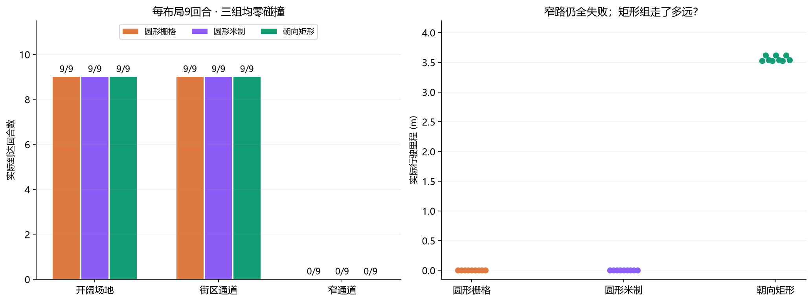
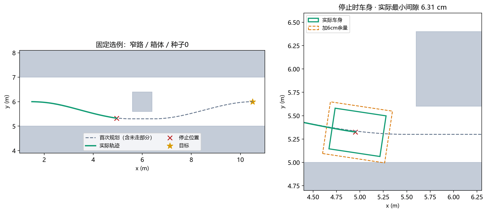
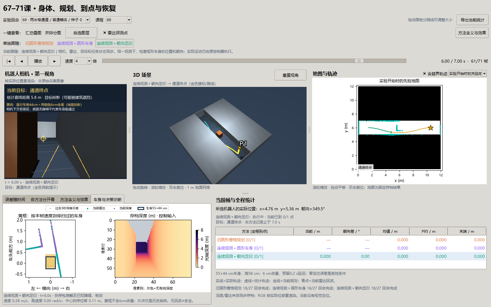

# 第 69 课：车身明明放得下，为什么规划和执行仍过不去？

承接[第六十七课讲义](67-body-aware-obstacle-avoidance.md)。那一课已经让深度相机补上了单层雷达的高度盲区：开阔场地和街区通道能够绕行，但九个窄路回合全部拒绝。本课固定身体、观测和控制器，只研究规划如何表示车身。

**结果：更换车身表示找到了可用的初始几何路线，但还没有提高最终到达数。** 三组都是 18/27 到达、零碰撞；九个窄路回合仍全部失败。矩形组不再原地拒绝，而是走了 3.52–3.62 m 后停止。这说明规划表示确实影响行为，也说明它还不足以解决实际跟踪问题。

## 1. 先把空间关系想明白

机器人从上面看长 55 cm、宽 44 cm。通道总宽 2 m，中间新增障碍宽 80 cm，两侧各剩 60 cm。身体平行于墙时，44 cm 宽的车可以放进 60 cm 的缝；侧身转弯时，车头和车尾也会占用横向空间，不能只检查中心点。

旧规划器用一个半径约 37.2 cm 的圆包住整辆车，加 6 cm 余量后，再按 10 cm 格子向上取整，膨胀半径成为 50 cm。两侧各向外扩 50 cm，60 cm 的缝自然被封住。取消取整后，圆的直径仍约 86.4 cm，也放不进去。矩形顺着通道放时，加余量后的宽度是 56 cm，才有可能通过。

**“可能通过”还有两个条件：转入窄缝的整段运动无碰撞，执行控制器能够跟住这条路线。** 本课分别检查这两件事。

## 2. 变量、单位和它们怎样关联

| 变量或概念 | 通俗含义 | 本课如何变化 |
| --- | --- | --- |
| `(x,y,θ)` | 身体参考点的位置 m 和车头方向 rad | 规划搜索位置与方向；执行后再生成真实轨迹 |
| `front/rear/half_width` | 参考点向前 0.30、向后 0.25、向侧面 0.22 m | 固定；前后不对称，不能按中心对称随意平移 |
| 足印 | 整辆车在地上的投影 | 对照圆形与带朝向矩形 |
| `margin=0.06 m` | 车身坐标中各边外扩的余量 | 全组固定；矩形外扩不等同于各方向统一6cm圆形缓冲 |
| 先验格子 / 观测点 | 原地图中的整块占据格 / 新扫描的米制落点 | 先验保留10cm方格范围；两种新规划都保留观测的实际坐标 |
| `θ` 搜索分桶 | 为避免重复搜索，把相近状态归成一类 | 32个方向，位置按2.5cm合并；保存的实际状态不吸附到格心 |
| 路径 / 轨迹 | 计划以后怎么走 / 已经实际走过哪里 | 两者分别归档、画图；未执行部分不算成功 |
| 跟踪前视距离 | 靠近一个路径点后，开始追下一个点 | 沿用35cm；速度、加速度和转向规则不变 |
| `search_budget` | 搜索达到10000次展开仍没找到答案 | 表示本次算法预算用尽，不是数学上证明无路 |
| `min_clearance` | 真实车身与真实障碍的最小分离间隙，m | 由独立几何评分器按不超过1cm运动采样计算 |
| 仿真秒 / 墙钟秒 | 场景内部运动时间 / 电脑计算实际耗时 | 分开报告；仿真等待规划，不代表规划能实时运行 |

例如转角增加时，矩形的横向占用会增加。若外扩后的半长为 `a=0.335 m`、半宽为 `b=0.28 m`，朝向与墙夹角为 `θ`，其横向半宽是 `a·|sinθ| + b·|cosθ|`。这就是为什么同一个中心位置，车头方向一变，通行判断也可能改变。

## 3. 实验原理：从观测到动作

1. 当前雷达与深度在同一车身坐标系中生成障碍点，按当前位姿放入历史观测。只保留已经看到的信息；规划器不能读取真实障碍箱体。
2. 圆形米制组与朝向矩形组使用相同类型的观测输入、候选构造和搜索规则；运动分开以后，各自看到的点也会变化，不能说全程扫描逐帧相同。检查矩形时，同时检查两个世界轴与两个车身轴上的投影是否分离；任何位置发生重叠就拒绝。
3. 先检查平滑侧移候选：侧移量每次增加5cm，转入/转出段最长4m；再以 Hybrid A* 式的20cm弧线运动和原地转向搜索作为后备。弧线按不超过2cm的运动步长检查，原地转向按车角运动采样检查。它是教学实现，不是 Nav2 Smac 的复现。
4. 平滑路径按约4cm间距输出，归档容量256点。预试发现把曲线压成47点后，折线段的方向与曲线切线不同，足印检查反复拒绝；加密只解决这项表示问题，没有改变35cm前视跟踪器。
5. 现有控制器追踪路径，近场保护继续检查加速后能够实际达到的速度，以及反应延迟和刹停过程中整辆车扫过的空间。执行轨迹仍由动力学简化后的运动学更新产生。

两种新规划器仍需经过独立真值评分。规划说可行、扫描看起来有缝，都不能代替这一步。

## 4. 对照设计与数据

预先登记见[执行计划](navigation-studies-69-71-plan.md)。预试固定窄路/箱体/种子0；正式固定开阔场地、街区通道、窄通道 × 普通箱体、14cm路障、悬空杆 × 种子0/1/2 × 三组，共81回合。

| 组别 | 唯一相邻对照 | 开阔场地 | 街区通道 | 窄通道 | 碰撞 |
| --- | --- | --- | --- | --- | --- |
| 圆形栅格 | 复现第67课深度融合基线 | 9/9 | 9/9 | 0/9 | 0 |
| 圆形米制 | 与旧组相比改变观测表示和搜索，保留圆形车身 | 9/9 | 9/9 | 0/9 | 0 |
| 朝向矩形 | 与圆形米制组相比只改变足印形状 | 9/9 | 9/9 | 0/9 | 0 |

第一个与第三个组并非纯形状消融，因此保留中间组；不能把它们的全部差别归因于矩形。精确里程计是隔离规划问题的受控条件，三组零定位误差不代表新定位算法有效。27个旧组存档的全部既有数组与第67课深度组逐位一致。



左图每根柱子的分母都是9，三个布局全部展示。右图每个点是一个窄路回合的实际里程；点的横向错开仅防止重叠。橙色旧组和紫色圆形米制组都没有出发，绿色矩形组虽走了3.52–3.62m，仍没有到达。

## 5. 代表回合：为什么走到一半又停了



固定选例是窄路/箱体/种子0。左图灰虚线是首次规划，绿色实线是实际运动，红叉是停止点，金星是目标；灰色区域是真实障碍，只用于解释与评分。右图放大车身：绿框为实体足印，橙虚框为沿车身各边外扩6cm后的规划足印。

7.0仿真秒后，车走了3.524m，真实位姿约为 `(4.950,5.325,-0.150)`。它与首次规划最近的采样点相差1.55cm，朝向比该处折线方向多偏约1.59°。看起来很小的偏差，在只多出4cm宽的通行带里已经很关键。

停止时，真实最小间隙仍有6.31cm；但是矩形的6cm外扩在这个倾斜角度向墙投影约6.83cm，外扩足印已经触到先验墙边。只用先验墙、去掉所有新观测点，仍然判为不通；观测噪声不是这个回合失败的必要条件。于是下一次重规划返回 `footprint_start_blocked`，实验终止。九个矩形窄路回合都是这一类终止。

因此本课得到的是：**车身表示的保守性有所缓解，执行跟踪与规划余量尚未协调好。** 不能以松开6cm余量、把真值路线塞给控制器，或只展示未执行的虚线路径来宣称通过。

## 6. 计算代价与失败边界

81回合墙钟总计257.63s。两组新规划的调用P95分别约0.504s、0.347s；圆形米制组315次调用有27次超过200ms，矩形组363次有27次超过200ms。圆形米制组的九次窄路搜索耗尽预算，单次约10–12s。**当前没有满足实时导航要求**；窗口流畅播放的是存档，不是实时计算证明。

原地拒绝组的运动最小间隙为 `null`，因为没有执行运动，不能记成0或无穷大。全部碰撞为零也不能补偿失败。本批包含三个已知布局，没有新布局盲测；障碍静止、定位精确、传感器同步，尚未覆盖延迟、滑移和动态目标。

## 7. 与成熟系统的关系

[Nav2 足印设置说明](https://docs.nav2.org/rolling/configuration_and_development/first_time_robot_setup_guide/footprint/setup_footprint/)区分圆形半径与多边形足印，并指出支持朝向的规划器能够使用多边形检查。我们验证的是这一表示差异在本实验中的作用；尚未对齐其优化、代价函数、速度控制和实时性能。

## 8. 思考题

1. 为什么44cm宽的身体能放进60cm缝，而包住它的圆却放不进去？把长度也写进计算。
2. 如果取消取整就提高到达率，怎样区分观测表示和车身形状的收益？为什么需要中间组？
3. 真实间隙6.31cm为什么仍能触发“6cm余量”的规划拒绝？把车身坐标里的外扩投影到墙面方向。
4. 在不改余量的前提下，下一次应该先测试路径曲率、前视距离还是速度？怎样一次只改变一个机制？
5. 零碰撞、走了3.5m和真正到达各证明什么？哪些信息会被一张最终规划图掩盖？

## 9. 复现、窗口与停止点

```powershell
uv run python -m embodied_learning.experiments.navigation_followups --lesson 69
uv run python -m embodied_learning.navigation_study_demo --lesson 69 --play
uv run python docs/img/make_navigation_followup_figures.py
```

输出为 `results/footprint_navigation_v1`，已存在时拒绝覆盖；另跑请用 `--output results/footprint_navigation_rerun`，窗口相应传 `--footprint`。绘图脚本读取三课默认完整记录；先生成70/71后再统一作图。窗口在“朝向矩形”一键同步相机、3D车身、雷达点、目标、地图和统计；“车身与决策诊断”显示同帧深度与刹停包络。



实现：[足印规划器](../src/embodied_learning/footprint_planning.py)、[实验入口](../src/embodied_learning/experiments/navigation_followups.py)。全部行、源码和输入哈希见[基准摘要](benchmarks/navigation-studies-69-71-v1.json)，验收见[验证记录](benchmarks/navigation-studies-69-71-validation.json)。原数组留在本地results，不放入Git。

本课实验完成，**窄路闭环未过门**。下一项优先做曲率与实际跟踪能力的单变量验证，保留固定场景与6cm余量。到点和恢复是独立问题，分别进入[第七十课讲义](70-arrival-decisions.md)与[第七十一课讲义](71-bounded-recovery.md)。
