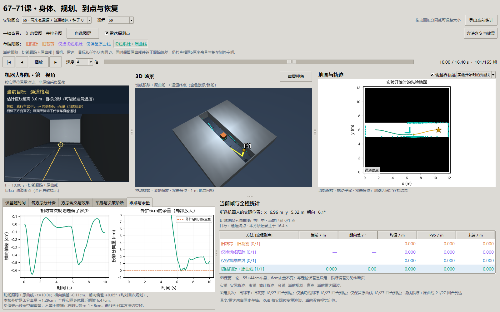

# 第 69 课第二轮：有路却跟不住，问题出在转向还是刹车？

> 同日后续已完成[第六十九课第三轮讲义](69-braking-round3.md)的制动实验；本页保留第二轮132回合及其失败。默认窗口会选择本地最新批次，看本页记录请明确指定`--footprint results/footprint_tracking_v2`。

日期：2026-09-30。承接[第六十九课讲义](69-footprint-planning.md)，实验登记见[第二轮计划](69-tracking-round2-plan.md)。这是同一课的第二轮验证，未新增课号，也未把70/71课的到点与恢复合入。

**本轮只取得部分改善。** 在相同27个固定条件下，同时修改转向跟踪与路线保留后，到达由18/27变为21/27，窄路由0/9变为3/9；这三个成功都来自开发用种子0的三种障碍高度。留出的种子3、4仍为0/6。132回合均无实体接触，但成功例也短暂侵入了外扩安全空间。因此“稳定通过窄路”和“全程保持外扩余量”两项门槛都没有通过。

## 1. 先想清楚：车怎么沿着一条弯线走

第一轮已经找到一条矩形车身能放下的路线。路线是一串位置点，机器人却只能在每一时刻选择“向前多快、向左或向右转多快”。规划线与实际运动之间，还隔着跟踪控制和刹停保护。

旧跟踪器看前方约35cm之外的一个点，让车头朝向它。问题有两种：一是追远处的点可能抄近路；二是每次更新计划时，程序也可能把弯曲的旧路线重新连接成直线。第二种情况中，车还没走偏，程序自己改出的那条直线就已触墙。

本轮用两个独立开关区分它们：**转向是否参考路线的切线和曲率；更新计划时是否保留已经检查过的原曲线。** 两项分别开启和同时开启都要跑，才能看出谁起作用。

## 2. 新变量分别是什么意思

| 变量 / 概念 | 通俗含义与单位 | 怎样进入实验 |
| --- | --- | --- |
| `estimate=(x,y,θ)` | 控制器认为自己的位置m、车头方向rad | 本课采用精确里程计的受控假设；估计与真实位置相同，不能据此说定位算法零误差 |
| 最近投影点 | 在规划折线上离机器人最近的点 | 确定在路线哪一段，避免拿远处的前视点裁剪路线 |
| `ψ`，路径切线方向 | 路线在这里朝哪里走，rad | 由相邻线段方向沿距离插值得到；与车头方向比较 |
| `κ`，曲率 | 每向前走1m，路线方向大约转多少，1/m | 方向沿弧长的变化率；直线接近0，弯越急绝对值越大 |
| `e`，横向偏差 | 车在路线左侧还是右侧，m | 以插值切线的左法向定义正号；反馈将车头朝路线调回 |
| `θ−ψ`，朝向偏差 | 车头是否与路线方向一致，rad/° | 与横向偏差分别记录；位置相近但方向错，也会让车角触墙 |
| 当前计划 / 首次计划 | 正在追的剩余路线 / 起步时完整路线 | 控制用当前计划；图中比较用固定首次计划，避免重规划后“换了尺子” |
| `v_nom` / `v_exec` | 跟踪器想要的速度 / 加减速约束后真正执行的速度，m/s | 本轮仍用旧前视规则给出0或0.6；安全保护可请求0，实际速度逐步降低 |
| `ω` | 转向速度，rad/s | 新反馈改变名义转向；限制为±1，仍经过原制动和加速度限制 |
| 5cm路线沿用阈值 | 距旧路线足够近，才考虑继续使用它 | 不是障碍余量；车身和剩余线段还必须通过原足印检查 |
| 6cm外扩 | 在车身坐标中把前、后、左、右各扩6cm | 四组固定。转弯时它在墙面法向的投影不一定是6cm |
| 实体间隙 | 真实车身离真实障碍还剩多少，m | 独立几何评分；接触与否不能由计划图代替 |
| 外扩足印分离量 | 外扩矩形与障碍投影之间的有符号分离量，m | 正值分开，负值重叠；采用分离轴计算，负数不是精确欧氏穿透深度，也不等于实体碰撞 |
| 制动帧 / 制动事件 | 一帧安全否决 / 一段连续否决的开始 | 连续十帧制动是十帧、一个事件；用来识别反复刹车再加速 |

传感器仍是带噪声的雷达和解析深度；RGB画面是按存档实际位姿重渲染，未参与定位或控制。控制器接收先验地图、观测和估计位姿，真实地物只用于生成观测及独立评分。

## 3. 两个修改如何工作

### 3.1 用切线告诉车头方向，用曲率提前准备转弯

先用横向偏差修正目标车头方向，再加曲率前馈：

```text
希望的车头方向 = ψ − atan2(k_e × e, v_ref)
希望的转向速度 = v_nom × κ + k_θ × wrap(希望的车头方向 − θ)
```

这里 `k_e=2/s`、`v_ref=0.6m/s`、`k_θ=2/s`。因此atan2的两个输入同为m/s；输出是角度。`wrap`把方向差折回±π以内，避免179°到−179°被当成转358°。转向速度最终限幅到±1rad/s。

例如车在路线左边，`e>0`，目标车头就向右偏一点，帮助它靠回路线。若路线自己向左弯，`v_nom×κ`会提供向左转的提前量。前馈负责跟着弯，反馈负责纠正偏差。

**这里只改变名义转向。** 原35cm前视点仍决定线速度：与前视点方向差绝对值小于0.3rad时请求0.6m/s，否则先原地调整。线加减速度0.8m/s²、角加减速度1.8rad/s²、10Hz更新、近场完整车身刹停检查均保留。名义速度与实际速度的差别，恰好成为后面的失败线索。

这是教学用切线/曲率反馈。开发时试过的纯追踪候选已失败并保留，正式结果不能标成Pure Pursuit。经典[纯追踪报告](https://publications.ri.cmu.edu/implementation-of-the-pure-pursuit-path-tracking-algorithm)使用前视目标构造追踪圆弧；[Nav2 Regulated Pure Pursuit文档](https://docs.nav2.org/rolling/configuration_and_development/configuration_guide/controller_plugins/configuring_regulated_pp/)还讨论曲率、障碍接近程度与速度调节。本课借此明确下一步要验证的关系，没有调用Nav2控制器。

### 3.2 保留原曲线，避免裁剪时造出一条新捷径

预试2在6秒时，车约在`(4.811,5.355)`，前视点约在`(5.140,5.316)`。旧逻辑把当前位置直接接到前视点，生成约33cm的直线。虽然车到原折线的横向偏差只有约0.13mm，这条新直线仍被先验墙拒绝；删除全部新观测点也不能通过。

新的路线沿用方式从最近线段的起点保留原折线，不直连远处前视点。沿用有三个条件：实际估计位姿的外扩足印可行、距原线不超过5cm、剩余每条线段通过相同检查。不满足时，重新调用原足印规划器。这里没有缩小余量，也没有保证未来实际轨迹一定贴线；后者仍需控制和逐帧评分检验。

## 4. 怎样做对照，避免看见结果后改规则

开发只用窄路、普通箱体、种子0。四轮预试保留源码与记录：切线反馈＋旧裁剪在6秒失败；纯追踪＋旧裁剪在6秒失败；保留曲线后的旧跟踪和纯追踪在7秒失败；保留曲线＋切线反馈在16.4秒到达。发现裁剪问题后，先追加登记独立因素，再冻结正式四组。

| 组名 | 名义转向 | 更新计划时保留什么 |
| --- | --- | --- |
| 旧跟踪＋旧裁剪 | 旧前视方向比例控制 | 当前位置直连前视点 |
| 仅换切线跟踪 | 切线/曲率反馈 | 仍用旧裁剪 |
| 仅保留原曲线 | 旧转向 | 最近线段之后的原曲线 |
| 切线跟踪＋原曲线 | 新转向 | 原曲线 |

固定批次：开阔、街区、窄路 × 普通箱体、低路障、悬空杆 × 种子0/1/2 × 四组，共108回合。另跑窄路三类障碍 × 留出种子3/4 × 四组，共24回合。种子3/4未参与开发，但只改变噪声实现，不能称作新布局泛化。

共132回合，墙钟284.51秒（约4分45秒，含写档和事后诊断）。旧组27份记录的既有数组与第一轮矩形组逐位一致；同一条件下四组首次规划一致。结果、协议与源码快照有SHA-256。正式结果出来后没有继续调增益、阈值或重新定义成功。

## 5. 所有结果，包括留出失败

| 组别 | 开阔 | 街区 | 固定窄路 | 固定合计 | 留出窄路 | 全批实体接触 |
| --- | --- | --- | --- | --- | --- | --- |
| 旧组 | 9/9 | 9/9 | 0/9 | 18/27 | 0/6 | 0 |
| 只换跟踪 | 9/9 | 9/9 | 0/9 | 18/27 | 0/6 | 0 |
| 只保留曲线 | 9/9 | 9/9 | 0/9 | 18/27 | 0/6 | 0 |
| 两项组合 | 9/9 | 9/9 | 3/9 | 21/27 | 0/6 | 0 |


读图：左侧每种环境的四根柱对应四组，分母均为9；右侧为未参与开发的种子3/4，四组均0/6。橙/紫/蓝/绿分别是旧组、只换跟踪、只保留曲线、组合组，窗口也用同一配色。

两个单项都没提高到达数，组合才在种子0有效，说明二者存在交互。与此同时，三个成功只对应同一个噪声种子下三类障碍，不能写成三个独立随机试验都成功，更不能跳过右图宣称窄路问题已解决。


读图：固定选择窄路/普通箱体/种子0；四幅图的灰色虚线是相同首次规划，彩色实线是各组实际运动，灰块是真实地物投影，金色星号是目标。叉号是未完成的终点；组合组圆点是完成时位置。成功例展示机制，上一张全量图负责显示其代表性边界。

## 6. 为什么换一个种子又失败：刹车时还在向前滑

组合组普通箱体的五个种子首次规划全部一致，差异随后出现于近场保护触发。种子0首次制动在5.8秒，种子2/3在5.7秒。种子2制动前执行约`(v=0.6m/s, ω=0.084rad/s)`；请求停下后，下一步变为`(0.52m/s, 0rad/s)`。

为什么不是同时停下？每0.1秒线速度最多减`0.8×0.1=0.08m/s`，角速度最多减`1.8×0.1=0.18rad/s`。小角速度一帧就降到零，线速度仍有0.52m/s。车不再沿原来的弧线转，却继续向前走；在很窄的缝里，这一点点方向差足以侵入外扩空间。随后反复刹车、加速，偏差可能继续积累。


读图：绿色为种子0，橙色为种子2；左上是相对固定首次路线的横向偏差，右上是朝向偏差，左下是外扩足印分离量（虚线0代表开始重叠），右下是实际线速度，叉号标记安全保护请求制动的帧。横轴统一截取4.8–8秒，便于把触发时间、速度变化与间隙变化对齐。

| 组合组普通箱体 | 结束状态 | 结束时外扩分离量 | 最后一次规划原因 |
| --- | --- | --- | --- |
| 种子0 | 16.4秒到达 | 终点已离开窄缝；全程最小−1.08mm | 完成 |
| 种子1 | 7秒停止 | +1.95mm | 当前搜索未找到足印路线 |
| 种子2 | 7秒停止 | −7.11mm | 外扩起点被占据 |
| 种子3（留出） | 7秒停止 | −7.11mm | 外扩起点被占据 |
| 种子4（留出） | 7秒停止 | −3.15mm | 外扩起点被占据 |

种子1仍有正的先验/真实外扩间隙，却没找到可用路线。观测约束、路径沿用检查和有限搜索还需分别检查，不能把全部失败都归结为制动。种子0/2的逐帧记录支持“制动的角速度与线速度不协调”这一具体线索；下一轮仍需单独干预它，才能量化其因果收益。

### 6.1 零碰撞为什么还不够

成功的种子0真实身体最近间隙为6.47cm，但外扩足印最小分离量约−1.08mm，有一帧记录重叠。失败种子2真实身体最近仍有6.08cm，外扩分离量却达到−7.11mm。两组数字并不矛盾：6cm是在转动车身坐标中逐边外扩，斜着面对墙时，额外投影可能大于6cm。

因此准确结论是：**外扩参数没有减少，实体没有接触，但实际执行没有始终遵守外扩区域。** 分离量是独立二维几何诊断；扫掠按车角运动不超过1cm取样，仍是有限采样，不能替代连续时间安全证明。

## 7. 计算要多快：平均顺畅不能代表最慢一帧

以下按每组33回合的全部调用汇总，包含首次规划。控制耗时包含观测处理、规划与安全检查，不含事后真值评分；仿真会等待计算完成。

| 组别 | 整步控制P95 | P99 | 最大 | 规划P95 | 规划最大 |
| --- | --- | --- | --- | --- | --- |
| 旧组 | 25.9ms | 50.0ms | 293ms | 211ms | 290ms |
| 只换跟踪 | 26.6ms | 173ms | 8475ms | 266ms | 8467ms |
| 只保留曲线 | 27.6ms | 49.6ms | 291ms | 221ms | 288ms |
| 两项组合 | 27.2ms | 50.7ms | 290ms | 210ms | 287ms |

10Hz给每步约100ms，组合组仍有33/4226次整步调用超过这个数。只换跟踪的最大调用超过8秒，说明规划失败分支仍可长时间阻塞。P95小于100ms不是硬实时达标；提前失败的组调用更少、任务也没完成，不能只凭耗时短或停得远就说它更好。

## 8. 在同一个窗口里怎么看



图固定为种子0组合组10秒：第一视角和3D场景同时显示当前目标，地图显示存档雷达落点，底部新增“跟踪与余量”。四个方法按钮一次同步相机、3D、地图、目标、统计与诊断，保留时间和诊断页。已经结束的方法只画到自己的末帧，并注明已结束，不能补画未来运动。

诊断左图是相对首次规划的横向偏差；右图把外扩分离量放大到−1至8cm，超出范围的值以文字显示。定位误差表为零来自本实验受控条件，不能把它当作路径跟踪误差；走偏程度看新诊断页。相机继续标注“按实际位置重渲染；非原始采集图像”。

## 9. 局限与思考题

本轮是平面运动学、静态三维盒体、精确定位下的教学实验；传感器噪声不等于实物中的轮胎打滑、执行延迟或定位跳变。真值到点要求仍为距目标小于25cm且上一帧线速度小于0.05m/s。场景、车身和积分方法没有与70/71统一，三项收益尚不能合并。

另一个终止边界：失败记录最后一帧的零命令是“没有后续执行”的存档标记，仿真在该处结束，并未模拟实体从残余速度继续刹到零。因此图中的“停止”指实验终止，不能用它证明实际设备失败后安全停稳；下一轮需把失败后的制动过程也纳入执行与碰撞评分。

1. 只改跟踪和只改路线沿用都没有提高完成数，能否据此说它们都无效？四组对照如何回答？
2. 为什么车到旧路线仅差0.13mm，新连接线却会被墙拒绝？画出弯线和弦线比较。
3. 把跟踪误差每次都相对新计划计算，会掩盖哪类问题？为什么还保存首次计划？
4. 0.6m/s和0.084rad/s在当前加减速限制下同时请求停下，第一帧和后续运动分别是什么？
5. 为什么实体离墙6.47cm仍可能侵入“各边外扩6cm”的矩形？旋转后画出墙法向投影。
6. 3/9成功却集中在开发种子0时，你需要什么额外证据才能认为方法稳定？现在种子3/4还能当下一轮盲测吗？
7. 规划耗时P95约210ms而整步P95约27ms，是否矛盾？考虑不是每一帧都规划。
8. 种子1外扩分离量为正仍规划失败，如何分别检查观测、路线沿用条件和搜索预算？

## 10. 复现、记录与验收

原始大数组保存在本地`results/footprint_tracking_v2`，Git保存[全132行摘要与哈希](benchmarks/footprint-tracking-v2.json)和[独立验收记录](benchmarks/footprint-tracking-v2-validation.json)。新克隆先按第一轮讲义生成`footprint_navigation_v1`，再运行本轮。输出目录必须不存在，防止覆盖原档：

```powershell
uv run python -m embodied_learning.experiments.footprint_tracking --output results/footprint_tracking_v2
uv run python docs/img/make_footprint_tracking_figures.py
uv run python -m embodied_learning.navigation_study_demo --lesson 69 --footprint results/footprint_tracking_v2 --play
uv run python scripts/check_footprint_tracking_window.py
uv run python scripts/validate_footprint_tracking.py
```

已有正式目录时可使用新的`--output results/footprint_tracking_repeat`；窗口用`--footprint results/footprint_tracking_repeat`指定它。图表和本轮审计默认指向冻结的v2，重复记录不能冒充原批次哈希。只看第一轮可加`--footprint results/footprint_navigation_v1`。

最小开发冒烟用`--smoke --output results/footprint_tracking_smoke_new`，只含种子0四组，不能替代132回合。开发失败目录`footprint_tracking_probe1`至`probe4`保留原始候选代码，最终正式源码以v2快照为准。

测试含已知圆弧的切线/曲率、纠偏方向、过窄通道拒绝、近场制动否决、源码/记录哈希和真实Tk同步。独立审计按存档动作重新积分、检查旧基线、首次规划、到点与外扩几何。初次窗口测试发现切换方法会跳走新增诊断页，已经修复并保留失败及复测证据；测试通过不等于窄路能力过门。

## 11. 下一轮停止点与顺序

1. 冻结本轮记录；开发用种子0/2分别代表成功与制动失败，种子1单列搜索/观测失败。种子3/4已经看过，下一轮不得再称它们为盲测。
2. 先在固定路径和固定观测输入上比较原独立减速与保持弯曲关系的制动，检查整个刹停过程而非只看停止点。满足相同线/角加速度、整车空间和停止距离限制，再进行闭环实验。
3. 另设曲率速度预算因素，与制动方式做2×2；不同时改跟踪增益、余量、地图或搜索分辨率。若仅降低速度也能改善，需要报告时间代价，不能把全部收益记在制动形状上。
4. 正式运行前登记新的留出种子（从5开始）及独立窄弯布局；要求原18个普通场景无退化、无实体接触，并统计全程外扩余量违规率。任何成功但侵入余量的回合不能列为完整安全通过。
5. 同时拆开首次规划与运行中规划耗时，设有限预算与可解释失败返回；未建立异步控制/截止时间前，不宣称实时运行通过。
6. 这一步完成后，再按[阶段复盘](navigation-stage-review-69-71.md)扩大70/71的到点与恢复反例，统一平台后组合。完整RGB-D采集、视觉定位、65课似然场诊断及跨场景门槛继续保留。

本轮到这里停止调参：已定位并分离两个可修的机制，也用留出失败明确了下一轮应检验的制动问题。
