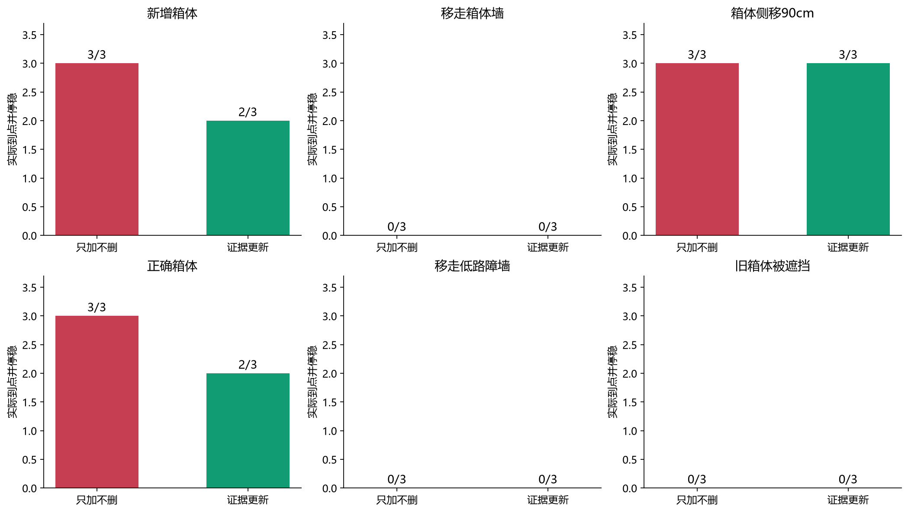
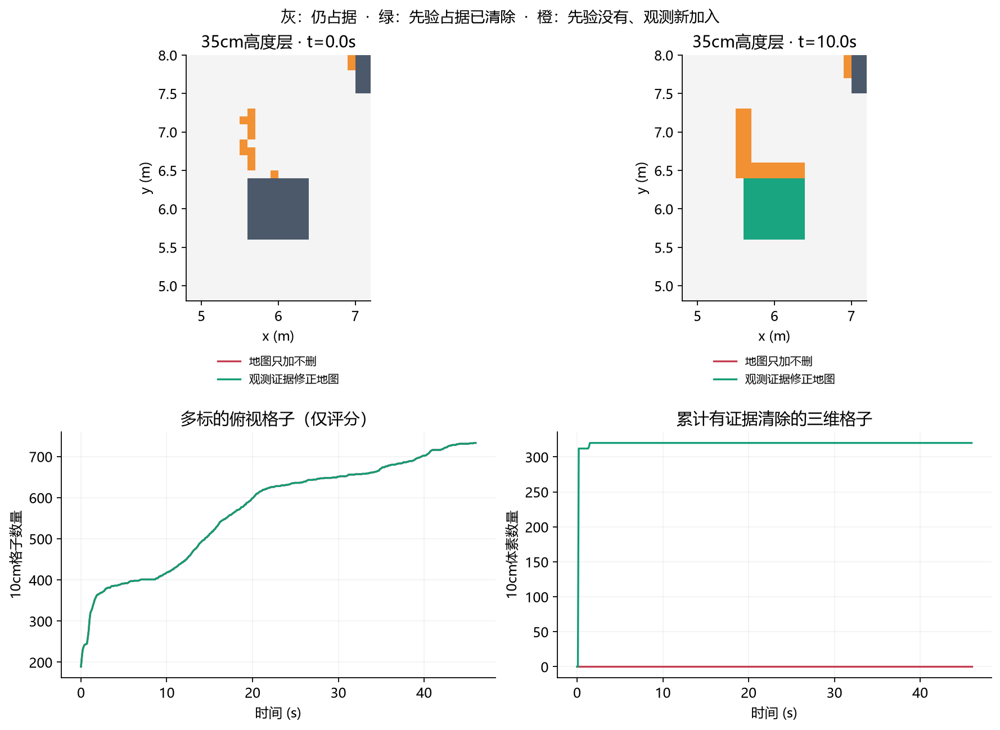
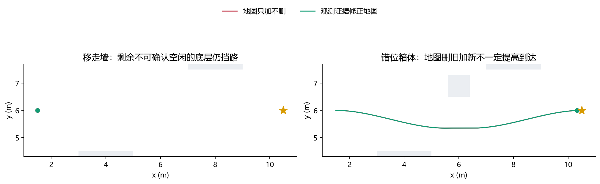
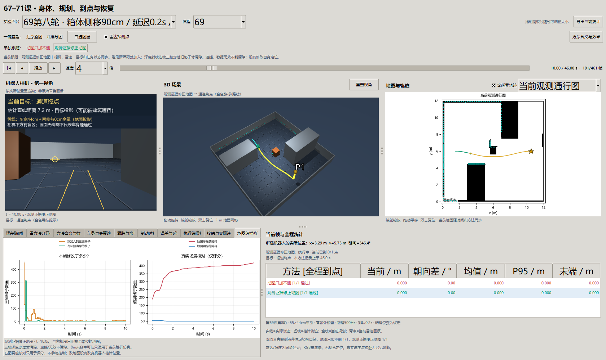
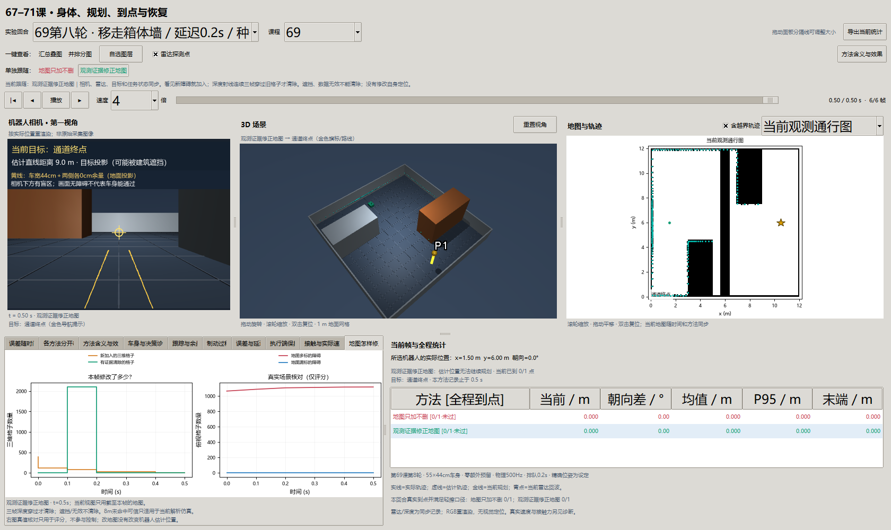

# 第六十九课第八轮：怎样用观测修改错误的局部地图？

2026-10-01，接续[第七轮](69-speed-round7.md)，按[两轮补强登记](navigation-reinforcement-7-8-plan.md)完成36回合；采集/计算/写盘477.87秒。

**结论：三维地图能按观测加入障碍、清除部分旧障碍，但本轮没有提高导航到达率。** 只加不删9/18、证据更新7/18，全部无接触、无误报。下方分别解释更新真的发生在哪里、为什么未能通过移走墙，以及新增的停滞。不能把“地图动了”写成“错误建图导航已经解决”。

## 1. 先分清三个问题

地图说前面有箱子，现实中箱子被搬走了。这是**场景占据错误**：需要确认原位置已经空，删除旧占据。箱子实际移到旁边，则还要加入新占据。

如果箱子在原地，但机器人以为自己在另一处，整批观测会投错位置。这是**位姿误差**，单纯删旧加新可能把地图越改越错。第68课用历史雷达和轮读数修正运动再重建地图；本轮假定位置精确，隔离占据更新。没有把地图修改称为定位改善。

即使位置和地图正确，规划器仍要考虑身体，控制器仍要真正沿路线移动。第七轮减速解决部分执行问题，本轮的失败又显示路线跟踪还有独立瓶颈。

## 2. 新变量与关联

| 变量 | 通俗含义 | 如何变化 |
| --- | --- | --- |
| `prior_boxes` | 实验开始前地图所声称的障碍体积 | 可能正确、漏标、错位或已被移走；属于控制输入 |
| `actual_boxes` | 仿真里真正存在的物体 | 只用于传感器、物理和评分，不传给地图控制器 |
| `occupied[y,x,z]` | 10cm三维格子是否占据 | 雷达/深度端点写入；证据组可以清除 |
| `votes` | 连续看见某个旧格子为空的次数 | 3帧才删；遮挡、无效、当前命中会归零 |
| `depth` | 相机光轴方向距离，m | 不是整条斜射线长度；先转到相机坐标比较 |
| `depth_valid` | 解析射线是否有量程内命中 | 本仿真无命中返回恰好8m；它与真实相机失效不同 |
| `map_counts` | 本帧新加入、清除、有空闲证据的三维格子数 | 计的是体素，不是地图面积，也不是到达次数 |
| `map_frames` | 本帧给规划看的俯视占据图 | 一个x/y柱内任何高度仍占据，就保守判该柱不通行 |
| `map_error` | 相比真实俯视图，多标/漏标的格子 | 仅评分；不供控制选动作 |
| `requested_command`、`passed` | 规划请求、实际通过 | 地图正确仍可能请求零速度；通过必须真实到点停稳 |

关联：当前观测＋估计位姿 → 三维端点与空闲证据 → 更新三维格子 → 保守投影为通行图 → 同一个规划/跟踪/停车流程 → 实际接触物理 → 下一帧。

## 3. 怎样证明旧障碍真的不在那里？

相机射线先穿过某格子，直到更远才打到物体，能支持“这个采样方向上格子前部没有挡住射线”。本轮检查格子中心投影周围3×3像素，取最短有效深度；它要比格子中心的光轴距离再远12cm。连续三帧满足才清除，避免单帧噪声删除。

如果前方有另一箱体挡住视线，深度停在它那里；后方旧格子没有空闲证据，继续保留。如果相机返回NaN或无效值，也不能清除。没有设置“几秒没看到就删”的期限。

本轮解析传感器的特殊合同是：`valid=False、depth恰为8m`表示射线量程内未命中，可支持8m以内的有限空闲。这个合同必须显式启用；`EvidenceMap`默认拒绝外部无效深度。真实相机无返回可能由玻璃、黑色表面、过曝或设备失效造成，不能照搬此合同。

雷达高32cm，命中被保守写作车身高度内的柱。雷达无回波没有证明低路障或悬空横杆不存在；其他高度的清除仍需深度。这里也没有识别箱子的语义身份，仅更新格子占据。

**边界：格子中心、3×3像素与12cm预算是有限采样模型，不是每个10cm立方体的连续几何空闲证明。** 噪声/稀疏观测与位姿误差必须继续研究。

## 4. 如何比较两种地图方法？

两组同用0.2m/s、零额外余量、允许轻擦、0.2秒排队、0.5秒静止观测准备、同一三维分辨率和同一规划器。只加组也会把新障碍加入并找路，唯一区别是不会删除旧占据。

6种地图条件×新种子20/21/22×两组，36回合。障碍在每回合内保持静止；“在线”指行驶时因观测更新地图，不代表已验证行驶途中突然有人搬动障碍。

| 条件 | 只加不删 | 证据更新 | 这项检验什么 |
| --- | --- | --- | --- |
| 新增箱体 | 3/3 | 2/3 | 新占据能否引起绕行 |
| 移走箱体墙 | 0/3 | 0/3 | 能否确认整车高度内的旧墙已空 |
| 箱体侧移90cm | 3/3 | 3/3 | 旧位置清除和新位置写入 |
| 箱体未变化 | 3/3 | 2/3 | 更新会不会妨碍本来可完成的任务 |
| 移走14cm路障墙 | 0/3 | 0/3 | 单层雷达盲区、地面附近空闲证据 |
| 旧箱体被前方箱体遮挡 | 0/3 | 0/3 | 不可观测部分保留；本批停滞失败 |



每柱3回合，红=只加、绿=证据更新。新增/正确箱体都在种子22出现更新组停滞；两条件得到相同有效执行记录，不能把它们当成两个独立现实失败环境。混合全批9/18对7/18不是部署成功率。

## 5. 清除320个体素，为什么俯视图仍没变好？



固定种子20错位箱体。上排是35cm高度层，不是全高度俯视图：灰=仍占据，绿=旧占据已清除，橙=观测新加入；左右分别0秒和10秒，由原始观测按验证后的规则重建。下右累计清除320个三维格子；下左全高度俯视多标曲线两组重合，红线被绿线覆盖。

原因是三维柱中**最底层仍占据**。相机射线在地面附近更早碰到地面，最短邻域深度和12cm预算不支持删除底层；俯视只要一层占据就继续标黑。上层地图改善，没有转化成通行图改善。

移走箱体墙每回合清除2101个体素，却仍保留底层，准备期后规划达到10000扩展预算而无路。这个结果是“当前观测/表示/规划未解决”，不能证明现实里墙还在或物理不可通过。移走低路障墙则清除0个体素；雷达看空不足以清除地面低障碍。没有人为清掉底层让结果变好。



固定种子20：左图真实通道已空，两组仍在起点拒绝；右图两组绕行轨迹与末端重合。灰为实际障碍，地图里不存在的旧墙不能画成真实墙；星为目标。轨迹重合不表示漏画。

## 6. 地图更新为什么还使两个回合停滞？

在种子22新增箱体/正确箱体条件，更新组走了3.60m后停在`(5.031,6.596)m`。记录中的理由仍叫“following”，但请求速度实际上为0，也没有本地保护接管；不能据状态名说车一直在跟随。

冻结路线保留逻辑留下了一个已落在车后的首个路点。它离车约47.96cm，大于原35cm路点接近半径；速度逻辑认为车尚未走到它，要求先对准这个后方点。转向逻辑同时沿前方路线切线稳定，角速度接近0，于是线速度0、角速度0，直至停滞终止。

固定存档姿态/路径的反事实只把路点索引从0改为1，请求从`(0,约0)`变为`(0.2,-0.0283)`。这支持“路点进度与切线跟踪不一致”的诊断，**不等于修复后真实到达已经验证**。遮挡批次两组也出现相同类型停滞，首点约44.07cm落后。

正式结果不调参补跑覆盖；[诊断存档](benchmarks/navigation-reinforcement-v8-waypoint-diagnosis.json)保留输入记录与请求对照。下一项应先独立修复路点进度，再以新种子重验地图更新，不能把改跟踪和改地图同时算作地图收益。

## 7. 窗口怎样看？



选择“当前观测通行图”，它随时间和所选方法同步；“实验开始时的先验地图”始终保留初始图。“地图怎样修正”页显示本帧增删和评分误差。一键方法切换同时更新第一视角、3D、雷达点、目标、曲线和地图，保持当前时间；并排图各自显示截至该帧的地图，没有借用未来最终图。



固定移走墙、种子20、0.5秒。相机与3D反映真实场景，地图仍保留无法确认的底层占据；全程通过0/1。能看见通道不等于已确认所有身体高度可通行。

## 8. 证据可信到哪一层？

[独立验收](benchmarks/navigation-reinforcement-v8-validation.json)从记录初态、XML和施加力直接重放459,200个物理步，状态和接触差均0；重建9,220帧地图。另用独立相机投影和逐个9像素比较核验7,763个删除事件各自的三帧原始证据。

已知答案覆盖三帧清除、单帧不清除、无效重置、遮挡保留、真实命中、雷达高度盲区、显式量程合同与估计朝向转换。窗口实测一键切换及回到0帧，排除最终地图回填。它们证明规则和存档自洽，不能替代真实传感器错误、相机/身体标定、连续RGB-D同步或实际SLAM误差。

## 9. 思考题

1. 旧箱子被搬走与机器人定位错了，为何需要不同处理？
2. 雷达高32cm，为什么“前面没回波”不足以删14cm路障？
3. 相机深度无效与解析射线量程内未命中有什么区别？
4. 三帧深度穿过一个格子，能保证整个格子每个角落为空吗？
5. 清除320个三维格子，为什么全高度俯视错误数量可能完全不降？

### 延伸问题（保留原题，不计入核心五题）

6. 地面是可行驶表面，但深度射线会打到地面；怎样避免把地面当箱子，也避免随意删除低路障？
7. “following”状态、零请求、零真实速度分别说明什么？
8. 把车后首路点跳过后的请求变为0.2m/s，为什么还不能宣称真实到达恢复？
9. 全部零接触但只有7/18到达，方法可以称为有效导航吗？
10. 下一轮若同时改相机位置、空闲规则与路点跟踪，因果解释会丢掉什么？

## 10. 复现和停止点

```powershell
uv run python -m embodied_learning.experiments.navigation_reinforcement --round 8 --output results/navigation_reinforcement_v8
uv run python scripts/validate_navigation_reinforcement.py --round 8
uv run python scripts/validate_navigation_reinforcement.py --diagnosis-only
uv run python -m embodied_learning.navigation_study_demo --lesson 69 --footprint results/navigation_reinforcement_v8 --case 69_street_crate_20__delay_2__shifted --play
```

同第七轮，输出目录须不存在；已有记录直接打开。两个正式摘要、原始数组、协议和执行源码各自保留，图表由同一生成脚本复现。`uv run python scripts/test.py full tests/test_navigation_reinforcement.py tests/test_contact_viewer.py tests/test_navigation_study_viewer.py tests/test_replay_viewer.py`验证受影响模块，再运行quick层。

本轮不推荐把证据更新默认用于所有导航。下一阶段先处理已确认的路点进度，再研究近地面主动观察/分高度通行判断，保留低障碍真实存在的负例。69—71同物理平台组合、异步执行、失定位、65课似然场与跨场景门槛仍未完成。72—73机械臂结果不能替代这些验收。

## 原始来源与本地适配（2026-10-09补引）

[A Formal Basis for the Heuristic Determination of Minimum Cost Paths](https://ai.stanford.edu/~nilsson/OnlinePubs-Nils/PublishedPapers/astar.pdf)（Peter Hart / Nils Nilsson / Bertram Raphael，1968）；[Implementation of the Pure Pursuit Path Tracking Algorithm](https://publications.ri.cmu.edu/implementation-of-the-pure-pursuit-path-tracking-algorithm)（R. Craig Coulter，CMU技术报告1992）；[Modern Robotics: Mechanics, Planning, and Control](https://github.com/NxRLab/ModernRobotics)（Kevin Lynch / Frank Park，2017）。

在本地差速平台分离足印、动作队列、制动、观测地图和三维通行；这些受控扩展不是原 A* 或纯追踪自带的安全保证，各轮身体/权限/种子与失败分开。 [完整采用关系与引用规则](references.md)。
