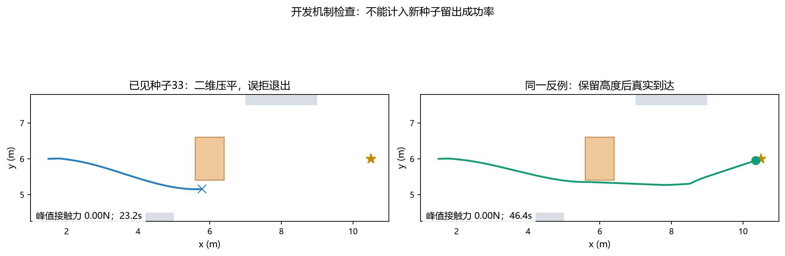
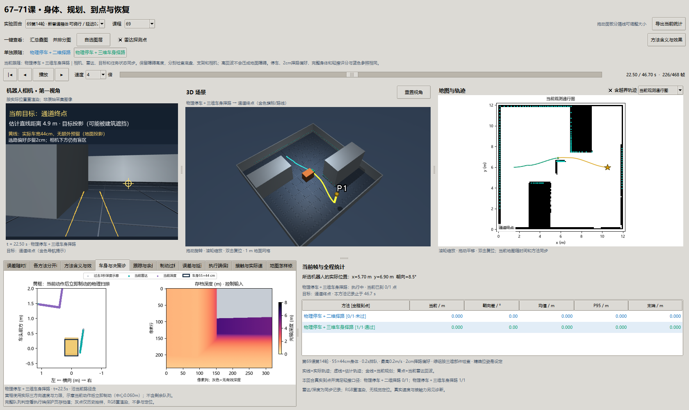

# 第六十九课补充：停车要算真实身体，规划要保留真实高度

> 第十二至十四轮。承接[第十一轮](69-reachable-obstacles-round11.md)及[接触诊断](69-contact-failure-diagnosis-round11.md)。本轮先修停车预测，再分离择路余量，最后修复把高处回波压到地面的误拒。所有失败存档保留。

## 1. 一条规划线为什么仍可能撞？

规划线告诉机器人应该走哪里，但身体不会立刻照着速度请求运动。刹车请求要排队，电机推力有限，车还有原来的速度。转弯时，身体角点也会扫过比中心线更大的范围。

第十一轮的箱体反例正好说明这条因果链：20.0s请求停车，20.2s才执行，20.418s前左角接触；原预测认为剩余行程56.0mm，相同驱动的真实不受阻停车却需要79.7mm。规划线最贴近障碍处只有约3.9mm，实际朝向还偏了约2.38°。观测到障碍并不等于停车距离已经算对。

## 2. 先把新变量串起来

| 变量或概念 | 平常话解释 | 在实验中怎样变化、关联？ |
| --- | --- | --- |
| `desired`速度请求 | 控制器希望前进/转向多快 | 请求进入0.2s队列；不是身体立即获得的速度 |
| 实际世界速度`vx,vy,w` | 身体真的向哪个方向走、转多快 | 由力和惯性产生；转到车身坐标后保留前向、侧向、转动三个分量 |
| 侧向速度 | 车身朝前，但还在向旁边滑 | 原二维“前进＋转向”表示会漏掉它；新预测仍积分它 |
| 限力伺服 | 电机只能有限度地追赶速度请求 | 8kg车、最大平面推力6.4N；不会把`qvel`直接设成请求 |
| 停车预测 | 把当前运动和已知待执行动作向前算 | 先执行已排队请求，再按同一驱动减速，直到三个速度分量都很小 |
| 扫掠身体 | 停车过程中整台车占过的空间 | 包括底盘、支架、相机；中心轨迹安全不代表角点安全 |
| 实测三维点`x,y,z` | 传感器命中的位置和高度 | 地图记录它，规划和停车检查读取它；不能把`z`丢掉后当作地面墙 |
| 择路偏好2cm | 尽量别选刚好擦边的路线 | 只扩大选路用的XY盒体，不缩小真实身体，不改接触通过标准 |
| 近墙起点放松 | 已经靠得近，也要能找离开的路 | 只有起点在偏好余量内才启用；离起点20cm内逐渐恢复2cm，始终检查真实身体 |
| 三维部件检查 | 点在哪个高度，就检查该高度的部件 | 50cm高点可能约束支架，却不该自动约束宽底盘 |
| 真正到达 | 车实际到了，而且真的停住 | 真实距离<25cm，平移/转动速度<0.01，并满足既有轻擦口径 |

顺序是：**传感器测量 → 地图保留三维点 → 规划检查各个部件 → 跟踪给速度请求 → 排队与驱动产生实际运动 → 用实际速度预测停车 → 独立检查真实到达和接触**。地图更细、路线存在、没有接触、完成任务，是不同层次的结果。

## 3. 第十二轮：让停车预测和驱动说同一种话

新预测在一个没有环境障碍的独立模型中积分车辆运动。它知道本车的质量、几何、驱动和已测速度，知道已经排队的请求；不知道隐藏障碍、真值绕行路线或未来传感器数据。积分出的身体姿态，再与当前/过去观测到的点核对。

为什么预测模型里不放真实障碍？因为放进去会让它提前知道未观测的场景，也可能利用碰撞来“帮忙刹车”。本轮需要的停车空间是在不靠撞墙阻滞的情况下计算。新点几何与身体的碰撞检查独立进行。

独立测试覆盖直行、倒退、转动和侧向速度，并与另一个真实物理车辆逐子步对比；还核对相同完整速度在坐标旋转后如何转换。这里的完整速度由受控仿真作为已测状态提供；原预测只取前向和转动，新预测保留原来丢掉的侧向分量。它不是从RGB估出的速度，也尚未检验实机读数误差。为了加速，距离核对改为批量矩阵计算，省略不需要的状态拷贝；预测姿态和标量距离的等价性单独检查，没有通过减少观测点数量换速度。

开发种子0箱体结果：原85.94N接触中止变为零接触，但车停在约8.4mm真实间隙处，随后噪声点让规划认为身体被挡，仍判无路。**修好停车只是让它停得住，还没让它走得完。** 四个开发场景中其余三类可以到达。

## 4. 第十三轮：给择路留空间，但不能把已有起点封死

2cm候选偏好来自开发量级：雷达噪声5mm、深度3mm；反例约2.4°朝向偏差，会让最远角点移动约1.6cm。它是经验预算，不能保证任何误差都被覆盖。

第一版在任何地方都强制多留2cm。它没有碰撞，但车已经距障碍约1.8cm时，起点被额外余量封住，不能继续规划。第二版允许在这种已有近墙起点逐渐恢复余量：当前姿态仍检查真实身体，额外空间随着离开起点增加，不是允许穿过观测障碍。

第二版四个开发场景均到达，零接触；随后冻结源码，使用32—36新种子和两个新布局验证。正式87回合全部完成：最终候选58/60正例到达、零接触，三例无路负例正确拒绝；原街区悬空杆种子33与箱体种子35仍误拒。因此不标为稳定通过，不能只汇报96.7%而隐藏两个失败。

## 5. 第十四轮：悬空点不能压成宽底盘前的一堵墙

第十三轮悬空杆、种子33，在22.5s退出。重建只截至这一帧的观测记忆，找到相对车身`(29.35cm,23.91cm,50.02cm)`的回波。它进入了2cm外扩底盘的俯视范围，却高于30cm底盘，且在支架/相机横向范围之外。按三维身体核对观测点的停车预测仍有约12.26cm间隙；该数不是控制器读取的真实障碍几何。

二维检查丢掉高度后，当前起点勉强放松，下一搜索步就被这个假想“地面点”挡住，只扩展了一个节点。三维规划分别核对底盘0—30cm、支架30—56cm、相机52—58cm。位于50cm的点仍会挡住真实支架；位于14cm的点仍会挡住底盘；75cm高杆可以从下方通过。没有把高障碍一律忽略。

先验格子没有可靠高度时仍当完整墙。新观测的二维投影只用于地图展示和搜索启发，最终可行性使用三维点和所有真实部件。地图清除依然要求连续三帧可见空闲证据，没有改清除阈值来获得通过。

开发只用已见种子0四场景和33悬空杆反例，五例均到达、零接触。正式另外冻结37—41种子、原街区和两个未用于开发的西移/北移布局。

## 6. 怎样安排对照和读成绩？

- 第十三轮87回合：原布局四高度、三个种子三组配对；最终候选另外扩大到三个布局、五种子，共60正例；三例不可达入口另列。
- 第十四轮75回合：三维候选三个布局、四高度、五新种子，共60正例；原布局37—39种子的二维候选12回合作配对参照；另有三例无路负例。
- 两算法的改善只比较同一12对条件。60/60描述最终候选的覆盖，不能与参照的12回合分母直接相减。
- 入口负例宽30cm，小于车身最小44cm；正确拒绝与停稳是负例成绩，不计入正例到达率。

**第十四轮通过冻结的稳定性门槛：60/60正例真实到达并停稳，零误报、零接触；三例无路负例全部正确拒绝并停稳。** 接触门槛仍为≤40N/5mm/连续0.5s，本轮没有用放宽门槛取得成功。无路、停住、超时均不能冒充正例成功。


左图只比较相同原街区、37—39种子的12对条件：二维择路10/12，三维部件择路12/12；二维组的箱体37、38种子仍无路退出。右图展开最终60例：三个布局、四种障碍高度，每格五个新种子均5/5。两图回答“同条件是否改善”和“新范围是否稳定”两个问题，分母不同。

| 检查 | 实测结果 | 怎样理解 |
| --- | --- | --- |
| 正例到达与停车 | 60/60，最终距离15.24—17.00cm | 满足既有25cm门槛；不是要求到目标中心零误差 |
| 正例接触/误报到达 | 0/60、0/60 | 未靠撞障碍完成；定位真值仍是受控输入，不能写成定位误差改善 |
| 不可达入口 | 3/3正确拒绝并停稳 | 成功识别无路，不计入到达分母 |
| 旧失败回归 | 五例5/5到达、零接触 | 已见案例只算回归：悬空杆30/33，箱体0/31/35 |
| 时间与路长 | 45.4—48.6s仿真；8.84—9.26m | 由各自真实执行链统计；不是墙钟运行时间 |
| 控制计算P95 | 127—218ms/回合 | 三进程并发实测，超过100ms控制周期；尚未满足实时运行 |
| 独立物理重放 | 1,642,850个2ms步，状态/接触误差均0 | 全75回合原始请求重放一致；核对存档，不证明实机模型准确 |


四图对应低路障、悬空杆、箱体和高杆。蓝虚线是物理停车＋二维择路，绿实线是物理停车＋三维部件择路，黑叉为目标。箱体蓝线停在途中，属于失败；另外三类两条线均到达，即使选边不同，也不能仅凭轨迹更好看就判断算法更有效。高杆两组都能从下面通过。



这个已见悬空杆33种子仅用于解释原因：二维组无路退出、三维组到达，两组接触力均0。说明零碰撞也可能因为拒绝前进，必须同时看完成任务。它不计入60例新验证。

完整[结果摘要](benchmarks/navigation-reinforcement-v14.json)、[独立重放审计](benchmarks/navigation-clearance-validation-v14.json)和[五例旧失败回归](benchmarks/navigation-height-known-regressions-v14.json)包含源码及输入哈希。第十三轮的58/60失败结果和审计也继续保留。

## 7. 窗口中分别看什么？

方法按钮同时切换第一视角、三维车、地图、路线、目标和统计，并保留当前时间。第十四轮蓝色是“物理停车＋二维择路”，绿色是“三维车身择路”；两组分别真实驾驶，轨迹差异不是两个定位器预测同一辆车。

黄线为实际车宽44cm的地面投影，另写2cm择路偏好。青点为雷达回波；紫点为深度抽样。第一视角是按实际位姿重新渲染，RGB没有参与定位。停车页的物理黄框是“当前动作执行后立即制动”的示意，不包含剩余队列；完整排队判断用执行端保护页的存档数值。相机下方盲区仍然存在，标线不是安全通行证明。



固定原街区、箱体37种子、22.5s截图：左侧实际相机，中间实际身体与目标，右侧观测地图与雷达点，下面当前停车扫掠、深度和两组统计。方法按钮一键同步切换所有面板。截图来自当前窗口运行，未拼接不同回合。

## 8. 理论联系与边界

停车预测属于使用驱动模型的有限前瞻检查；本轮模型与仿真驱动一致，但实机的载重、电池、摩擦和延迟会变化，需要重新标定和不确定性预算。2cm不是数学保证。

部件检查把“机器人是一个平面点/圆盘”细化为“多个有高度的实体”。它提高几何一致性，没有增加相机视野，也没有解决稀疏点之间未观测的表面、遮挡和移动物体。

位姿精确仍是受控条件，误差统计零不能写成定位算法成绩。计算期间仿真物理暂停；显式0.2s请求队列不等于真实端到端异步延迟。仿真通过、实时系统通过、视觉定位通过和实机通过继续分开。

## 9. 思考题

1. 请求速度已变小，身体为何仍会走得更快？把质量、最大推力、排队时长接到同一因果链上。
2. 当前前向速度为零、侧向速度不为零时，原二维停车预测遗漏了什么？应怎样设计已知答案测试？
3. 50cm高回波出现在宽底盘俯视范围内，为何不能直接判碰撞？在哪些部件位置又必须判碰撞？
4. 额外2cm偏好与允许轻擦40N是同一件事吗？一条路线满足偏好是否能保证物理接触力？
5. 为何三次相同街区新噪声成功，不能代替两个新街区布局？开发修好原反例为何不算留出验证？
6. 若CPU计算期间车继续运动，当前预报的初始状态还有效吗？怎样记录采样时间、完成时间和实际执行时间？

## 10. 复现与下一步

```powershell
uv run python -m embodied_learning.experiments.navigation_physical_braking_study --round 12 --smoke --output results/navigation_physical_braking_development_v12b
uv run python -m embodied_learning.experiments.navigation_clearance_study --round 13 --workers 3 --output results/navigation_reinforcement_v13
uv run python -m embodied_learning.experiments.navigation_height_study --workers 3 --output results/navigation_reinforcement_v14
uv run python scripts/validate_navigation_clearance.py --input results/navigation_reinforcement_v14 --output docs/benchmarks/navigation-clearance-validation-v14.json
uv run python -m embodied_learning.navigation_study_demo --lesson 69 --footprint results/navigation_reinforcement_v14 --case 69_street_crate_37__delay_2__bypass_crate --play
```

已存在目录会拒绝覆盖；中断后同命令加`--resume`，先校验源码、登记及已完成存档哈希，只运行剩余案例。`wall_s`是已保存运行段累计，未保存工作或中断间隙不包含其中。原始结果保留本地results，仓库摘要含输入/源码哈希，新克隆需按命令生成。

本轮在限定导航范围通过后继续[第73课](73-so101-physical-grasping.md)的接近几何；首轮正常抓取仍6/9，不能拿导航到达率替代抓取成绩。接下来分别诊断夹爪中心、物体朝向、下降和实际接触，再做新位置/朝向的独立验证。导航位姿误差、遮挡、异步执行及69—71联合系统仍在路线图保留。
