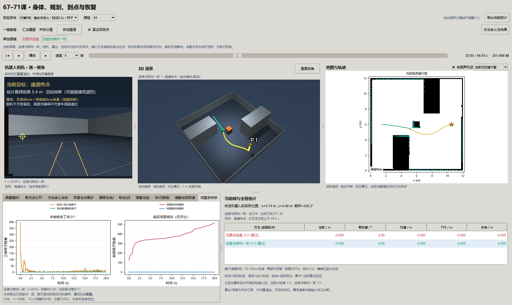

# 第六十九课第九轮：为什么有路线，机器人却不往前走？

2026-10-01，接续[第八轮地图更新](69-online-map-round8.md)，按[第九、十轮登记](navigation-reinforcement-9-10-plan.md)完成36回合。

**结论：可绕箱体的三类任务，由7/9提高到9/9；车后路点/前进门控造成的停滞得到修复。** 全部条件混合是7/18→9/18；移走墙仍无路，遮挡条件仍0/3。全部36回合无实体接触、无误报到达，未放宽接触或到点阈值。采集、计算和写盘514.13秒（与其他批次并行运行的墙钟）。

## 1. 先把失败说清楚

机器人有一条绕过箱子的路线，也已经沿它走了一段。路线开头那个点现在落在车后，但仍离车超过35cm。旧规则认为“还没进入这个点附近，所以不能跳过它”。于是它要求先朝向车后的点才准前进。

另一个负责转向的规则，却让车头顺着前方路线的切线。两条规则各自算得出数，却在要求相反的动作：前进规则等车头转回去，转向规则一直把车头留在前方。最终车头稳定、前进速度为零，直至停滞终止。图看起来路线合理，也不等于机器人执行了路线。

开发首版只跳过已走的首点，遮挡条件从走0.44m增到1.90m，又停住：35cm邻域提前跳到转角后的点，其远处方向再次与当前位置的切线冲突。所以本轮同时处理**已走首点**与**前进/转向朝向一致性**，不是仅改一个数组索引便宣布解决。

## 2. 变量怎样关联？

| 变量 | 通俗含义 | 如何影响实验 |
| --- | --- | --- |
| `path` | 当前规划的折线路线，单位m | 每秒检查/重规划；可保留旧曲线，因此首点未必是当前位置 |
| `wp` | 当前追的路点编号 | 重规划归零；旧规则进入35cm邻域才加一，不是全程累计进度 |
| `fraction` | 机器人投影位于首段的什么位置 | 0=起点，1=终点；处于0到1之间且贴近首段，才支持已走过首点 |
| `PROJECTION_TOLERANCE_M` | 投影离首段的横向容差，5cm | 只判断进度；不缩小55×44cm车身、不改变安全余量 |
| `prefix_passed` | 本帧是否依据投影跳过首点 | 记录在 `waypoint_progress`；不能代表到达终点 |
| `cross_m` | 车离路线的横向偏差，m | 越偏离，期望朝向越往路线内部修正 |
| `heading_rad` | 路线当前位置的方向，rad | 与横向修正一起形成期望车头方向 |
| `curvature_m_inv` | 路线弯曲程度，1/m | 同样速度下，弯得越急，需要的角速度越大 |
| `requested_command` | 保护检查之后的前进/转向请求 | 单位m/s、rad/s；请求不是身体的真实速度，且会排队 |
| `nominal_command` | 保护检查之前的跟踪请求 | 用来区分跟踪自己不给速度，还是保护主动制动 |
| `passed`、`status` | 实际任务评分、结束原因 | 真实到点、停稳、接触合格才通过；有请求不算成功 |

关系：估计位置 → 当前路线上的投影和方向 → 已走路点处理 → 一致的前进/转向请求 → 排队预测与本地保护 → 限力接触物理 → 下一帧观测。精确位姿是本轮设定，定位误差0不是新定位算法成绩。

## 3. 修复原理：两种动作使用同一个方向

设首段起点为a、终点为b，机器人位置为p。先计算投影比例：

`fraction = (p-a)·(b-a) / |b-a|²`。

只有投影处于首段内部、横向距离≤5cm，才证明首点已走过。只检查路线顺序中的首段；不会因为交叉路线的后段更近，就跳到后面。首段长度为零、机器人仍在起点后、偏离路线或已经越过转角，均不能靠这条新规则跳点。原35cm邻域规则仍保留。

转向延用原公式：`期望朝向 = 路线方向 - atan2(2×横向偏差, 0.6)`；角速度请求为 `v×曲率 + 2×朝向差`，再限制到±1rad/s。前进也检查**这个期望朝向**：朝向差小于0.3rad才给0.2m/s，否则先原地转向。门槛与反馈增益没有放宽。角速度中的v用最终前进请求，避免“速度已限到0.2，转弯还按0.6计算”。

路线生成与安全保护不变。若观测地图真的没有可行路线，仍会停车；这个修复不会擦掉墙，也不会强行给无路状态运动指令。

## 4. 怎样比较？

两组都使用第八轮证据地图：10cm体素、三帧确认、3×3深度邻域、12cm穿越预算；相机80×60。共用低速0.2m/s、排队0.2s、0.5s静止准备、90s超时。55×44cm车身、500Hz接触和轻擦40N/5mm/连续0.5s不变。距真实终点<25cm，世界平移和角速度均<0.01，才算到点停稳。

种子23/24/25，六种地图条件×两组，共36回合。对照是同种子旧进度与新一致规则，不能把它与第八轮不同种子的总分直接作因果比较。

| 条件 | 旧进度/门控 | 新一致规则 | 结果含义 |
| --- | --- | --- | --- |
| 新增箱体 | 2/3 | 3/3 | 未标的障碍引发绕行 |
| 移走箱体墙 | 0/3 | 0/3 | 底层未看空，仍无路 |
| 箱体侧移90cm | 3/3 | 3/3 | 旧图与新端点的联合约束 |
| 正确箱体 | 2/3 | 3/3 | 本来可绕行的任务是否仍停滞 |
| 移走14cm低墙 | 0/3 | 0/3 | 雷达高度盲区与地面附近证据 |
| 箱体被遮挡 | 0/3 | 0/3 | 进度修复后仍可能找不到通路 |


每柱3回合；红=旧进度/门控，绿=进度与门控一致。移走墙是缺少空闲观测证据的条件，不应期待跟踪修复清除它。不同地图条件混合的总分不是实际部署成功率。

## 5. 请求变了，真实运动是否也变了？


固定选种子23遮挡条件和正确箱体，未按最好成绩挑图。上排是实际轨迹，圆点为各自终点，灰色是真实障碍，金星是共同目标；下排实线是前进请求，虚线是身体实际平移速度；请求含保护检查结果。终点制动还会携带停车标志，因此请求仍非零也可能已被执行端制动，是否停稳须看实际速度。结束较早的曲线到此结束，不能把保持末帧计为额外成功。

正确箱体种子23两组都到达；新规则48.5s、旧48.0s，不应宣传为提速。真正改善出现在种子25：旧组走4.00m后停滞，新组走9.03m并到点停稳。新增箱体和正确箱体在本批得到相同有效运动，两个失败不能当两个独立现实环境。遮挡种子23旧组走0.44m后停滞，新组走2.47m后拒绝规划，仍没有到达；绕过首点并不保证地图/路线始终可行。



窗口同时显示相机、三维场景、当前雷达点、方法含义、目标、实际/估计轨迹和当前地图。顶栏一键切换全部面板；“地图怎样修正”页显示当前路点编号与本帧跳点情况。相机RGB是按记录位姿重渲染，控制使用的是存档深度/雷达；没有新增RGB定位。

## 6. 失败与此前课程的联系

旧组18回合有7次完成、5次停滞、6次无路；新组9次完成、0次停滞、9次无路。5次停滞消失中，2次变成完成、3次变成更前方的规划拒绝。不能把全部停滞消失写成全部任务被救回。移走墙和低墙的底层占据仍在，进度规则不会更改观测证据。

第69课第二轮强调沿曲线方向控制，第三轮要求停车预测和执行一致，本轮进一步要求**前进许可与转向方向一致**。这些一致性分别发生在路径、停车、跟踪接口上，不能互相替代。第68课修地图，第70课审到点，第71课有限恢复解决的是其他环节；本轮仍未把它们合为同一平台。

控制器只读取先验、估计位姿、当前/过去观测。真实盒体仅用于观测生成、接触与评分。路线切线仍取最近折线投影；新首点进度不跳交叉段，并不意味着整个切线控制器已解决所有自交路线问题。

## 7. 思考题

1. 为什么“有路线、没有碰撞、车头很稳定”仍可能是导航失败？应查看哪两个速度字段？
2. 若直接每次把 `wp` 设为1，机器人尚未走到首段时会有什么风险？投影条件限制了什么？
3. 为什么跳过旧首点后，提前跳过转角仍可能停滞？怎样从期望朝向解释？
4. 为什么本轮移走墙仍无路，不能据此否定进度修复？怎样设计下一轮分离地图观测因素？

## 8. 复现、验收与停止点

```powershell
uv run python -m embodied_learning.experiments.navigation_progress_study --round 9 --output results/navigation_reinforcement_v9
uv run python scripts/validate_navigation_progress.py --round 9
uv run python docs/img/make_navigation_progress_figures.py
uv run python -m embodied_learning.navigation_study_demo --lesson 69 --footprint results/navigation_reinforcement_v9 --case 69_street_crate_23__delay_2__unchanged
uv run python scripts/test.py full tests/test_navigation_progress.py
```

输出目录须尚不存在；脚本拒绝覆盖。图表脚本同时使用第十轮，先完成下一轮记录再运行。新克隆仓库不含大体积NPZ，需按命令生成；公共[正式摘要](benchmarks/navigation-reinforcement-v9.json)和[独立验收](benchmarks/navigation-reinforcement-v9-validation.json)保留协议、源码、记录哈希。

独立直接重放456400个2ms物理步，状态与接触误差均0；重建9164帧地图，对15701次删除逐一检查三个原始观测中的9像素深度。旧组桥接冻结第八轮的种子23实际运行，除计算墙钟与新增进度字段外，全部原数组逐值相同。已知答案涵盖首点已走/未走、偏离、折返、交叉、转角提前跳点和未对齐身体。真实窗口及共同回归见[交付验收](benchmarks/navigation-reinforcement-9-10-delivery.json)。

按登记完成后冻结结果，不在正式种子上继续调参。下一轮单独改变深度采样，见[第十轮讲义](69-depth-sampling-round10.md)。

## 原始来源与本地适配（2026-10-09补引）

[A Formal Basis for the Heuristic Determination of Minimum Cost Paths](https://ai.stanford.edu/~nilsson/OnlinePubs-Nils/PublishedPapers/astar.pdf)（Peter Hart / Nils Nilsson / Bertram Raphael，1968）；[Implementation of the Pure Pursuit Path Tracking Algorithm](https://publications.ri.cmu.edu/implementation-of-the-pure-pursuit-path-tracking-algorithm)（R. Craig Coulter，CMU技术报告1992）；[Modern Robotics: Mechanics, Planning, and Control](https://github.com/NxRLab/ModernRobotics)（Kevin Lynch / Frank Park，2017）。

在本地差速平台分离足印、动作队列、制动、观测地图和三维通行；这些受控扩展不是原 A* 或纯追踪自带的安全保证，各轮身体/权限/种子与失败分开。 [完整采用关系与引用规则](references.md)。
