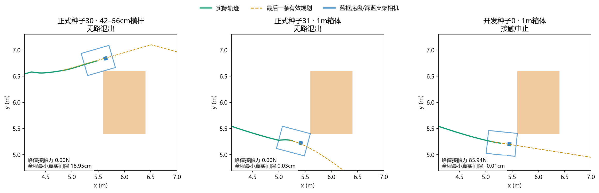
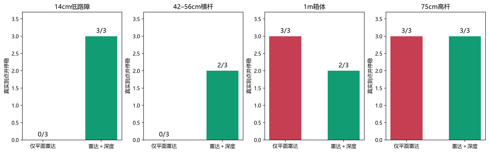
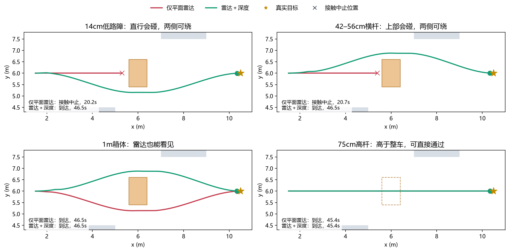
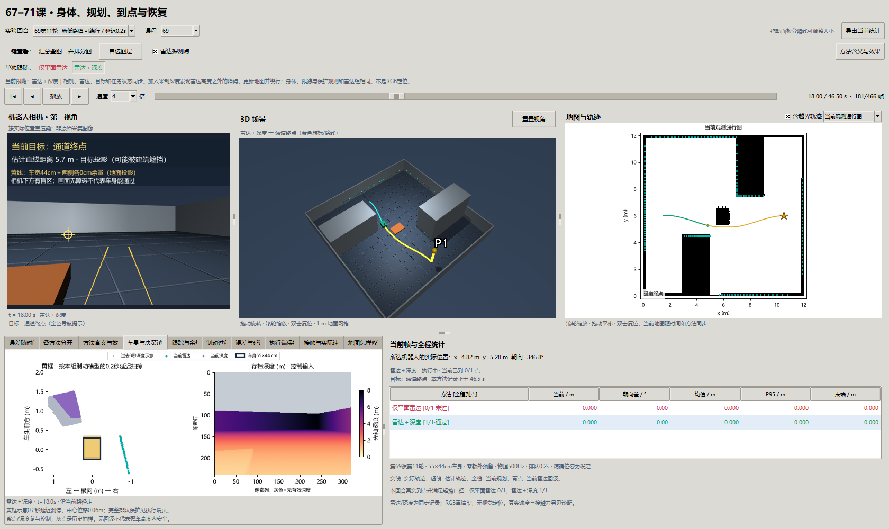
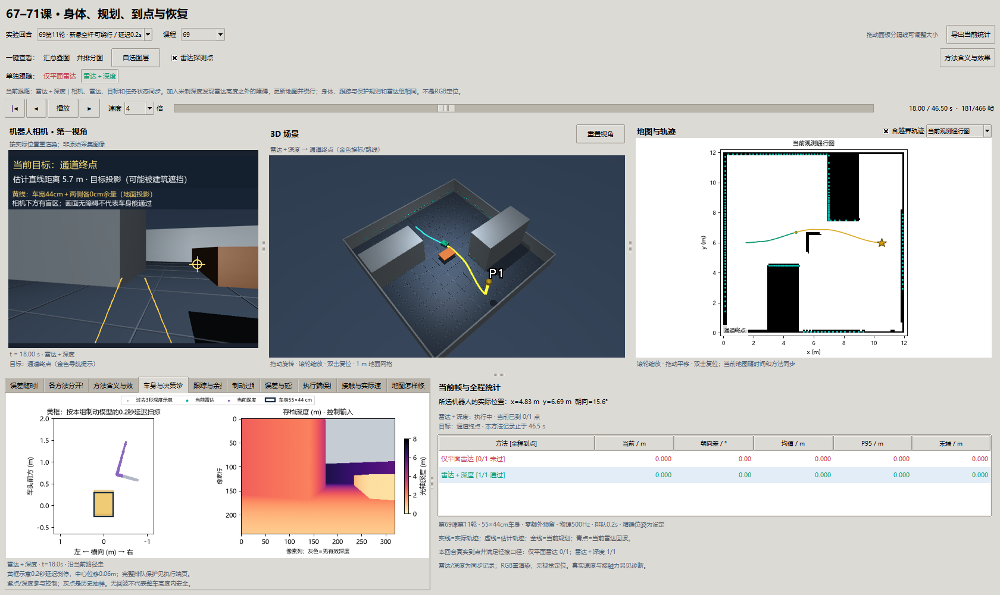
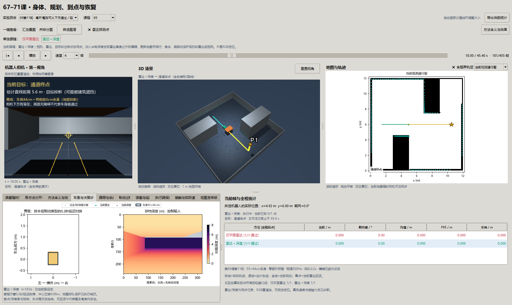

# 第六十九课补充：发现新障碍后，真的能绕过去吗？

> 第十一轮。把“本来就过不去”的负例换成有绕行通道的新障碍，比较只用平面雷达与加入深度的实际驾驶。统计见下文正式记录；新地图表示仍是实验候选。

## 1. 为什么要重新设计场景？

第十轮的低墙、横杆横贯整个通道，而且已画在先验地图里。拒绝通行是正确行为，但不能证明机器人发现了新障碍，也不能证明它会选择另一条路。原批次继续保留为“确实无路”的负例，不作为绕行有效性的主要证据。

这一轮的新障碍只占道路中央一段，两侧有空间。实验开始时地图没有它：控制器最初认为道路可走，必须从途中收到的传感器数据认识现实，然后改变路线。单纯停车仍不算完成。

| 条件 | 真实高度 | 身体与直行的关系 | 它在验证什么？ |
| --- | --- | --- | --- |
| 低路障 | 0–14cm | 底盘不能穿过 | 雷达从上方掠过时，深度是否能补上盲区并绕行 |
| 悬空杆 | 42–56cm | 会撞到上部支架/相机区域 | 雷达从下方掠过时，是否考虑整车高度 |
| 普通箱体 | 0–1m | 必须绕行，雷达可见 | 已能看到的障碍会不会因地图与跟踪变化反而出问题 |
| 高杆 | 75–89cm | 比整车最高58cm更高 | 有东西出现在相机里，不一定阻挡车身；是否无故绕行 |

四个障碍足印相同：x=5.6–6.4m、y=5.4–6.6m；街区建筑和起终点相同。高杆作为悬空几何测试件，没有假装已经建成真实园区设施。

## 2. 新变量、旧变量，怎样串在一起？

| 名称 | 通俗含义 | 实验中怎么变化、影响什么？ |
| --- | --- | --- |
| 先验地图 | 出发前认为哪里有障碍 | 两组完全相同，只含原建筑/边界；不含新测试件 |
| 雷达高度32cm | 激光只在这一层扫一圈 | 能看见箱体；低路障在它下方、悬空杆在它上方 |
| 米制深度 | 相机每个像素前方物体有多远 | 320×240、同一安装/视场；只有融合组把它用于控制 |
| 三维观测点 | 一次测量命中的位置与高度 | 由传感器外参和当前位姿投到世界；地面回波不当成路障 |
| 存储格子 | 将附近点归在一起的10cm编号 | 编号用于存储和俯视展示；新点不会自动变成占满整格的实体 |
| 规划约束 | 哪些位置整车不能占用 | 原先验仍保留完整格子范围；新障碍用连续观测点约束车身 |
| 当前路线 | 控制器现在想走的折线 | 新观测出现后重规划；不是离线检查用的绕行参考链 |
| 前进请求 / 实际速度 | 想怎么动 / 身体真正怎么动 | 请求会排队，限力伺服驱动物理身体；碰撞后两者可能不同 |
| 真实到达 | 身体是否真的到了并停稳 | 真实距离<25cm，平移和角速度都<0.01，接触也满足原口径 |

关联顺序是：**测量 → 按安装位置变成三维点 → 更新地图 → 检查整车并重规划 → 请求执行 → 物理身体运动 → 独立评分**。每一步的输出是下一步的输入；能发现障碍不等于能安全跟踪，路线存在也不等于实际到达。

位姿在本轮精确，是人为固定条件，所以定位误差为零不是算法成绩。RGB按实际位姿重渲染，只用于展示；没有RGB定位。

## 3. 如何保证比较公平？

两组是“仅平面雷达”和“雷达＋深度”。相同种子、场景、身体、地图候选、规划/跟踪、制动/排队保护和停止条件，只改变控制端是否收到深度。

两组都保存原始深度，方便看清漏掉了什么。但雷达组在进入地图前将它替为NaN和无效掩码；规划、安全预测、本地保护都读同一套只含雷达的点。不能因为窗口能显示深度，就偷偷用深度帮雷达组停车。静止准备期五帧的两组原始雷达、深度逐项相同；运动分开以后视角不同，不再要求回波相同。

身体55×44cm、最高58cm，额外余量仍为零；允许轻擦仍限制单点力≤40N、压入≤5mm、连续≤0.5s。物理500Hz、控制10Hz、速度上限0.2m/s、实际请求排队0.2s、90s超时，失败后真实减速。没有缩小车身或让车穿过障碍。

## 4. 可达性先检查，成绩再实跑

离线评分端检查固定绕行链，并在拐点采样身体旋转：1cm平移采样、每拐点181个朝向，共1772个状态。前三种的绕行采样最小身体间隙约16.7cm，直行会重叠；高杆直行不重叠。真实几何仅用于该检查、观测生成、物理与评分，参考链没有传入规划器。

这是采样几何证据，不是连续空间证明，也不是“控制器已经通过”。实际控制器可以选另一条更贴边的路线，仍可能跟踪失败。

开发只用种子0。首版融合组在绕行中被起点占据拒绝：连续点认为身体可行，完整存储格子却认为被挡。两个组共同改用新点的实际坐标，保留原先验格子范围，解决重复放大。修正后低障碍绕行成功，但普通箱体出现85.94N接触中止。因此候选尚不安全，正式保留该条件，不删失败、不继续调参。开发记录与登记见[实验登记](navigation-bypass-round11-plan.md)。

## 5. 正式结果与含义

| 条件（每组3回合） | 仅平面雷达 | 雷达＋深度 | 结果怎样解释？ |
| --- | --- | --- | --- |
| 14cm低路障 | 0/3，3次接触中止 | 3/3，无接触 | 深度补上高度盲区，发现后绕行的收益成立 |
| 42–56cm悬空杆 | 0/3，3次接触中止 | 2/3，无接触；1次无路退出 | 可以绕行，但还不稳定，种子30仍拒绝 |
| 1m普通箱体 | 3/3，无接触 | 2/3，无接触；1次无路退出 | 加深度并非所有条件都更好，种子31反而未完成 |
| 75–89cm高杆 | 3/3直行，无接触 | 3/3直行，无接触 | 同样“看到物体”，高于身体就不应挡路 |

正式总到达仅雷达6/12、融合10/12，均无误报到达。雷达低障碍六回合发生实体接触，单点峰值137.87N，超出允许轻擦的40N，因此正确中止；不是“允许擦碰就算成功”。融合正式12回合零接触，但两次途中规划拒绝仍是失败，不能从本批推出普遍安全。

开发种子0普通箱体的融合组发生85.94N接触中止，持续接触最长18ms、物理压入约0.139mm；力已超标，仍判失败。它与正式组使用相同候选源码，已额外独立重放，公开[开发摘要](benchmarks/navigation-bypass-development-v11-metric.json)。三个正式种子没有接触，不能抹掉这个反例。

成功回合实际距目标15.18–17.02cm，均按世界平移/角速度停稳。低路障融合组用46.5–50.6s、行走9.06–9.23m；高杆两组均45.4s、行走8.84m。低路障最小真实几何分离量仅1.87cm，普通箱体成功例最低约0.61mm，距离噪声/跟踪误差的量级很近，尚不能把零接触小样本称作有充分余量。



这张图完整列出融合组两次正式失败，再列开发种子0的接触反例；不是只挑成功。绿为实际轨迹，金色虚线是最后一条有效规划，蓝框为底盘足印，深蓝小块为上部支架/相机。横杆在底盘上方，俯视重叠不能直接推断实体碰撞，须看三维接触；几何分离量负值仅表示重叠，不等于精确物理压入深度。

审计重放24正式＋1开发反例，共465850个2ms子步：状态误差0，接触误差8.88×10⁻¹⁶；正式9134帧地图/规划先验与1067次三帧删除证据核验通过。正式批次累计已保存运行段1048.58s，中断间隙与未完成工作不计入该数。



每根柱子的分母为同一几何下三个新噪声种子29/30/31。柱高只统计真实到达且停稳、接触符合口径的回合；停车和重接触中止都不是成功。三次重复不等于三个未见街区。



固定选种子29。红线仅雷达，绿线雷达＋深度；星号是真实目标，叉号是接触中止位置，圆点是成功结束位置。灰块是原建筑，橙块是新障碍足印；高杆用虚框，因为车身可以从它下面经过。两条成功轨迹接近或重合时，后画的绿线会覆盖红线，不代表红组不存在。

## 6. 在窗口里怎样复盘？

```powershell
uv run python -m embodied_learning.navigation_study_demo --lesson 69 --footprint results/navigation_reinforcement_v11 --case 69_street_low_29__delay_2__bypass_low --play
```

一键选择方法，会同步相机、三维、真实轨迹、当前目标、当前地图与统计，保留时间。相机中的深度图会写明“控制输入”或“本组未使用”；青色点仍是当前雷达回波，紫色点是用于解释的深度抽样。地图显示本帧存储占据，不借用最终地图；整格颜色是存储示意，不等于新点的实体尺寸。

地图修正页的评分只比较车身高度内的障碍，75cm高杆不算漏掉碰撞危险。原存档`map_error`是所有盒体的俯视足印核对，仍原样保留；窗口另算`body_height_map_error`，只用于评分，不进入控制。







## 7. 理论对应与仍未解决的问题

平面雷达是高度切片，深度是有视场/遮挡的三维测量；没有点不能推导出整车高度内都安全。身体约束把“一个点能过”变成“每个部件都能过”。传感器互补能补上某些盲区，但不会自动保证地图表示和转向跟踪正确。

新点保留连续坐标可以减少格子造成的误拒，也减少了原完整方块的保守性；稀疏观测、未见的物体侧面、噪声、拐弯偏差仍可能导致接触。本轮不把候选升级为通用安全方案。误差位姿、遮挡、移动障碍、不同街区，以及计算期间持续运动，均未在本批验证。

本轮计算墙钟包含批次存档；控制p95不含传感器生成/物理/写盘。计算时世界没有后台积分，明确的0.2s请求排队不能替代端到端实时延迟验证。

## 8. 思考题

1. 同一根杆把最低点从42cm提高到75cm，为何正确行为应从绕行变成直行？雷达有没有因此变强？
2. 能看见地面为什么不等于车身能过去？地面、低路障和有效深度应分别怎样处理？
3. 一个返回点所在的格子有10cm宽，为什么不代表物体恰好占满这10cm？只相信返回点又会漏掉什么？
4. 规划存在路线、身体没有碰撞、真实到点，这三个条件哪个能推出哪个？结合普通箱体失败解释。
5. 若相机也失效，系统应把灰色深度区域当成空闲、继续旧路，还是保留不确定性？如何单独设计验证？

## 9. 复现、审计与停止点

```powershell
uv run python scripts/test.py full tests/test_navigation_bypass.py
uv run python -m embodied_learning.experiments.navigation_bypass_study --round 11 --smoke --output results/navigation_bypass_development_v11_metric
uv run python -m embodied_learning.experiments.navigation_bypass_study --round 11 --output results/navigation_reinforcement_v11
uv run python scripts/validate_navigation_bypass.py --round 11
uv run python docs/img/make_navigation_bypass_figures.py
uv run python scripts/check_navigation_bypass_window.py
```

输出目录已存在时会拒绝覆盖，请改目录名；验证脚本默认读取正式目录。公开[正式摘要](benchmarks/navigation-reinforcement-v11.json)与[独立物理/地图审计](benchmarks/navigation-reinforcement-v11-validation.json)包含源码、协议与数组哈希。完整原始数组保留本地results，新的克隆需按命令生成，不伪装成仓库自带。

本批在保存11回合后进程中断；`uv run python scripts/resume_navigation_bypass.py`先核验所有已完成数组、协议和冻结源码，再只跑剩余案例，已完成回合未重跑。`wall_s`为已保存各段累计，排除中断间隙和未完成回合的工作，不能当作从启动到结束的完整墙钟。

停止点为24回合、全部物理与地图审计、窗口读图与讲义一致性。下一项优先分离普通箱体的观测表示与实际跟踪偏差；先证明安全，再接位姿误差和69—71组合。
