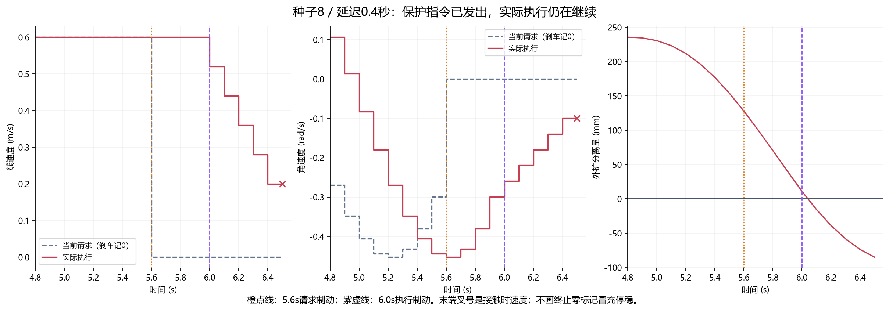
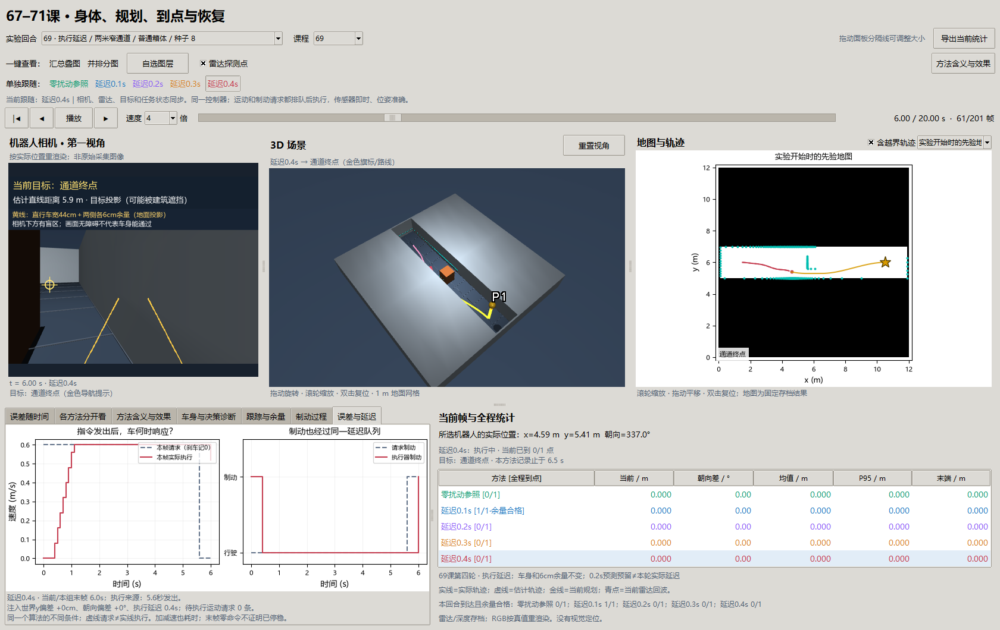

# 第69课第四轮：认偏一点、晚刹一点，原来的成功还成立吗？

日期2026-09-30。承接[第三轮讲义](69-braking-round3.md)，协议在[第四轮预登记](69-robustness-round4-plan.md)中冻结。同一问题继续用69课编号。

2026-10-01后续：[第五轮排队预测与执行端保护](69-execution-round5.md)。本页保留第四轮历史结果；打开本轮窗口显式加`--footprint results/navigation_robustness_v4`，默认69课窗口展示最新可用批次。

**本轮发现了明确失效边界，没有得到可泛化的安全容限。** 新种子零扰动参照仅7/9到达且余量合格；位置y−0.5cm为9/9、y+0.5cm为5/9，±1/2/4cm全部未到达；本批所有非零朝向等级均未到达。延迟0.1秒8/9、0.2/0.3秒0/9，0.4秒窄路9/9发生实体接触。开阔/街区的0.4秒配对例也都接触，说明宽路不能自动补偿执行迟滞。

## 1. 上一轮回答了什么，还没回答什么

第三轮让车在停车时同时放慢前进和转向，保持短时间内的转弯弧线。在那45个可通行案例中，它全部到达并保持设定余量。但当时机器人知道自己的准确位置，发出的运动指令当帧就执行；最小外扩分离量只有5.25毫米。

这相当于我们已经验证“眼睛和手脚配合准确时，停车规则能起作用”，还没有验证“认错一点位置、手脚反应慢一点时，是否仍然够用”。本轮固定这个算法，只改变输入误差或指令执行时机。也重新换了噪声种子，检验旧结论是否依赖之前那一批回波。

**这些来源按钮代表同一个算法受到不同扰动，不是21种定位算法。** 这里没有运行PF、视觉里程计或自动校准；人为注入误差是为了观察后果，不是声称实际定位就会稳定地偏这么多。

## 2. 从世界、估计、请求到实际运动

```text
真实车身位姿 → 生成雷达和深度观测
      ↓
加一种预设误差 → 机器人相信的位置/朝向 → 同一个规划与制动控制器
                                              ↓
                                      发出速度/制动意图
                                              ↓
                                  排队若干帧，再由执行器响应
                                              ↓
                                  实际运动 → 独立几何与到点评分
```

地图和目标始终在原来的世界坐标里，不跟着估计位置移动。传感器从真实位姿生成；控制器用有偏估计把点放到地图上。这样可能出现“雷达确实看到墙，但放到地图上时与先验墙对不齐”。这与相机没看到、雷达没回波、车身尺寸没考虑，是不同的问题。

执行延迟组的位姿准确、观测即时，只有指令排队。仿真确实在这段时间执行旧意图，不是把界面拖慢，也不是只把安全公式中的预留时间改大。此处仍是仿真中的延迟模型，不是实机延迟测量。

## 3. 新变量和旧变量怎么关联

| 变量 | 通俗含义与单位 | 本轮如何变化 |
| --- | --- | --- |
| 真值`x,y,θ` | 车实际上在哪里、朝哪里 | 由实际执行动作积分，只给传感器和评分器使用 |
| 估计`x̂,ŷ,θ̂` | 控制器相信的位置与朝向 | `x̂=x`，`ŷ=y+δy`，`θ̂=wrap(θ+δθ)` |
| `δy` | 世界y方向的固定位置误差，m | ±0.005、±0.01、±0.02、±0.04；正为地图上方，不是车身左侧 |
| `δθ` | 固定朝向误差，度 | ±0.5、±1、±2、±4；正为逆时针，位置保持准确 |
| `wrap` | 将朝向放回−180°到180°范围 | 179°再加4°应表示为−177°，不应被当作巨大的误差 |
| `k`、`Δt` | 第几帧、每帧多长 | `Δt=0.1s`，控制器10Hz更新 |
| `L`、`τ=LΔt` | 排队帧数、实际执行延迟 | L=1、2、3、4；与控制器固定0.2s预测预留分开 |
| `requested_command` | 当前发出的期望线/角速度 | 尚未执行，不能拿它积分真实轨迹 |
| `braking_active` | 当前是否请求停车 | 保护触发、到点、任务失败均会请求；同样进入队列 |
| `executed_request_frame` | 本帧实际响应哪一帧的请求 | 正常执行为`k−L`；启动时没有旧请求，按静止保持 |
| `incoming_velocity` | 进入本帧时车已经在执行的速度 | 执行器据此限制加减速度，末帧也用它判断停稳 |
| `commands` | 本帧真正执行的线/角速度 | 用它生成下一帧位姿，所有扫掠和碰撞评分都含这一段 |
| `pending_motion` | 队列里还有几条运动意图 | 即便此刻速度为零，也不能在仍有运动请求时宣布任务结束 |
| 实体间隙 / 外扩分离量 | 身体会不会接触 / 6cm预留空间是否还完整 | 两个门槛独立列出；外扩为负不必然表示身体已碰撞 |

55×44cm车身、高58cm、每边6cm余量、速度上限0.6m/s和1rad/s、线/角减速度0.8m/s²和1.8rad/s²均不变。先验地图、传感器噪声、路线保留、切线跟踪和同比例制动也不变。位置误差不是距离越走越大的里程计漂移，朝向误差也不是将整个坐标系连同目标一并旋转。

## 4. 延迟放在哪里，决定了实验到底在测什么

假设0.2秒延迟，第4帧发出停车意图，它应在第6帧才到执行器。第4、5帧仍响应先前请求。到第6帧，执行器再依据那一刻的实际速度，应用第三轮同比例减速公式：

```text
T = max(|v|/0.8, |ω|/1.8)
α = max(0, 1−0.1/T)
本帧执行速度 = (αv, αω)
```

我们排队的是“想往前走/想停车”的意图，执行器到期后才限制加速度。如果直接把很久以前算好的速度数值原样扔给现在的车，可能跳过减速限制，测到的就不是原来的车辆模型了。

**保护制动没有绕过队列的特权。** 本轮模拟导航指令到执行器整体迟到的情形。如果真实机器人有本机急停、可以绕过通信队列，那是另一种架构，应另设对照；不能拿本轮结果代替。控制器仍只知道当前已执行速度和观测，不会偷偷读取未来队列来改善动作。

0.2秒预测预留与真实0.2秒延迟也不等价。第三轮预测的是保持某个候选速度再刹停；现在队列里可能存在不同的转弯或前进请求，且制动也在排队。单有一个相同的数字，不代表实际运动必然包含在那条预测曲线内。

## 5. 到点由谁判断，为什么要单独评分

如果控制器的位置已经有偏差，却仍用真实位置决定何时停车，就相当于暗中告诉它正确答案。本轮任务端用**估计距离**进入原25cm目标圈、更新进展和判断超时。停稳且队列没有剩余运动意图后，再检查估计位置是否还在圈内，决定是否宣布到达。

评分器另外检查真实停点：估计认为到达而真实位置在圈外，记为误报；真实到达还必须满足全程外扩余量才算本课的完整成功。接触后只终止运动学回合、保存进入速度，不能写一个零命令就宣称车已经停住。

零误差、零延迟的27个旧条件，与第三轮同比例组全部既有数组逐位相同，只有墙钟计时另测。这个桥接检查确保上述接口改动没有偷偷优化原基线。测试另用大偏差构造“估计到点、真实未到”以及“真值经过目标、估计始终在圈外”的已知答案，验证评分确实分开。

## 6. 为什么跑233回合

| 批次 | 条件 | 数量与用途 |
| --- | --- | --- |
| 旧条件桥接 | 原三环境×三高度×种子0/1/2，零扰动 | 27；核对上一轮执行一致性，不算新留出成绩 |
| 新种子主扫描 | 窄路×三高度×种子8/9/10×21等级 | 189；一次只改变位置、朝向或延迟中的一项 |
| 环境配对 | 开阔/街区×普通箱体×种子8×六条件 | 12；与窄路同条件配对，但每格仅一个回合 |
| 过窄负例 | 0.50m通道×普通箱体×种子8×五条件 | 5；检查外扩宽0.56m放不下时应原地拒绝 |

开发七回合只用了旧种子0。正式记录出现后没有改参数、减余量、增搜索预算或重新挑种子。一个9回合分母是三个障碍高度乘三个种子，不是九个独立随机种子；小误差等级之间也不能当作独立随机样本。

## 7. 全部结果与非单调边界

正式233回合用时1612.93秒，约26分53秒。62回合真实到达且全程余量合格（包含27个旧桥接、29个主扫描、6个环境参照）；11回合发生接触，222回合实际停稳；没有到点误报。五个过窄负例均原地拒绝。除负例的初始外扩重叠外，另有21回合出现外扩余量违规。压力等级、旧桥接和负例混在一起，62/233不能当作部署成功率。

| 因素 | 等级 | 到达且余量合格 | 实体接触 | 最差外扩分离量 |
| --- | --- | --- | --- | --- |
| 共同参照 | 零扰动 | 7/9 | 0/9 | +5.37mm |
| 世界y误差 | -0.5cm | 9/9 | 0/9 | +7.70mm |
| 世界y误差 | -1cm | 0/9 | 0/9 | +425.85mm |
| 世界y误差 | -2cm | 0/9 | 0/9 | +319.61mm |
| 世界y误差 | -4cm | 0/9 | 0/9 | +50.08mm |
| 世界y误差 | +0.5cm | 5/9 | 0/9 | +2.87mm |
| 世界y误差 | +1cm | 0/9 | 0/9 | +600.17mm |
| 世界y误差 | +2cm | 0/9 | 0/9 | +133.98mm |
| 世界y误差 | +4cm | 0/9 | 0/9 | -3.51mm |
| 朝向误差 | -0.5° | 0/9 | 0/9 | +138.90mm |
| 朝向误差 | -1° | 0/9 | 0/9 | +201.75mm |
| 朝向误差 | -2° | 0/9 | 0/9 | +357.75mm |
| 朝向误差 | -4° | 0/9 | 0/9 | +498.39mm |
| 朝向误差 | +0.5° | 0/9 | 0/9 | +55.68mm |
| 朝向误差 | +1° | 0/9 | 0/9 | +172.77mm |
| 朝向误差 | +2° | 0/9 | 0/9 | +335.88mm |
| 朝向误差 | +4° | 0/9 | 0/9 | +529.18mm |
| 执行延迟 | 0.1s | 8/9 | 0/9 | +3.54mm |
| 执行延迟 | 0.2s | 0/9 | 0/9 | -19.28mm |
| 执行延迟 | 0.3s | 0/9 | 0/9 | -5.40mm |
| 执行延迟 | 0.4s | 0/9 | 9/9 | -85.03mm |

零参照在三类扫描图中复用，但统计只算一次。其两次失败分别是普通箱体种子8无路、种子10停滞；另七例完成。±1cm不是认证的几何临界值：这些失败大多发生在搜索阶段，距离真实障碍仍然较远。


读图：上排三幅分别扫描世界y位置、朝向和实际执行延迟，绿色为到达且余量合格，橙色为到达但余量未过，灰色为未到达且无实体接触，红色为实体接触；柱顶数字只数绿色。下排显示每回合最小外扩分离量的最差值与中位数，负值代表外扩重叠。为了同时看清几毫米和几百毫米，纵轴在±10mm内线性、之外压缩显示。失败回合可能很早停下、剩下很大间隙，这不是比成功回合“更安全的导航”。

不能将“某个等级通过”写成“这一等级以内都可靠”：新的零扰动参照本身可能失败，改变很小的输入也可能换一条规划路线或改变观测采样。这里报告离散测试点，不插值成允许的定位误差或通信延迟。

## 8. 为什么1厘米误差会让规划停下来

所有非负例的144个“无路”回合可进一步分为：

| 规划器实际返回的原因 | 回合数 | 说明 |
| --- | --- | --- |
| 搜索预算用尽 | 95 | 展开到10000个状态，未在预算内返回可用路线 |
| 路径转换受阻 | 27 | 搜索结束后，转成可跟踪路线时未通过检查 |
| 起点外扩足印无效 | 15 | 3例先验图就拒绝，另外12例加入观测后才拒绝 |
| 搜索队列耗尽仍无路 | 7 | 当前离散搜索表示未找到路线，不是连续空间无路的证明 |

剩余失败含11次停滞与11次实体接触，不能归入这144例。普通箱体种子8、y+1cm在2.0秒触发搜索预算失败，当时真实外扩间隙仍约65.58cm，先验与观测对当前位置的检查都允许；该次搜索耗时8.57秒。朝向−2°同一案例在起点因路径转换受阻直接拒绝，实际外扩间隙72cm。零扰动种子8则在9.0秒以25次状态展开结束为“未找到路线”，当时起点也可行。不同失败需要不同诊断，不能靠统一放宽余量处理。

在普通箱体种子8的环境配对中，位置±4cm在开阔和街区均合格、在窄路均失败；朝向±4°三环境都失败，延迟0.4秒三环境都接触。可用空间解释一部分差异，但没有消除朝向输入和执行时序的问题。

“搜索预算用尽”只说明这一实现没有在登记的10000次状态展开内找到结果；“路线转换受阻”说明搜索得到的路线在转换成可跟踪折线时没通过检查。它们都不能证明物理上绝对没有路。

恒定位置误差还会把历史观测整体放偏，而先验墙保持原位。当前观测转换回车体坐标时部分平移误差会抵消，但先验图、目标和规划起点仍受不一致影响。朝向误差会改变点投影和跟踪纠偏。规划器的候选曲线、离散状态和路径转换又可能放大这些差异。因此本轮不能把所有失败统称为“雷达坏了”，也不能据此只调停车公式。


读图：固定普通箱体、种子8、相同六个条件。每个格仅一个回合；普通场景留出空间更大，而窄路可用间隙接近外扩车宽。开阔场景通过不能抵消窄路失败，窄路失败也不表示同一算法在宽路必然无效。

## 9. 0.4秒不是只让视频晚播放



固定例为窄路、普通箱体、种子8、延迟0.4秒。5.6秒发出第一次保护制动，到6.0秒才作用于执行器；这0.4秒实际又走约24厘米。6.5秒发生实体接触，进入终帧时仍以约0.20m/s前进，角速度约−0.100rad/s。图末叉号保留该速度，未用终止零标记冒充成功停稳。

三幅图分别是请求与执行线速度、角速度、真实外扩分离量。橙色竖线是发出保护制动，紫色竖线是执行器开始响应。请求曲线把停车意图画在零处，但实际速度受减速度限制，不会立即归零。


按正式前登记的普通箱体种子8与最大绝对等级选例：零扰动、正向4cm、正向4度、延迟0.4秒；反向等级仍保留在完整扫描图和表中。彩色实线是实际运动，深灰虚线是有偏估计，橙色点线是首次规划，叉号是实际终点，星号是目标。朝向组的两条位置线可以重合，偏差体现在角度统计与随后控制中。零扰动例的失败也保留。

## 10. 窗口与计算时间



窗口将21个条件分成位置正偏、位置负偏、朝向正偏、朝向负偏和执行延迟五个回合视图；每组至多五个按钮，包含同一份零扰动参照。切换一个按钮会同步第一视角、3D、雷达落点、目标、真值/估计轨迹与统计，不需要在多个地方分别选。

新增“误差与延迟”页明确显示注入值、当前执行请求的来源时间、待执行运动数量及制动是否到达执行器。它只画当前及过去数据；先结束的条件停在自己的末帧。RGB是按真实位姿重渲染的演示画面，雷达和深度来自仿真存档，没有视觉定位。车身页仍画控制器的0.2秒预测预留，实际队列时序看新页。

主扫描的计算时间如下，单位毫秒；后续规划最大值单列为秒。

| 条件 | 整步P95 | 整步最大 | 后续规划最大 |
| --- | --- | --- | --- |
| 零扰动 | 50.2ms | 316.5ms | 0.052s |
| y+1cm | 309.2ms | 8852.6ms | 8.843s |
| 朝向+1° | 782.5ms | 9284.2ms | 9.273s |
| 延迟0.4秒 | 62.3ms | 312.6ms | 0.054s |

全批后续规划最大约9.304秒。整体运行比第三轮230回合的8分23秒更慢，主要因为本轮许多有偏输入进入了昂贵的备用搜索；不是把0.4秒乘回合数得到的耗时。慢层实验与测试耗时也分开报告，不能把两分钟的快速测试误当成完整压力实验时间。

本仿真在控制器计算期间等待，不会让车按墙钟继续运动。所注入的0.1–0.4秒是固定的指令队列延迟，没有再把每次规划的真实计算时间叠加进去。首次规划可以在车静止时准备，但后续规划若超过100毫秒，需要独立的截止时间、执行端保护和过期指令规则；仅缩短批次总耗时不能解决这个控制时序问题。

## 11. 思考题

1. 世界y误差+1cm与“车身左侧误差1cm”在转弯后是否相同？为什么这里必须声明坐标系？
2. 给估计朝向加4°，与把地图、目标和估计一起旋转4°，哪一个会造成相对不一致？
3. 0.2秒预测预留为什么不能直接证明实际0.2秒延迟一定安全？队列里有什么信息没进入旧预测？
4. 延迟应放在期望意图之前还是加速度限制之后？哪种写法可能造出车辆做不到的速度跳变？
5. 机器人已经停下，但队列里还有前进意图，此刻可以关闭评分并宣布完成吗？
6. 零扰动也失败，而某个小偏差成功，能否说明偏差有益？怎样区分路径选择、噪声与几何余量？
7. 搜索展开10000次仍失败，与真实车身没有通路有什么区别？应继续记录哪些阶段的信息？
8. 如果删掉一个“离群雷达点”就能恢复通行，怎样证明它不是一个真实的新障碍？
9. 当前位置误差均值为0时，是否仍可能有4°朝向误差、0.4秒指令延迟或实体接触？
10. 同时有位置误差和执行延迟时，可以直接相加本轮单变量容限吗？应怎样登记新的组合实验？

## 12. 复现、验收和下一步

原始NPZ及源码快照存于本地`results/navigation_robustness_v4`；Git保存[233回合摘要](benchmarks/navigation-robustness-v4.json)、[独立审计](benchmarks/navigation-robustness-v4-validation.json)、脚本和图片。新克隆需先按前几轮讲义生成第三轮依赖，不能只下载图片就得到完整窗口。

```powershell
uv run python -m embodied_learning.experiments.navigation_robustness
uv run python scripts/analyze_navigation_robustness.py
uv run python docs/img/make_robustness_figures.py
uv run python -m embodied_learning.navigation_study_demo --lesson 69 --play
uv run python scripts/check_robustness_window.py
```

输出已存在时拒绝覆盖。另跑用`--output results/navigation_robustness_repeat`，窗口用`--footprint results/navigation_robustness_repeat`；图表/正式审计默认仍指向冻结v4。开发七例用`--smoke --output results/navigation_robustness_smoke_new`。旧第三轮窗口请明确`--footprint results/braking_navigation_v3`。

独立审计还核对测试日志与图像，因此先生成上面的四张图和窗口截图，再运行：

```powershell
uv run python scripts/test.py quick > results/navigation_robustness_quick.log 2>&1
uv run python scripts/test.py full tests/test_navigation_robustness.py tests/test_braking_control.py tests/test_path_tracking.py tests/test_navigation_followups.py tests/test_navigation_geometry.py tests/test_replay_viewer.py tests/test_navigation_study_viewer.py tests/test_campus_patrol.py tests/test_map_repair.py > results/navigation_robustness_affected.log 2>&1
uv run python scripts/validate_navigation_robustness.py
```

验证：quick **844项通过**（入口132.4秒）；受影响完整选择集 **66项通过**（49.6秒，含真实Tk）；Ruff检查通过。旧八个算法模块的执行源码保持不变，27个零扰动桥接逐数组一致（计时除外）。独立审计233份记录、19535个实际动作、133534个扫掠采样位姿，逐帧检查有偏估计、请求来源、队列、执行器限制、动作积分、实际停稳和车身/外扩扫掠，并核对图像、测试日志和文档链接。采样步长按实体车角位移不超过1cm计算，外扩矩形在同一批位姿评分，仍是离散检查。没有重跑不相关的历史全仓慢层，不把当前测试成功等同于实验成功或硬实时。

本轮到此停止，不依据正式失败调参后覆盖结果。下一轮优先拆两个机制：一是有偏投影下候选路线、搜索与路径转换分别在哪里拒绝，二是包含排队动作的停车包络及执行端保护。每项先做相同输入反事实，再做独立闭环；有噪声误拒的改进必须同时保留真实新障碍反例。之后扩大70/71反例，在统一身体与执行模型后再组合。RGB-D采集、视觉定位、65课似然场诊断与原跨场景门槛继续保留。
