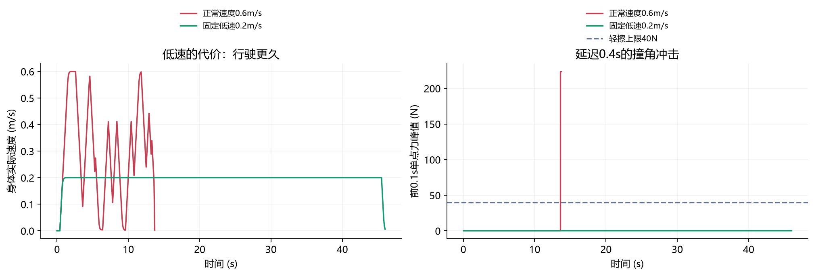
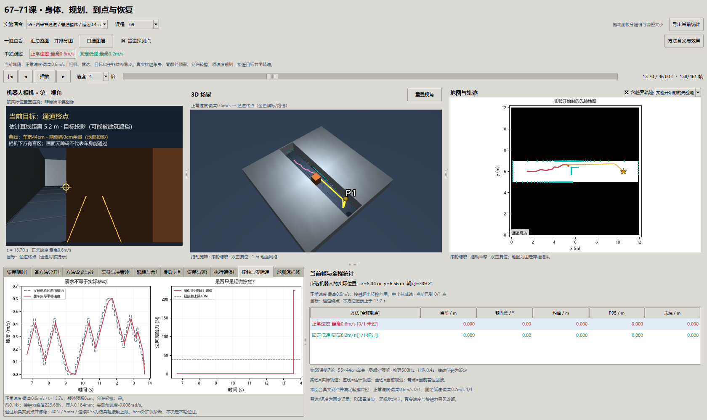

# 第六十九课第七轮：慢一点，能不能真正改善导航？

2026-10-01，基线`ecb9fe3`；接续[第六轮](69-contact-round6.md)，按[两轮补强登记](navigation-reinforcement-7-8-plan.md)执行。30个新回合，采集/计算/压缩写盘共302.44秒；这不是每回合仿真时间，也不包含之后的验收。

**结论：同一真实接触平台上，固定低速提高了窄路到达率，代价是更久的行驶。** 0.2秒延迟窄路主批，正常速度7/9、固定低速9/9；低速正式15回合都没有接触，14次到达、1次因身体放不下拒绝。它没有解决定位、动态障碍或地图错误。

## 1. 为什么要再研究速度？

第六轮取消每边6cm的额外预留后，车已经能通过一些窄路，但仍会撞角。允许轻擦不是允许猛撞：当时普通箱体的单点力超过40N，任务仍需中止。一个直觉是“慢一点也许就能绕过去”。本轮把这个直觉变成同条件对照。

车的身体不变，重8kg，底盘55×44cm，高58cm；接触后会受阻、滑动和转动。取消额外余量只表示愿意贴近实体，不代表实体缩小。30cm窄口比44cm身体还窄，低速也不能通过。

## 2. 变量如何关联？

| 变量 | 通俗含义 | 与其他变量的关系 |
| --- | --- | --- |
| `fixed_speed_cap_m_s` | 正常前向请求的速度上限 | 两组分别0.6、0.2m/s，不是一直保持这个速度 |
| `estimate`、`goal` | 算法当前位置与目标 | 距离越小，两组共同按`0.8×距离`降低上限 |
| 路线曲率`κ` | 路线每走1m，方向需要转多少 | 前馈角速度是`v×κ`；降低线速度时同步更新它 |
| 朝向/横向反馈 | 实际位置偏离路线时的纠正 | 两组增益相同，不能把换反馈算法算成低速收益 |
| `requested_command` | 本帧规划希望车怎么走 | 先经过限速和停车预测，再进入队列 |
| `commands` | 执行端实际发送的请求 | 可能是旧请求，也可能被本地保护替换 |
| `world_velocity` | 整车真实平移与转动速度 | 接触后可侧滑；停车必须查实际世界速度 |
| `contact_peak_force_n` | 一个接触点的最大法向力 | 与碰撞速度、接触位置、物理求解有关；不能用请求速度直接代替 |
| `passed` | 真实到点、停稳、满足轻擦阈值 | 路线存在、车曾进入目标圈、速度请求为零都不足以证明通过 |

关联顺序：估计位置与当前观测 → 找路线 → 根据路线决定转向 → 限制线速度并更新曲率前馈 → 检查排队和停车空间 → 限力伺服产生真实运动 → 下一帧观测。

## 3. 原理：为什么要在预测前限速？

例如路线曲率为1/m，0.6m/s需要约0.6rad/s的曲率前馈，0.2m/s需要约0.2rad/s。若只截断线速度、保留原前馈，就改变了预期转弯半径。这次反馈项保持不变，仅将前馈中的速度换为新的请求速度。

这个限速发生在候选停车轨迹计算之前。若先按0.6m/s预测、到了电机端才截成0.2m/s，预测与执行不是同一请求，无法清楚解释结果。

直行的粗略停车距离为`v×延迟 + v²/(2×制动加速度)`。按0.2秒和0.8m/s²算，0.6m/s约0.345m，0.2m/s约0.065m。它说明慢下来为何可能更容易保护，并不替代本轮转弯、排队、有限力和接触中的真实停车记录。

## 4. 实验怎么固定条件？

两组都用零额外余量、允许轻擦；单点力≤40N、压入≤5mm、连续接触≤0.5s。实际停点距目标<25cm，世界平移合速度和角速度都<0.01。物理500Hz，控制10Hz；精确位置是人为设定，不是定位算法的成绩。

正式前只看开发种子0，正常速度组逐数组桥接第六轮（计算墙钟除外）。正式种子17/18/19与旧批次不同；两组超时共同为90秒。不能把本轮7/9和上轮6/9之差归因于算法，因为不是同种子。

| 条件 | 正常速度 | 固定低速 |
| --- | --- | --- |
| 窄路箱体，延迟0.2s | 3/3 | 3/3 |
| 窄路低路障，延迟0.2s | 2/3；1次停滞 | 3/3 |
| 窄路横杆，延迟0.2s | 2/3；1次重接触 | 3/3 |
| 窄路箱体，延迟0s，种子17 | 1/1 | 1/1 |
| 窄路箱体，延迟0.4s，种子17 | 0/1；重接触 | 1/1 |
| 街区箱体，延迟0.2s | 3/3 | 3/3 |
| 30cm窄口，种子17 | 0/1；无路 | 0/1；无路 |

全批分别11/15、14/15。不同条件是混合诊断集合，不能将这个分数直接当部署成功率。

## 5. 数据与图怎么一起读？


每柱三个新种子，红为正常、绿为低速。箱体两组都能绕过；低路障的停滞、横杆的重接触只发生在正常组。低速在该主批有同条件收益，不能推出所有通道都应固定0.2m/s。


选例在运行前固定为种子17箱体。左图延迟0.2s，两条实际轨迹近乎重合且到达；重合不是漏画。右图同一种子延迟0.4s，红线在箱体边停止，绿线绕过到点。灰块是真实障碍俯视，星为目标，圆为最终位置；图线不表示规划路径。



同一0.4秒回合：正常组峰值223.68N，超过40N虚线；低速组无接触，46.0秒到达。另一正式横杆失败峰值125.07N。主批成功的典型同输入回合从16.6–16.7秒变为45.5秒。慢下来避免了这些撞角，同时明显增加任务时间；没有正式成功例依靠轻擦，所以还不能证明贴墙接触控制有效。

## 6. 为什么不同环境、不同种子会不一样？

同样的0.2秒排队，正常组箱体3/3、横杆2/3。传感器采样高度、障碍投影、路线曲率不同，身体角落也不同。相同控制器得到的是不同观测和路线，因此不能把“算法名字相同”理解成执行相同动作。

种子19低路障停滞而17/18通过，是观测噪声经体素和规划离散化后影响执行的例子。不同种子不等于不同真实园区；本轮只有三个噪声种子，证据范围有限。街区两组3/3、窄口两组0/1，说明减速能解决部分执行负担，不能改变物理可达性。

## 7. 窗口和验证



固定0.4秒种子17，t=13.7s；正常组已结束，低速组继续走，统计列明确区分“当前到点”和“全程通过”。两个按钮一键切换相机、三维、雷达、目标、轨迹和接触页，保持时间。相机按实际位姿重渲染；深度用于避障，没有RGB定位。

[独立重放](benchmarks/navigation-reinforcement-v7-validation.json)核对430,650个2ms物理步、8,643个控制帧，状态和接触最大误差均0；逐帧请求满足上限。已知答案检查速度与前馈、原六轮桥接；这些证明该仿真记录自洽，不证明实机质量、摩擦和延迟已标定。

## 8. 思考题

1. 限速0.2m/s为什么不等于每一帧实际速度恰为0.2m/s？
2. 只降低线速度、不更新`v×κ`，转弯会怎样变化？
3. 若只比较最终到达而不记录时间，低速方案漏掉什么代价？
4. 0.4秒正常组失败，能否据单个回合声称所有高延迟都必须低速？
5. 两条轨迹重合，为什么耗时仍可差近三倍？
6. 低速正式无接触，能否证明允许轻擦有收益？
7. 为什么不能用旧种子14–16与新种子17–19直接作算法因果比较？
8. 30cm窄口拒绝应算保护正确，还是到达成功？两种评价为何要分开？

## 9. 复现和停止点

```powershell
uv run python -m embodied_learning.experiments.navigation_reinforcement --round 7 --output results/navigation_reinforcement_v7
uv run python scripts/validate_navigation_reinforcement.py --round 7
uv run python -m embodied_learning.navigation_study_demo --lesson 69 --footprint results/navigation_reinforcement_v7 --case 69_narrow_crate_17__delay_4__normal --play
```

输出目录必须全新；已有正式记录直接验证/打开。使用仓库第六轮摘要核对冻结源码，不依赖旧原始数组；本地保存本轮完整npz、协议与源码。两轮完成后生成图与窗口：`uv run python docs/img/make_navigation_reinforcement_figures.py`、`uv run python scripts/check_navigation_reinforcement_window.py`。

本轮停止调参，0.2m/s作为受控参照保留。[第八轮](69-online-map-round8.md)使用这个固定低速研究地图增删。真正异步执行、速度自适应、误定位与70/71恢复组合继续单独验收。
