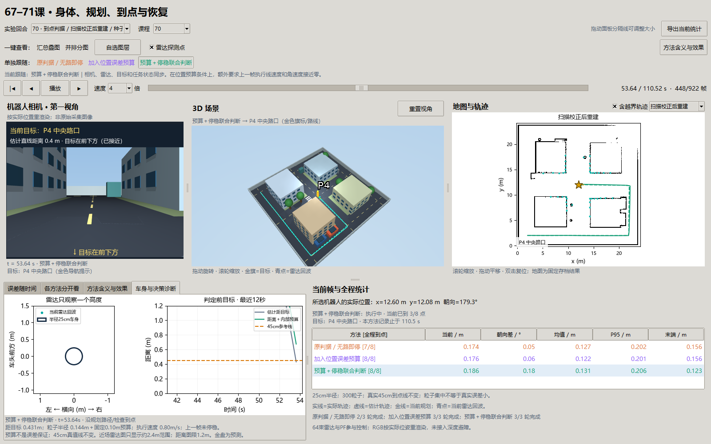

# 第 70 课：算法说“到了”，身体真的到了吗？

承接[第六十八课讲义](68-scan-based-map-repair.md)。修图后23/24个巡检点真正到达，剩余一点距目标46.09cm，但系统已经宣布成功。真实验收半径是45cm，这次明确属于误报，不能靠放宽验收线消除。

**本课固定地图和定位器，改变到点决策：两种新规则都在固定批次达到48/48点、零误报、零接触。** 这只是两张已知地图×三个种子的结果，不是安全概率保证；额外停稳条件本批没有增加到达数，但增加了停稳检查和时间代价。

## 1. 物理直觉：把“我在哪里”留出的误差算进去

导航知道的是估计位置，不是真实位置。假设算法说离目标29.6cm，而位置本身可能偏了20cm，那么身体可能离目标更远，也可能更近。只看29.6cm并不足以宣布通过45cm的真实验收。

粒子滤波器保留很多可能位置。本课计算“95%的粒子权重集中在估计位置周围多大范围”，把这个半径和额外10cm系统预算加在估计距离上。总数足够小，才允许开始累计到点帧数。最后把上一帧执行速度是否接近零也写成显式条件；它是否有额外收益，需要与旧的停车/停留逻辑对照，而不能凭设计意图认定。

**粒子挤在一起可能是大家一起猜错。** 所以粒子半径叫内部离散程度，不能直接叫“真实误差的95%置信上界”。固定10cm预算是预先选定的工程假设，本课没有给它做跨环境概率标定。

## 2. 变量与关系

| 符号 / 字段 | 含义、单位 | 谁能读取、怎样变化 |
| --- | --- | --- |
| `p` / `p_hat` | 实际位置 / PF估计位置，m | 控制只能用估计；实际位置只评分 |
| `g` | 当前巡检目标的地图坐标，m | 固定8个点，宣布后切到下一点 |
| `d_hat` | 估计位置到当前目标的距离，m | 向目标靠近一般下降；估计修正也能改变它 |
| `r95` | 95%粒子权重的距离分位数，m | 从当前粒子和权重计算；只度量内部集中程度 |
| `s=0.10` | 固定系统误差预算，m | 批次前登记；不从当前真值挑选 |
| `B=r95+s` | 到点决策的内部位置预算，m | 粒子更分散时，要求更靠近目标 |
| `R=0.45` | 真值到点验收半径，m | 所有组固定，评分门限没有变 |
| `L` | 控制器停止靠近的估计距离，m | 原组0.30；新组由预算收紧，最低0.04 |
| `dwell` | 连续满足条件的采样帧数 | 满足加1，不满足清零，5帧才宣布；原规则已经有5帧 |
| `v_prev/ω_prev` | 上一步实际执行的线/角速度，m/s、rad/s | 本运动学仿真执行命令即速度；实机还需速度反馈 |
| `false_arrivals` | 已宣布但真实距离大于45cm的次数 | 独立评分，必须与未宣布/未完成分开 |
| 预算覆盖率 | 真实位置误差不超过B的帧数比例 | 事后诊断，控制器读取不到 |

## 3. 原理与实现

若真实位置误差 `e=|p-p_hat|` 确实不超过 `B`，三角不等式给出 `|p-g| ≤ d_hat+B`。因此要求 `d_hat+B≤R` 有清楚的空间含义。但这里的前提 `e≤B` 只是假设，需要独立检查，不能由粒子集中程度自动保证。

新停止距离为：`L=max(0.04, min(0.30, R-B))`。机器人估计距离小于L时先停止靠近，随后逐帧检查：

- **原判据**：`d_hat<0.30`，连续5帧；没有额外停稳门。
- **位置预算**：`d_hat<L` 且 `d_hat+B≤0.45`，连续5帧。
- **预算＋停稳**：位置预算条件，再加上一帧 `|v|≤0.02 m/s` 且 `|ω|≤0.05 rad/s`，连续5帧。

4cm下限只防止控制器追一个负的停止距离，**不会放宽宣布条件**。若预算太大，即使已很靠近，也可能一直不宣布，最后超时。应报告这个代价，不能为了低误报删掉未完成回合。

到点检查发生在本帧目标切换之前；原存档的 `goal/mission` 在宣布帧已经记录下一个目标。因此新增 `arrival_distance/r95/budget/ready` 明确记录判定时的证据。复核某次到点应使用事件中的 `goal_index`，避免把旧位置与新目标误配。

## 4. 实验设计：只动决策层

输入是第68课已经冻结的扫描修后图、准确参照图，各三个种子；每轮8点、300粒子、64束雷达、2%公共刻度误差不变。三组×六回合，共18回合。先用修后图种子1预试，再固定整批，协议与结果写入独立目录。

相同种子提供相同的噪声序列和PF初始随机源；一旦动作或停留时长改变，后续真实位置和扫描就可能不同。因此比较的是闭环策略结果，不能说不同方法后半程读取了完全相同的观测，也不能把收益直接记为定位器本身更准。

## 5. 完整结果与图解

| 判据 | 修后图真实到点 | 准确图真实到点 | 整轮完成 | 误报到点 | 接触 |
| --- | --- | --- | --- | --- | --- |
| 原判据 | 23/24 | 18/24 | 4/6 | 1 | 0 |
| 位置预算 | 24/24 | 24/24 | 6/6 | 0 | 0 |
| 预算＋停稳 | 24/24 | 24/24 | 6/6 | 0 | 0 |


左图按地图分组，每组分母24。右图一个点对应一次实际宣布，橙虚线是始终不变的45cm真实验收线；未宣布的目标没有散点，完成情况必须同时看左图。原判据共宣布42次，其中一次越线；两个新组各宣布48次，均未越线。全部回合按各自有效帧计算，内部预算覆盖率均为100%，但它只是这批数据上的观测结果。

### 5.1 原先误报的P4怎样改变

固定选例：修后图、种子1、第四个巡检点。

| 判据 | 宣布帧 | 估计距目标 | 真实距目标 | 该帧预算B | 全轮仿真时间 |
| --- | --- | --- | --- | --- | --- |
| 原判据 | 447 | 0.2963m | **0.4609m，失败** | 0.2474m（仅记录） | 108.36s |
| 位置预算 | 451 | 0.1408m | **0.2948m，通过** | 0.2535m | 109.68s |
| 预算＋停稳 | 455 | 0.1551m | **0.3221m，通过** | 0.2318m | 110.52s |


左图放大P4附近，曲线是宣布前最后2.9秒的实际运动，超出局部范围的部分裁去；圆点是宣布时的位置，金星是目标，橙虚圈是45cm真值验收圈。右图在同一个宣布事件比较估计距离与真实距离。原组在圈外停下，两种新规则都继续靠近后再宣布。

联合组的真实终点没有比预算组更近，并不矛盾：多停几帧会改变后续PF更新、路径和宣布时刻。额外停稳条件本批没有带来新增到点数，证据支持的是“到点时执行速度也受约束”，不能宣称它在所有指标上都更好。

进一步查全部事件：原组42次、预算组48次、联合组48次宣布时，上一帧执行线速度与角速度**全为零**。在这个速度瞬时执行、进入估计圈便停车、连续5帧才宣布的模型里，原逻辑已经隐含了停稳。联合门主要改变开始累计的时刻，不能把此次改善归因于“原组不停、新组才停”。要检验速度门的独立价值，后续需引入实际加减速/执行延迟，并增加相同等待时长的对照；当前只确认位置预算的受控收益。

### 5.2 为什么准确地图组也多完成了六个点

原准确图种子0在第3个目标途中，因为估计起点落入膨胀区而终止，仅到达2点。新判据改变前两个点附近的停留与出发时刻，后续轨迹随之改变，这次没有再次落入同一无路状态。本课没有增加恢复功能；这项改善不能当作“无路恢复已经解决”的证据。[第71课](71-bounded-recovery.md)单独固定旧判据验证恢复。

## 6. 时间代价、边界与反例

18回合墙钟15.21s。六回合平均仿真时间原组96.12s、预算组109.18s、联合组110.16s；原组包含提前失败的33.6s短回合，不能据此声称原组完成任务更快。上面的修后图种子1是完整路线的更合适时间对照：联合组增加2.16s。

已知答案测试包含“所有粒子都挤在同一位置”的反例：r95可以为0，即便这个位置整体错误。10cm系统预算也不能保护所有大偏差。未来需要独立校准集、错误模式检测和留出布局；当前仍是固定地图、二维运动学和健康传感器，不是实机停稳认证。70课沿用半径25cm圆盘，尚未合入67/69的55×44cm车身和深度避障。

## 7. 与已有方法的关系

[Nav2 StoppedGoalChecker](https://docs.nav2.org/rolling/configuration_and_development/configuration_guide/core_servers/controller_server/controller_server_plugins/stopped_goal_checker/)把位置/朝向容差和停止速度阈值分开配置，说明到达与停稳需要不同检查。本课另加PF内部预算，当前任务不要求指定终点朝向；没有声称复制了其完整实现或获得定位可信区间。

## 8. 思考题

1. `d_hat=0.29m、r95=0.15m、s=0.10m` 时，新规则能否宣布？为什么旧规则可能宣布？
2. 100个粒子都聚在错误房间里，r95会怎样？仅增大粒子数能补上哪个前提？
3. 如果所有回合都因预算过大而超时，误报率为0是否值得庆祝？应一起看什么？
4. 为什么同一种PF、同一个种子，在修改到点规则后可能走出不同路线？
5. 怎样在新布局上标定系统预算，避免一边看验收真值、一边调整阈值？

## 9. 复现、窗口与停止点

先按[第68课复现步骤](68-scan-based-map-repair.md)生成冻结地图，再运行：

```powershell
uv run python -m embodied_learning.experiments.navigation_followups --lesson 70
uv run python -m embodied_learning.navigation_study_demo --lesson 70 --play
```

正式目录是 `results/arrival_decisions_v2`，v1保留为预试批次；旧文件不覆盖。重跑用 `--output`，窗口用 `--arrival` 指向新目录。“车身与决策诊断”显示雷达、当前距离、内部预算与上一帧停稳状态；点击方法按钮会同步相机、3D、地图、目标和统计，保留当前时间。RGB是按真实位姿重渲染的解释视图，没有参与本课定位。



实现：[决策模块](../src/embodied_learning/navigation_decisions.py)。全部数据摘要见[基准记录](benchmarks/navigation-studies-69-71-v1.json)，测试与可视验收见[验证记录](benchmarks/navigation-studies-69-71-validation.json)。本课固定批次通过；扩大到新布局前仍需冻结预算并报告拒绝代价，不自动把结果推广为普遍保证。
