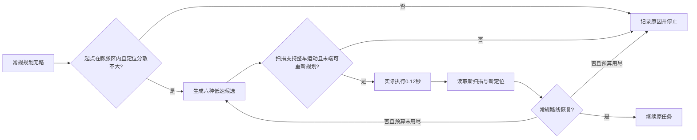

# 第 71 课：规划说“无路”，怎样安全地尝试恢复？

承接[第六十八课讲义](68-scan-based-map-repair.md)。准确地图的种子0在33.6秒时终止，已经到达2个点。周围并非完全封死：估计位置落入了规划膨胀区，A*不能从那里出发。本课保持旧到点规则，单独研究这种起点失效。

**结果：观测约束的低速恢复使准确地图组从18/24提高到24/24真实到点。** 修后图仍为23/24，旧的误报到点完整保留。六个恢复组回合只有一次触发恢复，不能据此声称已经解决全部失定位或所有无路原因。

## 1. 先分清三种“无路”

1. **起点太靠近规划边界**：真实身体还有活动空间，但估计中心落在膨胀区，常规规划拒绝启动。小范围实际移动可能恢复。
2. **路真的被堵住**：附近起点有效，但到目标的路线断开。把起点挪一点并不能穿过墙。
3. **位置可能猜错了**：地图和扫描不一致，不能放心按地图方向脱困。盲目移动可能更危险，应停止并处理定位。

本课只为第一类添加有限尝试。恢复必须是带有传感器约束的真实运动，不能改一个坐标，把机器人“吸附”到自由格后假装走过了中间空间。

## 2. 变量、单位与作用

| 变量 / 状态 | 含义 | 在实验中如何关联 |
| --- | --- | --- |
| 原始占据图 | 墙和障碍原本占据哪些10cm格子 | 冻结，不清空墙来获得路径 |
| 膨胀图 / `safe` | 为车身和规划余量预留空间后，中心可放的位置 | 目标端点必须回到可规划区 |
| 估计起点 | 当前PF输出的位置 | 落入膨胀区才允许尝试本恢复 |
| `r95` | 当前粒子95%权重的集中半径，m | 大于0.25m时拒绝；不是完整失定位检测器 |
| 雷达 `ranges` | 当前64个方向的测量距离，m | 检查整辆车未来移动的空间，不能只看正前方一束 |
| 车身半径 | 0.25m圆盘 | 沿用66/68，尚未切换为67/69矩形 |
| 恢复 `v/ω` | ±0.15m/s，0或±0.20rad/s | 比较前进/后退与缓转的六个候选动作 |
| 预测时域 | 3秒 | 每个候选检查46个中心位置；实际只执行一帧0.12秒 |
| 恢复时限 / 次数 | 每次40帧，最多3次 | 40帧为4.8秒预算；用尽就报告失败 |
| 恢复成功 | 真实移动后，常规规划重新返回路线 | 不等于已经完成任务；还要继续巡检评分 |
| 最小真实间隙 | 身体与真实障碍的最小距离，m | 独立按≤1cm运动采样检查，控制器读不到 |

## 3. 恢复动作怎样被接受

**先分类，再预测，再执行，再重新观察。** 流程如下：



对每个候选中心，把半径25cm车身加2cm余量，沿圆周取32个点；在46个预测位置上逐一检查这些边缘点。每个点对应相邻两条雷达射线，取两条中较短的量程，再减3cm保留量。边缘点超出这个范围，就不能证明当前扫描支持该动作。

接着把候选中心路径放回地图：中间不能跨越原始占据格，末端必须位于膨胀后的自由区，而且能从那里规划到当前目标。通过的动作中优先选择更接近目标、转动更小的候选。**末端只是检查点，不是要瞬移过去的位置**；每次只执行0.12秒，下一帧使用新扫描重新判断。

这个“扫描支持”仍是离散近似。64束射线之间可能藏着细障碍，单层雷达看不到低矮或悬空结构；这里没有接入深度来解决它们。当前健康传感器协议也不能推广成丢帧、无效距离时的安全证明。

## 4. 对照设计

原组与恢复组使用同一张冻结地图、同一个PF、同一噪声种子和旧的30cm/5帧到点规则。两张地图×三个种子×两组，共12回合。只改变常规规划返回无路后的行为，第70课新判据不混入本课。

程序明确拒绝：估计越界、起点有效而远处无路、内部定位半径过大、观测不足以支持整车运动、跨占据墙、恢复次数或时限耗尽。已知答案测试覆盖整盘检查、跨墙、远处封堵、定位分散和时限耗尽；它们是合成夹具，不伪装成新的完整街区回合。

## 5. 完整结果

| 方法 | 修后图真实到点 | 准确图真实到点 | 整轮完成 | 误报到点 | 接触 |
| --- | --- | --- | --- | --- | --- |
| 无路即停 | 23/24 | 18/24 | 4/6 | 1 | 0 |
| 观测约束低速恢复 | 23/24 | 24/24 | 5/6 | 1 | 0 |


左图按地图分组。右图为准确参照图/种子0的局部放大：黑实线是实际中心，绿虚线是估计中心；圆点是恢复开始，三角是常规规划恢复时的位置；黑虚圆和黑实圆分别画出开始与结束的25cm车身。灰色是冻结地图的障碍。两条中心线都发生了连续运动，没有改坐标跨墙。

### 5.1 唯一触发回合：实际移动23.4cm

第280帧，仿真时间33.60s，估计位置约 `(21.882,7.410)`，真实位置约 `(21.907,7.361)`。估计起点落在膨胀区；当前r95约0.161m，小于0.25m拒绝线。恢复策略找到扫描支持的低速动作，在13帧、1.56s内实际移动约0.234m。

第293帧，35.16s，常规路线重新出现，记录状态 `replanned_after_real_motion`。之后继续原来的8点巡检，109.8s完成8/8，而基线在33.6s以2/8终止。恢复只是帮它接回了常规路线，后面六点仍由原PF和控制器执行。


左图金星P1–P8是任务点，橙线为原组的实际轨迹，绿线为恢复组实际轨迹；共享部分相互覆盖。右图横轴为同一回合的仿真时间，绿色阶梯线是执行速度，紫线是内部粒子半径（单位在图例中分别标明），黄色背景是13帧恢复时段。没有把预测的3秒运动全部执行后才检查。

### 5.2 为什么修后图仍有误报

修后图种子1没有触发无路恢复；它仍在P4距离0.4609m时宣布，完整保留第68课的失败。恢复层负责“无路后如何尝试重新获得路线”，到点层负责“能否宣布任务完成”，两者职责和证据不同。不能把第70课与本课分别成功的数字直接相加，声称组合系统也已经通过。

## 6. 代价与适用范围

12回合墙钟9.91s，恢复组只有1/6回合实际触发。六回合内的最小真实间隙下界为0.0549m，两组相同；这属于25cm圆盘实验，不能套用第69课的矩形6cm外扩要求。原组平均96.12仿真秒、恢复组108.82秒，前者包含提前失败，不能解读为完成任务效率更高。

当前模型执行速度可瞬时改变，尚无实车加减速约束。r95拒绝门也会漏掉“粒子集中在错误位置”的情况；若整张图和定位都错了，本恢复可能没有足够证据判断。在真实封堵、动态物体、高度盲区或多峰定位下，应该保留停止与失败原因，而不是无限后退重试。

## 7. 与成熟导航的关系

[Nav2 BackUp 行为](https://docs.nav2.org/rolling/configuration_and_development/configuration_guide/core_servers/bt_plugins/actions/BackUp/)将恢复动作作为独立行为，并提供距离、速度、时限与碰撞检查配置。本课也是将恢复与普通跟踪分开，但允许扫描约束的前进/后退候选；没有接入完整Nav2行为树、重定位或三维碰撞系统。

## 8. 思考题

1. 为什么准确地图也会发生“规划起点无效”？列出地图表示、定位偏差和身体余量三个因素。
2. 只检查候选末端自由，为什么仍可能穿墙？本课如何约束中间部分？
3. 为什么预测3秒，却只执行0.12秒？执行前后哪些信息可能改变？
4. 如果恢复后继续导航但在目标外宣布，应该修改恢复层还是到点层？应保留哪些对照？
5. r95小于0.25m为什么不代表定位一定正确？怎样增加独立证据验证这一点？

## 9. 复现、窗口与停止点

先生成第68课冻结地图，再运行：

```powershell
uv run python -m embodied_learning.experiments.navigation_followups --lesson 71
uv run python -m embodied_learning.navigation_study_demo --lesson 71 --play
```

正式目录 `results/bounded_recovery_v2`，重跑需新的 `--output`，窗口传相应 `--recovery`。跳到33.6s并点“观测约束低速恢复”，相机、3D目标、地图雷达点、统计和决策诊断一起切换。诊断页的金色圆盘表示当前动作的预测扫掠，不是尚未发生的真实观测；未接入的深度不伪造显示。


实现：[决策模块](../src/embodied_learning/navigation_decisions.py)；[基准摘要](benchmarks/navigation-studies-69-71-v1.json)；[验证记录](benchmarks/navigation-studies-69-71-validation.json)。本课证明一个已知起点失效机制可以被有限恢复，仍需更多触发病例和负例。下一步顺序见[69–71阶段复盘](navigation-stage-review-69-71.md)：先补窄路跟踪缺口，再统一身体和时序，最后做组合消融与留出布局。
