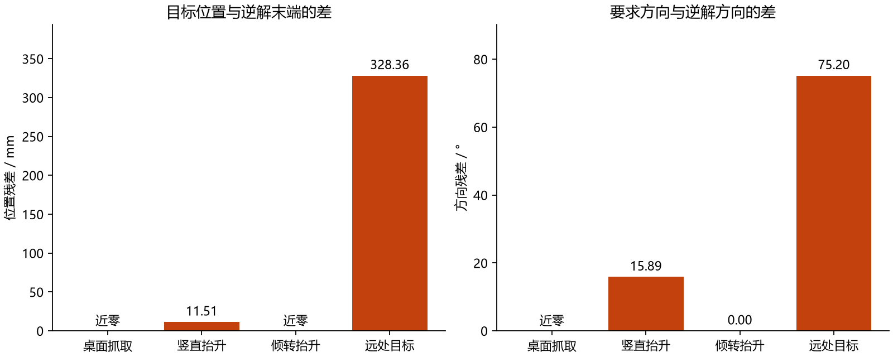

# 第七十二课：从平面双关节臂走到SO-101三维机械臂

**本课建立了可复用的三维机械臂、相机和控制接口。** 五个手臂关节和一个夹爪关节分别控制不同动作；能算出某个位置的关节角，并不保证夹爪能同时保持指定方向。模型内坐标审计通过，实机标定尚未进行。

基线`68bc87f`，首批协议见[72—73课实验计划](72-73-manipulation-plan.md)，数据与下一课共同保存于本地`results/so101_grasping_v2`，完整摘要见[记录](benchmarks/so101-grasping-v2.json)。

## 1. 接上已有知识：多出来的关节解决什么？

第8—13课的2R机械臂像桌面上两根相连的尺子：两个角度决定一个平面上的末端位置。SO-101需要把手伸到三维空间，还要让夹爪朝向物体。肩部负责转向和抬臂，肘部改变伸展，腕部改变接近方向与夹爪方向。

SO-101只有五个手臂关节。一个完全自由的三维目标有位置XYZ和三个方向自由度，共六个要求；不能假定所有要求都能独立满足。本课先限定接近方式与物体范围，用数值逆解检查残差，超出关节范围或残差门槛的目标拒绝执行。

夹爪还有自己的第六个电机。它改变开口，不增加手臂定位自由度。机械臂能伸过去、夹爪能闭合、物体能被抓起，是下一课需要分别检查的结果。

## 2. 新变量怎样关联？

| 变量 | 通俗含义、单位 | 实验中的作用 |
| --- | --- | --- |
| `q[0:5]` | 肩、肘、腕五个角度，rad | 共同决定夹爪参考点的位置和方向 |
| `q[5]` | 活动指角度，rad | 约1.1表示张开；请求0表示闭合；物体挡住手指时实际角度仍大于0 |
| `qvel` | 关节及自由物体的运动速度 | 用于物理状态与放置停稳判断，不等于角度请求 |
| `TCP` | 夹爪工具参考点，本课使用上游`gripperframe` | 是控制/几何参考点，不是任意开口下两指中心，也不是物体中心 |
| `p目标` | 本段想让TCP到达的位置，m | 经逆运动学转换为关节目标；窗口金点/金圈表示它 |
| `R目标` | 本段要求的夹爪方向，3×3旋转矩阵 | 同一位置改变方向要求，逆解可能从可达变成不可达 |
| `q请求` | 位置伺服的关节目标，rad | 由五次平滑插值生成；只写入电机输入，不直接修改运动中的状态 |
| `q实际` | 接触、惯量、摩擦和限矩下实际角度 | 由MuJoCo每2ms推进；物体挡住夹爪后，实际角度与请求分离 |
| `K` | 相机内参，像素单位 | 把相机坐标的三维点投影到图像 |
| `R世界←相机`、`C世界` | 相机方向和原点 | 腕部相机随关节运动，外部相机固定；把相机中的点放回世界 |
| `dt物理`、`dt控制` | 0.002s、0.02s | 电机目标50Hz更新，每次更新之间物理推进10步 |

因果链是：**目标位置与方向 → 受关节限制的逆解 → 平滑角度请求 → 电机与真实接触 → 实际手臂/物体状态 → 相机图像与评分。** 本阶段控制使用已知物体位置，相机尚未承担识别或定位任务。

## 3. 三套坐标怎样互相转换？

世界原点位于场景地面，机器人固定底座放在69cm高的桌面。本课桌高是场景假设，不是重新测得的房间尺寸。手臂模型原来的局部坐标整体平移到桌面。

相机坐标使用常见的“向右为X、向下为Y、向前为Z”。MuJoCo相机局部坐标是“向右、向上、向后”，所以接口显式转换Y/Z方向；漏掉这一步，图像上下或前后会解释错。

有深度Z时，像素对应的世界点为：

`p世界 = C世界 + R世界←相机 × (K⁻¹ × [u,v,1] × Z)`。

这里的Z是沿相机前方的深度，不能直接换成斜着量到物体的射线长度。K由垂直视场角、640×480图像尺寸构造；窗口缩放采用等比显示，不修改相机几何。

## 4. 模型来源与实验固定项

- 使用[MuJoCo Menagerie SO-101模型](https://github.com/google-deepmind/mujoco_menagerie/tree/4d038b3feae26ec82b46a4d586379114012a8ac7/robotstudio_so101)，固定提交`4d038b3feae26ec82b46a4d586379114012a8ac7`。22个所用文件保留原内容、Apache-2.0许可及[哈希清单](../src/embodied_learning/assets/so101/provenance.json)。
- 本项目场景包装器加入桌面、自由物体、放置区域及外部相机；物理步长改为2ms、接触迭代50次，给手指接触网格补名称便于区分接触来源。
- 夹爪力矩限制±0.3N·m是本轮仿真假设。原上游文件的±2.94N·m没有被覆盖；手臂其他伺服、惯量、关节范围和碰撞体沿用上游。不能把这套参数当成实机已标定性能。
- 逆解位置残差须小于3mm、方向残差小于0.08rad，且角度落在关节与电机控制范围的交集。`reachable`仅代表本次求解在数值上满足这些条件，不是全局可达性证明或完整无碰撞路径认证。

## 5. 数据和结果意味着什么？



左图是位置残差，右图是方向残差；绿色为通过本轮两项门槛，橙色为拒绝。近零只说明模型内部几何一致，不能解释为硬件具有这种精度。

| 目标 | 位置残差 | 方向残差 | 判定与含义 |
| --- | --- | --- | --- |
| 桌面抓取点，夹爪竖直 | 近零 | 近零 | 在本次逆解条件下可执行 |
| 同一XY上方12cm，仍要求竖直 | 11.51mm | 15.89° | 腕关节达到上限，本次求解不满足要求 |
| 同一抬升点，允许倾转−0.45rad | 0.000534mm | 0.0020° | 适度改变要求后满足门槛；不是把关节上限放宽 |
| X=0.8m的远处目标 | 328.36mm | 75.20° | 本次求解远不能满足目标，拒绝执行 |

另外32组关节姿态中，MuJoCo雅可比与有限差分的最大差为`1.79×10⁻¹⁰m/rad`；两相机64次坐标投影/反投影最大往返差`7.22×10⁻¹⁶m`。这些检查帮助发现坐标、索引和单位错误。它们不包含镜头畸变、真实安装偏差、图像识别误差或电机回差。

## 6. 窗口与复现

```powershell
uv run python -m embodied_learning.experiments.so101_grasping --output results/so101_my_run
uv run python -m embodied_learning.manipulation_demo --results results/so101_my_run
```

输出目录必须是新目录。窗口中红/绿/蓝短线表示底座与TCP的X/Y/Z坐标轴；三维视图可拖动旋转和滚轮缩放。相机、轨迹、目标和诊断图共用时间轴，方法按钮一次切换全部面板。

已有正式记录时直接运行`uv run python -m embodied_learning.manipulation_demo`。模型文件已随仓库提供；需要核对/重新取得同版本时用`uv run python scripts/fetch_so101_model.py`，脚本拒绝覆盖被修改的模型。

## 7. 理论对应与思考题

对应前课：第8课正/逆运动学，第9—13课参考与执行的区别，第14课坐标变换，第22/25课相机投影与标定。进一步对应机器人学的任务空间、关节空间、雅可比和自由度约束。

1. 为什么夹爪电机不能算作手臂第六个定位自由度？
2. 同一个XYZ改变夹爪方向后变成不可达，说明“位置够近”还漏掉什么？
3. 物体挡住手指时，为什么实际角度大于闭合请求0仍可能是正常现象？
4. 数值反投影误差接近零，能否证明真实相机找物体也准确？还缺哪几项验证？
5. 雅可比正确、逆解通过后，为什么仍需要检查实际接近路径与碰撞？

## 8. 自审与停止点

模型、控制、记录和渲染各自独立；回放只重建存档状态，不重新运行控制器。当前几何接口可进入下一课真实物理抓取。没有宣称实机精度、视觉抓取或通用机械臂路径规划已经完成。下一课的部分失败用于确定后续标定/接近策略研究方向。
