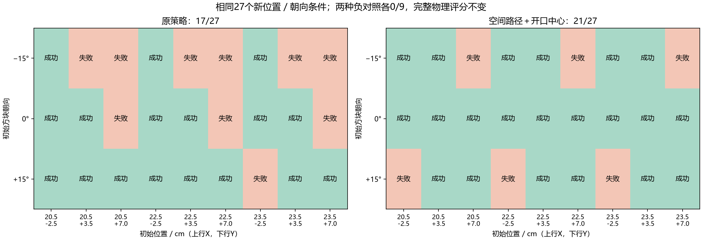
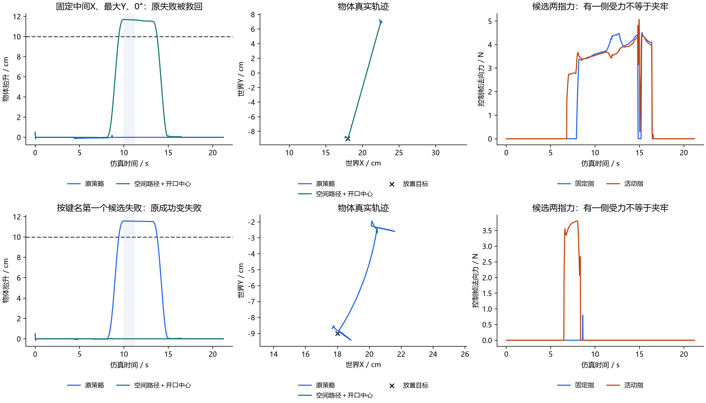
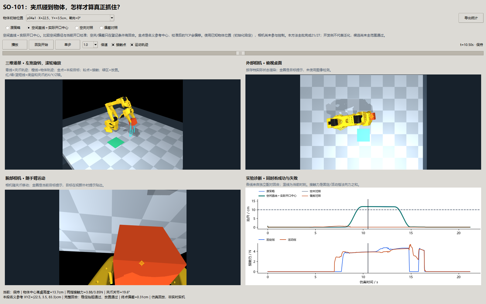
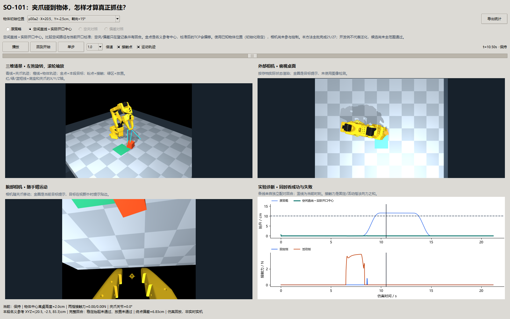

# 第七十三课第二轮：对准夹爪的点，为什么仍夹不住方块？

**导航第69课的限定稳定性门槛已通过，随后推进本课。新的27对位置／朝向条件中，原策略17/27，空间路径＋开口中心候选21/27；空夹、偏5.5cm对照各0/9。** 候选救回6次失败，也把2次原成功变成失败，剩6次失败，未达到稳健抓取。首轮6/9和全部旧记录继续保留。

承接[第七十三课首轮讲义](73-so101-physical-grasping.md)。[冻结登记](73-approach-round2-plan.md)、[开发八例](benchmarks/so101-approach-development-v3a.json)、[正式72回合](benchmarks/so101-approach-v3b.json)、[逐物理步审计](benchmarks/so101-approach-v3b-validation.json)、[配对及失败诊断](benchmarks/so101-approach-v3b-diagnosis.json)分别记录范围、输入与结果哈希。控制仍使用已知初始物体位置，本课没有视觉估计。

## 1. 先想象一把只有一侧会动的夹子

夹子张开时，活动指沿圆弧向外、向上走。夹子上画的固定参考点不一定处在开口正中；张开与闭合时，开口中心也不在同一处。把那个固定点放到方块中心，可能让某根手指先压住方块，而另一根还离得很远。

另一个问题是手臂怎样下降。每个关节各自平滑转到终点，夹爪在空间中通常走弯线；只看终点对准，无法知道中途是否碰到方块边角。本课分别研究参考点与运动路径，再用物体实际运动判断夹取是否成立。

## 2. 新变量怎样关联？

| 变量／概念 | 通俗含义 | 在实验里的关系 |
| --- | --- | --- |
| TCP | 模型给夹爪指定的固定参考点 | 首轮把它对准方块；它不是随开度变化的开口中心 |
| `opening` | 当前真实夹爪关节角，rad | 读取当前帧，决定活动指现在的位置；与发出的闭合请求不同 |
| 固定／活动指尖参考 | 两根指尖球体中心 | 用模型正运动学计算；代表几何参考，不代表所有接触面的平均位置 |
| `local_midpoint` | 两指尖参考在TCP坐标中的中点 | 开口变大时向外移动，开口变小时回到TCP附近 |
| `tcp_target` | 为让开口中心对准而移动后的TCP目标 | 只补偿水平XY，不按活动指抬高的中点调整Z，以免压入桌面 |
| `tilt` | 夹爪倾斜角，rad | 下降为0，抬升／搬运为−0.45；配合五关节手臂可达范围 |
| 关节路径 | 每个电机角度独立插值 | 末端实际空间轨迹可能弯曲 |
| 空间路径 | 名义XYZ和倾角先插值，再求关节角 | 下降名义参考沿直线；加开口补偿后TCP还会随开度偏移 |
| 方块朝向 | 初始化绕世界Z转多少度 | 改变手指碰到侧面还是边角；本轮仅作环境条件，控制器不读取它重新定向 |
| 双侧接触 | 固定指和活动指都有力 | 是保持评分必要条件；只有活动指有力，不能算抓住 |
| 保持与放置 | 物体升高并稳定、最后松手并稳定 | 沿用首轮评分，不用夹爪高度代替物体高度 |

因果链是：**已知初始位置 → 名义接近与搬运路径 → 当前开度决定指尖参考 → 补偿TCP → 逆解与实际电机运动 → 接触力 → 方块运动 → 原评分。** 校准不读取未来位置，不跟踪物体真值去追掉落的方块。

## 3. 几何校准具体算了什么？

独立的正运动学数据对象计算指尖位置，不改真正推进的物理状态。设固定指尖为`f`、活动指尖为`m`、TCP位置为`p`，TCP方向矩阵为`R`，局部中点偏移是`Rᵀ((f+m)/2−p)`。期望世界中心为`c`时，选择TCP水平位置，使`p+R·局部偏移`的XY等于`c`；Z保持原抓取高度。

本模型开度1.1rad时，局部中点沿闭合方向偏TCP约26.09mm；开度0.3rad时约−0.16mm。这个变化量相对于4cm方块已经很大。活动指同时抬高，所以中点三维高度不能直接当成方块应该所在的高度。补偿的方向也随手臂朝向改变，不能总在世界Y减一个常数。

五关节手臂不能独立满足任意六维姿态。水平目标补偿后，重新计算径向方向，迭代八次几何关系，再做有界逆解；位置残差≥3mm或方向残差≥0.08rad仍拒绝。测试在12个独立关节姿态中比较两指真实几何与局部预测，并核对补偿不改变高度、不会写入物理状态。

## 4. 开发与正式对照怎样安排？

开发只用已见(22,1.5)/(22,5.5)cm、0°两个位置，四种动作各两例：原策略1/2；空间路径、关节位置路径加开口中心、空间路径加开口中心各2/2。后两组同时规定倾角插值和在线逆解，不能把它们相对原策略的收益全部归因于中心偏移。开发仅帮助选候选，没有证明方向问题已全部分离。

最终冻结为空间路径＋当前实际开度补偿。初次高处接近保留原关节插值；下降至撤离使用名义XYZ和倾角的五次插值，再求关节请求。阶段时长、闭合请求、0.3N·m限矩、摩擦、质量、桌面和评分保持不变。

正式使用未用于开发的X={20.5,22.5,23.5}cm、Y={−2.5,3.5,7}cm、方块朝向={−15,0,+15}°，27条件两组配对，共54回合。中间X的三Y三朝向再加空夹、偏5.5cm两组，共18负对照，合计72回合。朝向只在初始化写入自由物体四元数，之后物体仅由`mj_step`运动。

## 5. 成绩要同时看改善和退步



横轴每列是相同初始X/Y，上行X、下行Y；纵轴是方块朝向。绿成功、橙失败，两图条件逐格相同。0°九位置由6/9变9/9；−15°由3/9变6/9；+15°由8/9变6/9。因此总体提升没有消除方向敏感性，甚至在一类方向出现退步。

| 原策略与候选的关系 | 条件数 | 意义 |
| --- | --- | --- |
| 都成功 | 15 | 保持原有能力 |
| 原失败、候选成功 | 6 | 新策略有实际增益 |
| 原成功、候选失败 | 2 | 必须报告的退步 |
| 都失败 | 4 | 原问题尚未解决 |

候选27例手指500Hz峰值最大13.03N，原组35.16N；两组其他手臂接触峰值均0。本轮没有设立新的手指安全力阈值，这些数是诊断，不能凭更低的力就宣布更安全或更牢。每回合仍21.2s仿真时间；三进程72回合约78.8s墙钟，这是具体机器上的批处理时间，不是实时性能保证。

## 6. 为什么有的位置好了，有的位置变差？



上排固定中间X、最大Y、0°，不是按最好效果挑选：原策略下降结束固定指20.48N、活动指0，方块仍被桌面托住；候选下降没有单侧压物，夹紧后形成双指接触，物体抬约11.7cm并放置。左图虚线10cm门槛，淡灰10—11.2s保持段；中图方块实际XY轨迹，黑叉放置目标；右图候选两指50Hz诊断力，完整峰值来自500Hz另行统计。

下排按键名首个候选失败`p00a2`，X20.5/Y−2.5cm、+15°：原组完成，候选夹紧结束固定指0、活动指约3.80N、桌面／其他支持约3.70N。抬升后方块没有随手臂走。说明按两指尖几何中点对准，并不保证两根真实碰撞指面都落在方块两侧。

另外四例候选最大抬升约5.28—8.63cm，未到10cm且保持段已落回桌面。这些是短暂抬起后失去接触；两例几乎未抬起是未夹牢。不能把两种失败一起写成“逆解失败”：本批所有计划均未被逆解拒绝。

已确认的是单侧受力或抬起后掉落；方块边角、活动指圆弧运动、参考球与完整指面的关系是下一步候选原因。当前没有把每种原因单独因果分离，也没有在线双侧接触反馈或重抓。

## 7. 实际窗口与独立验收



固定中间位置、0°、10.5s：左上三维机械臂与物体，右上外部相机，左下腕部相机，右下所有可用方法的物体高度及当前方法两指力。金点是名义任务参考中心，补偿后的TCP可能偏离它；目标标记是提示，没有用于图像识别。



同为10.5s，失败例方块留在桌上，候选高度线没有上升，不能被手臂的运动掩盖。方法按钮同时切换三维、两相机、曲线和统计，保持时间；没有登记负对照的条件按钮禁用，不借用其他初态回合。窗口兼容首轮数据，并在小尺寸检查文字与图例。

独立重放72回合763,200个2ms物理步，评分、状态、接触力、末端与物体几何差均0；没有在重放中复制未来状态。开发原策略与首轮同位置的全部15个数组逐值相同，确认原参照没有被修改。哈希和配对退步表见开头审计链接。

## 8. 理论对应与限制

开口中心校准是随关节变化的工具参考点转换；它比固定TCP对准更接近当前夹子几何，但尚未等于完整接触模型。空间插值控制目标轨迹，物理关节仍有误差和限矩，不能把逆解成功等同于抓取成功。

真实抓取还涉及接触面的方向、摩擦锥、物体转动和受力平衡。本课用自由物体与接触仿真揭示这些现象，没有验证力闭合保证。质量、摩擦和驱动均为固定模型假设；相机画面只是按存档重渲染，尚无视觉闭环，也不是实机标定。

## 9. 思考题

1. 为什么固定指不动，开口中心仍会改变？为什么闭合请求0rad不能替代当前真实开度？
2. 两指尖的三维中点上移，为什么不应直接把TCP向下补偿同样距离？桌面与指尖分别会怎样接触？
3. 为什么每个关节都平滑运动，末端却不一定沿直线下降？空间路径加入开口反馈后TCP又为何会偏离名义直线？
4. 同样17/27→21/27，如果有两例退步与没有退步，下一轮开发重点会有什么不同？
5. 手指力更低、没有其他手臂接触，但物体掉落了，这能算有效抓取吗？请串起双侧受力、支持力、抬升和保持条件。
6. 如何分别测试方块朝向、接触面参考点和双侧接触反馈？为什么不能用修好本轮六失败的成绩冒充新条件泛化？

## 10. 复现和下一项

```powershell
uv run python -m embodied_learning.experiments.so101_approach_study --smoke --output results/so101_approach_development_v3a
uv run python -m embodied_learning.experiments.so101_approach_study --workers 3 --output results/so101_approach_v3b
uv run python scripts/validate_so101_approach.py results/so101_approach_v3b --output docs/benchmarks/so101-approach-v3b-validation.json
uv run python docs/img/make_so101_approach_figures.py
uv run python -m embodied_learning.manipulation_demo --results results/so101_approach_v3b --position p04a1 --method center_cartesian --play
uv run python scripts/check_so101_approach_window.py
```

目录存在会拒绝覆盖；旧开发v3a源快照与现行种子初始化版本略有区别，精确复现历史开发应使用其源快照。现行冒烟生成相同登记条件但新实验必须取新目录名。正式v3b可用仓库冻结源码直接复现；原始数组本地存档，新的克隆需要重新生成。

下一项先在本批反例分离“完整指面接触几何”与“闭合后双侧接触门控”，门控不能把不抬升当成功；恢复应报告新增成功、额外时间和退步。冻结下一候选再测新位置／朝向，几何教师稳健后再进入第74课视觉位置估计。路线详见[机械臂安排](manipulation-roadmap.md)。
