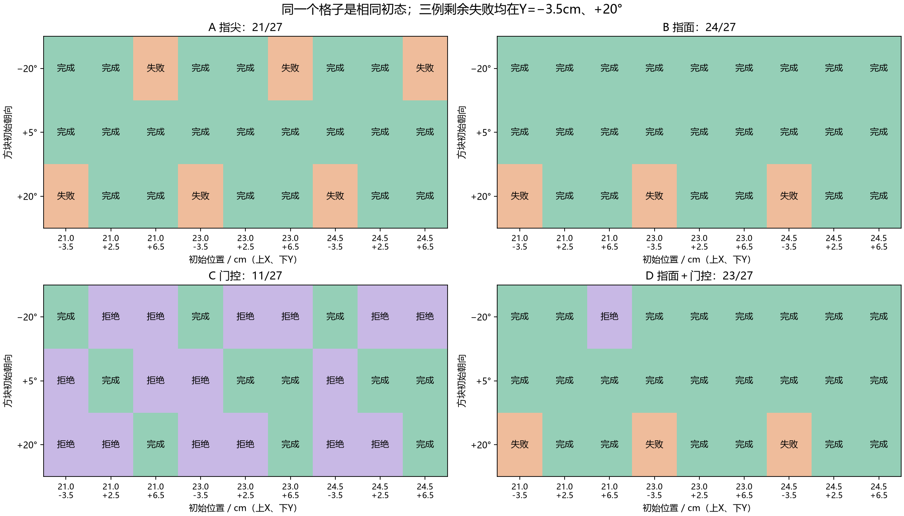
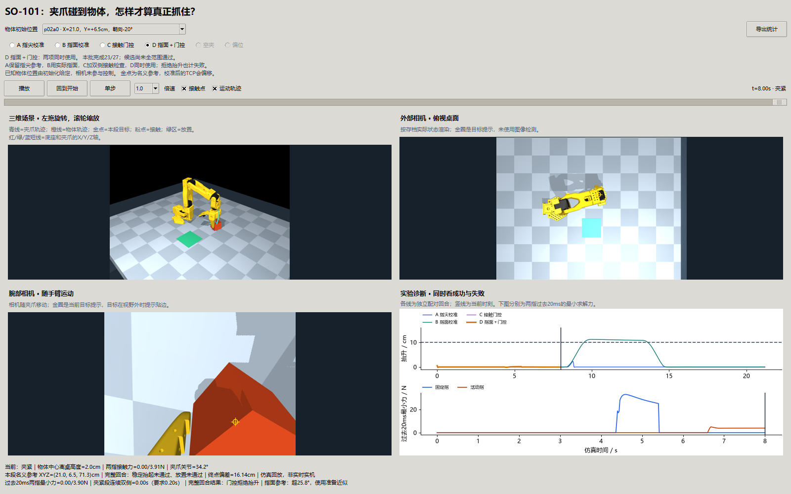

# 第七十三课第三轮：两根手指都有力，为什么方块还是会掉？

**126个物理回合完成。相同27个新位置／朝向条件：第二轮策略21/27，指面校准24/27；救回3例，没有退步，但仍有3例掉落。单独加抬升前接触检查为11/27，指面＋检查为23/27。两种负对照各0/9。** 本轮说明接触参考点有用，也说明“先检查两指有力”不能代替稳定抓取。第74课视觉教师入口尚未通过。

承接[第二轮讲义](73-so101-approach-geometry.md)。证据：[执行前登记与冻结补记](73-contact-round3-plan.md)、[126回合输入／结果／源哈希](benchmarks/so101-contact-v4.json)、[开发、配对与失败诊断](benchmarks/so101-contact-v4-diagnosis.json)、[独立物理和因果审计](benchmarks/so101-contact-v4-validation.json)。原始数组保存在本地`results/so101_contact_v4`，新克隆需重新采集。旧结果未覆盖。

## 1. 先用夹子理解问题

想象夹一块积木：夹子的两根尖端正对着积木，并不代表两侧的平面已经贴好。凸出的边角可能先压住积木上沿；一边向下压，桌子向上托，电机感觉到了阻力，积木却没有被可靠地夹在中间。

上一轮六个失败在夹紧结束都是固定指没有力、活动指有力、桌面仍托住物体。两例几乎没离桌，四例抬起来一点又掉了；所有逆解都通过。所以这次先改“夹爪哪个部位应该对准”，再独立加“确认接触后才抬升”。机器人关节运动、方块运动和任务完成依然分别检查。

## 2. 新变量是什么，怎样影响实验？

| 变量或概念 | 通俗含义 | 如何变化、和谁关联 |
| --- | --- | --- |
| TCP | 夹爪上固定的坐标参考点 | 电机逆解控制它的位置；它不一定是夹住物体的中心 |
| `opening`，rad | 当前实际张开角 | 随活动指转动而变化；不能用“请求闭合0rad”代替实际角度 |
| 指尖参考 | 上轮两根指尖球中心的中点 | 能表示开口变化，但未覆盖真正碰撞的指面 |
| `band_x`，m | 在夹爪自身坐标里选哪一层指面 | 本轮冻结为0，即经过TCP的截面；局部x大致沿指的长方向，局部z沿闭合方向，不是世界高度轴 |
| 内表面交点 | 在这个截面沿闭合方向，分别碰到两根指的位置 | 由碰撞盒、球、胶囊和网格凸包计算，随开度改变 |
| `local_midpoint` | 两个内表面交点的中点 | 作为新的接触参考，代替指尖参考；只是一个截面，不是所有接触面的受力中心 |
| 准备开度上限0.45rad | 标定表能同时找到两指交点的开度范围上限 | 实际角度更大时先用上限参考接近；**没有把夹爪开口限为0.45rad**，打开请求仍是1.1rad |
| `tcp_target` | 为把该指面参考放到名义位置而求出的TCP目标 | 随实际开度和倾角改变，再交给原逆解和电机；不改物体位置 |
| 求解接触力，N | 刚刚物理子步已经算出的接触力 | 固定／活动指各自汇总法向力；与当前`mj_forward`诊断力的时间口径不同 |
| 最小双侧力 | 过去20ms内，每根指的最小求解力 | 每段含十个2ms物理步；任何一个子步低于门槛，该段不能累加确认时间 |
| 连续接触时间，s | 夹紧段两指每个子步都>0.05N的连续时长 | 中断就清零；达到0.2s才允许门控组开始抬升 |
| 桌面等支持力 | 除手指外，物体还由什么接触托住 | 方块仍在桌上时可以很大；本轮门控没有检查支持力或接触方向，这是关键限制 |
| 稳定抓取评分 | 方块确实升高、保持、搬运并放稳 | 拒绝抬升也算失败；不能用夹爪高度、两指有力或停车代替完成 |

完整关系：**初始给定位置 → 名义空间路径 → 自身开度决定指面参考 → TCP补偿与逆解 → 真实电机／接触 → 过去的双指力决定是否抬升 → 自由方块的真实运动 → 原评分。** RGB只用于回放画面，控制器没有看图找方块；方块朝向只在初始化设置，没有读出当前真值来追踪或定向。

## 3. 指面校准的原理

在夹爪自己的坐标里，选定`x=0、y=0`，沿局部z画一条线。计算这条线穿过每个有碰撞作用的手指几何的区间。固定指取靠内的一端，活动指取另一侧靠内的一端，再求中点。网格按本模型使用的凸包处理，原始碰撞模型未缩小，物理质量、摩擦和限矩未改。

用独立的正运动学数据对象生成131个开度样本，运行时按自身实际开度插值。设世界名义参考是`c`，局部中点是`m(a)`，夹爪方向是`R`，则希望`TCP + R·m(a) = c`。方向又受五关节手臂的径向姿态限制，所以迭代八次求TCP目标后再做有界逆解。位置残差≥3mm或方向残差≥0.08rad仍拒绝。

这次的截面x=0，没有初版−12mm带来的直接纵向下移，但倾角变化仍会把闭合方向偏移转换为世界XYZ偏移。打开时在此截面找不到两指共同交点，才使用0.45rad的准备参考；这是一项明确的策略假设，不能说打开时已经测得真实接触中心。标定不写入推进中的物理状态，不读取运行中物体真值。

这项准备近似也可能一直延续到夹紧结束。三例剩余失败最后请求所用实际开度约0.464—0.475rad，三例救回则约0.538—0.598rad，都超过0.45rad；其余21成功例结束时在标定范围内。因此超范围值得研究，但不是失败的充分判据。窗口按生成本帧请求前的开度明确标出“超25.8°，使用准备近似”，完整逐条件开度和超范围时长见诊断摘要。

## 4. 为什么要保留失败的开发版本？

开发用上一轮六失败和两成功，共八个已见条件。初版截面−12mm、准备上限0.65rad：基线2/8，指面1/8，单独门控1/8，组合0/8。读接触位置发现较厚指部仍先压到方块上边；“参考点算对”并未意味着实际接触对。

随后只在两个失败端点检查五组截面／上限。−6mm/0.65、0mm/0.45、+3mm/0.45各2/2；−12mm/0.45、−20mm/0.9各0/2。选0mm/0.45，在完整八例复核得到指面8/8、组合8/8，六失败救回、两成功保留。单独门控仍1/8。这些用于选参数，**不能作为新条件成功率**；两批完整开发有源快照。十次参数探针保存参数、指标、数组及文件哈希，没有保存独立源码快照，也没有计入正式独立验证。

正式前冻结参数。新的X={21,23,24.5}cm、Y={−3.5,2.5,6.5}cm、朝向={−20,+5,+20}°，27条件四组配对108回合；中间X的九条件另加空夹／偏5.5cm各九例，共126。正式结果没有用于继续调参。

| 组 | 指面参考 | 抬升前门控 | 固定项 |
| --- | --- | --- | --- |
| A | 第二轮指尖中点 | 无 | 原模型、4cm/50g、摩擦1.0、0.3N·m、原阶段和评分 |
| B | 新截面内表面中点 | 无 | 同A |
| C | 同A | 过去双指力持续0.2s | 同A；拒绝时8s结束，未执行搬运 |
| D | 同B | 同C | 同A；未拒绝仍21.2s |

这是“接触参考策略 × 门控”的2×2对照。B包含截面选择、内表面计算及超标定开度处理；不能把收益进一步归因于其中某一个子项。

## 5. 结果怎样读？


左图每根柱都有27回合：绿为完成，紫为门控拒绝，橙为继续执行但失败。紫色也在失败分母里。右图横向只换参考，纵向只加门控：换指面有增益，当前门控没有额外完成收益。

| 方法 | 完成 | 门控拒绝 | 执行后失败 | 配对含义 |
| --- | --- | --- | --- | --- |
| A 指尖 | 21/27 | 0 | 6 | 同新条件的参照 |
| B 指面 | 24/27 | 0 | 3 | 相对A救回3例，保留21成功，退步0 |
| C 门控 | 11/27 | 16 | 0 | 相对A损失10例原本能完成的回合；不是更会抓 |
| D 指面＋门控 | 23/27 | 1 | 3 | 相对B少完成1例，三个掉落仍未拦住 |
| 空夹／偏位 | 各0/9 | 0 | 各9 | 手臂移动或有偶发接触不足以骗过原评分 |



上下四图的同一格是同初态；绿色完成、紫色门控拒绝、橙色执行失败，与汇总图一致。横轴上行X、下行Y，纵轴方块朝向。B救回的三例均在Y=+6.5cm、−20°；B剩余三失败均在Y=−3.5cm、+20°。其余位置和方向保持成功，说明失败具有方向／位置结构，不能写成随机逆解失败。

不能把首轮6/9、第二轮21/27和本轮24/27拼成一条同范围曲线：三批位置／朝向不同。本轮有效增益是**同一批新条件A21/27→B24/27**，而不是“旧21/27→新24/27”本身。

## 6. 三类回合把机制说明白


选例规则固定为键名首个救回、首个B仍失败、首个B成功但D拒绝，未按画面最好挑选。左列是方块实际抬升，10cm虚线是门槛，10—11.2s浅灰为保持段；中列是方块真实XY轨迹、黑叉放置目标；右列是B组500Hz求解力，8s竖虚线开始抬升，蓝固定指、橙活动指、灰桌面等支持。

第一排`p02a0`：A最多抬2.33cm，B超过11cm并完成放置。B的实际接触参考改变了接触过程；不是提高电机力矩或让物体跟随夹爪。

第二排`p00a2`：B抬升前已经持续1.04s满足双侧门槛，但过去20ms的最小固定／活动指力约18.20/3.75N，桌面等支持约20.96N。50g物体自身重量只有约0.49N；这些大力说明手指和桌面正在共同压住它。两指有力并没有说明力的方向适合悬空保持。物体最多抬6.00cm，随后两指失去接触并落回桌上。另两例最多5.39/5.70cm，抬升前连续接触约1.02s，同样通过D门控后掉落。

第三排还是`p02a0`，但比较B和D：B在开始抬升后的短暂变化中形成有效夹持并完成；D在8s那一刻没有连续0.2s合格双侧力，于是停止，少了一次成功。它说明检查时间和检查内容不适合所有可完成接触，不等于停止本身没有价值。

已证实：三例剩余失败有双侧受力、有较大桌面支持、短暂抬升后丢失接触。**尚未单变量证实**：倾角变化、凸出部位、摩擦滑动及物体转动各占多少原因。不能把观察到同一时段就写成“倾角是唯一原因”。

## 7. 任务收益也有代价

原评分保持不变：保持段方块抬升≥10cm且连续≥1s、两指各>0.02N、其他支持<0.02N；放置连续≥0.5s、XY误差≤2.5cm、高度误差±3mm、线速度<2cm/s、角速度<0.2rad/s，夹爪打开且无有效指接触。门控用的0.05N/0.2s只是抬升前候选检查，不能替代这一整套评分。

27个正常条件中，A固定／活动指峰值最大6.85/19.70N，B为34.20/13.77N；最大模型压入由3.58mm变5.57mm。其他手臂接触均0，但**方块与手指／桌面的接触仍然存在且可能很强**。B提高了完成率，没有证明更低载荷、力闭合或实机安全。当前接触参数、固定摩擦和驱动是假设，实机需要独立标定。

三工作进程正式采集墙钟150.10s；未拒绝回合21.2s仿真，接触拒绝8s。批处理时间包含保存，和控制实时性能不是同一指标。独立重放耗时及精确物理步数见审计JSON，测试耗时另列于[交付核验](benchmarks/so101-contact-v4-delivery.json)。

## 8. 可复用窗口和独立验收


固定中间位置`p04a1`、10.5s。三视图按同一存档实际状态渲染；右下上图叠各方法方块高度，下图分别画当前方法两指过去20ms的最小求解力。底部同时显示瞬时诊断力与过去求解力，口径有区分。金点是名义目标，校准后TCP会偏移，图像没有参与控制。



`p02a0`的D在8s拒绝。方法按钮一次同步三维、两相机、曲线、目标及统计，保持时间；切到较短回合时所有面板一起夹到结尾。没有登记的负对照按钮禁用。已检查1600×1000和1100×800实际窗口，兼容前两轮记录。

独立审计从初始状态和逐帧动作重新物理推进，核对每个2ms的状态、力、压入量、时间，以及原评分；重放不复制未来状态。另逐过去区间重算门控计时，检查拒绝回合没有发出抬升动作、拒绝不计成功；A与第二轮相同八开发条件全部15数组逐值桥接。C与A、D与B直到各自结尾的请求和物理状态逐值对齐，避免把门控以外的变化混入比较。

## 9. 理论对应、思考题

本轮对应机器人学中的工具坐标变换、模型碰撞几何、接触力反馈和混合状态控制：几何参考改变目标，真实力改变是否进入抬升状态。力闭合还需要接触位置、法向方向、摩擦和能抵抗的物体运动；两边各有一个正数不构成证明。对照使用固定初态、保持物理参数和独立新条件验证；模型内自洽、仿真完成、视觉控制及实机表现分别判断。

1. TCP、指尖中点、指面截面中点为什么可能是三个不同位置？开口变化怎样经过坐标转换影响电机目标？
2. 实际开度1.1rad却查0.45rad标定表，改变的是夹爪开口还是接近参考？这一近似在哪些条件下可能失效？
3. 为什么过去20ms里有一个2ms子步失去接触就清零？如果只看段末的一个力值，会漏掉什么？
4. 两指各有力，桌面仍受20N，而方块只重0.49N，这可能是悬空夹持还是夹子在压桌？需要哪些额外信息判断？
5. C拒绝16例、没有执行后掉落，可以说它优于A吗？请同时计算完成、误拒和失败分母。
6. B开发8/8、正式24/27，说明开发没有意义，还是说明验证条件不同？下一轮三失败应怎样使用？
7. 同一方法完成更多，却峰值力／压入变大，应该追加什么指标和对照？为什么不能只展示成功视频？
8. 接触方向、试抬保持和物体朝向三个变量如何分开检验？哪些可以作为现有反馈，哪些仍需传感器或特权真值？

## 10. 复现、停止点与下一轮

```powershell
uv run python -m embodied_learning.experiments.so101_contact_study --development --workers 3 --output results/so101_contact_dev_v2
uv run python -m embodied_learning.experiments.so101_contact_study --workers 3 --output results/so101_contact_v4
uv run python scripts/validate_so101_contact.py results/so101_contact_v4 --output docs/benchmarks/so101-contact-v4-validation.json
uv run python docs/img/make_so101_contact_figures.py
uv run python -m embodied_learning.manipulation_demo --results results/so101_contact_v4 --position p04a1 --method surface --play
uv run python scripts/check_so101_contact_window.py
uv run python scripts/test.py full tests/test_so101_contact.py tests/test_so101_manipulation.py tests/test_gripper_calibration.py
```

目录存在会拒绝覆盖。审计的旧开发桥接依赖第二轮正式记录；默认开发v2与正式v4名称对应，换名时用审计器`--development`、`--previous`指定。历史开发v1及参数探针的精确输入见诊断JSON；图表脚本需要这些本地历史记录，新的克隆先复现正式结果或使用仓库已生成图表，不能凭缺失记录宣称历史审计通过。

**停止点：当前24/27，教师仍未稳定，不把它交给74课当全范围成功教师。** 下一轮以本批三掉落和一个门控误拒作开发，保留B成功的哨兵条件；先审计接触方向与桌面支持，再对照“保持现倾角试抬”与“原倾角变化”，最后单独测试短距离试抬的持续反馈／有限重抓。限制重试与额外时间，保持质量、摩擦、限矩及评分；冻结后再换新位置、朝向验证。不要同时加视觉、改摩擦、加力矩，把真正原因混在一起。具体次序见[机械臂路线](manipulation-roadmap.md)。
