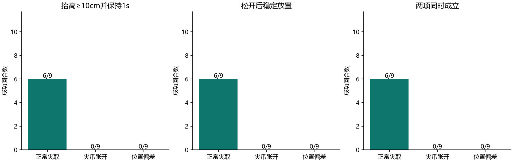
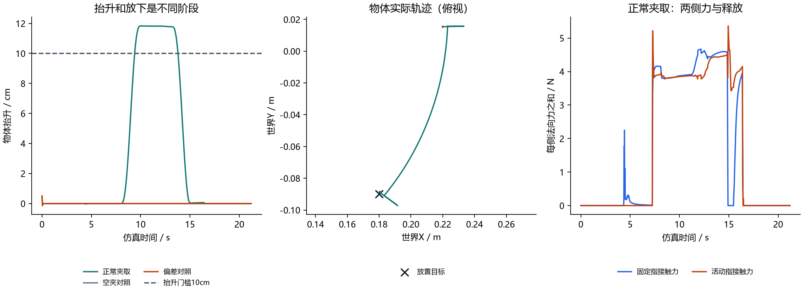
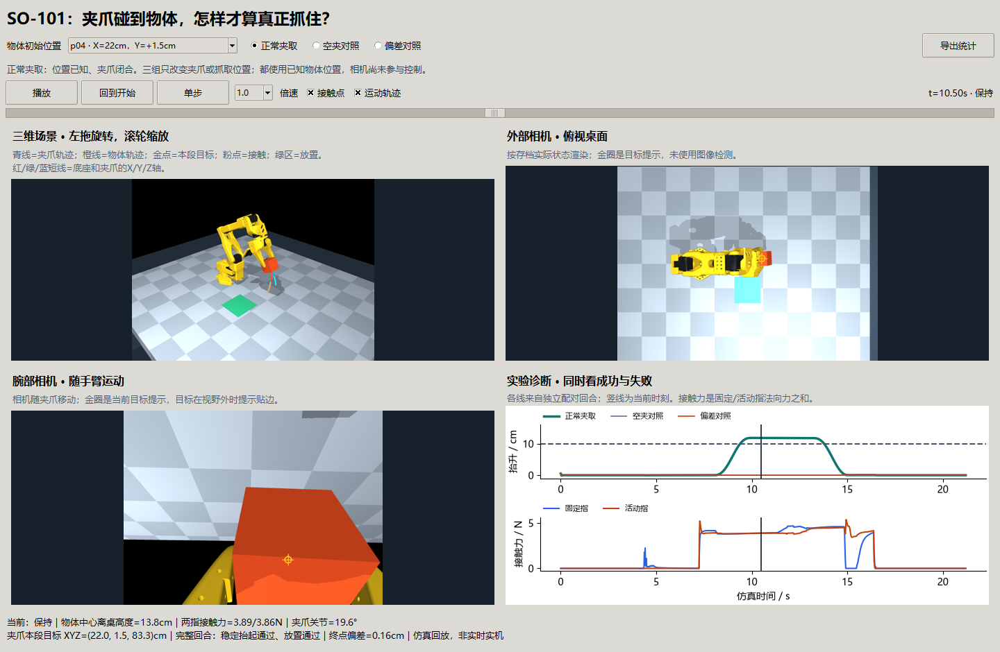
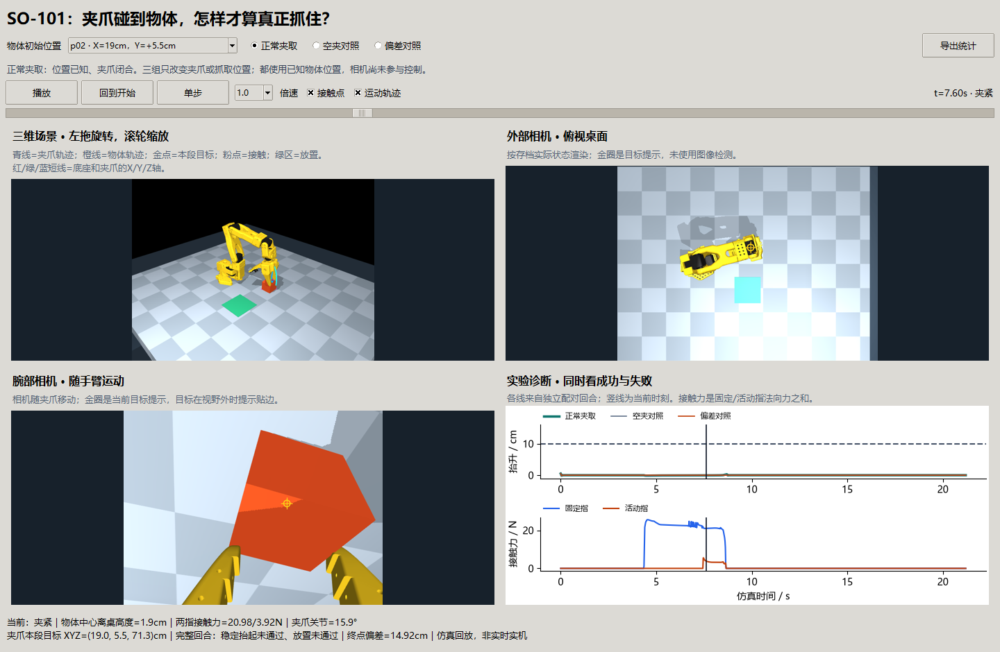

# 第七十三课：夹爪闭合以后，怎样证明方块真的被抓住？

> **后续更新**：[第七十三课第二轮讲义](73-so101-approach-geometry.md)已完成空间路径和开口中心校准，新27对条件17/27→21/27；保留6失败、2退步，未称稳健。下文是首轮冻结成绩。

**首批真实物理抓取完成6/9次；张开夹爪与抓取位置偏5.5cm两组各0/9。** 三组在相同九个位置各执行一次，共27回合。成功要求把方块抬起、保持，再松开并稳定放到目标区域。三个正常组失败保留在记录和窗口中。

承接[第七十二课](72-so101-geometry.md)。正式数组、原始500Hz接触力和源快照位于本地`results/so101_grasping_v2`，仓库保存[完整摘要](benchmarks/so101-grasping-v2.json)、[独立重放审计](benchmarks/so101-grasping-v2-validation.json)和[冻结协议](72-73-manipulation-plan.md)。

## 1. 抓住、抬起和放好，是三个不同现象

用筷子夹方块，筷子合拢只说明做了动作。两侧接触的位置不合适，可能只把方块压在桌上；夹起来后，也可能在搬运中掉落。最后方块在目标附近，还要确认已经松手、没有继续滚动。

本课物体是4cm边长、50g的自由方块。有质量、重力和接触；它没有被焊接到手臂，也没有在夹爪闭合时自动吸附。除了初始化，物体位置只能由物理推进改变。

控制器先读取已知初始位置，用逆解生成接近、夹紧、抬升、搬运、下放、释放和撤离动作。本阶段先研究执行机制，所以没有图像识别网络。相机看到成功动作，不等于相机促成了成功。

## 2. 变量、动作和评分怎样连起来？

| 变量 | 通俗含义、单位 | 和结果的关系 |
| --- | --- | --- |
| `object_xyz` | 方块实际中心XYZ，m | 判断它有没有跟着手臂动，不能用夹爪高度代替 |
| `tcp_xyz`、`waypoint_xyz` | 夹爪实际参考点与本段目标，m | 反映手臂执行；两者接近不保证物体被夹住 |
| `phase` | 当前动作阶段 | 同一高度在抬升、保持和释放中含义不同；稳定抬升只在专门保持段评分 |
| `jaw_normal_n[0:2]` | 固定指/活动指对物体的法向力之和，N | 两侧都有有效接触才可计入本轮稳定抓取；夹爪掌部接触不会冒充手指 |
| `jaw_normal_n[2]` | 物体与桌面或其他部位的支持力，N | 保持段仍被桌面托住，不能算被夹爪抬起 |
| `physics_jaw_n` | 每2ms求解中的手指法向力 | 用于统计峰值，避免50Hz图线漏掉短暂冲击 |
| `max_lift_m` | 初始化静置结束后的最大抬升，m | 初始从桌上方落下的5mm不算抬升；瞬时抬起还须通过持续时间判断 |
| `final_xy_error_m` | 最后方块中心距放置目标的水平距离，m | 目标是方块的位置，不是手臂最后的位置 |
| `lift_hold_s`、`placement_hold_s` | 满足稳定条件的连续时长，s | 一次触碰门槛不能算完成 |
| `success` | 稳定抬起和稳定放置同时成立 | 不把其中一个成功替代整项任务成功 |

关联链为：**位置/方向目标 → 关节请求 → 手指接触 → 方块实际运动 → 保持与释放 → 独立评分。** 夹爪限矩是0.3N·m，手指接触力单位是N，两者通过接触位置和力臂关联，不能直接比较数值。

## 3. 固定什么，改变什么？

| 组 | 改变项 | 作用 |
| --- | --- | --- |
| 正常夹取 | 使用已知位置，按阶段闭合夹爪 | 检查完整物理动作能否完成 |
| 空夹对照 | 全程保持张开 | 检查“手臂移动”是否被误当成“物体被抓住” |
| 偏差对照 | 抓取/抬升目标向世界Y偏5.5cm | 检查位置误差能否让正常夹紧动作落空；不是实际视觉估计结果 |

三组固定同一机器人、桌面、物体、放置目标、逆解门槛、动作时长和评分；偏差不作用于放置目标。正式位置x∈{19,22,24}cm、y∈{−4,1.5,5.5}cm。开发位置(22,2.5)cm不在正式网格中。

每回合21.2s仿真时间：静置1s、接近2s、下降2s、夹紧3s、抬升2s、保持1.2s、搬运2s、下放2s、松开3s、撤离2s、放置检查1s。夹爪限矩后开合需要时间，不能把位置请求当瞬时完成。

手臂运动采用平滑五次关节插值；本轮没有在线重规划或抓取失败后的恢复。抬升和搬运允许倾转−0.45rad，避免第72课发现的腕关节限制。

## 4. 原理与成功判据

摩擦帮助抵抗物体向下滑，但两侧接触点、方向、夹紧力、运动加速度也影响物体是否稳定。手指有力而方块仍被桌面托着，只能说明接触发生，不能说明抓取有效。

稳定抬起要求：相对静置后中心高度抬升≥10cm，在保持段连续≥1s；两指各有>0.02N接触，其他支持力<0.02N。

稳定放置要求：松手撤离后，在检查段连续≥0.5s，XY误差≤2.5cm，中心离桌高度为半边长±3mm，线速度<2cm/s、角速度<0.2rad/s，夹爪关节>0.9rad且两指均无有效接触。2.5cm检查的是方块中心，并非要求整个方块都在绘制的绿区中。

离散记录中51个连续的20ms时刻才覆盖1s；不能把一个样本也算作20ms持续时间。最终成功还要求计划未被逆解门槛拒绝。

## 5. 结果与数据解读



三面板分别统计稳定抬起、稳定放置、两项同时成立；绿=正常夹取，灰=张开夹爪，橙=位置偏差。分母各9，九个位置不是九个独立随机种子，不能把6/9直接当部署成功率。

| 物体X | Y=−4cm | Y=1.5cm | Y=5.5cm |
| --- | --- | --- | --- |
| 19cm | 抬起并放置 | 抬起并放置 | 未夹起 |
| 22cm | 抬起并放置 | 抬起并放置 | 未夹起 |
| 24cm | 抬起并放置 | 抬起并放置 | 未夹起 |

正常组的六个成功回合，最大抬升约11.64—11.89cm，最终水平偏差约1.59—3.48mm。正常组未检测到手臂与桌面/非相邻自身部件的受力接触；这不代表手指与物体无冲击。三次失败中固定指的物理力峰值约24.41—27.85N。



选例固定为正式网格中间位置`p04`，没有根据结果挑选。左图：正常组先抬升越过10cm虚线，再放下；另两组物体留在桌面。中图：正常组物体实际运动到黑色叉号目标；另两组在起点附近，曲线几乎缩成点。右图：正常组两侧接触力随夹紧建立，释放后降为零；图线是50Hz瞬时诊断，峰值另由500Hz原始力统计，不能用图线最高点替代完整峰值。

### 同一个算法为什么换位置就失败？

`p02/p05/p08`都是Y=5.5cm。下降结束时固定指约有21—25N力，活动指尚无有效接触，桌面支持力也明显增加。夹紧后两侧短暂有力，但抬升后手指与物体脱离，方块留在桌上。因此已确认的直接失败现象是“单侧先压住，随后未形成稳定夹取”。

位置改变会改变肩部转角，当前接近策略的方向也随之变化，而方块初始世界朝向保持不变。径向接近方向与方块侧面不一致、TCP参考点与实际开口中心的关系，都是下一轮需单变量检验的原因；本轮没有分离它们，不能仅凭同排失败就宣称根因已完全解决。

## 6. 可复用窗口



左上三维场景可旋转/缩放，右上为外部俯视相机，左下为随手臂移动的腕部相机，右下为三组物体高度和所选组的接触力。金点/金圈是控制目标提示，粉点是受力接触位置，青/橙线是夹爪/物体真实存档轨迹；所有视图与统计一起切换，保留当前仿真时刻。图例放在曲线区域外。



失败图来自`p02`夹紧阶段：画面上手指接触并不等于成功，右下单侧大力与下方“未通过”解释了原因。相机均按存档状态重渲染，不是实机采集图像或视觉检测输出。

## 7. 复现、验证与记录边界

```powershell
uv run python -m embodied_learning.experiments.so101_grasping --output results/so101_my_run
uv run python -m embodied_learning.manipulation_demo --results results/so101_my_run --play
uv run python scripts/validate_so101_grasping.py results/so101_my_run
uv run python scripts/test.py full tests/test_so101_manipulation.py
```

原始记录每回合含1061个控制时刻和10600个物理步。`physics_time=t`对应步结束状态，力是该次`[t−dt,t]`求解中的力；控制时刻的力由`mj_forward`重新计算作瞬时诊断。独立审计重放全部27回合286200物理步并重算评分，状态、几何与力最大差均0。重放证明记录可复现，不证明物体摩擦、电机限矩或真实环境参数已经校准。

初始检查版`results/so101_grasping_v1`保留；v2仅修正“最大抬升不包含初始化落下段”的统计口径并冻结最终源码，控制输入和原始运动不变，三组成功数不变。没有依据正式失败位置重新调参。

## 8. 理论对应与思考题

对应第8—13课控制、位置参考与实际执行；第22/25课像素与坐标；第40/42课教师与学习闭环验收；第69课接触力与实际运动。抓取进一步引入双侧接触、摩擦、支持力和释放判据。

1. 手指有20N力，但方块还在桌上，为什么不能据此说夹紧力已经足够？
2. 夹爪实际抬高12cm、方块仍在原地时，应该给哪项评分判失败？
3. 偏差组0/9说明位置准确有作用；它能说明某个视觉模型的精度或效果吗？
4. 同一算法换位置后手指接近方向改变了，怎样设计实验只检验方块朝向的影响？
5. 50Hz力图最大约5N，500Hz原始记录峰值更大，两个数字为什么能同时正确？

### 延伸问题（保留原题，不计入核心五题）

6. 以后加入抓取恢复，怎样限制重试次数并防止“把物体推到目标附近”冒充抓取成功？

## 原始来源与本地适配（2026-10-09补引）

[Modern Robotics: Mechanics, Planning, and Control](https://github.com/NxRLab/ModernRobotics)（Kevin Lynch / Frank Park，2017）；[Robotic Manipulation · 作者教材](https://manipulation.mit.edu/intro.html)（Russ Tedrake，持续更新）；[MuJoCo Menagerie · SO-101](https://github.com/google-deepmind/mujoco_menagerie/tree/4d038b3feae26ec82b46a4d586379114012a8ac7/robotstudio_so101)（Google DeepMind / 模型贡献者）；[MuJoCo 官方文档](https://mujoco.readthedocs.io/en/stable/overview.html)（维护团队，持续更新）。

固定开源模型与本地真实接触仿真；夹紧时双侧受力不保证搬运持续接触，已知物体初始位置与 RGB 回放不等于视觉抓取或实机放行。 [完整采用关系与引用规则](references.md)。

## 9. 阶段裁决与下一步

本课建立了真正可运行的接触抓取和两类负对照，成功仅限所测范围，当前覆盖未达到9/9。下一轮先对接近方向/手指中心作受控几何诊断，检查Y=5.5cm失败；再接入RGB-D估计，与已知位置对照，最后才采集示范进行学习。导航低速实验和在线局部地图更新仍列为原主线待办，不因增加机械臂就宣布导航问题已解决。
