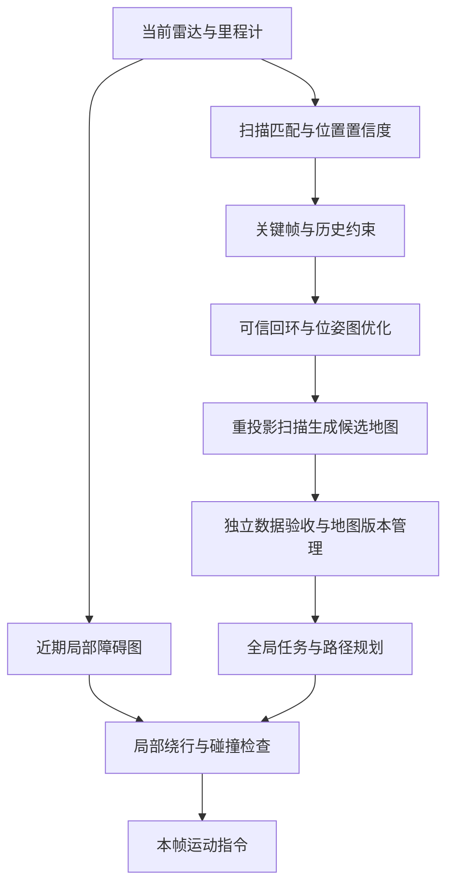

# 园区巡检：从遇障停车到地图自我修正

日期：2026-09-27。本文保留第 66 课 后的研究设计。**执行更新**：第 67 课 已完成车身/传感器标定、81回合静态新障碍避障；第 68 课 已完成恒定尺度偏差下的离线修图与12回合独立巡检。完整在线位姿图、动态地图更新与失效恢复仍未实现，见[阶段小结](navigation-stage-review-66-68.md)。下文“当前行为”均指第 66 课 基线，后续计划不能当成已交付功能。

## 1. 先回答当前现象

2026-09-28追加：局部起点失效已有[第71课](71-bounded-recovery.md)的受控恢复证据；[第69课](69-footprint-planning.md)窄路闭环尚未通过，[第70课](70-arrival-decisions.md)完成到点判据消融。此处“未实现恢复”保留为66/68基线的历史描述，不能据此否定新批次，也不能把新批次升级为通用重定位。后续排序见[69–71复盘](navigation-stage-review-69-71.md)。

用户观察到：自建地图组面对障碍停着不动，地图与真实建筑不一致时，系统似乎仍照着错误判断走。这个观察对应两个实际缺口：**新扫描没有进入绕行规划；地图也不会在线修正。**

检查 `experiments/campus_patrol.py` 的 `run_episode` 与 `run`，并复核 `results/campus_patrol_v1`：

| 环节 | 当前实际行为 | 尚未具备 |
| --- | --- | --- |
| 雷达定位 | 参考图组、自建图组都用当前扫描给 PF 的位置猜测打分 | 地图错误时自动判断“该改位置还是该改地图” |
| 雷达停车 | 前方约 ±23° 内，距离小于 0.466 m 就把线速度设为 0；转速仍由跟随器决定 | 侧向/后向完整车体保护、绕行和停滞恢复 |
| 规划 | 四组共用准确的事先几何避障图，每 20 帧（2.4 s）重新规划；起点由各组定位给出 | 实时扫描更新局部通行状态 |
| 自建地图 | 只用于该组定位；建好后固定不变 | 持续建图、轨迹优化后重投影、地图版本切换 |
| 建图证据 | 保存了扫描、命中标志及有偏里程计；栅格累积命中端点 | 射线经过处的空闲证据、动态变化管理 |
| 第一视角 | 按存档实际位置重新渲染，用于理解行为 | 原始连续 RGB-D 数据和视觉定位输入 |

停车阈值来自：车体半径 0.25 m + 一步最大移动距离 0.8×0.12 m + 余量 0.12 m。它是当前运动学控制器的规则，不是经过实车制动距离验证的安全保证。

三个种子中，轮子推算组和自建图组结束前最后 50 帧均同时满足“前方距离触发停车条件、线速度为零”，最终状态均为超时。说明雷达停车确实生效了，但系统没有找到继续前进的办法。零接触不能代表任务完成。

参考图组种子 0 则是另一类失败：33.6 s 后定位结果落在规划安全边界之外，状态为 `no_path`。这与激光近障停车需要分开记录和处理。

**现有实验检验的是：定位误差如何影响使用先验地图的闭环导航。它还不能证明在错误自建地图上实现了自主避障与地图修复。** 旧实验及哈希继续保留，后续以新协议产生新记录。

## 2. “地图错了”至少有三种情况

| 情况 | 通俗例子 | 合适的处理 | 不能混淆的事 |
| --- | --- | --- | --- |
| 自己的位置估错了 | 墙没动，机器人却以为自己偏向左边 | 扫描匹配、重定位，纠正地图与局部里程计的坐标关系 | 不应把整面墙搬走来迎合错位姿 |
| 建图时画歪了 | 绕楼一圈后，起点和终点没接上，同一面墙画成两面 | 找到可信的重复观测，优化历史位姿/子地图，再重投影原始扫描 | 整张图平移旋转一次，无法修复内部逐渐累积的形变 |
| 环境真的变了 | 原来停车的地方空了，通道新放了围挡 | 多次观测确认新增/移除，维护近期障碍与长期地图 | “这次没看见”可能只是遮挡，不能立刻删墙 |

还有第四种边界：机器人被遮挡、丢扫描、进入重复走廊，证据不足。此时应降低置信度、停下或补观测，不能强行选择一个修正。

“映射到真实地物”可以先做到：同一栋楼的不同扫描在统一的米制坐标中重合。如果还要求与测绘/GIS 中的绝对坐标一致，需要测量控制点、GNSS 或可信的外部地标；仅靠相对扫描不能凭空知道经纬度。真值只用于仿真生成观测和事后评分。

## 3. 相关研究和开源项目怎样做

以下为原论文与项目官方资料核对结果；“适合借鉴”是本项目的选型判断，尚未在本机运行这些新增系统。

### 3.1 Nav2：让眼前观测影响通行决策

Nav2 的障碍层能把激光命中位置标成障碍，并沿射线清除该层的旧障碍；滚动局部代价地图跟着机器人移动，控制器可以据此选择局部动作。这里“代价地图”就是把周围哪些地方不能走、哪些地方靠障碍太近写成网格。[障碍层官方说明](https://docs.nav2.org/jazzy/configuration_and_development/configuration_guide/core_servers/costmap_2d/costmap_plugins/obstacle/)、[Costmap 2D](https://docs.nav2.org/rolling/configuration_and_development/configuration_guide/core_servers/costmap_2d/)、[MPPI 控制器](https://docs.nav2.org/rolling/configuration_and_development/configuration_guide/controller_plugins/mppi_controller/configuring_mppic/)。

注意：障碍层默认按最大代价与主地图合并。由这个规则可推知，清除了观测层的一格，并不意味着静态层里那堵错误的墙也会消失。接入局部避障后，仍需独立处理长期地图修正。

### 3.2 SLAM Toolbox：保留历史扫描，继续修正已有地图

项目能保存并重新加载位姿图和关联数据，继续建图，通过扫描匹配和图优化更新地图。位姿图可以理解为：每次关键观测是一个节点，两次观测之间“相隔多远、转了多少”的证据是一条连接。可靠的回环连接能约束一整段历史位置。[SLAM Toolbox 官方仓库](https://github.com/SteveMacenski/slam_toolbox#lifelong-mapping)。

这与“发现墙没对齐后，用已有数据修正地图”很接近。它也明确区分定位模式与持续建图模式；定位模式不会长期改写底图。官方 README 仍将带旧节点删除的完整 lifelong 实现标为高度实验性，不能把“支持续建图”直接等同于长期无人值守已经可靠。

本项目的优先外部对照是它：我们的传感器目前主要是二维激光，已有 ROS 2 数据桥接经验，迁移范围比直接接入完整三维长期建图框架更小。导出真实扫描和有偏里程计，先单会话重放，再比较冻结地图上的独立定位。

### 3.3 LT-mapper：先对齐多次巡检，再分辨环境变化

LT-mapper（ICRA 2022）把长期建图拆成多会话轨迹对齐、动态变化检测、地图变化管理。其先处理轨迹误差再检测物体变化的顺序，与本项目需要区分“画歪”和“搬走”直接相关。[论文](https://arxiv.org/abs/2107.07712)、[作者代码](https://github.com/gisbi-kim/lt-mapper)。

这是三维 LiDAR 框架。当前 64 束水平扫描不能当作已满足其三维输入要求；先借鉴问题分解和评估办法，待有合适三维观测后再评估完整复现。

### 3.4 ELite：停车车辆介于永远不动与马上移动之间

ELite（ICRA 2025）用不同时间尺度下的临时性来描述地图点，并结合多会话对齐、动态物体移除与地图更新。停了几小时的车是典型例子：当下要绕开，长期地图又不宜把它当成永久建筑。[论文](https://arxiv.org/abs/2502.13452)、[作者代码](https://github.com/dongjae0107/ELite)。

它适合作为后续“稳定建筑、慢变化停车物、快速移动人车”分层管理的参考。现阶段还没有跨时段变化数据，不能声称已经验证这类能力。

## 4. 我们应怎样接起来

- **快的局部通路**负责眼前是否能走。使用连续的局部里程计坐标和短时间窗口；全局位置突然纠正时，周围的墙不应在局部控制器里瞬移。
- **慢的地图通路**负责历史是否一致。修正地图时保存新旧版本、接受的约束和影响范围；证据不足时冻结更新。
- **任务层**负责何时等待、重规划、重新定位、补观测或放弃不可达点。无进展要有状态和原因，不能一直重复同一条失败指令。

这符合 ROS 中 `odom` 连续但会漂移、`map` 长期校正但可能跳变的职责划分。[REP-105](https://github.com/ros-infrastructure/rep/blob/master/rep-0105.rst)。

地图变动还需同步处理巡检目标：目标若绑定在建筑地标上，应跟随经确认的地标坐标更新；若来自外部测量控制点，应保留其外部坐标约束。不能只挪墙、不检查目标与路线，也不能把全部目标随意拖到容易成功的地方。

## 5. 下一阶段实施顺序与验收

每一步先写协议与已知答案，再冒烟、固定小批对照、锁定方案后扩展留出布局。下表是原验收范围：A/B已在第 67 课 部分完成，C/D已用恒定尺度修正做受控子实验；通用位姿图、留出布局、动态变化与完整恢复仍待完成。

**实验归属**：修复显示错误属于第 66 课 窗口优化；加入新的局部避障决策属于第 67 课 新实验，复用场景和模块但另存结果；改历史位姿与地图属于第 68 课 新实验。保留旧基线才能判断收益来自哪里。

**几何验收先于算法比较**：相机、LiDAR、底盘、支架使用同一坐标和尺寸定义。检查正面、侧面、后面与转弯扫过区域；设置相机视野外的矮栏杆、雷达切片上方的悬空障碍、窄门和贴墙转弯。分别验证“传感器能否观测”“整台机身是否可通过”“渲染是否遮挡正确”。任何一种通过都不能代替其余两项。未知区域保持未知，不能把 RGB 未见到的地方直接当作空地。

| 顺序 | 控制变量与实现 | 必须保存和检查的证据 |
| --- | --- | --- |
| A. 原因可见 | 给停车、无路、定位低置信度、等待观测分别记事件；窗口显示当前原因与持续时间 | 不用最终 timeout 反推所有中间状态；逐帧触发条件与指令一致 |
| B. 雷达驱动绕行 | 先固定可靠定位；准确底图中加入未标障碍。比较当前停车规则 vs 扫描局部图＋局部规划 | 同任务/布局/种子；绕行到点率、碰撞、最小间隙、停滞时长、路径长度、运算 P95；从真实扫描产生新障碍 |
| C. 静态错图修复 | 固定同一批扫描，分别测试整体错位、历史漂移造成的形变；对照原图、仅刚体配准、扫描约束/回环优化后重建 | 原始图、修后图、每个约束来源和残差；位置误差、双向墙面距离、固定物理容差的地图 P/R；重复建筑负例不能乱闭环 |
| D. 独立定位查询 | 用建图段修图并冻结，另一次巡检只定位；对照原图/修后图，定位参数相同 | 有效覆盖率、均值/P95、失定位次数与恢复时间；不把查询未来帧提前写入地图 |
| E. 环境变化 | 在定位稳定后分别增加围挡、移走车辆、暂时遮挡；再做多次巡检 | 新增/消失检测精确率召回率、确认延迟、错删稳定建筑比例、地图增长；未看见不能等于不存在 |
| F. 综合闭环 | 让各算法真正使用各自允许的地图规划；锁定恢复策略后再测新布局 | 真正到点率、整轮完成率、接触、停滞、地图质量和资源占用同时报告；平均误差小不能抵消任务失败 |

B 的正确定位是有意设置的诊断条件，用于先验证局部避障本身；真值控制对照须标 oracle，不用于声称部署通过。C 的历史整段优化是离线诊断；转在线时只允许使用当前及过去观测，并另报延迟。F 必须去掉准确几何作为运行期隐藏规划答案，只允许仿真和评分端访问它。

现有 `mapping.npz` 含 `truth/odom/ranges/hits`，已具备用原始扫描重建的主要材料；算法侧仅暴露 `odom/ranges/hits`。其时间步、传感器外参与噪声语义在接入成熟实现前还要核验，缺失项须补协议或重新采集。现有各组巡检也有扫描与控制记录，可做离线诊断。它们没有动态变化，也没有原始连续 RGB-D，因此 E 和视觉部分需要新数据。

首轮 C 建议用已有地图分离数据做诊断概念验证，并以园区存档原始扫描做成熟实现对照；随后冻结新场景与新种子。两轮限定改动仍没有改善时，回到关联错误、观测不足或偏差模型分析，保留失败，不无限调参。

与原路线图的关系：A/B 是当前园区试跑暴露的 LiDAR 局部导航补课，C/D 是阶段 1 地图问题的后续研究；阶段 2 连续 RGB-D 采集仍应保留，后续视觉融合和深度避障继续各自验收。不会因为三维画面更丰富便跳过相机几何验收。

## 6. 作为项目还是课程

**建议在 embodied-ai-lab 内把“可修正地图的园区巡检”作为综合项目方向，用连续课程逐步实现。** 场景、传感器记录、规划、评分和回放模块共用；每课只回答一组清晰问题。

课程安排：

1. **第 66 课（基线已完成）**：园区闭环基线，定位、任务、雷达与失败原因怎样联系。[讲义](66-campus-patrol.md)。
2. **第 67 课（受控实验已完成）**：[车身标定与观测驱动避障](67-body-aware-obstacle-avoidance.md)，深度补高度盲区，窄路仍暴露规划保守性。
3. **第 68 课（受控实验已完成）**：[恒定尺度修图与独立导航](68-scan-based-map-repair.md)，重投影改善墙面与到点结果，通用在线位姿图仍待做。
4. 后续专题：多次巡检地图维护，怎样区分临时物体、永久变化与定位错误。
5. 后续专题：恢复与综合验收，失定位/无路/传感中断后能否完成留出场景任务。

每课沿用完整讲义结构：问题与物理直觉 → 新变量及单位 → 变量如何随实验变化 → 原理 → 控制变量与对照 → 真实数据/轨迹/统计 → 结果含义与失败边界 → 理论联系 → 思考题 → 复现入口 → 停止点。

当项目具有稳定数据接口、独立安装运行、跨布局结果、地图修复消融和成熟系统对照后，再考虑拆独立仓库、作品集或研究报告。现阶段“集成已有方法”可以构成工程项目；研究创新性需要相对已有方法的新增贡献和实验支持。

## 7. 本次窗口交付

“单独跟随”方法按钮一次切换：相机、3D/平面轨迹、对应底图、雷达点、目标/规划路径、误差曲线与统计高亮。保留当前帧、播放/暂停状态、速度、缩放和机位；汇总叠图/并排分图恢复全部轨迹，镜头继续跟随最近选中的方法。“自选图层”保留细调入口。

另已修复相机近裁剪面随场景扩大到约 0.478 m 的问题，设为固定 0.01 m；机位前偏从 0.28 m 收回到 0.18 m。用“相机前 0.17 m 处有墙”的已知答案检查渲染深度，防止近处表面再次消失。

这些是读取同一份实验记录的展示改进，未改变控制器、地图修复能力或旧成绩。
