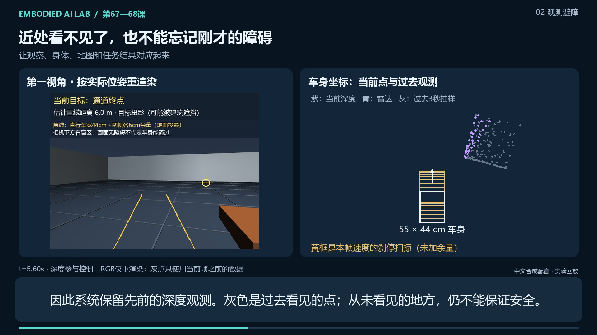

# 67—68 课讲解视频

**《机器人怎样知道自己会不会撞？》**：4 分 14 秒，1920×1080、25 帧/秒，中文合成配音、画内字幕和可单独编辑的 SRT 字幕。MP4 内嵌 13 个章节，支持章节的播放器可以直接跳转。



## 内容与观看入口

从“相机能看过去，车身就能过去吗”开始，依次解释传感器安装位置、刹停空间、高度盲区、低路障对照、81 回合统计、窄路拒绝、旧扫描修图、独立巡检和误报到达。相机、雷达点、轨迹及统计都有中文说明。

- [完整分镜与配音稿](navigation-67-68-script.md)
- [可编辑剧本数据](navigation-67-68-story.json)
- [专题 67 讲义](../67-body-aware-obstacle-avoidance.md)、[专题 68 讲义](../68-scan-based-map-repair.md)、[阶段复盘](../navigation-stage-review-66-68.md)
- 本机成片：`results/navigation_video_v1/navigation-67-68-narrated.mp4`
- 同目录字幕：`navigation-67-68.zh-CN.srt`；旁白：`narration.wav`；来源记录：`manifest.json`

MP4 和音频放在忽略的 `results/`，不随 Git 分发。仓库保留剧本、渲染器、封面及验收摘要。打开交互实验窗口仍使用根目录的 `open_navigation_study.cmd`。

## 画面与数据怎么对应

运动取自正式记录，按回放时间选择已经保存的姿态，不插值生成新轨迹。两种方法分别播放自己的执行结果；提前结束的一组会明确标为“保持末帧”。第一视角与三维场景由 MuJoCo 按存档重新渲染；它们不是训练输入中的连续 RGB 录像。控制器实际记录的传感器包括雷达与米制深度。

代表例固定为：专题 67 开阔场地、低路障、种子 0；窄路箱体、种子 0；专题 68 种子 1。统计页采用全部回合。专题 68 第 4 个巡检点的诊断图固定在该点，标明误报事件时刻，不把已经切换到下一个目标的日志当成前一个目标。

蓝色窄路诊断线来自独立几何检查，没有送入控制器；它不能计为机器人已经通过。专题 67 零定位误差是受控条件。专题 68 只验证恒定尺度偏差下的离线修图；两个专题的控制器还未完成组合验证。上述边界和失败均保留在成片中。

## 重新生成

在仓库根目录的 Windows PowerShell 中运行。需要项目环境及本机 `Microsoft Huihui Desktop` 中文语音。语音由 Windows `System.Speech` 离线合成，不上传实验数据。

先按两课讲义生成正式目录 `results/observed_navigation_v1`、`results/map_repair_v1`。渲染器会检查原始数组哈希；完整数据摘要在 [benchmark JSON](../benchmarks/navigation-studies-67-68-v1.json)。新克隆只有摘要，需要先生成原始数组。

```powershell
# 可选的视频编码依赖；不影响实验运行环境的锁定依赖
uv pip install --python .venv/Scripts/python.exe imageio-ffmpeg==0.6.0

# 用新目录保留每一版；剧本改变后重新配音，避免声音和字幕不一致
powershell.exe -NoProfile -ExecutionPolicy Bypass -File scripts/narrate_navigation_video.ps1 -Output results/navigation_video_my_run/narration

# 先输出 13 张预览，检查排版和数字
.venv/Scripts/python.exe scripts/render_navigation_video.py --output results/navigation_video_my_run --preview

# 生成 MP4、SRT、时间轴、剧本和哈希清单
.venv/Scripts/python.exe scripts/render_navigation_video.py --output results/navigation_video_my_run
```

字幕时长取自每句实际 WAV，自动分配停顿，并与音轨使用同一时间轴。脚本会拒绝覆盖已有配音或成片；预览图片可以重复生成。若使用自己的 FFmpeg，可传 `--ffmpeg` 指定可执行文件。当前画面固定为 1080p；改剧本中的分辨率会明确报错。

## 维护结构

| 文件/模块 | 改什么 |
| --- | --- |
| `navigation-67-68-story.json` | 章节顺序、标题、旁白、语音和语速 |
| `scripts/narrate_navigation_video.ps1` | 离线配音与逐句音频哈希 |
| `scripts/render_navigation_video.py` 的 `Film` | 车身示意、相机回放、地图、结果表等独立画面模块 |
| `timeline` / `subtitle_lines` | 根据音频排时、生成 SRT、字幕换行 |
| `NavigationStudySource` / `SceneRenderer` | 与交互窗口共用的记录读取、哈希检查和三维渲染 |

更改数据、图形或剧本后，先检查所有分镜，再完整解码导出文件。音轨可解码和视频帧完整只能证明文件可播放；数据可信度另由记录来源、输入哈希及课程实验协议支持。

本版[导出验收摘要](navigation-67-68-validation.json)：全片 6,351 帧与音轨解码无错误，25 句旁白均有有效音量、无数字削波，已检查全部 13 个章节的导出代表帧。画面及讲解内容沿用正式实验结果，本次没有修改或重新运行实验算法。渲染用时约 88 秒；音频为 AAC 单声道 48 kHz，视频为 H.264/yuv420p。
